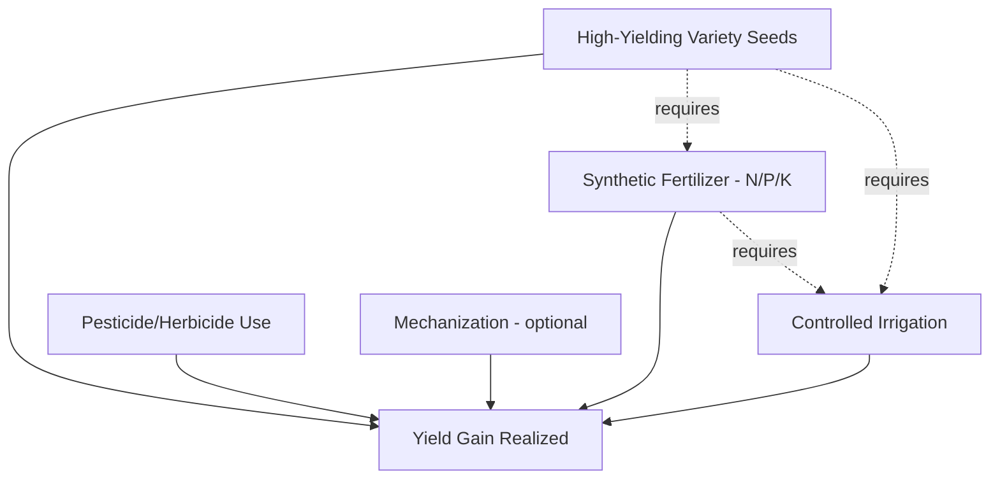

## Green Revolution and Technology Adoption

### Overview

**Key Points**

- The Green Revolution refers to the widespread adoption of high-yielding variety (HYV) seeds, synthetic fertilizers, irrigation expansion, and mechanization in developing country agriculture, primarily from the 1960s through the 1980s.
- It produced dramatic yield gains in staple cereals (wheat, rice, maize) and is widely credited with averting predicted famines in South Asia and elsewhere, while also generating significant debates over distributional equity, environmental sustainability, and regional unevenness.
- Technology adoption theory (diffusion of innovations, adoption curves, constraints to adoption) developed substantially out of empirical study of Green Revolution uptake patterns and remains foundational to agricultural extension and development policy today.

### Historical Origins

The Green Revolution is most closely associated with agronomist **Norman Borlaug**, whose work on semi-dwarf, disease-resistant, high-yielding wheat varieties at CIMMYT (International Maize and Wheat Improvement Center) in Mexico in the 1940s–1960s formed the technological foundation. Borlaug received the Nobel Peace Prize in 1970 for this work.

Parallel breeding efforts at the **International Rice Research Institute (IRRI)** in the Philippines produced high-yielding rice varieties (notably IR8, released in 1966, sometimes called "miracle rice") that were rapidly adopted across South and Southeast Asia.

The term "Green Revolution" was coined by USAID administrator William Gaud in 1968 to describe this technological package's rapid spread, particularly in India, Pakistan, and the Philippines.

### The Green Revolution Technology Package

The core innovation was not a single technology but a **complementary package** requiring simultaneous adoption:

1. **High-yielding variety (HYV) seeds**: semi-dwarf varieties bred to be responsive to fertilizer without lodging (falling over under grain weight), with shorter growing seasons enabling multiple cropping cycles per year.
2. **Synthetic fertilizer**: HYVs are bred specifically to convert high nitrogen inputs into grain yield rather than excess vegetative growth; without adequate fertilizer, HYV yield advantage over traditional varieties is limited.
3. **Controlled irrigation**: HYVs generally require reliable water control (not rainfed-only conditions) to realize their yield potential and to support the shorter growing cycles enabling multiple annual harvests.
4. **Agrochemical inputs**: pesticides and herbicides to protect the higher-value, input-intensive crop from pest and weed losses.

This complementarity is central to understanding adoption patterns: farmers lacking access to reliable irrigation or credit for fertilizer purchase often saw limited benefit from HYV seeds alone. [Inference — this complementarity constraint is well documented in the technology adoption literature, though the degree varied by region and crop]

### Yield and Production Impact

$$Yield\ Gain = Y_{HYV} - Y_{traditional}$$

Documented outcomes generally associated with Green Revolution technology adoption in South and Southeast Asia include substantial increases in cereal yields per hectare and significant expansion of total cereal production, contributing to the region moving from persistent food deficit concerns toward near or full food self-sufficiency in several countries by the 1980s. [Unverified — specific percentage figures vary across sources and time periods; consult FAO or IRRI historical data series for precise figures]

### Diffusion of Innovation Theory and Adoption Curves

Agricultural economists and rural sociologists (notably **Everett Rogers**, in *Diffusion of Innovations*, and subsequent applied agricultural economics work) modeled Green Revolution technology adoption using the classic **S-curve (logistic) diffusion pattern**:

$$A(t) = \frac{K}{1 + e^{-r(t - t_0)}}$$

where $A(t)$ is cumulative adoption at time $t$, $K$ is the ceiling/saturation level of adoption, $r$ is the diffusion rate parameter, and $t_0$ is the inflection point (time of most rapid adoption).

#### Adopter Categories (Rogers' Classification)

| Category | Approx. Share of Population | Characteristics |
| --- | --- | --- |
| Innovators | ~2.5% | Highest risk tolerance, often larger/wealthier farmers with resources to absorb potential losses |
| Early Adopters | ~13.5% | Opinion leaders, closely observed by others |
| Early Majority | ~34% | Adopt after observing early adopter success, more risk-averse |
| Late Majority | ~34% | Adopt due to economic necessity or social pressure once technology is well-established |
| Laggards | ~16% | Last to adopt, often most resource-constrained or risk-averse |

### Determinants of Technology Adoption

Empirical agricultural economics literature identifies recurring factors explaining differential adoption rates:

#### Farm-Level and Household Factors

- **Farm size and land tenure security**: larger, secure-tenure farms often adopted earlier due to greater capacity to bear risk and access credit; tenant farmers with insecure tenure often had weaker incentives to make long-term land investments.
- **Access to credit**: fertilizer and irrigation investment require upfront capital; credit-constrained farmers adopt more slowly or partially. [Inference]
- **Education and information access**: extension service contact and literacy correlate with faster technology uptake in most empirical studies.
- **Risk aversion**: HYVs, while higher-yielding on average, sometimes exhibited higher yield variance under input-constrained conditions, making risk-averse smallholders cautious.

#### Infrastructure and Institutional Factors

- **Irrigation infrastructure availability**: adoption was markedly higher in irrigated regions (e.g., Indian Punjab) than rainfed regions.
- **Input and output market access**: proximity to fertilizer supply and output markets/roads reduced transaction costs of adoption.
- **Agricultural extension services**: government/NGO extension programs disseminating technical knowledge accelerated diffusion.
- **Price support and procurement policy**: guaranteed minimum support prices for HYV output (as in India's procurement system) reduced price risk and encouraged adoption.

### Regional Unevenness: Winners and Laggards

The Green Revolution's benefits were geographically and socioeconomically uneven:

- **High adoption regions**: irrigated, favorable agro-climatic zones (e.g., Punjab and Haryana in India, Central Luzon in the Philippines) saw rapid, large productivity gains.
- **Low adoption regions**: rainfed, marginal, or drought-prone areas (much of Sub-Saharan Africa, parts of rainfed South Asia) saw limited penetration, partly because the HYV package was originally optimized for irrigated wheat and rice conditions rather than the more diverse rainfed cropping systems and crops (sorghum, millet, cassava) common in Africa. [Inference]
- **Distributional concerns**: larger, better-resourced farmers often adopted first and captured a disproportionate early share of productivity gains and market benefits, contributing to debates about whether the Green Revolution increased rural inequality, at least in its early diffusion phase, even as later diffusion to smaller farmers and aggregate poverty reduction effects (through lower food prices) are also documented in the literature. [Unverified — the net inequality effect is empirically contested and varies substantially across specific regional studies]

### Environmental and Sustainability Critiques

- **Groundwater depletion**: intensive irrigation for HYV cultivation, particularly in Indian Punjab, contributed to significant groundwater table decline in several regions.
- **Soil degradation**: continuous high-input monocropping (particularly rice-wheat rotation systems) has been associated with declining soil organic matter and micronutrient depletion in some long-term studies. [Inference]
- **Agrochemical pollution**: fertilizer and pesticide runoff contributing to water quality degradation and health concerns in high-input zones.
- **Biodiversity loss**: displacement of traditional crop varieties and diversified cropping systems by monoculture HYV cultivation, raising concerns about genetic diversity loss in staple crop gene pools.
- **Response — Sustainable Intensification and "Evergreen Revolution"**: agricultural scientist **M.S. Swaminathan** (a key figure in India's Green Revolution implementation) later advocated for an "Evergreen Revolution" emphasizing productivity gains achieved without ecological harm, influencing subsequent sustainable intensification approaches.

### Technology Adoption Frameworks Beyond the Green Revolution Era

The empirical lessons from Green Revolution adoption research continue to inform contemporary agricultural technology diffusion analysis, including for:

- **Conservation agriculture** (no-till, cover cropping)
- **Improved crop varieties for climate resilience** (drought-tolerant maize, flood-tolerant rice)
- **Digital agriculture tools** (mobile-based extension, precision agriculture, market information systems)
- **Genetically modified/biotech crops**

Common analytical tools applied across these contexts include:

$$Adoption\ Probability = f(Perceived\ Benefit,\ Risk,\ Access\ to\ Inputs,\ Credit,\ Information,\ Social\ Networks)$$

Modeled empirically via logit/probit regression frameworks in applied agricultural economics research, with social network and peer-effects analysis increasingly incorporated in more recent adoption studies. [Inference]

### Diagram: Green Revolution Adoption Determinants (svg_diagram)

<svg viewBox="0 0 720 400" xmlns="http://www.w3.org/2000/svg">
\<style\>
.box { fill: #f5f5f5; stroke: #333; stroke-width: 1.5; }
.boxAlt { fill: #eaf5ea; stroke: #333; stroke-width: 1.5; }
.label { font-family: Arial, sans-serif; font-size: 12px; fill: #111; }
.title { font-family: Arial, sans-serif; font-size: 15px; font-weight: bold; fill: #111; }
.arrow { stroke: #333; stroke-width: 1.5; marker-end: url(#arrow4); fill: none; }
\</style\>
<defs>
<marker id="arrow4" markerWidth="10" markerHeight="10" refX="8" refY="3" orient="auto" markerUnits="strokeWidth">
<path d="M0,0 L0,6 L9,3 z" fill="#333"/>
</marker>
</defs>

<text x="360" y="24" text-anchor="middle" class="title">Green Revolution Adoption Determinants (svg_diagram)</text>

<rect x="280" y="50" width="180" height="50" class="box"/>
<text x="370" y="80" text-anchor="middle" class="label">HYV Adoption Decision</text>
<rect x="30" y="150" width="160" height="55" class="boxAlt"/>
<text x="110" y="172" text-anchor="middle" class="label">Farm-level factors</text>
<text x="110" y="190" text-anchor="middle" class="label">(size, tenure, education)</text>
<rect x="220" y="150" width="160" height="55" class="boxAlt"/>
<text x="300" y="172" text-anchor="middle" class="label">Access to credit</text>
<text x="300" y="190" text-anchor="middle" class="label">and inputs</text>
<rect x="410" y="150" width="160" height="55" class="boxAlt"/>
<text x="490" y="172" text-anchor="middle" class="label">Irrigation and</text>
<text x="490" y="190" text-anchor="middle" class="label">infrastructure access</text>
<rect x="580" y="150" width="120" height="55" class="boxAlt"/>
<text x="640" y="172" text-anchor="middle" class="label">Extension &</text>
<text x="640" y="190" text-anchor="middle" class="label">information</text>
<rect x="200" y="260" width="180" height="55" class="box"/>
<text x="290" y="282" text-anchor="middle" class="label">Yield &</text>
<text x="290" y="300" text-anchor="middle" class="label">Income Gains</text>
<rect x="420" y="260" width="200" height="55" class="box"/>
<text x="520" y="282" text-anchor="middle" class="label">Environmental &</text>
<text x="520" y="300" text-anchor="middle" class="label">Distributional Tradeoffs</text>
<path d="M370,100 L110,150" class="arrow"/>
<path d="M370,100 L300,150" class="arrow"/>
<path d="M370,100 L490,150" class="arrow"/>
<path d="M370,100 L640,150" class="arrow"/>
<path d="M200,205 L280,260" class="arrow"/>
<path d="M400,205 L500,260" class="arrow"/>
</svg>

### Common Misconceptions

- **"The Green Revolution was purely a seed technology"** — the yield gains depended on the full complementary input package (seed + fertilizer + irrigation), not seeds alone.
- **"The Green Revolution succeeded uniformly across the developing world"** — outcomes were geographically concentrated, with much weaker uptake and impact in rainfed and Sub-Saharan African contexts. [Inference]
- **"Technology adoption is purely a matter of farmer awareness"** — adoption theory consistently finds structural constraints (credit, infrastructure, tenure security, risk) as equally or more important barriers than mere lack of information. [Inference]

### Conclusion

The Green Revolution represents one of the most consequential episodes of agricultural technology diffusion in modern development history, built on a complementary package of high-yielding seeds, fertilizer, and irrigation. Its yield impacts were substantial in favorable agro-climatic zones but geographically and socioeconomically uneven, generating lasting debates over inequality and environmental sustainability alongside its food security achievements. The diffusion-of-innovation and adoption-constraint frameworks developed and refined through study of this period continue to underpin contemporary analysis of agricultural technology adoption, from climate-resilient crop varieties to digital agriculture tools.

**Related Topics**

- Diffusion of Innovations theory (Rogers) applied to agricultural extension
- Agricultural credit markets and adoption constraints in developing economies
- Land tenure security and investment incentives
- Environmental externalities of intensive input-based agriculture
- Conservation agriculture and sustainable intensification approaches
- Genetically modified crop adoption debates and biosafety regulation
- Digital agriculture and mobile-based extension services
- Climate-resilient crop variety development and adoption barriers