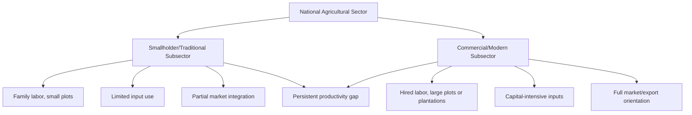
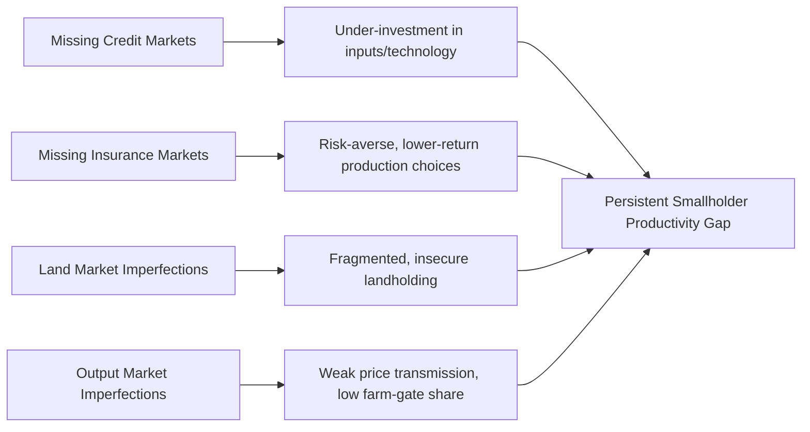

## Smallholder Agriculture and Dualistic Economies

### Overview

**Key Points**

- Smallholder agriculture refers to farming carried out on small landholdings, typically operated by family labor, and remains the dominant form of agricultural production in most developing economies by number of farms, even where its share of marketed output varies.
- **Dualistic economies** describe economic structures where a modern, capital-intensive, high-productivity sector coexists alongside a traditional, labor-intensive, low-productivity sector — with agriculture (and smallholder farming specifically) typically anchoring the traditional pole.
- The persistence, transformation prospects, and policy treatment of smallholder agriculture within dualistic economic structures is a central and long-running debate in agricultural development economics.

### Defining Smallholder Agriculture

There is no single universal threshold, but smallholders are generally characterized by:

- **Small operated land area**: commonly under 2 hectares, though definitions vary by country and agro-ecological context (e.g., FAO and World Bank studies commonly use thresholds ranging from 1–10 hectares depending on region).
- **Predominantly family labor**: limited or no hired permanent labor.
- **Diversified, often subsistence-oriented production**: mix of food crops for household consumption and some marketed surplus, frequently combined with livestock.
- **Limited access to capital, credit, and modern inputs**: constraining productivity and market integration relative to larger commercial farms.
- **Multiple income sources**: many smallholder households derive significant income from off-farm labor, remittances, or non-farm enterprise alongside farming. [Inference]

$$Smallholder\ Share\ of\ Farms = \frac{N_{farms < threshold}}{N_{total\ farms}} \times 100$$

Globally, smallholder farms are estimated to constitute the large majority of farm units worldwide, though their share of total agricultural land and marketed output is considerably smaller and varies significantly by region. [Unverified — precise global figures vary across studies (FAO, World Bank, Lowder et al.) depending on methodology and year; consult current sources for specific percentages]

### The Dual Economy Concept

**Dualism** in development economics describes the coexistence of structurally distinct sectors within a single economy, differing systematically in:

| Dimension | Traditional/Smallholder Sector | Modern Sector |
| --- | --- | --- |
| Technology | Labor-intensive, low mechanization | Capital-intensive, mechanized |
| Productivity | Low output per worker | High output per worker |
| Market orientation | Partial subsistence, thin market integration | Fully market-oriented, export/commercial |
| Wage/return determination | Family labor, imputed/implicit returns | Market wages, formal capital returns |
| Access to credit/inputs | Limited, informal credit sources | Formal banking, input supply chains |
| Risk exposure | High vulnerability to weather/price shocks, limited insurance | Better risk management, formal insurance/hedging access |

This dualism was central to the **Lewis Model** (covered in structural transformation) but has also been analyzed extensively as a persistent, not merely transitional, feature of many developing agricultural economies — sometimes called **agrarian dualism** or, within agriculture itself, the **bimodal farm structure** (large commercial estates coexisting with small family farms, historically prominent in Latin America and parts of Southern/Eastern Africa).

### Theories of Smallholder Persistence and Efficiency

#### The "Efficient but Poor" Hypothesis

Economist **Theodore Schultz** (Nobel laureate, *Transforming Traditional Agriculture*, 1964) argued that smallholder farmers in traditional agriculture are typically allocatively efficient given their existing technology, resources, and information — i.e., they optimize well within severe constraints, but the constraints themselves (limited technology, capital, and risk-bearing capacity) keep them poor. This challenged earlier views that traditional farmers were simply irrational or resistant to change.

#### Inverse Farm Size–Productivity Relationship

A widely studied empirical regularity in agricultural economics is the **inverse relationship (IR)** between farm size and land productivity (output per hectare) — smaller farms often show higher yields per hectare than larger farms, commonly attributed to:

- More intensive family labor application per hectare on small plots (labor cannot easily be "sold" elsewhere at the same shadow price, so its opportunity cost is lower for the smallholder than a market wage would suggest).
- Better labor supervision on family farms versus hired labor on large farms (reduced agency/monitoring costs).
- Land quality and market imperfection explanations (some studies attribute part of the observed relationship to unmeasured land quality differences or missing/incomplete land and credit markets rather than a genuine size-productivity causal relationship).

$$IR:\ \frac{Y}{A}\Big|_{small\ farm} > \frac{Y}{A}\Big|_{large\ farm}$$

[Unverified — the inverse relationship is one of the most extensively studied and debated empirical regularities in agricultural economics; its existence, magnitude, and correct causal interpretation remain actively contested across different country studies and methodologies]

### Market Imperfections and Smallholder Constraints

Smallholder-specific vulnerabilities are frequently explained through the lens of **missing or incomplete markets**:

- **Credit market failures**: lack of collateral (informal/customary land tenure not bankable), information asymmetries, and high transaction costs of small loans lead formal lenders to under-serve smallholders, forcing reliance on informal, often higher-cost credit sources.
- **Insurance market failures**: absence of affordable crop/weather insurance leaves smallholders exposed to covariate risk (weather shocks affecting an entire community simultaneously), leading to risk-averse production choices that sacrifice expected income for stability (e.g., planting lower-risk, lower-return traditional varieties over higher-return but riskier options).
- **Land market imperfections**: customary tenure systems, fragmented plots (from inheritance subdivision), and weak title formalization can constrain both land sales/rental markets and use of land as loan collateral.
- **Output market imperfections**: poor rural infrastructure (roads, storage, market information) raises transaction costs and price risk, often resulting in smallholders receiving a smaller share of final consumer prices relative to well-connected commercial farms.

### Policy Debates: Smallholder-Centered vs. Large-Scale Commercial Development

#### Arguments Favoring Smallholder-Centered Development

- Higher land productivity per hectare (inverse relationship) suggests smallholder-intensive growth may achieve higher aggregate output for a given land base, at least under certain market conditions.
- Broader distributional benefits: agricultural growth concentrated among numerous small farm households tends to have larger poverty-reduction and local economic multiplier effects than growth concentrated in a small number of large commercial operations. [Inference]
- Employment absorption: labor-intensive smallholder agriculture can absorb rural labor that would otherwise be un/underemployed, particularly relevant where non-farm job creation is limited.

#### Arguments Favoring Commercial/Large-Scale Development

- Economies of scale in mechanization, input procurement, and access to export markets requiring quality/volume consistency that fragmented smallholder production struggles to meet.
- Easier access to formal credit and technical assistance due to greater collateral and negotiating capacity.
- Faster technology adoption and capital investment cycles.

[Inference] Contemporary development policy increasingly favors hybrid or complementary approaches — improving smallholder productivity and market linkages (contract farming, cooperatives, value chain integration) rather than treating smallholder and commercial development as strictly competing pathways, though the appropriate balance remains contested and context-dependent.

### Contract Farming and Value Chain Integration as a Response to Dualism

**Contract farming** arrangements link smallholders to commercial buyers/processors, attempting to capture some benefits of commercial-scale coordination while retaining smallholder land tenure and labor structure:

- Buyer provides inputs, credit, technical assistance, and guaranteed purchase terms.
- Smallholder retains land ownership/use rights and provides labor.
- Reduces some market imperfection constraints (credit, information, output market access) without requiring land consolidation.

**Producer cooperatives** similarly attempt to achieve scale economies (input bulk purchasing, collective marketing, shared processing/storage infrastructure) while preserving individual smallholder landholding.

[Inference] Empirical evidence on contract farming and cooperative effectiveness is mixed and highly context-dependent, with outcomes shaped by contract design, buyer market power, and the specific commodity and institutional environment.

### Smallholder Agriculture and Off-Farm Diversification

An increasingly emphasized feature of smallholder household economics is **livelihood diversification**: many smallholder households derive substantial income from non-farm sources (wage labor, remittances, small enterprise, seasonal migration) alongside farming, blurring the traditional/modern sector boundary at the household level.

$$Household\ Income = Y_{farm} + Y_{off\text{-}farm\ wage} + Y_{remittance} + Y_{non\text{-}farm\ enterprise}$$

This diversification serves multiple functions:

- **Risk management**: non-farm income is often less correlated with agricultural production risk (weather, pests), providing a buffer.
- **Capital accumulation**: off-farm earnings can finance agricultural input purchases, partially substituting for missing rural credit markets.
- **Structural transformation microcosm**: individual household diversification away from pure farming reflects, at a micro level, the same sectoral shift described macro-economically by structural transformation theory.

### Diagram: Dualistic Agricultural Economy Structure (svg_diagram)

<svg xmlns="http://www.w3.org/2000/svg" viewBox="0 0 720 380">
\<style\>
.box { fill: #f5f5f5; stroke: #333; stroke-width: 1.5; }
.boxAlt { fill: #eaf0fa; stroke: #333; stroke-width: 1.5; }
.boxWarn { fill: #faf0ea; stroke: #333; stroke-width: 1.5; }
.label { font-family: Arial, sans-serif; font-size: 12px; fill: #111; }
.title { font-family: Arial, sans-serif; font-size: 15px; font-weight: bold; fill: #111; }
.arrow { stroke: #333; stroke-width: 1.5; marker-end: url(#arrow5); fill: none; }
\</style\>
<text x="360" y="24" text-anchor="middle" class="title">Dualistic Agricultural Economy Structure (svg_diagram)</text>

<rect x="60" y="55" width="260" height="60" class="boxAlt" />
<text x="190" y="80" text-anchor="middle" class="label">Smallholder Sector</text>
<text x="190" y="98" text-anchor="middle" class="label">Small plots, family labor, mixed markets</text>
<rect x="400" y="55" width="260" height="60" class="box" />
<text x="530" y="80" text-anchor="middle" class="label">Commercial Sector</text>
<text x="530" y="98" text-anchor="middle" class="label">Large scale, hired labor, export markets</text>
<rect x="60" y="160" width="260" height="60" class="boxWarn" />
<text x="190" y="182" text-anchor="middle" class="label">Constraints:</text>
<text x="190" y="200" text-anchor="middle" class="label">Credit, insurance, land, output markets</text>
<rect x="400" y="160" width="260" height="60" class="box" />
<text x="530" y="182" text-anchor="middle" class="label">Advantages:</text>
<text x="530" y="200" text-anchor="middle" class="label">Scale economies, formal credit access</text>
<rect x="130" y="260" width="460" height="60" class="boxAlt" />
<text x="360" y="282" text-anchor="middle" class="label">Policy responses: contract farming, cooperatives,</text>
<text x="360" y="300" text-anchor="middle" class="label">value chain integration, land/credit market reform</text>
<path d="M190,115 L190,160" class="arrow" />
<path d="M530,115 L530,160" class="arrow" />
<path d="M190,220 L280,260" class="arrow" />
<path d="M530,220 L440,260" class="arrow" />
</svg>

### Common Misconceptions

- **"Smallholders are inefficient and should be replaced by large farms"** — the inverse farm size–productivity relationship literature complicates this view, though the debate remains active and context-dependent. [Inference]
- **"Traditional smallholder farmers are irrational or resistant to innovation"** — Schultz's "efficient but poor" hypothesis and subsequent research generally support the view that smallholders optimize well within severe resource and market constraints.
- **"Smallholder households rely solely on farm income"** — off-farm income diversification is common and often substantial among smallholder households in many developing country contexts. [Inference]

### Conclusion

Smallholder agriculture remains the numerically dominant farm structure across much of the developing world and sits at the core of dualistic economic structures, where a traditional, labor-intensive, market-constrained sector coexists alongside a modern, capital-intensive commercial sector. Rather than reflecting irrationality or backwardness, smallholder production patterns are generally understood as efficient responses to severe and interlocking market imperfections in credit, insurance, land, and output markets. Contemporary development policy increasingly seeks complementary rather than purely substitutive approaches — improving smallholder market linkages and productivity through contract farming, cooperatives, and targeted market reform — while structural transformation and off-farm diversification continue to gradually reshape the boundary between the traditional and modern agricultural poles.

**Related Topics**

- Inverse farm size–productivity relationship: empirical debates and explanations
- Schultz's "efficient but poor" hypothesis and its critiques
- Rural credit markets and microfinance interventions
- Contract farming models and value chain governance
- Agricultural cooperatives: design, governance, and performance
- Land tenure reform and titling programs
- Rural livelihood diversification and non-farm income strategies
- Bimodal agrarian structures in Latin America and Southern Africa