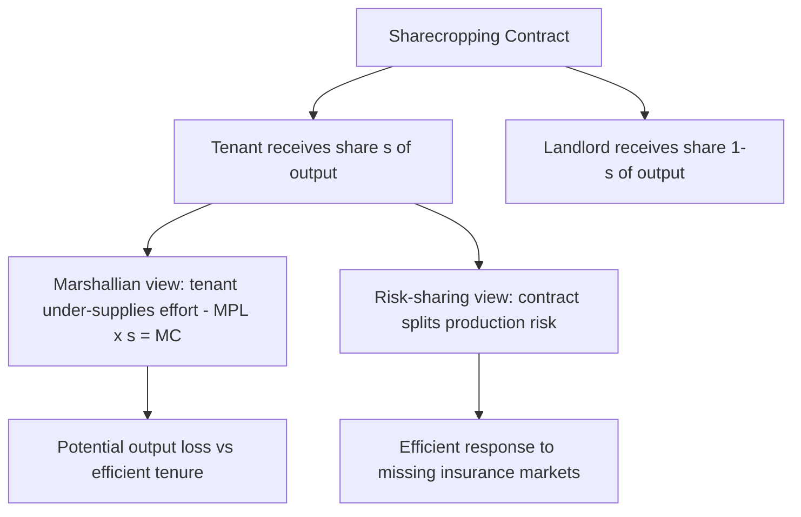
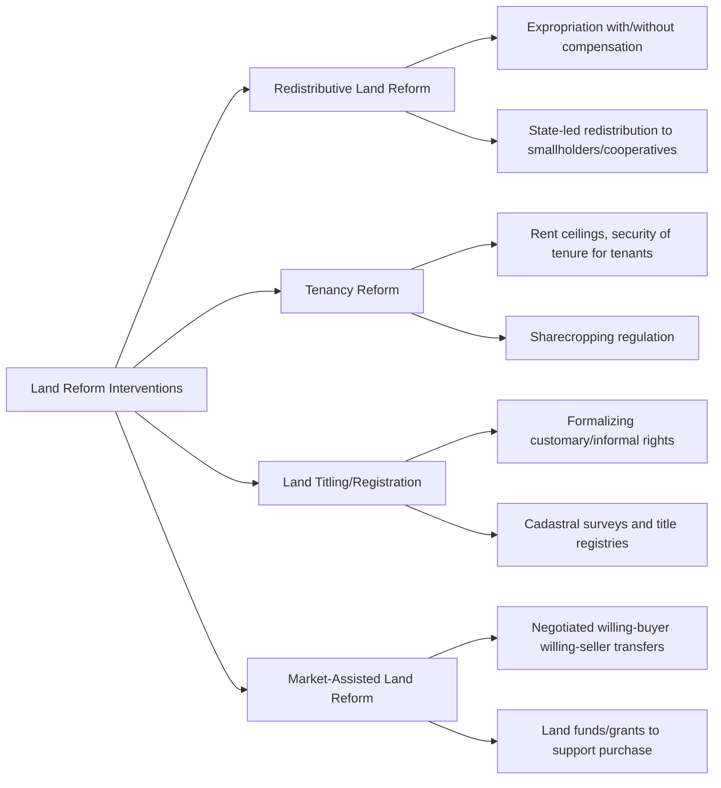

## Land Reform and Tenure Systems

### Overview

**Key Points**

- Land tenure systems define the rules governing how individuals and groups access, use, control, and transfer rights to land, forming a foundational institutional layer underlying agricultural investment, productivity, and equity outcomes.
- Land reform refers to deliberate policy interventions that redistribute land ownership/use rights or restructure tenure institutions, typically motivated by equity, productivity, or political-economy objectives.
- Land tenure security is widely considered a key determinant of farmer investment incentives, credit access, and long-run agricultural productivity, though the empirical relationship is nuanced and context-dependent.

### Land Tenure Systems: Typology

| Tenure Type | Description | Key Characteristics |
| --- | --- | --- |
| **Freehold/private ownership** | Individual holds full ownership rights, including sale and inheritance | Highest formal security; typically bankable as collateral where titling and land markets are well-functioning |
| **Leasehold** | Tenant holds temporary use rights under a rental agreement (cash rent or share rent) | Security depends on lease terms, duration, and legal enforcement |
| **Customary/communal tenure** | Land rights governed by traditional community rules, often administered by chiefs, elders, or lineage groups | Predominant in much of Sub-Saharan Africa and parts of Asia/Latin America; often lacks formal state-recognized title, but can provide strong de facto security within the community |
| **State/public land tenure** | Land owned by the state, allocated via leases, permits, or use rights | Common historically in socialist and post-colonial land systems |
| **Sharecropping** | Tenant farms land in exchange for a share (commonly ½ or ⅓) of output to the landowner | Historically widespread; often analyzed for incentive distortions (see below) |

### Property Rights Theory and Agricultural Investment

Secure property rights are theorized to affect agricultural outcomes through several channels:

1. **Investment incentive channel**: farmers are more willing to make long-term land investments (irrigation, terracing, tree crops, soil conservation) when confident they will capture the returns over time.
2. **Collateral/credit channel**: formally titled land can be used as loan collateral, easing credit constraints for input purchases and investment.
3. **Land market channel**: secure, transferable rights enable land sales and rental markets that can allocate land toward more productive users over time.
4. **Reduced tenure-related conflict**: clear rights reduce disputes and associated productivity losses from land insecurity/litigation.

$$Investment_{it} = f(Tenure\ Security_{it},\ Credit\ Access_{it},\ Expected\ Returns_{it})$$

[Inference] The empirical magnitude of the tenure security–investment relationship varies substantially across studies; some research finds strong positive effects of formal titling on investment, while other studies find customary tenure systems already provide sufficient de facto security in some contexts, making formal titling's marginal effect smaller than theory alone would predict.

### The Sharecropping Puzzle

Sharecropping has been a subject of extensive economic analysis due to an apparent incentive inefficiency, sometimes called the **Marshallian inefficiency** (after Alfred Marshall):

Under a fixed sharecropping arrangement where the tenant receives share $s$ of output (e.g., $s = 0.5$), the tenant's marginal private return to effort is only $s$ times the marginal product, while the tenant bears the full marginal cost of effort:

$$MPL \times s = MC_{effort}$$

versus the socially efficient condition:

$$MPL = MC_{effort}$$

Because $s < 1$, this implies the tenant under-supplies effort relative to the efficient level, in the simple static Marshallian model — theoretically resulting in lower output than under either fixed-rent tenancy or owner-cultivation.

**[Inference]** Subsequent theoretical and empirical work (e.g., incentive-based models by economists such as Joseph Stiglitz) has shown sharecropping can be understood as an efficient risk-sharing arrangement between a risk-averse tenant and a landlord, rather than simply an inefficient institution, particularly where formal insurance and credit markets are absent — the share contract splits production risk between both parties. The empirical evidence on sharecropping's actual productivity effects relative to alternative tenure arrangements remains mixed and context-dependent.

### Rationale for Land Reform

Land reform programs have historically been motivated by multiple, sometimes overlapping objectives:

#### Equity Rationale

Highly unequal initial land distribution (e.g., large latifundia/hacienda systems in Latin America, colonial-era land concentration in parts of Africa and Asia) is associated with persistent rural poverty and political instability; redistribution aims to broaden asset ownership among the rural poor.

#### Productivity Rationale

Given the empirically observed **inverse farm size–productivity relationship** (discussed in smallholder agriculture), redistributing land from large, less labor-intensive operations to smallholder family farms has been argued, in some contexts, to raise aggregate land productivity — though this argument depends on the underlying market imperfections driving the inverse relationship and is contested. [Inference]

#### Political-Economy Rationale

Land reform has frequently been pursued as a strategy for political stabilization, reducing rural unrest, and building political constituencies (e.g., post-WWII land reforms in Japan, South Korea, and Taiwan were partly motivated by Cold War-era concerns about agrarian-based political radicalization). [Unverified — the precise weighting of political versus economic motivations in specific historical episodes is debated among historians and political economists]

### Types of Land Reform Interventions

#### 1. Redistributive Land Reform

Direct transfer of land from large landholders to smallholders or landless households, historically implemented through expropriation (with or without compensation) or state-led collectivization.

**Example**

The East Asian land reforms in **Japan (1946–1950)**, **South Korea (1950s)**, and **Taiwan (1949–1953)**, implemented under significant US occupation/advisory influence, redistributed land from landlords to tenant cultivators, generally converting a large share of tenant farmers into owner-cultivators. These reforms are widely cited in development economics as contributing to subsequent broad-based agricultural productivity growth and are considered influential precedents in the land reform literature, though scholars continue to debate the precise causal contribution of land reform versus other concurrent factors (infrastructure investment, agricultural extension, favorable trade policy) to these countries' later growth. [Unverified — the relative causal weight of land reform versus other development interventions in these cases remains debated in the historical development economics literature]

#### 2. Tenancy Reform

Regulating existing landlord-tenant relationships without full redistribution — rent ceilings, minimum tenancy duration, restrictions on eviction, or regulation of sharecropping terms. Often politically easier to implement than full redistribution but can have unintended consequences (e.g., landlords evicting tenants preemptively to avoid triggering tenant rights protections). [Inference]

#### 3. Land Titling and Registration Programs

Formalizing existing (often customary or informal) land rights through surveying and legal title issuance, without changing the underlying distribution of land. Prominent examples include large-scale titling programs in several Latin American and Southeast Asian countries from the 1990s onward, often supported by World Bank and bilateral donor funding.

#### 4. Market-Assisted Land Reform

A "willing buyer, willing seller" approach (prominently associated with World Bank-supported programs in the 1990s–2000s, e.g., in South Africa, Brazil, Colombia) using land funds/grants to help targeted beneficiaries purchase land through negotiated market transactions rather than state expropriation. This approach has been critiqued for slower pace and limited scale relative to redistributive objectives in some country contexts. [Unverified — outcomes vary substantially by country program and evaluation methodology]

### Common Challenges and Critiques of Land Reform Programs

- **Implementation capacity constraints**: cadastral surveying, title registration, and dispute resolution require substantial administrative capacity often lacking in the contexts where reform is most needed.
- **Elite capture and political resistance**: landholding elites often have disproportionate political influence, leading to weak enforcement, compensation-heavy designs that limit redistribution scope, or reform reversal.
- **Post-reform support gaps**: land redistribution without complementary access to credit, extension, and input markets can leave beneficiaries unable to realize productivity gains ("land without capital" problem). [Inference]
- **Gender and intra-household distribution**: formal titling programs have sometimes reinforced male-headed household land rights at the expense of women's customary use rights, an issue increasingly addressed in more recent program designs. [Inference]
- **Customary tenure formalization risks**: converting communal/customary tenure into individual formal title can disrupt existing community-based resource-sharing and risk-pooling arrangements, and may disadvantage groups (e.g., women, pastoralists with seasonal land use rights) whose claims are less visible in formalization processes. [Inference]

### Land Tenure and Investment: The De Soto Thesis

Economist **Hernando de Soto** (*The Mystery of Capital*, 2000) argued that the primary barrier to development in many poor countries is not lack of assets but lack of formal legal title converting informally-held assets (including land) into usable capital — "dead capital" that cannot be leveraged as collateral for credit or formally transacted.

This thesis has been influential in shaping large-scale land titling program design globally, though it has also drawn significant critique:

- Empirical studies on titling programs show mixed results on actual credit access improvements, partly because formal financial institutions may still be reluctant to lend against agricultural land in rural areas even with clear title, due to enforcement costs of foreclosure. [Unverified — evidence varies substantially across country contexts and financial sector conditions]
- Critics argue the thesis underestimates the functionality of existing customary and informal tenure arrangements in providing adequate de facto security for many purposes. [Inference]

### Analytical Framework: Land Reform Outcome Assessment

| Evaluation Dimension | Key Questions |
| --- | --- |
| Equity | Did land distribution become more equal? Who were the actual beneficiaries? |
| Productivity | Did land/labor productivity rise post-reform? Over what time horizon? |
| Tenure security | Did beneficiaries gain durable, enforceable, transferable rights? |
| Complementary support | Was reform accompanied by credit, extension, and input market access? |
| Political sustainability | Was the reform politically durable, or vulnerable to reversal/erosion? |
| Gender/intra-household equity | Were women's and marginalized groups' rights explicitly protected? |

### Diagram: Land Tenure Security and Agricultural Outcomes (svg_diagram)

<svg xmlns="http://www.w3.org/2000/svg" viewBox="0 0 720 380">
\<style\>
.box { fill: #f5f5f5; stroke: #333; stroke-width: 1.5; }
.boxAlt { fill: #eaf5ea; stroke: #333; stroke-width: 1.5; }
.boxWarn { fill: #faf0ea; stroke: #333; stroke-width: 1.5; }
.label { font-family: Arial, sans-serif; font-size: 12px; fill: #111; }
.title { font-family: Arial, sans-serif; font-size: 15px; font-weight: bold; fill: #111; }
.arrow { stroke: #333; stroke-width: 1.5; marker-end: url(#arrow6); fill: none; }
\</style\>
<text x="360" y="24" text-anchor="middle" class="title">Land Tenure Security and Agricultural Outcomes (svg_diagram)</text>

<rect x="270" y="50" width="180" height="50" class="box" />
<text x="360" y="80" text-anchor="middle" class="label">Land Tenure Security</text>
<rect x="40" y="140" width="180" height="55" class="boxAlt" />
<text x="130" y="162" text-anchor="middle" class="label">Investment</text>
<text x="130" y="180" text-anchor="middle" class="label">Incentive ↑</text>
<rect x="270" y="140" width="180" height="55" class="boxAlt" />
<text x="360" y="162" text-anchor="middle" class="label">Credit/Collateral</text>
<text x="360" y="180" text-anchor="middle" class="label">Access ↑</text>
<rect x="500" y="140" width="180" height="55" class="boxAlt" />
<text x="590" y="162" text-anchor="middle" class="label">Land Market</text>
<text x="590" y="180" text-anchor="middle" class="label">Functioning ↑</text>
<rect x="200" y="245" width="320" height="55" class="box" />
<text x="360" y="267" text-anchor="middle" class="label">Higher Long-Run Productivity</text>
<text x="360" y="285" text-anchor="middle" class="label">and Sustainable Land Use</text>
<rect x="230" y="330" width="260" height="40" class="boxWarn" />
<text x="360" y="355" text-anchor="middle" class="label">Risk: elite capture, weak enforcement</text>
<path d="M330,100 L130,140" class="arrow" />
<path d="M360,100 L360,140" class="arrow" />
<path d="M400,100 L590,140" class="arrow" />
<path d="M130,195 L280,245" class="arrow" />
<path d="M360,195 L360,245" class="arrow" />
<path d="M590,195 L440,245" class="arrow" />
<path d="M360,300 L360,330" class="arrow" />
</svg>

### Common Misconceptions

- **"Formal titling automatically improves credit access and investment"** — empirical evidence is mixed; lenders may remain reluctant despite formal title, and customary tenure sometimes already provides sufficient de facto security. [Inference]
- **"Sharecropping is always inefficient"** — modern risk-sharing theories of tenancy contracts show sharecropping can be an efficient institutional response to missing insurance markets, not simply an incentive distortion. [Inference]
- **"Land redistribution alone guarantees productivity gains"** — without complementary access to credit, inputs, and extension services, redistributed land may not translate into sustained productivity improvement. [Inference]

### Conclusion

Land tenure systems shape the fundamental institutional environment within which agricultural investment, credit access, and productivity decisions occur, ranging from freehold ownership to customary communal arrangements and sharecropping contracts. Land reform — whether redistributive, tenancy-focused, or titling-based — has been pursued globally for equity, productivity, and political-economy reasons, with historical episodes such as the East Asian post-war land reforms frequently cited as influential (if contested) precedents. Contemporary land reform and tenure policy increasingly recognizes that formal legal security alone is insufficient; complementary access to credit, extension, and input/output markets, alongside careful attention to gender and intra-household equity, are necessary for land tenure interventions to translate into sustained agricultural development outcomes.

**Related Topics**

- Inverse farm size–productivity relationship and its link to land redistribution rationale
- East Asian land reform case studies (Japan, South Korea, Taiwan)
- Customary land tenure systems in Sub-Saharan Africa
- Gender and land rights in titling program design
- De Soto's "dead capital" thesis and critiques
- Rural credit market failures and collateral constraints
- Market-assisted land reform program evaluations
- Cadastral survey and land registry system design