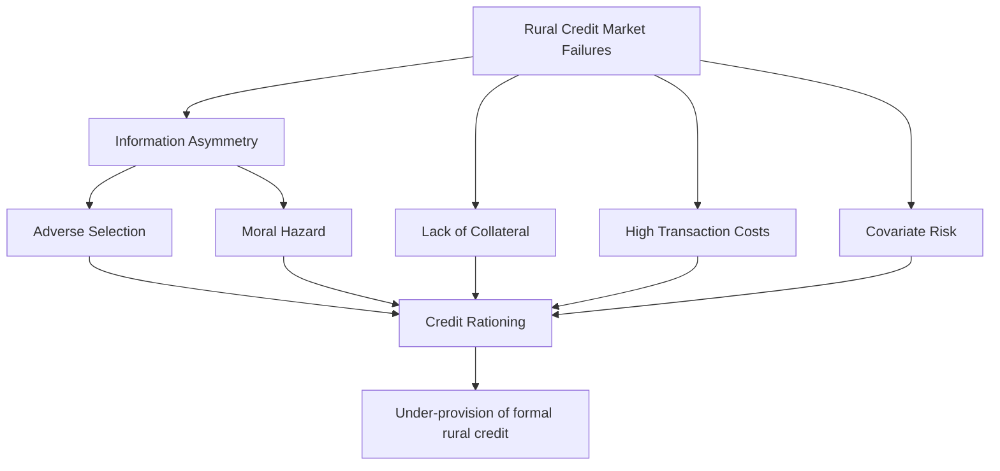
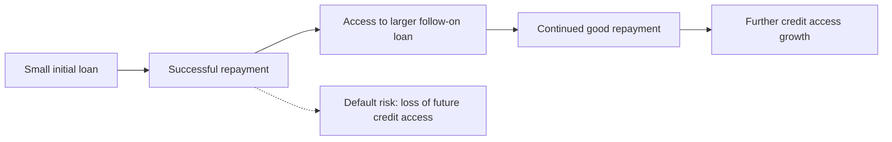

## Rural Credit and Microfinance

### Overview

**Key Points**

- Rural credit markets in developing economies are characterized by pervasive market failures — information asymmetry, lack of collateral, high transaction costs, and covariate risk — that lead formal financial institutions to systematically under-serve smallholder farmers and rural households.
- Microfinance emerged as an institutional innovation designed to overcome these constraints, primarily through group lending, dynamic incentives, and alternative screening mechanisms, rather than relying on traditional collateral requirements.
- Despite significant global expansion, rigorous impact evaluations of microfinance have produced more modest and nuanced findings than originally anticipated, prompting ongoing debate about its role in rural agricultural development.

### Why Rural Credit Markets Fail: Theoretical Foundations

#### Information Asymmetry

Lenders typically cannot fully observe a borrower's true risk type (creditworthiness) or effort/investment behavior after loan disbursement, generating two classic problems:

- **Adverse selection**: at any given interest rate, riskier borrowers are disproportionately willing to borrow (since they bear less expected cost of default), so raising interest rates to compensate for average risk can perversely worsen the risk pool — a mechanism formalized by economist **Joseph Stiglitz and Andrew Weiss (1981)**.
- **Moral hazard**: once a loan is disbursed, borrowers may take on riskier investments or reduce repayment effort, since they do not bear the full downside if the lender absorbs default losses.

$$\pi_{lender} = f(r, \bar{p}(r))$$

where $\pi_{lender}$ is expected lender profit, $r$ is the interest rate, and $\bar{p}(r)$ is average borrower repayment probability, which the Stiglitz-Weiss model shows can *decline* as $r$ rises beyond some point due to adverse selection and moral hazard, producing **credit rationing** — lenders limit loan quantity rather than raise prices to clear the market.

#### Lack of Collateral

Many rural households, particularly smallholders under customary or informal land tenure, lack legally titled, bankable collateral (see land reform and tenure), making standard collateral-based lending models difficult to apply.

#### High Transaction Costs

Small, geographically dispersed loan amounts in rural areas generate disproportionately high per-loan administrative and monitoring costs relative to loan size, discouraging formal bank participation.

#### Covariate Risk

Rural, particularly agricultural, income shocks (drought, floods, pest outbreaks, price collapses) tend to affect many borrowers within a community simultaneously, undermining risk-pooling within a single lender's local portfolio and limiting the effectiveness of informal community-based insurance/credit mechanisms that rely on idiosyncratic (individually varying) risk.

### Informal Credit Arrangements

In the absence of adequate formal credit, rural households historically rely on informal mechanisms:

- **Moneylenders**: often charge high interest rates reflecting information advantages (local knowledge of borrower reliability) but also monopoly power in thin rural credit markets; interlinked with output markets in some cases (e.g., trader-lenders who require crop sale to themselves as informal loan repayment).
- **Rotating Savings and Credit Associations (ROSCAs)**: community-based groups where members contribute regularly to a pooled fund, with the full pot rotating to a different member each cycle — an informal mechanism for consumption smoothing and lump-sum access without formal collateral.
- **Kinship and social network lending**: informal borrowing from family/community members, often interest-free or low-interest but subject to social obligation and reciprocity norms.
- **Input supplier credit**: informal credit extended by agricultural input dealers, often tied to input purchase and sometimes to output sale commitments.

### The Microfinance Model: Core Innovations

Microfinance institutions (MFIs), pioneered prominently by **Grameen Bank** (Muhammad Yunus, Bangladesh, founded 1983; Yunus and Grameen Bank jointly received the Nobel Peace Prize in 2006), developed several institutional mechanisms to address the market failures above without relying on conventional collateral:

#### 1. Group Lending with Joint Liability

Borrowers form small groups (commonly 5 members in the original Grameen model) who are jointly liable for each other's loans — if one member defaults, the group's future access to credit is jeopardized, creating peer monitoring and social collateral incentives.

$$Repayment\ Incentive = f(Individual\ Liability + Peer\ Pressure + Future\ Credit\ Access)$$

**[Inference]** Group lending theoretically addresses adverse selection (group members self-select peers they believe are creditworthy, using local information the lender lacks) and moral hazard (peer monitoring substitutes for costly lender monitoring), though subsequent research has produced mixed findings on the actual necessity of joint liability versus individual liability lending with strong dynamic incentives (see below).

#### 2. Dynamic Incentives (Progressive Lending)

Borrowers start with small loan amounts and gain access to progressively larger loans conditional on successful repayment history, creating a repeated-game incentive to maintain good standing rather than default on any single loan.

#### 3. Regular Repayment Schedules

Frequent (often weekly) small repayment installments, rather than lump-sum repayment, are theorized to build repayment discipline and allow early detection of repayment difficulty, though they can also poorly match the seasonal, lumpy cash flow patterns of agricultural production. [Inference]

#### 4. Targeting Women Borrowers

Many MFIs specifically target women borrowers, based on evidence and theory suggesting women often have higher repayment rates and that credit access to women may have broader positive intra-household welfare effects (child health, education spending). [Unverified — the evidence on gendered repayment differentials and intra-household welfare effects varies across studies and contexts]

### Evolution of the Microfinance Sector

The microfinance model has evolved considerably since its origins:

- **Microfinance institutions (MFIs)** range from NGO-based programs to regulated microfinance banks and, increasingly, commercial microfinance operations.
- **Mobile money and digital microfinance**: integration with mobile payment platforms (e.g., M-Pesa in Kenya) has substantially reduced transaction costs of loan disbursement and repayment collection in some markets, and enabled new digital credit-scoring models using mobile transaction history as an alternative to conventional collateral. [Inference]
- **Agricultural value chain finance**: linking credit provision to specific agricultural value chains (input suppliers, processors, buyers) as an alternative or complement to standalone microfinance, sometimes embedding credit within contract farming arrangements (see smallholder agriculture).
- **Savings-led approaches**: some programs have shifted emphasis toward promoting rural savings mobilization (savings groups, village savings and loan associations - VSLAs) rather than external credit provision alone, partly in response to over-indebtedness concerns in some microcredit markets. [Inference]

### Empirical Evidence on Microfinance Impact

Rigorous randomized controlled trial (RCT) evaluations of microcredit expansion, conducted across multiple countries by researchers including Abhijit Banerjee, Esther Duflo, Dean Karlan, and others (several of whom received the 2019 Nobel Memorial Prize in Economic Sciences partly for this body of work), have generally found:

- Microcredit access tends to produce modest effects on average household income and consumption, generally smaller than the transformative poverty-reduction effects originally hoped for by early microfinance advocates.
- Effects are heterogeneous: households with pre-existing profitable business opportunities or those classified as more entrepreneurially inclined tend to benefit more from credit access than average households.
- Some studies find shifts in the composition of economic activity (e.g., business investment, durable goods purchase) even where average income effects are limited.
- Concerns about over-indebtedness have emerged in some microfinance markets experiencing rapid, sometimes poorly regulated expansion (e.g., documented crises in Andhra Pradesh, India in 2010, and in some other markets), highlighting risks of aggressive multiple lending to the same borrowers without adequate credit bureau infrastructure. [Unverified — specific crisis details and current regulatory responses should be checked against current sources]

[Inference] This body of evidence has led to a broader reassessment within development economics: microfinance is now generally viewed as one useful tool among several for expanding financial access, rather than a standalone, transformative poverty-reduction solution as originally framed by some early advocates.

### Agricultural-Specific Credit Challenges

Agricultural lending poses distinct challenges relative to general rural microcredit:

- **Seasonality mismatch**: standard microfinance weekly repayment schedules poorly match agricultural cash flow, which is typically concentrated around harvest, creating demand for agriculture-specific loan products with harvest-aligned repayment schedules.
- **Covariate weather risk**: agricultural lending portfolios are highly exposed to correlated weather shocks across a lender's entire client base in a given region, a risk not easily diversified within a single local MFI's portfolio.
- **Long gestation investments**: agricultural investments (irrigation infrastructure, perennial tree crops, livestock) often require longer repayment horizons than typical microfinance products offer.

**Index-based weather insurance** has been developed and piloted as a complementary risk-management tool specifically to address the covariate weather risk problem, paying out based on an objectively measured weather index (e.g., rainfall at a local station) rather than requiring individual loss verification, though these products have faced adoption challenges related to basis risk (index outcomes not perfectly matching an individual farmer's actual losses) and demand uptake. [Inference]

### Credit Rationing and the Role of Formal Banking Reform

Beyond microfinance, broader formal financial sector development efforts relevant to rural agricultural credit include:

- **Agricultural development banks**: state-owned or state-supported banks specifically mandated to serve agricultural credit needs, with historically mixed performance records related to political interference in lending decisions and loan repayment enforcement. [Inference]
- **Warehouse receipt financing**: using stored, quality-certified agricultural commodities as loan collateral, addressing the collateral constraint problem for farmers without titled land.
- **Digital credit scoring**: leveraging mobile phone transaction data, satellite/remote sensing data on farm conditions, and other alternative data sources to assess creditworthiness without traditional collateral or credit history. [Inference]
- **Credit bureaus and information sharing systems**: addressing information asymmetry and over-indebtedness risk by enabling lenders to share borrower credit history across institutions.

### Diagram: Rural Credit Market Structure (svg_diagram)

<svg xmlns="http://www.w3.org/2000/svg" viewBox="0 0 720 400">
\<style\>
.box { fill: #f5f5f5; stroke: #333; stroke-width: 1.5; }
.boxAlt { fill: #eaf5ea; stroke: #333; stroke-width: 1.5; }
.boxWarn { fill: #faf0ea; stroke: #333; stroke-width: 1.5; }
.label { font-family: Arial, sans-serif; font-size: 12px; fill: #111; }
.title { font-family: Arial, sans-serif; font-size: 15px; font-weight: bold; fill: #111; }
.arrow { stroke: #333; stroke-width: 1.5; marker-end: url(#arrow7); fill: none; }
\</style\>
<text x="360" y="24" text-anchor="middle" class="title">Rural Credit Market Structure (svg_diagram)</text>

<rect x="290" y="45" width="160" height="50" class="box" />
<text x="370" y="75" text-anchor="middle" class="label">Rural Household</text>
<rect x="40" y="140" width="180" height="55" class="boxWarn" />
<text x="130" y="162" text-anchor="middle" class="label">Informal Sources</text>
<text x="130" y="180" text-anchor="middle" class="label">Moneylenders, ROSCAs</text>
<rect x="270" y="140" width="180" height="55" class="boxAlt" />
<text x="360" y="162" text-anchor="middle" class="label">Microfinance</text>
<text x="360" y="180" text-anchor="middle" class="label">Group lending, dynamic incentives</text>
<rect x="500" y="140" width="180" height="55" class="box" />
<text x="590" y="162" text-anchor="middle" class="label">Formal Banking</text>
<text x="590" y="180" text-anchor="middle" class="label">Ag banks, warehouse receipts</text>
<rect x="150" y="250" width="420" height="60" class="box" />
<text x="360" y="272" text-anchor="middle" class="label">Complementary tools: mobile money, digital credit scoring,</text>
<text x="360" y="290" text-anchor="middle" class="label">index-based weather insurance, value chain finance</text>
<path d="M320,95 L130,140" class="arrow" />
<path d="M370,95 L360,140" class="arrow" />
<path d="M420,95 L590,140" class="arrow" />
<path d="M130,195 L250,250" class="arrow" />
<path d="M360,195 L360,250" class="arrow" />
<path d="M590,195 L470,250" class="arrow" />
</svg>

### Common Misconceptions

- **"Microfinance is a proven, transformative poverty-reduction tool"** — rigorous RCT evidence generally shows modest average effects, with benefits concentrated among households with pre-existing productive opportunities; the earlier transformative narrative has been substantially revised in the academic literature. [Inference]
- **"Group lending's joint liability is essential to microfinance success"** — subsequent research has found individual liability lending with strong dynamic incentives can achieve comparable repayment performance in some contexts, questioning whether joint liability is strictly necessary. [Inference]
- **"Rural credit rationing simply reflects lender discrimination"** — the Stiglitz-Weiss framework shows credit rationing can be a rational lender response to information asymmetry even under competitive, non-discriminatory lending conditions.

### Conclusion

Rural credit markets in developing economies are structurally prone to failure due to information asymmetry, collateral scarcity, high transaction costs, and covariate risk, which together produce credit rationing that formal financial institutions have historically struggled to overcome. Microfinance emerged as an influential institutional response, using group lending, dynamic incentives, and alternative screening to expand credit access without conventional collateral, though rigorous impact evaluation has tempered early expectations about its transformative potential. Contemporary rural and agricultural finance increasingly combines microfinance with complementary tools — digital credit scoring, mobile money, warehouse receipt financing, and index-based weather insurance — reflecting a broader recognition that agricultural credit provision requires addressing seasonality, covariate risk, and long-gestation investment needs distinct from general rural microcredit.

**Related Topics**

- Stiglitz-Weiss credit rationing model in depth
- Index-based weather insurance: design and basis risk challenges
- Mobile money and digital financial inclusion (e.g., M-Pesa case study)
- Warehouse receipt financing systems
- Contract farming and value chain finance linkages
- Savings groups and village savings and loan associations (VSLAs)
- Over-indebtedness crises in microfinance markets: causes and regulatory responses
- Land tenure and collateral constraints in rural credit access