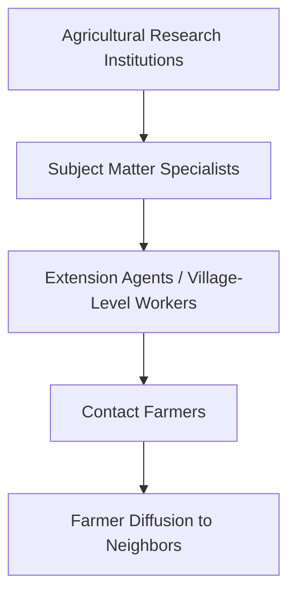
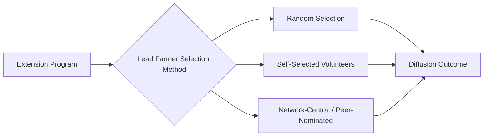
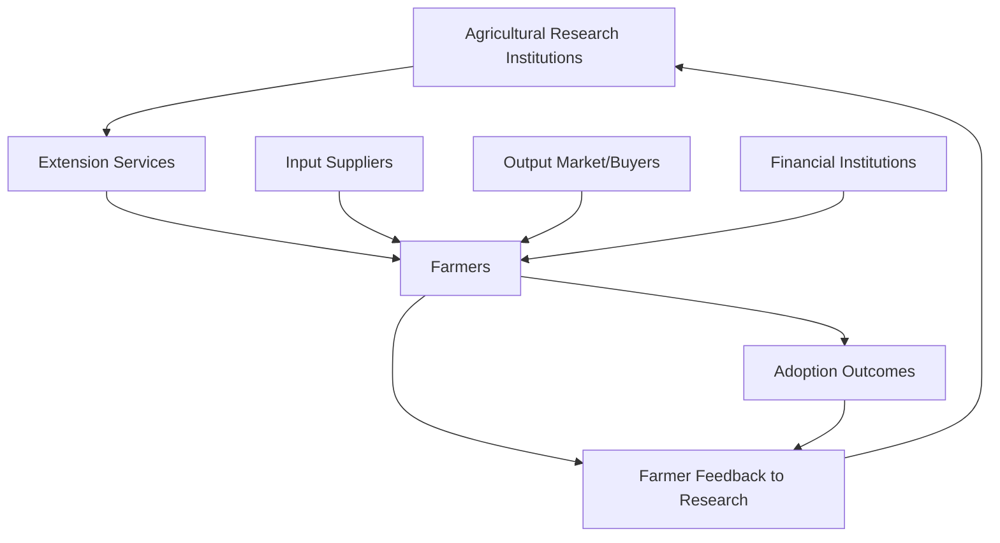

## Agricultural Extension and Information Diffusion

### Overview

**Key Points**

- Agricultural extension refers to the systems and services that transmit agricultural knowledge, research findings, and technical recommendations from research institutions to farmers, historically delivered through public sector agents and increasingly through pluralistic, digital, and market-based channels.
- Information diffusion theory explains how new agricultural knowledge and technologies spread through farmer populations via formal extension, social learning, and peer networks, with implications for extension program design and targeting.
- Extension effectiveness depends critically on institutional design, farmer-to-agent ratios, message credibility, and complementary access to inputs and credit — extension alone rarely overcomes structural adoption constraints.

### Historical Models of Agricultural Extension

#### Training and Visit (T&V) System

The **Training and Visit (T&V)** system, developed and widely promoted by the World Bank (associated with agricultural economist Daniel Benor) from the 1970s–1990s, structured extension as a hierarchical system:

Key features:

- Extension agents visited fixed groups of "contact farmers" on a regular schedule, who were expected to demonstrate practices that would then diffuse to neighboring farmers through informal observation and interaction.
- Emphasis on single-line management, regular training, and standardized technical messages.
- Widely implemented across dozens of countries with World Bank support in the 1970s–1980s.

**[Inference]** The T&V system has been extensively critiqued in subsequent literature for high recurrent fiscal costs relative to demonstrated impact, rigid top-down messaging poorly adapted to local agro-ecological diversity, and unrealistic assumptions about the extent of spontaneous diffusion from contact farmers to their neighbors; most donor-supported T&V programs were discontinued or substantially reformed by the late 1990s.

#### Farmer Field Schools (FFS)

Developed initially by the **FAO** in Indonesia in the late 1980s (originally for integrated pest management in rice), the **Farmer Field School** model shifted from top-down message transmission to participatory, experiential learning:

- Groups of farmers meet regularly over a full cropping season at a local field site.
- Facilitators guide farmers through structured field observation, experimentation, and group discussion rather than delivering fixed technical recommendations.
- Emphasis on building farmers' own analytical and decision-making capacity ("farmers as experts") rather than simple technology transfer.

[Unverified — evidence on FFS cost-effectiveness and diffusion beyond directly participating farmers is mixed across empirical evaluations, with some studies finding limited spillover to non-participating neighboring farmers relative to program cost, though results vary by context and implementation quality]

#### Pluralistic Extension Systems

Contemporary extension increasingly involves multiple, overlapping providers rather than a single public system:

| Provider Type | Example Mechanisms |
| --- | --- |
| Public extension services | Government agricultural ministries, agricultural universities |
| Private sector | Input suppliers (seed/fertilizer companies), commercial buyers/processors providing technical support tied to contracts |
| NGOs and civil society | Farmer field schools, community-based training programs |
| Farmer organizations/cooperatives | Peer-to-peer knowledge sharing, collective bargaining and technical support |
| Digital/ICT-based services | SMS advisory services, mobile apps, call centers, remote sensing-based recommendations |

### Information Diffusion Theory Applied to Extension

Building on the general diffusion-of-innovation framework (Rogers, covered under Green Revolution technology adoption), extension-specific diffusion research emphasizes:

#### Social Learning Models

Economists including **Timothy Conley and Christopher Udry** (notably their study of pineapple farmers in Ghana) formalized **social learning** models in which farmers update their technology/input use based on observing the outcomes achieved by information neighbors (farmers with whom they discuss agricultural practices), not merely geographic neighbors.

$$Belief_{i,t+1} = Belief_{i,t} + \lambda \left( Outcome_{j,t} - Expected\ Outcome_{j,t} \right)$$

where farmer $i$ updates beliefs based on the surprise component of information-neighbor $j$'s realized outcome relative to what was expected, with $\lambda$ representing the weight given to social information relative to prior beliefs.

**Key implication**: social learning is most valuable when signal quality is otherwise poor (novel technologies with uncertain local performance), which explains why information networks matter more for genuinely new technologies than for well-established practices. [Inference]

#### Contact Farmer / Lead Farmer Models

Programs strategically select and train a subset of "lead farmers" or "model farmers" intended to serve as diffusion nodes within their community, based on the theory that information will spread through existing social networks from trained individuals to their contacts.

**[Inference]** Empirical research on targeting strategies for lead farmer selection has found that the choice of *which* farmers to train significantly affects diffusion outcomes — for example, some studies suggest that farmers identified by their peers as popular or influential ("network-central" individuals, sometimes identified using a "gossip" or nomination method) achieve higher diffusion than randomly selected or self-selected lead farmers, an active area of applied research combining social network analysis with agricultural extension design.

### Extension Message Design and Credibility

Effectiveness of extension messaging depends on several factors beyond simple information provision:

- **Source credibility**: farmers weight information more heavily from sources perceived as trustworthy and locally relevant; extension agents lacking local agro-ecological knowledge or perceived as disconnected from farmer realities face credibility barriers. [Inference]
- **Message complexity and specificity**: overly generic, one-size-fits-all recommendations perform worse than locally calibrated advice accounting for specific soil, climate, and farming system conditions.
- **Demonstration versus verbal instruction**: hands-on demonstration plots and visible results tend to be more persuasive than verbal or written recommendations alone, consistent with experiential learning theory underlying the Farmer Field School model. [Inference]
- **Timing relative to decision points**: information delivered close to actual planting/input purchase decisions tends to be more actionable than generic seasonal messaging delivered off-cycle. [Inference]

### Digital Extension and ICT-Based Information Diffusion

Mobile phone penetration growth across developing country agricultural regions has enabled substantial expansion of digital extension delivery channels:

- **SMS/voice-based agricultural advisory services**: text or voice message delivery of weather forecasts, planting advice, pest/disease alerts, and price information (e.g., various country-specific services across Sub-Saharan Africa and South Asia).
- **Interactive Voice Response (IVR) systems**: allow farmers with basic (non-smartphone) phones to access recorded agricultural advice via voice menus, addressing literacy barriers that limit SMS-based services.
- **Smartphone applications**: image-based crop disease diagnosis tools, integrated market price and weather information, and personalized recommendation engines using farm-specific data.
- **Remote sensing and satellite-based advisory**: using satellite imagery to generate localized recommendations on irrigation timing, pest risk, or yield forecasting, increasingly integrated into digital extension platforms.

**[Inference]** Evidence on digital extension effectiveness is generally more limited and more recent than for traditional extension models; early evaluations suggest digital channels can meaningfully reduce information delivery costs per farmer reached, though behavior change and technology adoption outcomes depend on the same underlying constraints (credit, input access, risk tolerance) that affect adoption of any extension-recommended practice, meaning information delivery alone is generally necessary but not sufficient for adoption.

### Extension System Design Tradeoffs

| Design Dimension | Tradeoff |
| --- | --- |
| Centralized vs. decentralized delivery | Standardization/quality control vs. local relevance and responsiveness |
| Public vs. private provision | Broad equitable access vs. potential for more sustainable market-based financing and stronger accountability to farmer-clients |
| Generalist vs. specialist agents | Breadth of coverage vs. depth of technical expertise per topic |
| In-person vs. digital delivery | Higher per-contact cost/trust vs. lower cost/broader reach but potentially lower engagement depth |
| Universal vs. targeted (lead farmer) delivery | Equity of access vs. cost-efficiency through diffusion leverage |

### Extension's Role Within the Broader Innovation System

Agricultural extension is best understood as one component of a broader **Agricultural Innovation System (AIS)** or **Agricultural Knowledge and Information System (AKIS)** framework, which also includes:

This systems view emphasizes that extension functions most effectively when integrated with, rather than isolated from, research feedback loops, input/credit access, and output market linkages — consistent with the complementary technology package insight from Green Revolution adoption analysis. [Inference]

### Diagram: Information Diffusion Pathways in Extension (svg_diagram)

<svg viewBox="0 0 720 380" xmlns="http://www.w3.org/2000/svg">
\<style\>
.box { fill: #f5f5f5; stroke: #333; stroke-width: 1.5; }
.boxAlt { fill: #eaf5ea; stroke: #333; stroke-width: 1.5; }
.boxWarn { fill: #eaeef5; stroke: #333; stroke-width: 1.5; }
.label { font-family: Arial, sans-serif; font-size: 12px; fill: #111; }
.title { font-family: Arial, sans-serif; font-size: 15px; font-weight: bold; fill: #111; }
.arrow { stroke: #333; stroke-width: 1.5; marker-end: url(#arrow8); fill: none; }
\</style\>
<defs>
<marker id="arrow8" markerWidth="10" markerHeight="10" refX="8" refY="3" orient="auto" markerUnits="strokeWidth">
<path d="M0,0 L0,6 L9,3 z" fill="#333"/>
</marker>
</defs>

<text x="360" y="24" text-anchor="middle" class="title">Information Diffusion Pathways in Extension (svg_diagram)</text>

<rect x="270" y="45" width="180" height="50" class="box"/>
<text x="360" y="75" text-anchor="middle" class="label">Extension Source</text>
<rect x="60" y="140" width="180" height="55" class="boxAlt"/>
<text x="150" y="162" text-anchor="middle" class="label">Formal Channel</text>
<text x="150" y="180" text-anchor="middle" class="label">Agent visits, FFS, T&V</text>
<rect x="270" y="140" width="180" height="55" class="boxWarn"/>
<text x="360" y="162" text-anchor="middle" class="label">Digital Channel</text>
<text x="360" y="180" text-anchor="middle" class="label">SMS, IVR, apps</text>
<rect x="480" y="140" width="180" height="55" class="boxAlt"/>
<text x="570" y="162" text-anchor="middle" class="label">Lead Farmer</text>
<text x="570" y="180" text-anchor="middle" class="label">Peer diffusion node</text>
<rect x="270" y="250" width="180" height="55" class="box"/>
<text x="360" y="272" text-anchor="middle" class="label">Farmer Social Network</text>
<text x="360" y="290" text-anchor="middle" class="label">Social learning updates</text>
<rect x="180" y="335" width="360" height="35" class="box"/>
<text x="360" y="358" text-anchor="middle" class="label">Adoption Outcome (contingent on credit/input access)</text>
<path d="M330,95 L150,140" class="arrow"/>
<path d="M360,95 L360,140" class="arrow"/>
<path d="M400,95 L570,140" class="arrow"/>
<path d="M150,195 L300,250" class="arrow"/>
<path d="M360,195 L360,250" class="arrow"/>
<path d="M570,195 L420,250" class="arrow"/>
<path d="M360,305 L360,335" class="arrow"/>
</svg>

### Common Misconceptions

- **"More extension contact automatically produces more adoption"** — adoption also depends on complementary access to credit, inputs, and risk tolerance; extension provides necessary but often insufficient information alone. [Inference]
- **"Diffusion from trained farmers to neighbors happens automatically"** — the T&V model's assumption of largely spontaneous diffusion has been substantially qualified by subsequent research showing diffusion effectiveness depends heavily on social network structure and lead farmer selection method. [Inference]
- **"Digital extension can fully replace in-person extension"** — digital channels reduce delivery costs but generally complement rather than fully substitute for trust-building, demonstration, and locally calibrated advice that in-person extension provides, particularly for complex or high-stakes technology decisions. [Inference]

### Conclusion

Agricultural extension systems have evolved from centralized, top-down models such as Training and Visit toward more participatory (Farmer Field Schools) and pluralistic, multi-provider systems incorporating private sector, NGO, and digital channels. Information diffusion theory — particularly social learning models and lead farmer targeting research — has substantially refined understanding of how agricultural knowledge actually spreads through farmer networks, moving beyond simple assumptions of automatic diffusion. Extension is most effective when understood as one component of a broader agricultural innovation system, integrated with research feedback, credit access, and input/output markets, rather than as a stand-alone information delivery mechanism capable of overcoming all adoption barriers on its own.

**Related Topics**

- Diffusion of Innovations theory and adoption curves (Green Revolution linkage)
- Social learning models in agricultural technology adoption (Conley and Udry)
- Lead farmer targeting and social network analysis in extension design
- Farmer Field School program evaluation evidence
- Digital agriculture and ICT-based advisory services
- Agricultural Innovation Systems (AIS) framework
- Extension privatization and market-based advisory service models
- Gender-responsive extension service design