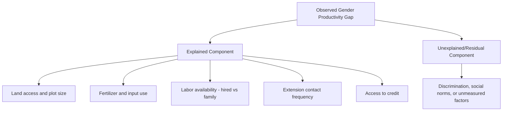
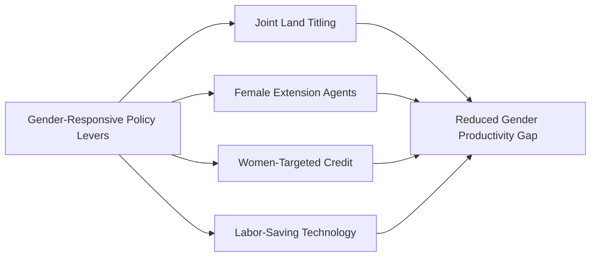

## Gender and Agricultural Development

### Overview

**Key Points**

- Women constitute a substantial share of the agricultural labor force in many developing economies, yet consistently face disproportionate constraints in access to land, credit, inputs, extension services, and markets relative to men.
- The **"gender productivity gap"** in agriculture — the observed difference in output per hectare between male- and female-managed plots — is a well-documented empirical pattern generally attributed primarily to unequal resource access rather than differences in farming ability.
- Closing gender gaps in agricultural resource access is widely estimated in the development economics literature to carry significant aggregate productivity and food security benefits, making gender-responsive agricultural policy design an increasingly central component of agricultural development economics.

### Women's Roles in Agricultural Production

Women's involvement in agriculture spans production, processing, and marketing activities, though the specific division of labor varies substantially by region, culture, and farming system:

- **Production activities**: planting, weeding, harvesting, and increasingly, in many regions, decision-making on smaller plots or specific crops (often food crops for household consumption, as distinct from male-managed cash crops in some farming systems).
- **Livestock management**: particularly small livestock (poultry, small ruminants) and dairy processing in many farming systems.
- **Post-harvest processing**: food processing, storage, and preparation activities predominantly performed by women in many contexts.
- **Marketing**: selling agricultural produce and processed goods, particularly at local/informal markets.
- **Unpaid domestic and care labor**: water and fuel collection, childcare, and household maintenance, which constitute a significant time burden that competes directly with time available for agricultural production activities. [Inference]

[Unverified — precise global or regional estimates of women's overall share of agricultural labor vary considerably across data sources and measurement methodologies (e.g., FAO's frequently cited but methodologically debated aggregate figures); consult current FAO/World Bank gender and agriculture data for specific up-to-date figures]

### The Gender Productivity Gap: Measurement and Evidence

The gender gap in agricultural productivity is typically measured by comparing output value per hectare between plots managed by women and plots managed by men within the same household or community:

$$Gender\ Gap = \frac{Y_{male\text{-}managed}/A_{male\text{-}managed} - Y_{female\text{-}managed}/A_{female\text{-}managed}}{Y_{male\text{-}managed}/A_{male\text{-}managed}} \times 100$$

Multiple country-level studies (notably World Bank and FAO-supported analyses across several Sub-Saharan African countries) have documented statistically significant gender productivity gaps, generally in the range of a substantial percentage difference, though the exact magnitude varies considerably by country, crop, and measurement methodology. [Unverified — specific percentage figures cited across different studies range considerably; consult current World Bank/FAO gender and agriculture publications for precise, current figures]

#### Decomposition of the Gender Gap

Empirical decomposition studies (using techniques such as Oaxaca-Blinder decomposition, common in labor economics and adapted to agricultural gender gap analysis) generally attribute the gender productivity gap primarily to differences in **access to productive resources and inputs** rather than to differences in farming knowledge, effort, or managerial ability:

Key contributing factors identified across multiple country studies:

1. **Unequal land access and tenure security**: women often have secondary or use-only rights to land through male relatives rather than direct ownership, particularly under customary tenure systems, limiting both land quality/plot choice and the collateral value of land for credit access (see land reform and tenure).
2. **Lower input use**: women-managed plots frequently show lower fertilizer, improved seed, and pesticide application rates, generally attributed to more limited access to credit and cash income needed to purchase inputs. [Inference]
3. **Labor constraints**: women often have less access to hired labor (due to more limited cash resources) and face competing time demands from domestic/care responsibilities, affecting timely completion of labor-intensive agricultural tasks.
4. **Reduced extension contact**: extension services have historically, in many contexts, been delivered predominantly to male household heads, even where women are significant agricultural decision-makers, resulting in lower effective extension reach to women farmers. [Inference]
5. **Weaker access to credit**: compounding effects of land tenure insecurity (limiting collateral) and social/institutional barriers to formal credit access.

### Intra-Household Resource Allocation Models

Development economics has moved beyond simple **unitary household models** (which assume households behave as if maximizing a single joint utility function) toward **collective/bargaining household models**, which recognize that intra-household resource allocation reflects negotiation between household members with potentially different preferences and bargaining power.

$$U_{household} \neq f(single\ utility\ function)$$

$$U_{household} = g(U_{male}, U_{female}, Bargaining\ Power)$$

Under collective models, an individual's bargaining power is often theorized to depend on their **fallback/threat point** — the welfare they could achieve outside the household arrangement (e.g., through independent income, land ownership, or the option to leave the household) — implying that policies strengthening women's independent asset ownership or income can shift intra-household allocation in ways affecting agricultural input allocation, plot management, and household welfare spending patterns. [Inference]

**[Inference]** Empirical research (e.g., studies analyzing the effects of targeting cash transfers or agricultural interventions to women versus men within the same household) has generally found that resources controlled by women are more likely to be allocated toward child nutrition, health, and education spending compared to resources controlled by men, though the magnitude and consistency of this finding vary across studies and contexts, and this remains an active area of empirical research.

### Gender-Responsive Agricultural Policy Approaches

#### Land Tenure Reform with Gender Provisions

- Joint titling requirements (both spouses' names on land certificates) in land formalization/titling programs, addressing the risk that individual titling defaults to male household head registration.
- Legal reform of inheritance laws that may otherwise systematically exclude women from land inheritance.

#### Gender-Targeted Extension and Training

- Recruiting and training female extension agents, who may have greater access and credibility with women farmers in contexts where social norms restrict interaction between unrelated men and women.
- Scheduling extension activities (timing, location) accounting for women's time constraints from domestic responsibilities.
- Women-only farmer groups and Farmer Field Schools, designed to increase women's participation and voice in group learning settings.

#### Credit and Financial Inclusion Targeting

- Women-focused microfinance programs (see rural credit and microfinance), based partly on evidence of comparable or higher female repayment rates and potential intra-household welfare benefits.
- Mobile money and digital financial services, which can provide women more independent, private financial access compared to household-shared or male-controlled financial accounts in some contexts. [Inference]

#### Labor-Saving Technology

- Promoting technologies that reduce women's domestic/agricultural labor burden (improved cookstoves, water access infrastructure, labor-saving processing equipment), freeing time for productive agricultural or income-generating activities. [Inference]

### Aggregate Economic Implications of Closing Gender Gaps

FAO and World Bank analyses have frequently argued that closing the gender gap in agricultural resource access could yield meaningful gains in aggregate agricultural output and food security, based on the logic that equalizing input access to women-managed plots would raise their productivity toward the male-managed plot benchmark, holding total resources within the sector roughly constant. [Unverified — specific aggregate percentage estimates cited in FAO and related publications have been subject to some methodological critique in the academic literature regarding the underlying assumptions and extrapolation methods; consult current primary sources and any subsequent critiques for a full assessment]

### Data and Measurement Challenges

Gender and agriculture research faces persistent measurement challenges:

- **Plot manager attribution ambiguity**: joint management of plots by multiple household members complicates simple "male-managed" versus "female-managed" plot classification used in much of the empirical literature.
- **Female-headed household heterogeneity**: this category includes structurally different situations (widowed, divorced, de facto female-headed due to male out-migration) with potentially different resource access patterns, often aggregated together in survey data despite meaningfully different underlying dynamics. [Inference]
- **Individual-level agricultural survey data limitations**: many agricultural surveys historically collected data at the household level rather than disaggregating by individual plot manager or decision-maker, limiting the ability to analyze intra-household gender dynamics; this has improved with more recent survey instruments (e.g., World Bank LSMS-ISA surveys with individual-level modules) but remains an ongoing methodological challenge. [Inference]

### Diagram: Gender Productivity Gap Pathway (svg_diagram)

<svg xmlns="http://www.w3.org/2000/svg" viewBox="0 0 720 380">
\<style\>
.box { fill: #f5f5f5; stroke: #333; stroke-width: 1.5; }
.boxAlt { fill: #f5eaf0; stroke: #333; stroke-width: 1.5; }
.boxWarn { fill: #eaf0f5; stroke: #333; stroke-width: 1.5; }
.label { font-family: Arial, sans-serif; font-size: 11.5px; fill: #111; }
.title { font-family: Arial, sans-serif; font-size: 15px; font-weight: bold; fill: #111; }
.arrow { stroke: #333; stroke-width: 1.5; marker-end: url(#arrow9); fill: none; }
\</style\>
<text x="360" y="24" text-anchor="middle" class="title">Gender Productivity Gap Pathway (svg_diagram)</text>

<rect x="30" y="55" width="150" height="55" class="boxAlt" />
<text x="105" y="77" text-anchor="middle" class="label">Unequal Land</text>
<text x="105" y="95" text-anchor="middle" class="label">Access/Tenure</text>
<rect x="200" y="55" width="150" height="55" class="boxAlt" />
<text x="275" y="77" text-anchor="middle" class="label">Limited Credit</text>
<text x="275" y="95" text-anchor="middle" class="label">Access</text>
<rect x="370" y="55" width="150" height="55" class="boxAlt" />
<text x="445" y="77" text-anchor="middle" class="label">Lower Extension</text>
<text x="445" y="95" text-anchor="middle" class="label">Contact</text>
<rect x="540" y="55" width="150" height="55" class="boxAlt" />
<text x="615" y="77" text-anchor="middle" class="label">Domestic Labor</text>
<text x="615" y="95" text-anchor="middle" class="label">Time Burden</text>
<rect x="150" y="160" width="420" height="55" class="box" />
<text x="360" y="182" text-anchor="middle" class="label">Lower Input Use on Women-Managed Plots</text>
<text x="360" y="200" text-anchor="middle" class="label">(fertilizer, hired labor, improved seed)</text>
<rect x="200" y="255" width="320" height="50" class="boxWarn" />
<text x="360" y="285" text-anchor="middle" class="label">Gender Gap in Agricultural Productivity</text>
<rect x="150" y="335" width="420" height="35" class="box" />
<text x="360" y="357" text-anchor="middle" class="label">Policy Response: land, credit, extension, labor-saving tech</text>
<path d="M105,110 L280,160" class="arrow" />
<path d="M275,110 L320,160" class="arrow" />
<path d="M445,110 L400,160" class="arrow" />
<path d="M615,110 L440,160" class="arrow" />
<path d="M360,215 L360,255" class="arrow" />
<path d="M360,305 L360,335" class="arrow" />
</svg>

### Common Misconceptions

- **"The gender productivity gap reflects women's lower farming ability"** — empirical decomposition studies generally attribute the gap primarily to unequal resource access (land, inputs, credit, extension), not differences in skill or effort. [Inference]
- **"Households allocate resources jointly and equally by default"** — collective/bargaining household models and associated empirical evidence indicate intra-household resource allocation often reflects differential bargaining power rather than simple joint optimization. [Inference]
- **"Gender-neutral policies automatically benefit women and men equally"** — policies that appear neutral on their face (e.g., extension delivered to "household heads") can systematically under-reach women where social and institutional norms default such roles to men. [Inference]

### Conclusion

Gender inequality in agricultural resource access — spanning land tenure, credit, extension contact, and labor availability — underlies a well-documented and economically significant gender productivity gap, generally understood to stem primarily from unequal access to productive resources rather than differences in farming capability. Intra-household bargaining models provide a theoretical foundation for understanding why gender-neutral policy design often fails to reach women effectively, motivating gender-responsive approaches: joint land titling, female extension agents, women-targeted credit, and labor-saving technology. Given estimates suggesting substantial aggregate productivity and food security gains from closing these gaps, gender considerations have become an increasingly central, rather than peripheral, dimension of agricultural development economics and policy design.

**Related Topics**

- Intra-household bargaining models and collective household economics
- Land tenure reform and joint titling program design (linkage to land reform)
- Gender-targeted microfinance and financial inclusion programs
- Female-headed household heterogeneity and measurement challenges
- Time-use surveys and women's domestic labor burden in agriculture
- Gender-responsive agricultural extension service design
- LSMS-ISA survey methodology for individual-level agricultural data
- Cash transfer targeting and intra-household welfare effects