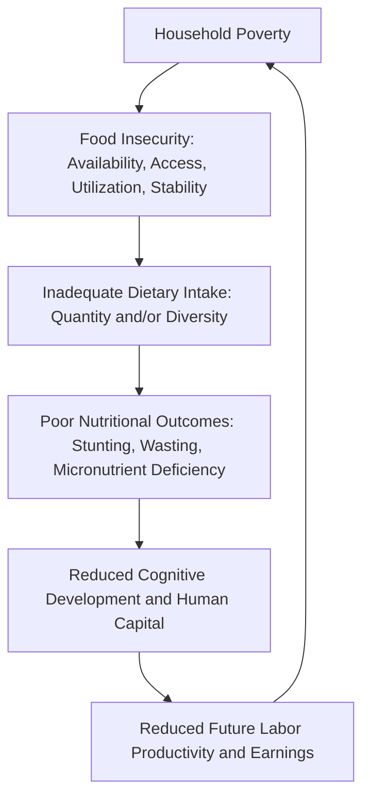
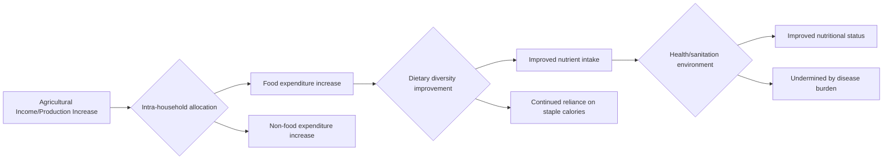

## Poverty, Food Security, and Nutrition Linkages

### Overview

**Key Points**

- Poverty, food security, and nutrition are conceptually distinct but causally interlinked outcomes: poverty constrains food access, food insecurity undermines nutritional status, and poor nutrition in turn reduces human capital and labor productivity, reinforcing poverty in a potential intergenerational cycle.
- The relationship between agricultural income growth and improved nutrition is not automatic — increased farm income does not mechanically translate into better dietary diversity or child nutrition outcomes without attention to intra-household allocation, market access, and health/sanitation complementarities.
- Understanding these linkages requires distinguishing between **caloric sufficiency**, **dietary diversity/quality**, and **nutritional outcomes** (stunting, wasting, micronutrient deficiency), each of which responds differently to agricultural and economic interventions.

### Conceptual Framework: The Poverty–Food Security–Nutrition Chain

This cyclical relationship is often referred to as the **poverty-malnutrition trap** or, in the specific context of child growth, the **intergenerational transmission of poverty** through early-life nutritional deprivation. [Inference]

### Distinguishing Food Security, Dietary Diversity, and Nutrition

| Concept | Definition | Common Measurement Approaches |
| --- | --- | --- |
| **Food security** | Physical and economic access to sufficient, safe, nutritious food meeting dietary needs (FAO's four pillars: availability, access, utilization, stability) | Food Consumption Score (FCS), Household Food Insecurity Access Scale (HFIAS), caloric intake surveys |
| **Dietary diversity** | Range of food groups consumed, a proxy for micronutrient adequacy | Household Dietary Diversity Score (HDDS), Minimum Dietary Diversity for Women (MDD-W) |
| **Nutritional status** | Anthropometric and biochemical indicators of the body's actual nutritional condition | Stunting (height-for-age), wasting (weight-for-height), underweight (weight-for-age), micronutrient biomarkers (e.g., serum ferritin for iron status) |

A household can be food secure in caloric terms (sufficient staple food intake) while still experiencing **hidden hunger** — micronutrient deficiencies (iron, vitamin A, zinc, iodine) resulting from insufficient dietary diversity, particularly where diets are dominated by starchy staples with limited fruit, vegetable, animal-source food, or legume intake. [Inference]

### The Agricultural Income–Nutrition Pathway: Why It Is Not Automatic

A common assumption in early agricultural development policy was that raising farm household income or food production would directly and proportionally improve nutritional outcomes. Subsequent research has identified multiple points where this pathway can break down:

#### 1. Income–Expenditure Allocation Uncertainty

Increased household income does not automatically flow toward food expenditure, let alone toward nutritionally diverse food purchases; a portion may be allocated to non-food goods, savings, debt repayment, or agricultural reinvestment. The share of additional income spent on food, and specifically on higher-quality/diverse food, varies by context and is not guaranteed to be large. [Inference]

#### 2. Engel's Law and Dietary Quality Elasticity

**Engel's Law** establishes that the food expenditure *share* of total spending declines as income rises, but this describes aggregate food spending, not necessarily nutrient quality improvement. Within food expenditure, however, rising income is generally associated with substitution toward more diverse and higher-value foods (animal-source foods, fruits, vegetables) rather than simply more staple calories — sometimes termed **Bennett's Law**. [Inference — Bennett's Law describes a widely observed empirical regularity but the specific dietary substitution pattern varies by cultural food preferences and relative food prices across contexts]

#### 3. Intra-Household Allocation and Gender Dynamics

As discussed in gender and agricultural development, the individual within the household who controls additional income significantly affects whether it is allocated toward child nutrition; income controlled by women is more frequently associated with increased spending on food, health, and child nutrition compared to income controlled by men in several empirical studies, though this finding varies in magnitude across contexts. [Inference]

#### 4. The Health and Sanitation Environment (WASH Complementarity)

Nutritional status depends not only on dietary intake but on the body's ability to absorb and utilize nutrients, which is undermined by poor water, sanitation, and hygiene (WASH) conditions leading to repeated diarrheal disease and intestinal parasitic infections — a mechanism sometimes described through the concept of **environmental enteric dysfunction**. This means agricultural/income interventions alone, without complementary WASH and health interventions, may show limited nutritional impact even where dietary intake improves. [Inference]

#### 5. Own-Production versus Market Access Substitutability

Increased farm production of a specific commodity (e.g., a cash crop) does not necessarily improve household dietary diversity if it displaces food crop production without adequate market access to purchase diverse foods with the resulting income — a debate closely tied to **cash crop versus food crop production tradeoffs** in smallholder farming systems. [Inference]

### Empirical Evidence on Agriculture-Nutrition-Sensitive Interventions

Development economics and nutrition research increasingly distinguishes between **nutrition-sensitive** and **nutrition-specific** interventions:

- **Nutrition-specific interventions**: directly address immediate determinants of malnutrition (micronutrient supplementation, therapeutic feeding for acute malnutrition, breastfeeding promotion, deworming).
- **Nutrition-sensitive interventions**: address underlying determinants through sectors not primarily focused on nutrition (agriculture, WASH, education, social protection), including biofortification, homestead food production, and agricultural diversification programs.

**[Inference]** Evaluations of nutrition-sensitive agricultural interventions (e.g., homestead garden programs, livestock/poultry provision programs, biofortified crop promotion such as vitamin A-biofortified orange sweet potato) have generally found more consistent evidence of improved dietary diversity and micronutrient intake than of improvements in anthropometric outcomes (stunting/wasting), reflecting the multiple additional pathways (health environment, caregiving practices, disease burden) that mediate the link between dietary improvement and measurable growth outcomes.

### Biofortification as a Nutrition-Agriculture Integration Strategy

**Biofortification** — breeding staple crops for enhanced micronutrient content (e.g., vitamin A-rich orange-fleshed sweet potato, iron-biofortified beans, zinc-biofortified rice/wheat) — represents a deliberate integration of agricultural research with nutrition objectives, developed prominently through programs such as **HarvestPlus** (part of CGIAR).

Rationale:

- Reaches populations through existing staple food consumption patterns without requiring behavior change toward new food categories.
- Potentially more cost-effective and sustainable at scale than recurrent supplementation programs, since the nutrient enhancement is embedded in the seed and does not require ongoing distribution logistics beyond normal seed systems. [Inference]

[Unverified — the comparative cost-effectiveness of biofortification versus supplementation or fortification approaches varies by micronutrient, delivery context, and evaluation methodology; consult current HarvestPlus/CGIAR evaluation literature for specific evidence]

### Measurement and Analytical Tools

#### Food Consumption Score (FCS) and Dietary Diversity Indices

Standard household survey tools (widely used by WFP, FAO) that assign weighted scores based on the frequency of consumption across food groups over a recall period (commonly 7 days), used to classify households into food security categories.

#### The Cost of the Diet / Cost of Nutrient Adequacy Analysis

Linear programming-based tools estimating the minimum-cost food basket meeting nutrient requirements given locally available foods and prices, used to assess affordability gaps for nutritionally adequate diets relative to household income/poverty lines.

$$\min \sum_i p_i x_i \quad \text{subject to} \quad \sum_i n_{ik} x_i \geq R_k \ \forall k$$

where $p_i$ is the price of food item $i$, $x_i$ is quantity, $n_{ik}$ is the nutrient content of food $i$ for nutrient $k$, and $R_k$ is the minimum required intake of nutrient $k$.

#### Stunting and Wasting as Core Anthropometric Indicators

$$Height\text{-}for\text{-}Age\ Z\text{-}score = \frac{Height_{observed} - Height_{median\ reference}}{SD_{reference\ population}}$$

A child is classified as stunted if height-for-age Z-score falls below −2 standard deviations from the WHO Child Growth Standards reference median; stunting reflects chronic, cumulative nutritional deprivation (often occurring in the critical first 1,000 days from conception to age two), whereas wasting (low weight-for-height) reflects acute, recent nutritional deprivation, typically from illness or acute food shortage. [Unverified — check current WHO growth standard reference documentation for precise current definitional thresholds and classification cutoffs]

### The First 1,000 Days Window

A significant body of nutrition and development economics research emphasizes the **first 1,000 days** (from conception through a child's second birthday) as a critical window during which nutritional deprivation has particularly severe and often irreversible long-run effects on physical growth and cognitive development, with documented associations to reduced adult height, cognitive test scores, and labor market earnings in later life. [Inference — this is a well-established emphasis in the global nutrition policy and economics literature, though the precise magnitude of long-run earnings effects varies across specific longitudinal studies and country contexts]

This has motivated significant policy emphasis on interventions targeted specifically at pregnant/lactating women and children under two, rather than general household-level agricultural or income interventions alone.

### Social Protection and Food Security Linkages

Beyond agricultural production-side interventions, **social protection programs** (cash transfers, food/voucher-based transfers, school feeding programs, public works with food/cash payment) serve as complementary tools addressing the access dimension of food security:

- **Conditional and unconditional cash transfers**: several large-scale programs (e.g., in Latin America and increasingly in Africa and Asia) have demonstrated improvements in food expenditure and, in some cases, dietary diversity, particularly when combined with nutrition education components. [Inference]
- **Food-based safety nets**: direct food or voucher transfers targeting food access more directly than cash, sometimes preferred in contexts of thin or poorly functioning local food markets.
- **School feeding programs**: address both immediate nutritional needs and, in some designs, provide indirect income transfer effects to households alongside education incentive effects.

### Diagram: Multi-Sector Pathways to Nutrition Outcomes (svg_diagram)

<svg viewBox="0 0 740 400" xmlns="http://www.w3.org/2000/svg">
\<style\>
.box { fill: #f5f5f5; stroke: #333; stroke-width: 1.5; }
.boxAlt { fill: #eaf5ea; stroke: #333; stroke-width: 1.5; }
.boxWarn { fill: #f5eaea; stroke: #333; stroke-width: 1.5; }
.boxInfo { fill: #eaeef5; stroke: #333; stroke-width: 1.5; }
.label { font-family: Arial, sans-serif; font-size: 11.5px; fill: #111; }
.title { font-family: Arial, sans-serif; font-size: 15px; font-weight: bold; fill: #111; }
.arrow { stroke: #333; stroke-width: 1.5; marker-end: url(#arrow10); fill: none; }
\</style\>
<defs>
<marker id="arrow10" markerWidth="10" markerHeight="10" refX="8" refY="3" orient="auto" markerUnits="strokeWidth">
<path d="M0,0 L0,6 L9,3 z" fill="#333"/>
</marker>
</defs>

<text x="370" y="24" text-anchor="middle" class="title">Multi-Sector Pathways to Nutrition Outcomes (svg_diagram)</text>

<rect x="30" y="55" width="170" height="55" class="boxAlt"/>
<text x="115" y="77" text-anchor="middle" class="label">Agricultural Income</text>
<text x="115" y="95" text-anchor="middle" class="label">& Production</text>
<rect x="220" y="55" width="170" height="55" class="boxInfo"/>
<text x="305" y="77" text-anchor="middle" class="label">Social Protection</text>
<text x="305" y="95" text-anchor="middle" class="label">Cash/food transfers</text>
<rect x="410" y="55" width="170" height="55" class="boxWarn"/>
<text x="495" y="77" text-anchor="middle" class="label">WASH & Health</text>
<text x="495" y="95" text-anchor="middle" class="label">Environment</text>
<rect x="600" y="55" width="130" height="55" class="box"/>
<text x="665" y="77" text-anchor="middle" class="label">Nutrition</text>
<text x="665" y="95" text-anchor="middle" class="label">Education</text>
<rect x="200" y="160" width="340" height="55" class="box"/>
<text x="370" y="182" text-anchor="middle" class="label">Household Food Access &</text>
<text x="370" y="200" text-anchor="middle" class="label">Dietary Diversity</text>
<rect x="200" y="260" width="340" height="55" class="boxAlt"/>
<text x="370" y="282" text-anchor="middle" class="label">Intra-household Allocation</text>
<text x="370" y="300" text-anchor="middle" class="label">(esp. first 1,000 days targeting)</text>
<rect x="230" y="345" width="280" height="40" class="boxWarn"/>
<text x="370" y="370" text-anchor="middle" class="label">Nutritional Status Outcome</text>
<path d="M115,110 L300,160" class="arrow"/>
<path d="M305,110 L340,160" class="arrow"/>
<path d="M495,110 L420,160" class="arrow"/>
<path d="M665,110 L450,160" class="arrow"/>
<path d="M370,215 L370,260" class="arrow"/>
<path d="M370,315 L370,345" class="arrow"/>
</svg>

### Common Misconceptions

- **"Raising farm income automatically improves child nutrition"** — the pathway involves multiple intermediate steps (expenditure allocation, dietary diversity, health environment) at which impact can be attenuated or lost entirely. [Inference]
- **"Food security equals caloric sufficiency"** — a household can meet caloric needs while suffering micronutrient deficiencies ("hidden hunger") due to insufficient dietary diversity.
- **"Stunting and wasting measure the same thing"** — stunting reflects chronic, cumulative deprivation while wasting reflects acute, recent nutritional shocks; they require different intervention timing and design.

### Conclusion

Poverty, food security, and nutrition are linked through a chain running from economic deprivation through inadequate food access to compromised nutritional status and, ultimately, reduced human capital that can perpetuate poverty across generations. Agricultural income growth is a necessary but insufficient condition for improved nutrition: intra-household allocation dynamics, dietary diversity substitution patterns, and the health/sanitation environment all mediate whether agricultural gains translate into measurable nutritional improvement. This has motivated a shift toward explicitly **nutrition-sensitive** agricultural program design — biofortification, homestead food production, gender-targeted resource transfers — implemented alongside complementary WASH, health, and social protection interventions, with particular policy emphasis on the critical first 1,000 days window for long-run human capital outcomes.

**Related Topics**

- First 1,000 days interventions and long-run human capital effects
- Biofortification programs (HarvestPlus/CGIAR) and evaluation evidence
- Cash crop versus food crop production tradeoffs
- Gender and intra-household resource allocation (linkage to gender and agricultural development)
- WASH (water, sanitation, hygiene) and environmental enteric dysfunction
- Social protection program design: cash versus food-based transfers
- Household Dietary Diversity Score and Food Consumption Score methodology
- Engel's Law and Bennett's Law in food demand analysis