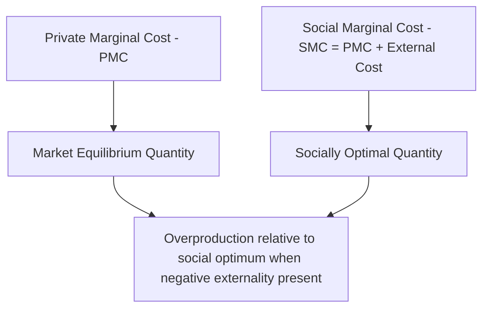
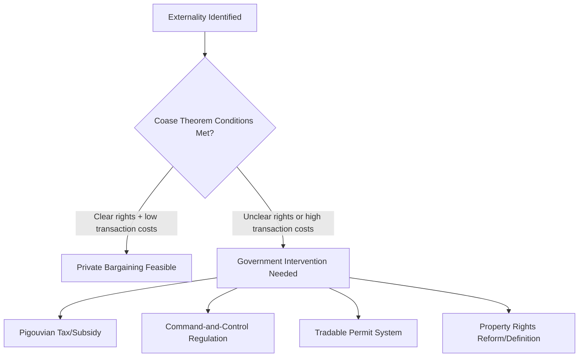

## Property Rights and Externalities in Agriculture

### Overview

**Key Points**

- Externalities occur when agricultural production or resource use activities impose uncompensated costs or benefits on third parties not reflected in market prices, causing a divergence between private and social optimal outcomes.
- Property rights structures determine whether externality-generating resources (water, air, soil, biodiversity) are subject to any accountability mechanism at all — poorly defined or unenforced property rights are a root cause of many agricultural environmental externalities.
- The Coase Theorem provides a foundational (though conditionally limited) framework for understanding when private bargaining can resolve externalities without government intervention, informing the broader policy toolkit of regulation, taxation, and property rights reform used to address agricultural externalities in practice.

### Externalities: Conceptual Foundation

An **externality** exists when the actions of one economic agent affect the utility or production possibilities of another agent outside of any market transaction, so that the private cost/benefit calculation diverges from the social cost/benefit calculation.

$$Social\ Cost = Private\ Cost + External\ Cost$$

$$Social\ Benefit = Private\ Benefit + External\ Benefit$$

#### Negative Externalities in Agriculture

| Externality Type | Source Activity | Affected Third Parties |
| --- | --- | --- |
| Water pollution | Fertilizer/pesticide runoff, livestock waste | Downstream water users, aquatic ecosystems, fisheries |
| Groundwater depletion | Excessive irrigation extraction | Other groundwater users, future users (intertemporal externality) |
| Soil erosion/sedimentation | Poor land management, deforestation for cropland | Downstream water bodies, irrigation infrastructure, other land users |
| Greenhouse gas emissions | Livestock methane, rice paddy methane, nitrous oxide from fertilizer, land-use change emissions | Global climate system (a global public bad affecting all of humanity) |
| Pesticide drift | Aerial or ground spraying | Neighboring farms (organic certification loss), human health of nearby residents |
| Antimicrobial resistance | Livestock antibiotic use | Public health system, future antibiotic efficacy |
| Biodiversity loss | Habitat conversion, monoculture expansion, pesticide impact on pollinators | Ecosystem service beneficiaries, future generations |

#### Positive Externalities in Agriculture

- **Agricultural landscape amenities**: open space, scenic value, and cultural heritage provided by farmland, benefiting non-farming neighbors and society without compensation to farmers.
- **Pollinator habitat maintenance**: farms maintaining hedgerows/wild habitat benefit neighboring farms' pollination services.
- **Carbon sequestration**: certain agricultural practices (cover cropping, agroforestry, reduced tillage) sequester atmospheric carbon, providing a global public good.
- **Flood control and water regulation**: certain land management practices (wetland preservation, terracing) can reduce downstream flood risk.

### Externalities and Market Failure: The Standard Graphical Framework

Where a negative production externality exists, the market equilibrium quantity (determined by private marginal cost) exceeds the socially optimal quantity (determined by social marginal cost), resulting in a deadweight loss equal to the excess social cost of the overproduced units:

$$Deadweight\ Loss = \int_{Q_{social}}^{Q_{market}} (SMC(q) - Demand(q))\, dq$$

### Property Rights as the Root Cause: Open Access vs. Common Property vs. Private Property

Many agricultural environmental externalities trace back to how the underlying resource's property rights are structured:

| Regime | Definition | Externality Implication |
| --- | --- | --- |
| **Open access** | No defined ownership; anyone can use the resource | No individual bears the full cost of resource depletion → systematic overexploitation (classic "tragedy of the commons") |
| **Common property** | Defined group holds collective rights, often with internal rules governing use | Can sustainably manage the resource if the group can enforce rules and exclude outsiders (contra assumptions of the tragedy of the commons framing — see Ostrom below) |
| **Private property** | Individual/firm holds exclusive rights | Owner internalizes costs and benefits of their own resource use, though can still generate externalities affecting others outside their property boundary |
| **State property** | Government owns/manages the resource | Depends on state capacity and incentive alignment for effective management; can suffer from political interference or under-resourced enforcement |

#### The Tragedy of the Commons

Ecologist **Garrett Hardin's** 1968 formulation described how, under open access conditions, each individual resource user has an incentive to maximize their own extraction/use because they capture the full private benefit while the depletion cost is spread across all users, leading to systematic overexploitation relative to the collectively optimal level.

$$Individual\ Optimal\ Extraction > Collectively\ Optimal\ Extraction\ \text{(under open access)}$$

**Groundwater irrigation** is a commonly cited agricultural example: individual farmers extracting from a shared aquifer bear only a fraction of the depletion cost (the rest is borne by other aquifer users, including future extractors), leading to extraction rates exceeding the sustainable yield in many documented cases globally. [Inference]

#### Elinor Ostrom's Critique and Common Property Resource Management

**Elinor Ostrom** (2009 Nobel Memorial Prize in Economic Sciences) demonstrated empirically, across numerous case studies of irrigation systems, forests, and fisheries, that communities can and do develop effective self-governing institutions to manage shared resources sustainably without requiring either full privatization or centralized state control — challenging Hardin's implicit assumption that only privatization or government regulation can solve commons problems.

Ostrom identified design principles associated with successful community-based resource management, including:

- Clearly defined resource boundaries and membership.
- Rules governing use that are locally adapted to specific conditions.
- Collective-choice arrangements allowing users to participate in rule modification.
- Effective monitoring, graduated sanctions for rule violations, and accessible conflict-resolution mechanisms.

[Inference] This research has substantially informed contemporary agricultural water governance and irrigation management policy, particularly in the design of farmer-managed irrigation systems and water user associations as alternatives to purely top-down state water management.

### The Coase Theorem and Its Limitations

Economist **Ronald Coase** (1960, "The Problem of Social Cost") argued that if property rights are clearly defined and transaction costs are sufficiently low, private parties can bargain to an efficient resolution of an externality regardless of which party is initially assigned the property right — the efficient (welfare-maximizing) outcome is achieved through voluntary negotiation, with the initial rights assignment affecting only the distribution of gains, not overall efficiency.

$$Efficient\ Outcome\ Achieved \iff Clear\ Property\ Rights + Low\ Transaction\ Costs$$

**Example**

Consider a crop farmer whose fields are affected by drift from a neighboring farm's pesticide application. Under the Coase framework, if property rights are clearly assigned (e.g., the crop farmer has a legally enforceable right to be free from drift damage, or alternatively the spraying farmer has a right to spray), and if the two farmers can negotiate at low cost, they could reach a mutually beneficial agreement (e.g., compensation payment, or investment in drift-reduction equipment) achieving the efficient outcome without government intervention.

#### Why the Coase Theorem Has Limited Practical Applicability to Many Agricultural Externalities

- **High transaction costs with many affected parties**: externalities like water pollution or greenhouse gas emissions typically affect numerous, dispersed parties (downstream water users, global climate-affected populations), making coordinated bargaining prohibitively costly.
- **Unclear or unenforceable property rights**: many agricultural externalities involve resources (atmosphere, groundwater, biodiversity) where property rights are poorly defined, contested, or practically unenforceable, preventing the Coasean bargaining precondition from being met.
- **Information asymmetries**: parties often cannot accurately observe or verify the magnitude of the externality (e.g., precise attribution of downstream water quality degradation to specific upstream farms), undermining bargaining efficiency.
- **Free-rider problems**: where many affected parties would need to jointly fund compensation or negotiate collectively, individual incentives to free-ride on others' negotiation efforts can prevent effective bargaining from occurring at all.

[Inference] These limitations are precisely why most real-world agricultural externality problems (water pollution regulation, greenhouse gas policy, pesticide regulation) rely on government intervention — regulation, taxation, or tradable permit systems — rather than pure Coasean private bargaining, despite the theorem's continued value as a conceptual benchmark for understanding when and why market-based bargaining solutions fail.

### Policy Instruments for Addressing Agricultural Externalities

#### Pigouvian Taxes and Subsidies

Named after economist Arthur Pigou, these instruments impose a tax equal to the marginal external cost (for negative externalities) or a subsidy equal to the marginal external benefit (for positive externalities), aligning private incentives with social costs/benefits without requiring the regulator to specify exact behavior.

$$Optimal\ Pigouvian\ Tax = Marginal\ External\ Cost\ at\ Q_{social\ optimum}$$

**Example**: a fertilizer tax set equal to the estimated marginal water pollution damage per unit of nitrogen applied, incentivizing farmers to reduce application toward the socially optimal level while preserving flexibility in how they achieve the reduction.

#### Command-and-Control Regulation

Direct regulatory requirements or prohibitions (e.g., maximum permitted pesticide application rates, mandatory buffer zones along waterways, bans on specific agrochemicals) — administratively simpler to enforce than tax-based systems but generally considered less economically efficient since they do not allow flexibility for lower-cost abaters to reduce more while higher-cost abaters reduce less. [Inference]

#### Tradable Permit Systems

Cap-and-trade style systems establishing an aggregate limit on an externality-generating activity (e.g., total nutrient loading in a watershed) and allocating tradable permits among users, allowing market-based reallocation toward the lowest-cost abatement opportunities while achieving the aggregate environmental target. Water quality trading programs (nutrient credit trading) have been piloted in several watershed contexts, generally with mixed and context-dependent success related to monitoring and enforcement capacity. [Unverified — specific program performance varies substantially by watershed and regulatory design; consult current program evaluations]

#### Payment for Ecosystem Services (PES)

Programs directly compensating landowners for providing positive externalities/ecosystem services (watershed protection, carbon sequestration, biodiversity conservation) that would otherwise be under-provided due to lack of market compensation — effectively a form of targeted Pigouvian subsidy for positive externalities.

#### Property Rights Definition and Reform

In cases where the underlying problem is genuinely undefined or unenforced property rights (rather than defined rights with high transaction costs), establishing clear, enforceable rights — water rights systems (e.g., tradable water rights/water markets), land tenure formalization, or fishing quota systems — can enable either direct Coasean bargaining or at least clearer accountability for resource use decisions.

### Diagram: Externality Correction Policy Toolkit (svg_diagram)

<svg xmlns="http://www.w3.org/2000/svg" viewBox="0 0 740 380">
\<style\>
.box { fill: #f5f5f5; stroke: #333; stroke-width: 1.5; }
.boxAlt { fill: #eaf5ea; stroke: #333; stroke-width: 1.5; }
.boxWarn { fill: #f5eaea; stroke: #333; stroke-width: 1.5; }
.label { font-family: Arial, sans-serif; font-size: 12px; fill: #111; }
.title { font-family: Arial, sans-serif; font-size: 15px; font-weight: bold; fill: #111; }
.arrow { stroke: #333; stroke-width: 1.5; marker-end: url(#arrow11); fill: none; }
\</style\>
<text x="370" y="24" text-anchor="middle" class="title">Externality Correction Policy Toolkit (svg_diagram)</text>

<rect x="270" y="45" width="200" height="50" class="box" />
<text x="370" y="75" text-anchor="middle" class="label">Agricultural Externality</text>
<rect x="30" y="140" width="160" height="55" class="boxAlt" />
<text x="110" y="162" text-anchor="middle" class="label">Pigouvian</text>
<text x="110" y="180" text-anchor="middle" class="label">Tax/Subsidy</text>
<rect x="210" y="140" width="160" height="55" class="boxAlt" />
<text x="290" y="162" text-anchor="middle" class="label">Command-and-</text>
<text x="290" y="180" text-anchor="middle" class="label">Control</text>
<rect x="390" y="140" width="160" height="55" class="boxAlt" />
<text x="470" y="162" text-anchor="middle" class="label">Tradable</text>
<text x="470" y="180" text-anchor="middle" class="label">Permits</text>
<rect x="570" y="140" width="160" height="55" class="boxAlt" />
<text x="650" y="162" text-anchor="middle" class="label">Property Rights</text>
<text x="650" y="180" text-anchor="middle" class="label">Reform</text>
<rect x="200" y="260" width="340" height="60" class="boxWarn" />
<text x="370" y="282" text-anchor="middle" class="label">Effectiveness depends on:</text>
<text x="370" y="300" text-anchor="middle" class="label">monitoring capacity, enforcement, information quality</text>
<path d="M330,95 L110,140" class="arrow" />
<path d="M350,95 L290,140" class="arrow" />
<path d="M400,95 L470,140" class="arrow" />
<path d="M420,95 L650,140" class="arrow" />
<path d="M110,195 L280,260" class="arrow" />
<path d="M290,195 L330,260" class="arrow" />
<path d="M470,195 L410,260" class="arrow" />
<path d="M650,195 L460,260" class="arrow" />
</svg>

### Common Misconceptions

- **"The Coase Theorem shows government intervention is unnecessary for externalities"** — the theorem's own conditions (clear property rights, low transaction costs) are frequently unmet in real agricultural externality contexts, which is precisely why it functions as a conceptual benchmark rather than a general policy solution. [Inference]
- **"Open access and common property are the same thing"** — Ostrom's work specifically distinguishes these: common property involves a defined, rule-bound group capable of excluding outsiders and enforcing internal rules, which can avoid the tragedy of the commons that genuinely open-access (no defined group, no rules) resources are prone to.
- **"Command-and-control regulation is always less efficient than market-based instruments"** — while generally true in terms of static cost-effectiveness given heterogeneous abatement costs, command-and-control can be preferable where monitoring/verification for tax or permit systems is prohibitively costly or where uniform standards address information or enforcement constraints. [Inference]

### Conclusion

Agricultural externalities — spanning water pollution, groundwater depletion, greenhouse gas emissions, and biodiversity loss — arise fundamentally from a divergence between private and social costs or benefits, frequently rooted in poorly defined, unenforced, or open-access property rights over shared natural resources. The Coase Theorem provides a valuable conceptual benchmark showing that clearly defined property rights combined with low transaction costs can in principle resolve externalities through private bargaining, but its restrictive conditions are rarely met for diffuse, multi-party agricultural externalities in practice, motivating reliance on Pigouvian taxation, regulation, tradable permits, payment for ecosystem services, and property rights reform. Elinor Ostrom's empirical work further demonstrates that community-based common property management can offer a viable middle path between pure privatization and centralized state regulation, particularly relevant for agricultural water and land resource governance.

**Related Topics**

- Coase Theorem: formal derivation and transaction cost analysis
- Elinor Ostrom's design principles for common property resource management
- Water rights systems and water markets in agriculture
- Payment for Ecosystem Services (PES) program design and evaluation
- Nutrient credit trading and water quality trading programs
- Pigouvian taxation: theory and agricultural application examples
- Greenhouse gas emissions from agriculture and carbon pricing mechanisms
- Groundwater governance and aquifer management institutions