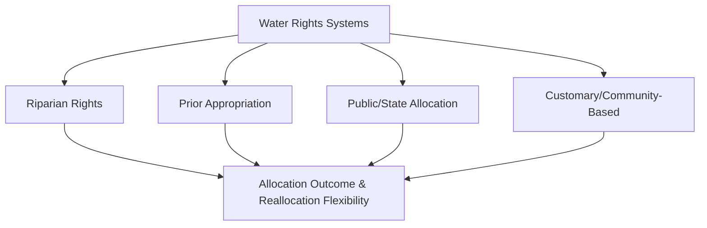
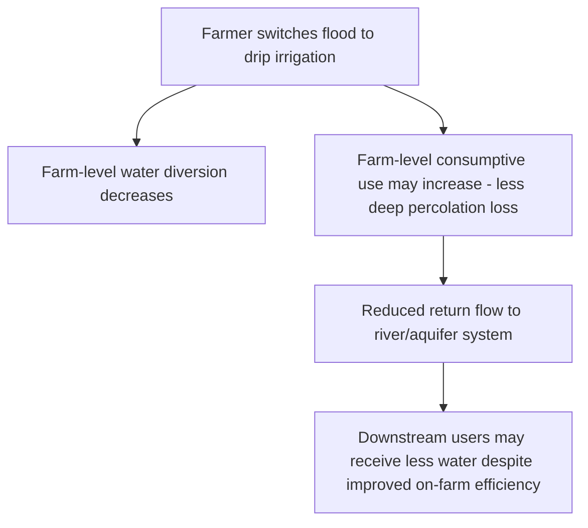

## Water Economics and Irrigation Management


### Overview

**Key Points**

- Water for agriculture is an economic good with unusual characteristics — bulky, costly to transport, subject to hydrological interdependence among users, and often governed by non-market allocation institutions — that make standard market-based allocation mechanisms difficult to implement fully.
- Irrigation represents one of the largest claims on freshwater withdrawals globally and a central determinant of agricultural productivity, yet irrigation water is frequently underpriced or unpriced relative to its scarcity value, contributing to over-extraction and allocative inefficiency.
- Water economics addresses both the **efficient allocation** of water among competing agricultural and non-agricultural uses and the **design of institutions** (water rights, pricing, markets, and user associations) capable of achieving that allocation given water's distinctive physical and hydrological properties.

### The Economic Characteristics of Water as a Resource

Water differs from most economic goods in ways that complicate standard market allocation:

| Characteristic | Implication for Water Economics |
| --- | --- |
| **Bulky, high transport cost relative to value** | Limits the geographic extent of water markets compared to markets for most other commodities |
| **Fugitive/mobile resource** | Groundwater and surface water flow across property boundaries, creating hydrological interdependence among users (upstream extraction affects downstream availability) |
| **Variable and stochastic supply** | Rainfall and runoff variability create supply uncertainty not present for most manufactured or stored goods |
| **Multiple competing uses** | Agricultural, municipal, industrial, and environmental (in-stream flow) uses compete for the same source, often with different value per unit and different administrative/legal treatment |
| **Common pool resource characteristics** | Many water sources (aquifers, rivers) exhibit non-excludability (difficult to prevent access) and rivalry (one user's extraction reduces availability for others), classic common pool resource conditions |
| **High value at low use levels, declining marginal value** | Water has extremely high value for basic survival needs, then declining marginal value as quantity increases toward agricultural/industrial use levels |

### Water Rights Systems and Institutional Frameworks

#### Riparian Rights Doctrine

Common in humid regions (historically dominant in the Eastern United States and parts of Europe), riparian rights grant water use rights to landowners whose property borders a water source, generally without requiring the water to be put to a specific "beneficial use" and without a formal permit/priority system.

#### Prior Appropriation Doctrine

Common in arid Western regions (notably the Western United States), prior appropriation allocates water rights based on the principle **"first in time, first in right"** — the first user to divert water for beneficial use establishes a priority claim that must be satisfied before more junior rights holders receive water during scarcity.

$$Priority\ Order:\ Senior\ Rights_{(earliest\ claim)} > \ldots > Junior\ Rights_{(latest\ claim)}$$

During drought/scarcity, junior rights holders may be cut off entirely while senior rights holders continue receiving their full allocation — a system providing certainty to senior users but potentially limiting flexible reallocation toward higher-value uses. [Inference]

#### Public/State Allocation Systems

Common in much of the developing world and in centrally planned water systems, where the state (often through irrigation agencies or river basin authorities) allocates water administratively rather than through defined transferable individual rights, frequently at highly subsidized or zero volumetric prices.

#### Customary/Community-Based Water Rights

Traditional irrigation systems (e.g., *subak* systems in Bali, *acequia* systems in the Southwestern US/Latin America, and numerous farmer-managed irrigation systems across South and Southeast Asia) allocate water through community-governed rules, often based on rotational scheduling and collectively maintained infrastructure — frequently cited in Elinor Ostrom's common property research (see property rights and externalities) as examples of effective self-governance.



### Irrigation Water Pricing: Methods and Economic Implications

#### Common Irrigation Pricing Structures

| Pricing Method | Description | Economic Efficiency Implication |
| --- | --- | --- |
| **Flat/area-based fee** | Fixed charge per hectare irrigated, independent of actual water volume used | No marginal incentive to conserve water at the point of use; administratively simple and low metering cost |
| **Volumetric pricing** | Charge based on measured water volume consumed | Provides marginal conservation incentive but requires metering infrastructure, often costly to install/maintain at scale |
| **Tiered/increasing block pricing** | Higher marginal price for consumption above defined thresholds | Balances basic access affordability with conservation incentive for high-volume users |
| **Water markets/tradable rights** | Rights holders can buy/sell/lease water allocations | Enables reallocation toward higher-value uses, subject to the same transaction cost and hydrological interdependence caveats affecting Coasean bargaining generally |

#### Why Irrigation Water Is Frequently Underpriced

Empirical and policy literature consistently documents that irrigation water is priced well below its scarcity (opportunity) value in many contexts globally, for several converging reasons:

- **Political economy**: agricultural water subsidies are politically popular and difficult to reform once established, given concentrated benefits to farming constituencies versus diffuse costs to taxpayers/other water users. [Inference]

```mermaid
Consider merged into main diagram above; placeholder removed
```

- **High metering and administrative costs**: volumetric pricing requires measurement infrastructure that is costly to install and maintain, particularly across dispersed smallholder irrigation systems, leading many systems to default to flat-fee structures lacking marginal incentives.
- **Food security and equity objectives**: governments often subsidize irrigation water explicitly to support smallholder farmer incomes and food production objectives, treating underpricing as a deliberate (if economically distortionary) redistributive tool. [Inference]
- **Historical infrastructure cost recovery norms**: many public irrigation schemes were designed with fee structures intended only to recover a fraction of capital and operating costs, not to reflect scarcity value, reflecting the historical framing of irrigation investment as public infrastructure rather than a priced commodity. [Inference]

$$Marginal\ Value\ of\ Water_{scarcity\ value} > Price_{charged}\ \Rightarrow\ Overuse\ relative\ to\ efficient\ allocation$$

### Water Demand Analysis in Agriculture

#### The Derived Demand for Irrigation Water

Agricultural water demand is a **derived demand** — farmers do not value water directly but value the crop output and associated revenue that water application enables. This means irrigation water demand elasticity depends on:

- The **crop water production function** (how yield responds to water application, typically exhibiting diminishing marginal returns).
- **Output prices** for the irrigated crop.
- **Availability of substitute water sources** (groundwater vs. surface water) and substitute inputs.

$$Q_{water\ demanded} = f(P_{water},\ P_{output},\ Technology,\ Climate)$$

#### Crop Water Production Functions

$$Y = f(W)$$

where $Y$ is crop yield and $W$ is water applied, typically exhibiting increasing yield with diminishing marginal returns up to a saturation point, beyond which additional water may reduce yield (waterlogging, nutrient leaching). The economically optimal water application level equates the marginal value product of water to its marginal cost (price):

$$P_{output} \times MPP_{water} = P_{water}$$

Where irrigation water is heavily underpriced (near zero marginal cost), farmers have limited economic incentive to restrict application to the level implied by this efficiency condition, contributing to observed over-application in many irrigated systems. [Inference]

### Irrigation Efficiency: Technical Concepts

| Efficiency Measure | Definition |
| --- | --- |
| **Conveyance efficiency** | Share of water diverted from source that reaches the field, after losses in canals/pipes (seepage, evaporation) |
| **Application efficiency** | Share of water delivered to the field that is actually used by the crop (as opposed to lost to deep percolation or runoff) |
| **Irrigation efficiency (overall)** | Product of conveyance and application efficiency; overall share of water withdrawn from source that is beneficially used by the crop |

$$Irrigation\ Efficiency = Conveyance\ Efficiency \times Application\ Efficiency$$

#### The "Efficiency Paradox" in Irrigation Water Conservation

**[Inference]** A widely discussed counterintuitive finding in water economics is that improving on-farm irrigation application efficiency (e.g., switching from flood irrigation to drip irrigation) does not necessarily reduce overall basin-level water consumption, and can sometimes increase it — because water previously "lost" to inefficient application (seepage, runoff) often returns to the same river/aquifer system and is available for reuse by other downstream users; efficiency improvements that reduce this return flow can actually reduce water availability for downstream users even while reducing the individual farmer's diversion. This distinction between farm-level water *use* and basin-level water *consumption* (consumptive use, i.e., water genuinely removed from the system through evapotranspiration) is a critical and often overlooked concept in irrigation efficiency policy design.



### Water Markets and Transferable Water Rights

Formal water markets, allowing rights holders to buy, sell, or lease water allocations, have been implemented in several contexts (most extensively in Australia's Murray-Darling Basin, parts of the Western United States, and Chile) as a mechanism to reallocate water toward higher-value uses without requiring administrative reallocation.

#### Conditions Favoring Water Market Effectiveness

- Clearly defined, quantified, and legally secure water rights (a precondition analogous to Coase Theorem requirements).
- Adequate metering and monitoring infrastructure to verify trades and prevent over-extraction beyond traded volumes.
- Physical/hydrological connectivity allowing water to actually be delivered from seller to buyer (constrained by infrastructure and basin geography).
- Institutional capacity to register, enforce, and adjudicate trades and any third-party effects (e.g., impacts on other water users from changed return flow patterns).

[Unverified — the Australian Murray-Darling Basin water market is among the most extensively studied globally and is generally regarded as relatively well-developed, though specific efficiency outcomes, drought-period performance, and ongoing environmental flow controversies are actively debated in current policy and academic literature; consult current sources for up-to-date assessment]

### Groundwater Management: A Distinct Set of Challenges

Groundwater irrigation (from aquifers) poses management challenges distinct from surface water due to:

- **Difficulty monitoring extraction**: individual wells are numerous, dispersed, and costly to meter comprehensively, unlike centralized surface water diversion points.
- **Delayed depletion signals**: aquifer level decline may not be immediately apparent to individual users, delaying behavioral response to over-extraction (an information/salience problem compounding the open-access incentive problem discussed in property rights and externalities).
- **Long recharge timescales**: some aquifers (particularly deep, "fossil" aquifers with minimal natural recharge) are effectively non-renewable on human timescales, making their economics closer to exhaustible resource extraction (see energy/exhaustible resource economics) than renewable flow management.

$$Sustainable\ Extraction \leq Natural\ Recharge\ Rate$$

Groundwater governance approaches include extraction permits/licensing, spacing and well-density regulations, energy pricing reform (since groundwater pumping cost is often tied to subsidized electricity pricing, indirectly subsidizing over-extraction), and, in some contexts, community-based management following Ostrom-style design principles. [Inference]

### Irrigation Infrastructure Investment: Public vs. Private Considerations

Large-scale irrigation infrastructure (dams, canal networks) exhibits characteristics of a **public good/quasi-public good** at the system level — non-rival to some degree in the shared infrastructure itself, though the water delivered is rival — which has historically justified substantial public investment and management:

- **Economies of scale** in large dam and canal construction favor centralized/public provision over fragmented private investment.
- **Externalities and interdependence**: individual farmers' water use decisions affect other users sharing the same system, creating coordination challenges that pure private ownership does not automatically resolve.
- **Long payback periods and high upfront capital costs**: often exceed private investment horizons or risk tolerance, particularly for smallholder-dominated agricultural systems.

**Water User Associations (WUAs)**, farmer-managed organizations responsible for local-level irrigation system operation and maintenance (often below the main canal level), represent a widely adopted institutional model attempting to combine public bulk infrastructure investment with decentralized, locally accountable management of distribution — reflecting Ostrom-style common property management principles applied specifically to irrigation systems. [Inference]

### Diagram: Irrigation Water Economics Framework (svg_diagram)

<svg viewBox="0 0 740 420" xmlns="http://www.w3.org/2000/svg">
\<style\>
.box { fill: #f5f5f5; stroke: #333; stroke-width: 1.5; }
.boxAlt { fill: #eaf0fa; stroke: #333; stroke-width: 1.5; }
.boxWarn { fill: #faf0ea; stroke: #333; stroke-width: 1.5; }
.label { font-family: Arial, sans-serif; font-size: 11.5px; fill: #111; }
.title { font-family: Arial, sans-serif; font-size: 15px; font-weight: bold; fill: #111; }
.arrow { stroke: #333; stroke-width: 1.5; marker-end: url(#arrow12); fill: none; }
\</style\>
<defs>
<marker id="arrow12" markerWidth="10" markerHeight="10" refX="8" refY="3" orient="auto" markerUnits="strokeWidth">
<path d="M0,0 L0,6 L9,3 z" fill="#333"/>
</marker>
</defs>

<text x="370" y="24" text-anchor="middle" class="title">Irrigation Water Economics Framework (svg_diagram)</text>

<rect x="30" y="55" width="180" height="55" class="boxAlt"/>
<text x="120" y="77" text-anchor="middle" class="label">Water Rights System</text>
<text x="120" y="95" text-anchor="middle" class="label">(riparian, appropriation, customary)</text>
<rect x="280" y="55" width="180" height="55" class="boxAlt"/>
<text x="370" y="77" text-anchor="middle" class="label">Pricing Structure</text>
<text x="370" y="95" text-anchor="middle" class="label">(flat fee, volumetric, tiered)</text>
<rect x="530" y="55" width="180" height="55" class="boxAlt"/>
<text x="620" y="77" text-anchor="middle" class="label">Infrastructure</text>
<text x="620" y="95" text-anchor="middle" class="label">(conveyance, application tech)</text>
<rect x="150" y="170" width="420" height="55" class="box"/>
<text x="360" y="192" text-anchor="middle" class="label">Farmer Water Application Decision</text>
<text x="360" y="210" text-anchor="middle" class="label">(equates marginal value product to price, if priced)</text>
<rect x="150" y="270" width="420" height="55" class="boxWarn"/>
<text x="360" y="292" text-anchor="middle" class="label">Basin-Level Consumptive Use &</text>
<text x="360" y="310" text-anchor="middle" class="label">Return Flow to Other Users</text>
<rect x="200" y="360" width="320" height="45" class="box"/>
<text x="360" y="387" text-anchor="middle" class="label">Sustainable Allocation Outcome</text>
<path d="M120,110 L280,170" class="arrow"/>
<path d="M370,110 L360,170" class="arrow"/>
<path d="M620,110 L440,170" class="arrow"/>
<path d="M360,225 L360,270" class="arrow"/>
<path d="M360,325 L360,360" class="arrow"/>
</svg>

### Common Misconceptions

- **"Improving irrigation efficiency always saves water at the basin level"** — the efficiency paradox shows that reduced return flows from improved on-farm efficiency can reduce water availability for downstream users even as farm-level diversion falls. [Inference]
- **"Water markets can solve allocation problems anywhere clear rights exist"** — physical/hydrological connectivity, infrastructure capacity, and third-party return-flow effects constrain where water trading is practically feasible, beyond the rights-definition precondition alone. [Inference]
- **"Underpriced irrigation water is simply a policy oversight"** — underpricing frequently reflects deliberate (if economically distortionary) political and food-security/equity objectives, not merely administrative neglect. [Inference]

### Conclusion

Water economics addresses the allocation of a resource whose bulk, mobility, hydrological interdependence, and common-pool characteristics resist straightforward market-based management. Water rights systems — riparian, prior appropriation, public allocation, or customary/community-based — establish the institutional foundation determining whether efficient reallocation toward higher-value uses is even possible. Irrigation water is frequently underpriced relative to its scarcity value for a combination of political-economy, administrative, and equity reasons, contributing to overuse and, in the case of groundwater, unsustainable depletion. Improving irrigation efficiency and establishing tradable water rights each carry economic promise but also important caveats — the basin-level consumptive use versus diversion distinction and the physical/institutional preconditions for functioning water markets — that must inform sound water and irrigation policy design.

**Related Topics**

- Groundwater depletion and aquifer governance institutions
- Water markets: Murray-Darling Basin and Western US case studies
- Crop water production functions and deficit irrigation strategies
- Water User Associations and farmer-managed irrigation systems
- Prior appropriation doctrine and drought-period water rights curtailment
- Payment for watershed ecosystem services
- Energy-water nexus: subsidized pumping and groundwater over-extraction
- Climate change impacts on irrigation water availability and scheduling