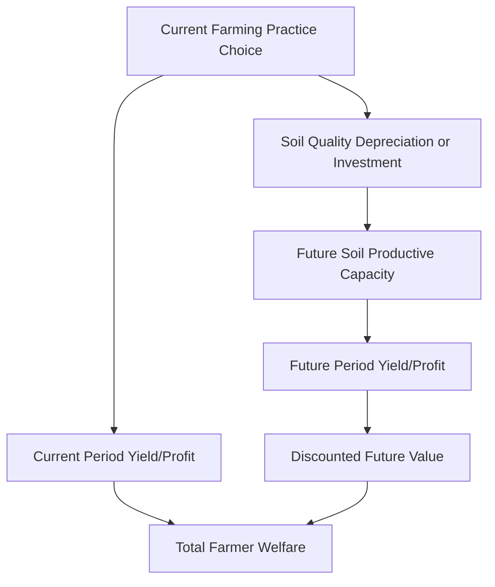
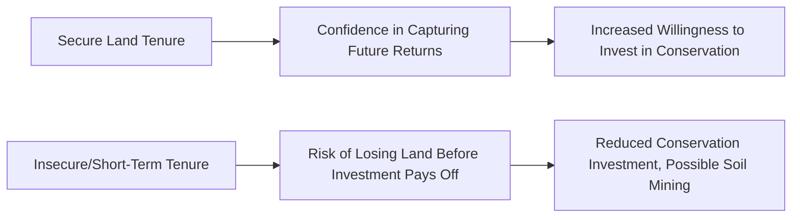

## Soil Conservation and Land Degradation

### Overview

**Key Points**

- Land degradation — encompassing soil erosion, nutrient depletion, salinization, and organic matter loss — represents a slow-onset, often invisible depreciation of the agricultural natural capital stock, distinct from more immediately observable environmental problems.
- Soil conservation investment decisions exhibit classic dynamic economic tradeoffs: farmers weigh present consumption/investment against future productivity, with the outcome shaped by discount rates, tenure security, credit access, and the degree to which degradation costs are borne privately versus externally (offsite).
- Land degradation generates both **on-site costs** (borne directly by the farmer through reduced future yields) and **off-site externalities** (sedimentation, water quality impacts borne by downstream parties), creating a policy design challenge distinct from either pure private-good or pure public-good environmental problems.

### Defining and Measuring Land Degradation

Land degradation encompasses several distinct physical processes:

| Degradation Type | Mechanism | Primary Drivers |
| --- | --- | --- |
| **Soil erosion (water)** | Topsoil removal by rainfall/runoff | Slope, vegetation cover loss, tillage practices, rainfall intensity |
| **Soil erosion (wind)** | Topsoil removal by wind action | Vegetation cover loss, soil structure, aridity |
| **Nutrient depletion/mining** | Removal of nutrients via harvest exceeding replenishment | Continuous cropping without adequate fertilizer/organic matter replacement |
| **Salinization** | Salt accumulation in soil, often from irrigation | Poor drainage, excessive irrigation in arid/semi-arid zones, rising water tables |
| **Soil organic matter decline** | Loss of soil carbon and associated structural/fertility benefits | Intensive tillage, monocropping, reduced organic inputs |
| **Compaction** | Physical soil structure degradation reducing water infiltration and root penetration | Heavy machinery use, livestock trampling |

$$Land\ Degradation\ Rate = f(Erosive\ Forces,\ Vegetative\ Cover,\ Management\ Practices,\ Slope,\ Soil\ Type)$$

### The Dynamic Economics of Soil Conservation Investment

Soil conservation is fundamentally an **intertemporal capital investment problem**: farmers choose current-period practices (tillage intensity, cover cropping, terracing, fertilizer application) that affect the future productive capacity of the soil resource itself.

#### The Farmer's Dynamic Optimization Problem

A simplified framework treats soil quality as a capital stock $S_t$ that depreciates through erosive/degrading farming practices and can be replenished through conservation investment:

$$S_{t+1} = S_t - D(Practices_t) + I(Conservation\ Investment_t)$$

The farmer maximizes the present discounted value of the income stream from the land:

$$\max \sum_{t=0}^{\infty} \frac{\pi(S_t, Practices_t)}{(1+r)^t}$$

where $\pi$ is period profit (a function of soil quality and practices) and $r$ is the farmer's discount rate.

#### Why High Discount Rates Undermine Conservation Investment

A central finding in this literature is that a farmer's **effective discount rate** — often higher than a social planner's discount rate due to poverty-driven urgency, credit constraints, or genuine uncertainty about future land access — strongly shapes whether soil-depleting practices appear individually rational even when they reduce long-run land value:

$$Conservation\ Adopted \iff NPV(Conservation) > NPV(Status\ Quo)\ \text{at the farmer's discount rate}\ r$$

At high discount rates, near-term yield gains from soil-depleting practices (e.g., continuous cropping without fallow, minimal fertilizer replacement) can dominate the present value calculation even where the practice clearly reduces long-run soil productivity, because future losses are heavily discounted. [Inference] Poverty and immediate subsistence needs are frequently cited as drivers of implicitly high effective discount rates among resource-poor smallholders, sometimes framed as a **poverty-environment nexus** or "poverty-degradation trap," though the empirical strength and universality of this specific causal link remains debated in the literature. [Unverified]

### Tenure Security and Conservation Investment Incentives

As discussed under land reform and tenure systems, secure land tenure is theorized to increase soil conservation investment incentives because farmers with confidence in future land access are more likely to capture the returns to long-horizon investments (terracing, agroforestry, soil amendment):

[Inference] Empirical evidence on the tenure-conservation link is generally supportive but not uniform across contexts; some studies find customary tenure arrangements, despite lacking formal title, provide sufficient de facto security for conservation investment, similar to findings in the broader land tenure and investment literature, suggesting formal titling's marginal effect on conservation behavior specifically may be smaller in some contexts than theory alone would predict.

### On-Site versus Off-Site Costs of Land Degradation

A defining feature of soil erosion economics is the distinction between costs borne by the degrading farmer and costs borne by others downstream or downwind:

| Cost Type | Borne By | Nature |
| --- | --- | --- |
| **On-site costs** | The farmer whose land is eroding | Reduced current and future yield, increased input requirements to maintain output, reduced land value |
| **Off-site costs** | Downstream/downwind third parties | Reservoir/waterway sedimentation, water quality degradation, increased flood risk, air quality impacts from wind erosion (dust) |

$$Total\ Social\ Cost\ of\ Erosion = On\text{-}site\ Cost_{private} + Off\text{-}site\ Cost_{external}$$

Because farmers bear only the on-site cost component in their private decision-making, and this on-site cost may itself be underweighted due to high discount rates or imperfect information about long-run yield effects, actual soil conservation investment tends to fall short of the socially optimal level from both channels simultaneously — a private market failure (myopic on-site cost internalization) compounding a classic externality problem (uncompensated off-site costs), analogous to the general negative externality framework covered under property rights and externalities in agriculture. [Inference]

### Policy Instruments for Soil Conservation

#### Direct Payment/Cost-Share Programs

Governments subsidize a portion of conservation investment costs (terracing, cover crops, conservation tillage equipment) to offset the gap between private and social returns, exemplified by long-standing US Department of Agriculture conservation cost-share programs and similar schemes in other countries.

#### Conservation Compliance and Cross-Compliance

Linking eligibility for other government support (subsidies, crop insurance) to adoption of specified minimum conservation practices — a regulatory mechanism embedded within existing agricultural support program administration rather than a standalone program. [Inference — specific program design and current compliance requirements vary by country and should be checked against current policy documentation]

#### Payment for Ecosystem Services (Erosion Control Focus)

Compensating farmers specifically for erosion-reducing practices that generate off-site benefits (reduced downstream sedimentation), functioning as a targeted Pigouvian subsidy addressing the off-site externality component specifically (see property rights and externalities for the general PES framework).

#### Land Tenure and Titling Reform

As a complementary long-run institutional intervention, addressing the tenure-security dimension of the conservation investment decision (see land reform and tenure systems).

#### Extension and Technical Assistance

Addressing information failures — farmers may under-invest in conservation not purely due to discount rate or tenure issues but due to imperfect information about the actual long-run yield consequences of current practices or the effectiveness of specific conservation techniques (linkage to agricultural extension and information diffusion).

### Conservation Agriculture: An Integrated Technical Response

**Conservation agriculture** (CA) has emerged as a widely promoted technical package combining three core principles, intended to address land degradation while maintaining or improving yields:

1. **Minimum soil disturbance**: reduced or no-till practices minimizing soil structure disruption.
2. **Permanent soil cover**: maintaining crop residue or cover crops rather than bare soil between cropping cycles.
3. **Crop rotation/diversification**: reducing pest/disease buildup and improving nutrient cycling relative to continuous monocropping.

$$Expected\ Benefits: \Delta Soil\ Organic\ Matter \uparrow,\ \Delta Erosion \downarrow,\ \Delta Water\ Retention \uparrow$$

**[Inference]** Empirical evidence on conservation agriculture adoption and yield outcomes in smallholder developing-country contexts is mixed: while soil health benefits are generally well-documented over sufficiently long time horizons, short-run yield effects (particularly in the first several seasons of transition) are sometimes neutral or negative, creating an adoption disincentive analogous to the general discount-rate problem discussed above — farmers bear near-term costs/risks for benefits materializing only after a multi-year transition period, a pattern that has motivated targeted transition-period subsidy and extension support in several conservation agriculture promotion programs.

### Land Degradation Neutrality and Global Policy Frameworks

The **UN Convention to Combat Desertification (UNCCD)** promotes the concept of **Land Degradation Neutrality (LDN)** — a target state in which the amount and quality of land resources necessary to support ecosystem functions and services remains stable or improves, balancing any degradation in one location with restoration/improvement elsewhere, incorporated into the UN Sustainable Development Goals (SDG target 15.3). [Unverified — specific current monitoring methodology and country-level progress data should be checked against current UNCCD reporting for up-to-date status]

### Diagram: Soil Conservation Decision Framework (svg_diagram)

<svg xmlns="http://www.w3.org/2000/svg" viewBox="0 0 740 400">
\<style\>
.box { fill: #f5f5f5; stroke: #333; stroke-width: 1.5; }
.boxAlt { fill: #eaf5ea; stroke: #333; stroke-width: 1.5; }
.boxWarn { fill: #f5eaea; stroke: #333; stroke-width: 1.5; }
.label { font-family: Arial, sans-serif; font-size: 11.5px; fill: #111; }
.title { font-family: Arial, sans-serif; font-size: 15px; font-weight: bold; fill: #111; }
.arrow { stroke: #333; stroke-width: 1.5; marker-end: url(#arrow13); fill: none; }
\</style\>
<text x="370" y="24" text-anchor="middle" class="title">Soil Conservation Decision Framework (svg_diagram)</text>

<rect x="30" y="55" width="180" height="55" class="boxAlt" />
<text x="120" y="77" text-anchor="middle" class="label">Farmer's Discount Rate</text>
<text x="120" y="95" text-anchor="middle" class="label">(poverty, urgency)</text>
<rect x="280" y="55" width="180" height="55" class="boxAlt" />
<text x="370" y="77" text-anchor="middle" class="label">Tenure Security</text>
<rect x="530" y="55" width="180" height="55" class="boxAlt" />
<text x="620" y="77" text-anchor="middle" class="label">Information on</text>
<text x="620" y="95" text-anchor="middle" class="label">Long-Run Soil Effects</text>
<rect x="150" y="170" width="420" height="55" class="box" />
<text x="360" y="192" text-anchor="middle" class="label">Soil Conservation Investment Decision</text>
<rect x="60" y="270" width="280" height="55" class="boxWarn" />
<text x="200" y="292" text-anchor="middle" class="label">On-Site Cost</text>
<text x="200" y="310" text-anchor="middle" class="label">(reduced future farm yield)</text>
<rect x="400" y="270" width="280" height="55" class="boxWarn" />
<text x="540" y="292" text-anchor="middle" class="label">Off-Site Cost</text>
<text x="540" y="310" text-anchor="middle" class="label">(sedimentation, water quality)</text>
<rect x="220" y="355" width="300" height="35" class="box" />
<text x="370" y="378" text-anchor="middle" class="label">Policy: PES, cost-share, tenure, extension</text>
<path d="M120,110 L280,170" class="arrow" />
<path d="M370,110 L360,170" class="arrow" />
<path d="M620,110 L440,170" class="arrow" />
<path d="M300,225 L200,270" class="arrow" />
<path d="M420,225 L540,270" class="arrow" />
<path d="M200,325 L300,355" class="arrow" />
<path d="M540,325 L440,355" class="arrow" />
</svg>

### Common Misconceptions

- **"Soil erosion is purely a technical/agronomic problem"** — the rate and extent of soil-depleting practices are fundamentally shaped by economic factors (discount rates, tenure security, credit constraints, and externality structure), not agronomic knowledge alone. [Inference]
- **"Farmers who don't adopt conservation practices are simply uninformed or shortsighted"** — high effective discount rates driven by poverty, credit constraints, and tenure insecurity can make soil-depleting practices individually rational in the near term even with full information about long-run consequences. [Inference]
- **"All erosion costs are borne by the eroding farmer"** — significant off-site externality costs (sedimentation, water quality) are borne by downstream parties, meaning private farmer decisions alone will generally under-invest in conservation relative to the social optimum even absent any discount rate or information problem.

### Conclusion

Soil conservation and land degradation economics centers on an intertemporal capital investment problem in which farmers' current practice choices determine the future productive capacity of the soil resource itself. High effective discount rates (often linked to poverty and subsistence urgency), insecure land tenure, and imperfect information about long-run soil effects can each independently lead to under-investment in conservation, while the additional presence of off-site externalities (sedimentation, water quality impacts) ensures that even fully informed, secure-tenure, patient farmers would still under-invest relative to the socially optimal level absent policy intervention. This dual private-myopia-plus-externality structure motivates a policy toolkit combining direct payments/cost-share programs, targeted ecosystem service payments, tenure security reform, and extension support, with conservation agriculture representing an integrated technical response whose short-run adoption costs mirror the same discount-rate challenge the underlying economic problem describes.

**Related Topics**

- Dynamic optimization models of renewable resource stocks (linkage to exhaustible/renewable resource economics)
- Poverty-environment nexus and the "poverty-degradation trap" debate
- Conservation agriculture adoption barriers and transition-period support design
- Payment for Ecosystem Services applied to erosion control
- Land tenure security and long-horizon agricultural investment (linkage to land reform)
- UNCCD Land Degradation Neutrality framework and SDG 15.3 monitoring
- Reservoir sedimentation and downstream infrastructure cost analysis
- Discount rates and intertemporal choice under poverty and credit constraints