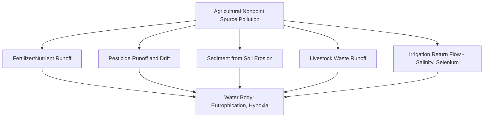
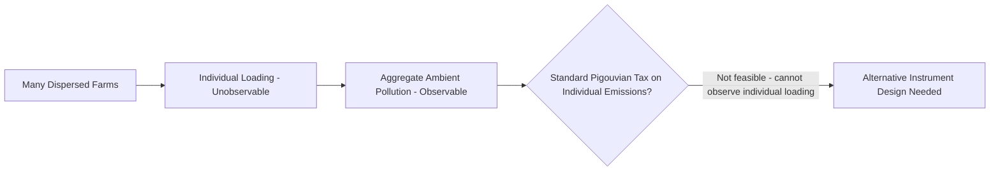
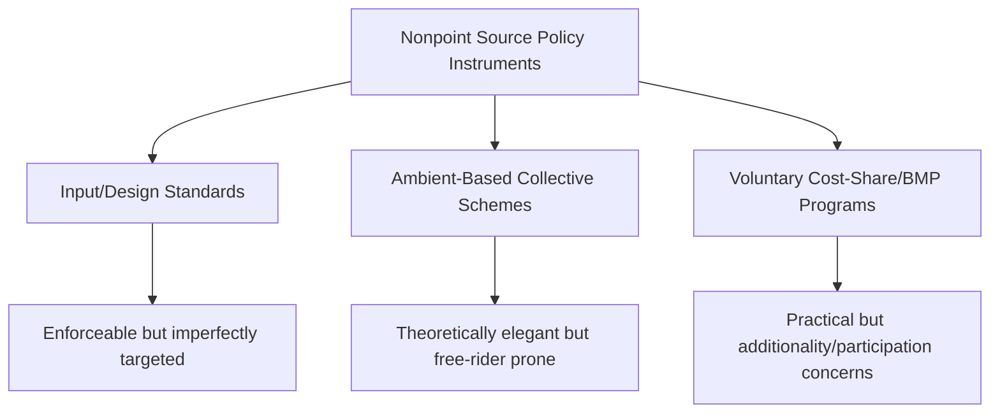

## Agricultural Pollution and Nonpoint Source Externalities

### Overview

**Key Points**

- Agricultural pollution is predominantly a **nonpoint source** problem — pollutant loading originates from diffuse, spatially dispersed sources (fields, pastures, feedlots) rather than identifiable discharge points, fundamentally distinguishing it from industrial point source pollution in both monitoring feasibility and policy design.
- The core economic challenge of nonpoint source pollution is that regulators typically cannot observe individual polluter contributions directly, only aggregate ambient outcomes (e.g., measured nutrient concentration in a water body), creating an information asymmetry that standard Pigouvian and command-and-control instruments struggle to address.
- Nonpoint source policy design has consequently evolved toward instruments working around this observability constraint: input-based regulation, ambient-based collective incentive schemes, and voluntary/cost-share conservation programs, each with distinct efficiency and equity tradeoffs.

### Point Source versus Nonpoint Source Pollution: The Fundamental Distinction

| Characteristic | Point Source | Nonpoint Source |
| --- | --- | --- |
| **Discharge location** | Identifiable, fixed point (pipe, outfall) | Diffuse, spatially distributed across the landscape |
| **Monitoring feasibility** | Can typically measure discharge directly at the point | Cannot generally measure individual contributions; only aggregate ambient concentration is observable |
| **Attribution to specific polluter** | Straightforward | Difficult or impossible without extremely costly monitoring |
| **Weather/stochastic dependence** | Relatively low | High — runoff-driven loading varies substantially with rainfall timing and intensity |
| **Standard regulatory approach** | Direct discharge permits and effluent limits (e.g., US Clean Water Act NPDES permits) | Requires indirect instruments given unobservability of individual loading |

Agricultural pollution sources are overwhelmingly nonpoint in character:

### Key Agricultural Pollution Mechanisms

#### Nutrient Runoff and Eutrophication

Excess nitrogen and phosphorus from fertilizer application (beyond crop uptake capacity) or livestock waste can runoff into surface water or leach into groundwater, contributing to **eutrophication** — excessive algal growth that depletes dissolved oxygen upon decomposition, creating **hypoxic ("dead") zones** harmful to aquatic life. The Gulf of Mexico hypoxic zone, substantially attributed to nutrient loading from the Mississippi River agricultural watershed, is among the most extensively studied examples of this mechanism. [Unverified — the precise current-year extent and specific attribution shares among different pollution sources are subject to ongoing monitoring and should be checked against current NOAA/USGS assessments]

#### Pesticide Contamination

Pesticide runoff and spray drift can contaminate surface water, groundwater, and neighboring land, with effects ranging from aquatic toxicity to human health exposure risk and, in the case of drift onto neighboring organic farms, direct economic loss through certification decertification.

#### Sediment Loading

Soil erosion (see soil conservation and land degradation) transports sediment into waterways, causing turbidity, reservoir/channel sedimentation, and transport of sediment-bound nutrients and agrochemicals.

#### Livestock Waste and Concentrated Animal Feeding Operations (CAFOs)

Large-scale livestock operations generate substantial waste volumes; while CAFO waste storage/discharge can sometimes be regulated as a point source in some jurisdictions (representing a partial exception to the general nonpoint categorization), land application of manure as fertilizer reintroduces nonpoint-source runoff dynamics. [Inference — the specific point-source/nonpoint-source regulatory classification of CAFOs varies by jurisdiction and specific facility characteristics]

#### Salinity and Selenium from Irrigation Return Flow

In irrigated arid/semi-arid agriculture, return flows can carry elevated salinity and, in some geologic settings, naturally occurring selenium mobilized by irrigation, contaminating receiving water bodies (see water economics and irrigation management for related irrigation return-flow dynamics).

### The Core Economic Problem: Unobservable Individual Contributions

Unlike a point-source discharge that can be metered, an individual farm's nonpoint contribution to ambient water pollution depends on a complex, largely unobservable interaction of management practices, weather (rainfall timing/intensity), soil type, and field topography:

$$Loading_i = f(Management\ Practices_i, Weather_t, Soil/Topography_i) + \varepsilon_i$$

Because the regulator observes only aggregate ambient pollution $\sum_i Loading_i$ (or a downstream measurement reflecting the sum of many contributors plus natural background levels), rather than each $Loading_i$ individually, standard Pigouvian taxation (which requires taxing each polluter's marginal contribution) and standard command-and-control regulation (which requires verifying compliance with a discharge limit) are both difficult to implement directly.

### Policy Instrument Design Under Nonpoint Source Observability Constraints

#### 1. Input-Based (Design) Standards

Rather than regulating the unobservable pollution output directly, policy regulates observable *inputs* correlated with pollution potential — maximum fertilizer application rates, mandatory buffer strips along waterways, restrictions on application timing (e.g., prohibiting fertilizer application immediately before forecast heavy rainfall), or required manure storage/application practices.

**Tradeoff**: input standards are enforceable (inputs are typically observable/verifiable) but are a less efficient targeting mechanism than directly taxing/limiting the pollution itself, since the actual relationship between a given input level and realized pollution loading varies by farm-specific conditions (soil type, slope, proximity to waterways) not captured by a uniform input standard. [Inference]

#### 2. Ambient-Based Collective Instruments

A body of environmental economics theory (notably work by economists including James Shortle and others on nonpoint source pollution policy design) has proposed **ambient tax/subsidy schemes**, where a group of polluters collectively faces a tax or subsidy based on the *aggregate* measured ambient pollution level, rather than any individual's contribution:

$$Group\ Tax = t \times (Ambient\ Pollution_{observed} - Ambient\ Standard_{target})$$

This creates an incentive for the group as a whole to reduce loading, but introduces a **free-rider problem**: any individual farmer's own reduction has only a small effect on the aggregate ambient outcome (and hence the tax/subsidy the whole group faces), while abatement is individually costly — creating incentives for individual under-effort even though the group collectively benefits from aggregate improvement. [Inference] This structure closely resembles a public-goods provision problem, and its practical implementation has been limited relative to the theoretical literature, partly due to this free-rider concern and partly due to the political difficulty of imposing collective liability on farmers for pollution they did not individually and verifiably cause. [Unverified — actual field implementation of pure ambient-based tax schemes remains rare; consult current environmental economics literature for documented pilot or operational examples]

#### 3. Voluntary and Cost-Share Conservation Programs

Given the practical difficulty of mandatory nonpoint source regulation, much actual agricultural water quality policy (particularly in the United States and several other countries) relies on **voluntary participation programs** offering cost-share payments or technical assistance for adopting best management practices (BMPs) — conservation tillage, cover cropping, buffer strips, nutrient management planning — rather than mandatory discharge limits.

**Tradeoff**: voluntary programs avoid the enforcement/monitoring challenge entirely (compliance with adopted practices, rather than pollution outcomes, is what's tracked) but rely on adequate farmer participation and can suffer from adverse selection, where farmers already planning to adopt a given practice absent the subsidy are disproportionately likely to enroll (reducing the program's genuine "additionality" — the pollution reduction that would not have occurred without the program). [Inference]

#### 4. Water Quality Trading Programs

Some watershed programs allow point sources (e.g., wastewater treatment plants) to purchase pollution reduction "credits" from nonpoint agricultural sources implementing best management practices, on the logic that agricultural nutrient reduction is often cheaper per unit than further point-source treatment upgrades — a hybrid market-based instrument spanning the point/nonpoint source divide. [Unverified — program design, credit verification methodology, and demonstrated performance vary considerably across specific watershed trading programs; consult current program evaluations]

### Measuring and Attributing Nonpoint Source Pollution: Modeling Approaches

Given the impossibility of direct universal monitoring, nonpoint source pollution assessment relies heavily on **simulation modeling** connecting management practices and landscape characteristics to estimated loading, such as:

- **SWAT (Soil and Water Assessment Tool)**: a widely used watershed-scale hydrological and water quality simulation model estimating nutrient/sediment loading from land use and management data.
- **Export coefficient models**: simpler approaches estimating pollutant loading based on land use category-specific "export coefficients" (average loading rates per unit area for a given land use/management type) applied across a watershed.

[Inference] These modeling approaches introduce their own uncertainty and validation challenges, and model-based loading estimates (rather than direct measurement) are frequently the basis for both scientific assessment and, where used, market-based trading credit calculations, which has been a source of ongoing debate regarding the environmental integrity of some water quality trading program designs.

### Distinguishing Agricultural Externalities: Nonpoint versus the Broader Externality Framework

Agricultural pollution nonpoint source problems are a specific, particularly challenging case within the broader agricultural externality framework (see property rights and externalities in agriculture): the general theory of Pigouvian correction and Coasean bargaining assumes the externality-generating activity (and its magnitude) can be observed or verified; nonpoint source pollution's defining feature is precisely that this assumption fails, requiring the specialized instrument adaptations described above.

$$\text{General externality theory requires: Observable}\ Loading_i \Rightarrow \text{Nonpoint reality: Only}\ \textstyle\sum_i Loading_i\ \text{observable}$$

### International and Regional Policy Examples

- **US Clean Water Act framework**: agricultural nonpoint sources are largely exempt from the direct permitting (NPDES) system that governs point sources, instead addressed primarily through voluntary conservation programs (e.g., USDA Environmental Quality Incentives Program) and state-level nonpoint source management plans under Clean Water Act Section 319. [Unverified — specific current program names, funding levels, and regulatory status should be checked against current EPA/USDA documentation]
- **EU Nitrates Directive**: establishes mandatory measures in designated "Nitrate Vulnerable Zones," including limits on manure nitrogen application and closed application periods — representing a more regulatory (input-standard-based) approach than the predominantly voluntary US model. [Unverified — specific current provisions and zone designations should be checked against current EU documentation]

[Inference] The contrast between predominantly voluntary (US) and more regulatory (EU) approaches to agricultural nonpoint source nutrient management reflects differing political economy considerations and institutional traditions regarding agricultural environmental regulation, an active area of comparative environmental policy research.

### Diagram: Nonpoint Source Pollution Policy Challenge (svg_diagram)

<svg xmlns="http://www.w3.org/2000/svg" viewBox="0 0 740 400">
\<style\>
.box { fill: #f5f5f5; stroke: #333; stroke-width: 1.5; }
.boxAlt { fill: #eaf0fa; stroke: #333; stroke-width: 1.5; }
.boxWarn { fill: #faf0ea; stroke: #333; stroke-width: 1.5; }
.label { font-family: Arial, sans-serif; font-size: 11.5px; fill: #111; }
.title { font-family: Arial, sans-serif; font-size: 15px; font-weight: bold; fill: #111; }
.arrow { stroke: #333; stroke-width: 1.5; marker-end: url(#arrow14); fill: none; }
\</style\>
<text x="370" y="24" text-anchor="middle" class="title">Nonpoint Source Pollution Policy Challenge (svg_diagram)</text>

<rect x="40" y="55" width="150" height="55" class="box" />
<text x="115" y="82" text-anchor="middle" class="label">Farm 1</text>
<rect x="210" y="55" width="150" height="55" class="box" />
<text x="285" y="82" text-anchor="middle" class="label">Farm 2</text>
<rect x="380" y="55" width="150" height="55" class="box" />
<text x="455" y="82" text-anchor="middle" class="label">Farm 3</text>
<rect x="550" y="55" width="150" height="55" class="box" />
<text x="625" y="82" text-anchor="middle" class="label">Farm N ...</text>
<rect x="200" y="150" width="340" height="55" class="boxWarn" />
<text x="370" y="172" text-anchor="middle" class="label">Aggregate Ambient Water Quality</text>
<text x="370" y="190" text-anchor="middle" class="label">(the only directly observable outcome)</text>
<rect x="30" y="250" width="200" height="55" class="boxAlt" />
<text x="130" y="272" text-anchor="middle" class="label">Input Standards</text>
<text x="130" y="290" text-anchor="middle" class="label">(buffer strips, app. limits)</text>
<rect x="270" y="250" width="200" height="55" class="boxAlt" />
<text x="370" y="272" text-anchor="middle" class="label">Ambient-Based</text>
<text x="370" y="290" text-anchor="middle" class="label">Collective Schemes</text>
<rect x="510" y="250" width="200" height="55" class="boxAlt" />
<text x="610" y="272" text-anchor="middle" class="label">Voluntary Cost-Share</text>
<text x="610" y="290" text-anchor="middle" class="label">/ BMP Programs</text>
<rect x="230" y="340" width="280" height="40" class="box" />
<text x="370" y="365" text-anchor="middle" class="label">Reduced Nonpoint Source Loading</text>
<path d="M115,110 L300,150" class="arrow" />
<path d="M285,110 L340,150" class="arrow" />
<path d="M455,110 L400,150" class="arrow" />
<path d="M625,110 L440,150" class="arrow" />
<path d="M300,205 L130,250" class="arrow" />
<path d="M370,205 L370,250" class="arrow" />
<path d="M440,205 L610,250" class="arrow" />
<path d="M130,305 L300,340" class="arrow" />
<path d="M370,305 L370,340" class="arrow" />
<path d="M610,305 L440,340" class="arrow" />
</svg>

### Common Misconceptions

- **"Agricultural pollution can be regulated the same way as factory discharge"** — the fundamental unobservability of individual farm contributions to ambient pollution, unlike a metered pipe discharge, requires categorically different policy instrument design. [Inference]
- **"Ambient-based collective tax schemes are a practical, widely implemented solution"** — while theoretically elegant in the environmental economics literature, the free-rider problem and political/administrative difficulties have limited real-world implementation; consult current sources for documented cases. [Unverified]
- **"Voluntary conservation programs guarantee genuine pollution reduction"** — additionality concerns (subsidizing practices farmers would have adopted anyway) can substantially reduce a voluntary program's actual marginal environmental benefit relative to its face-value participation numbers. [Inference]

### Conclusion

Agricultural pollution is predominantly a nonpoint source problem, distinguished from industrial point source pollution by the fundamental unobservability of individual polluters' contributions to aggregate ambient outcomes. This observability constraint undermines the direct application of standard Pigouvian taxation and command-and-control regulation, motivating a distinct policy toolkit: input-based design standards, theoretically elegant but free-rider-prone ambient-based collective schemes, voluntary cost-share and best management practice programs, and hybrid point-nonpoint water quality trading arrangements. Each instrument involves a distinct efficiency-enforceability-participation tradeoff, and the predominance of voluntary approaches in some jurisdictions (contrasted with more regulatory approaches elsewhere) reflects both the genuine technical difficulty of nonpoint source monitoring and the political economy of agricultural environmental policy.

**Related Topics**

- Ambient-based pollution tax theory and free-rider problem analysis
- SWAT and watershed-scale water quality simulation modeling
- Water quality trading programs and point-nonpoint credit exchange design
- US Clean Water Act Section 319 and nonpoint source management planning
- EU Nitrates Directive and Nitrate Vulnerable Zone regulation
- Best management practice (BMP) adoption and additionality in cost-share programs
- Gulf of Mexico hypoxic zone and Mississippi River Basin nutrient loading
- General externality and property rights framework in agriculture (linkage chapter)