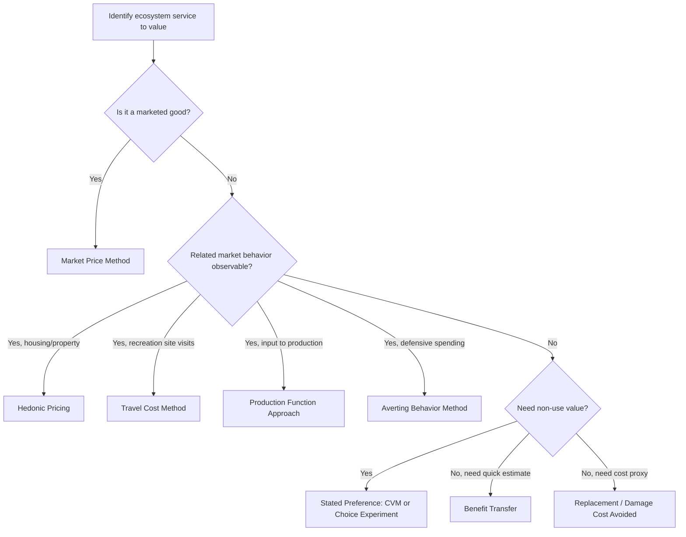

## Ecosystem Services Valuation

### Definition and Conceptual Foundations

Ecosystem services valuation is the process of estimating, in monetary or non-monetary terms, the benefits that human societies derive from ecosystems. These benefits arise from ecological structures and functions that support production, consumption, and wellbeing, but that typically lack observable market prices. Valuation techniques attempt to make these benefits commensurable with market goods so they can be incorporated into cost-benefit analysis, policy design, and natural resource accounting.

The economic rationale rests on the concept of **total economic value (TEV)**, which decomposes the value of an ecosystem into use values and non-use values.

$$TEV = UV + NUV$$

where $UV$ (use value) includes direct use value, indirect use value, and option value, and $NUV$ (non-use value) includes bequest value and existence value.

- **Direct use value**: Value from direct interaction with the resource (timber harvesting, fishing, recreation).
- **Indirect use value**: Value from ecosystem functions that support economic activity indirectly (flood regulation, pollination, water purification).
- **Option value**: Value of preserving the option to use the resource in the future, relevant under uncertainty.
- **Bequest value**: Value derived from preserving the resource for future generations.
- **Existence value**: Value derived simply from knowing the resource exists, independent of any use.

### Classification of Ecosystem Services

Ecosystem services are commonly classified following the Millennium Ecosystem Assessment (MEA) framework into four categories:

1. **Provisioning services** — tangible goods extracted from ecosystems: food, fiber, fresh water, timber, genetic resources.
2. **Regulating services** — benefits from regulation of ecosystem processes: climate regulation, flood control, water purification, pollination, pest control.
3. **Cultural services** — non-material benefits: recreation, aesthetic value, spiritual and educational value.
4. **Supporting services** — underlying processes necessary for all other services: soil formation, nutrient cycling, primary production.

Supporting services are generally not valued directly, since doing so risks double-counting their contribution when the provisioning, regulating, and cultural services they enable are already valued.

### The Valuation Problem: Market Failure and Externalities

Ecosystem services are frequently public goods or exhibit positive externalities. Their **non-excludability** and **non-rivalry** (fully or partially) mean private markets fail to allocate resources efficiently, since providers cannot capture the full social value they generate. This is formalized as a divergence between private and social marginal benefit:

$$MSB = MPB + MEB$$

where $MSB$ is marginal social benefit, $MPB$ is marginal private benefit, and $MEB$ is marginal external benefit. Absent correction, ecosystems are under-provided relative to the social optimum, which is the core justification for valuation exercises that feed into Pigouvian instruments, payments for ecosystem services (PES), or regulation.

### Valuation Methods

Valuation methods are grouped into revealed preference, stated preference, and cost-based/benefit-transfer approaches.

#### Revealed Preference Methods

These infer value from observed behavior in related markets.

**Market Price Method**

Uses observed market prices for provisioning services (e.g., fish catch, timber) as a direct valuation. Applicable only when a functioning market exists.

$$V = P \times Q$$

Limitation: ignores consumer and producer surplus, and is inapplicable to non-marketed services like carbon sequestration absent a carbon market.

**Hedonic Pricing Method (HPM)**

Decomposes the price of a marketed good (typically housing) into implicit prices of its attributes, including environmental attributes (proximity to parks, air quality, water clarity).

$$P_i = f(S_i, N_i, E_i)$$

where $P_i$ is the price of property $i$, $S_i$ is structural characteristics, $N_i$ is neighborhood characteristics, and $E_i$ is environmental characteristics. The implicit price of an environmental attribute is obtained from the partial derivative:

$$\frac{\partial P_i}{\partial E_i}$$

This is commonly applied to value air quality, urban green space, and water quality. [Inference] Estimates are sensitive to model specification (functional form of the hedonic price function) and are prone to omitted variable bias if correlated neighborhood characteristics are excluded.

**Travel Cost Method (TCM)**

Values recreational services of an ecosystem (e.g., a national park, lake) by using travel expenditure and time cost as a proxy for the price of access, then deriving a demand curve for visits.

$$V_i = f(TC_i, S_i)$$

where $V_i$ is number of visits from zone $i$, $TC_i$ is travel cost from zone $i$, and $S_i$ is socioeconomic characteristics. Consumer surplus is calculated as the area under the estimated demand curve, giving the recreational value of the site. Zonal TCM aggregates visitors by origin zones; individual TCM uses survey data on trips per individual.

**Averting Behavior / Defensive Expenditure Method**

Infers value from expenditures households make to mitigate environmental degradation (e.g., bottled water purchases when water quality declines, air purifiers). Provides a lower-bound estimate of the value of the service being degraded.

**Production Function Approach**

Treats an ecosystem service as an input into a production process (e.g., wetlands as a nursery habitat supporting fisheries, mangroves providing storm protection reducing property damage). The value is derived from the marginal contribution of the ecological input to output.

$$Q = f(K, L, E)$$

where $E$ is the ecosystem service input. The value is estimated as:

$$V_E = P_Q \times \frac{\partial Q}{\partial E}$$

This approach is widely used for regulating services such as pollination (crop yield contribution) and coastal wetland storm buffering (avoided property damage).

#### Stated Preference Methods

These use survey-based hypothetical scenarios to elicit values, particularly for non-use values that leave no behavioral trace.

**Contingent Valuation Method (CVM)**

Directly asks respondents their willingness to pay (WTP) for a specified improvement in an ecosystem service, or willingness to accept (WTA) compensation for its loss, via a hypothetical market scenario.

Elicitation formats include open-ended questions, bidding games, payment cards, and dichotomous choice (referendum-style) questions. The dichotomous choice format is generally preferred in contemporary practice for reducing strategic bias, and is typically analyzed using a logit or probit model:

$$Pr(Yes) = F(\beta_0 + \beta_1 Bid + \beta_2 X)$$

Mean WTP is then derived by integrating the estimated probability function over the bid range.

**Known biases in CVM** [Inference — magnitude varies by study design]:

- Hypothetical bias (stated WTP exceeds actual WTP)
- Strategic bias (free-riding or overstatement to influence outcome)
- Embedding effect / scope insensitivity (WTP insensitive to the scale of the good)
- Starting point bias in bidding game formats

**Choice Experiment (Choice Modeling)**

Presents respondents with multiple alternatives, each described by a bundle of attributes (including a cost attribute), and asks them to choose their preferred option repeatedly. This allows estimation of marginal values (implicit prices) for individual attributes of an ecosystem, not just the whole good, using random utility theory:

$$U_{ij} = V_{ij} + \varepsilon_{ij} = \beta X_{ij} + \varepsilon_{ij}$$

Marginal WTP for attribute $k$ is derived as the ratio of coefficients:

$$MWTP_k = -\frac{\beta_k}{\beta_{cost}}$$

Choice experiments are estimated via conditional/multinomial logit or more flexible mixed logit models to account for preference heterogeneity.

#### Cost-Based Approaches

These do not measure welfare directly but proxy value using cost data; they are theoretically weaker but practically common when data is limited.

- **Replacement Cost Method**: Value equals the cost of replacing the ecosystem service with a human-made substitute (e.g., water treatment plant replacing a wetland's filtration function).
- **Damage Cost Avoided Method**: Value equals damages avoided due to the presence of the ecosystem service (e.g., flood damage avoided due to mangrove buffers).
- **Mitigation/Restoration Cost Method**: Value equals the cost of restoring a degraded ecosystem to its prior state.

[Inference] These approaches tend to reflect the cost of substitution rather than the actual marginal welfare value to beneficiaries, and can over- or under-state true economic value depending on whether the substitute is a perfect functional equivalent.

#### Benefit Transfer

Given the cost of primary valuation studies, practitioners frequently transfer value estimates from existing "study sites" to a "policy site" with similar characteristics.

- **Unit value transfer**: Applies a per-hectare or per-household value directly, sometimes adjusted for income (purchasing power parity or income elasticity adjustment).
- **Function transfer**: Transfers an entire estimated value function (e.g., a hedonic or CVM WTP function) and re-applies it with policy-site variable values.
- **Meta-analytic transfer**: Uses a meta-regression across many primary studies to predict values based on site characteristics, offering broader generalizability.

Benefit transfer trades cost efficiency for accuracy; the transfer error is generally larger when study and policy sites differ substantially in ecological, socioeconomic, or cultural characteristics. [Unverified] Reported transfer errors vary widely across the empirical literature and are context-dependent, so no single error magnitude should be treated as generalizable.

### Selecting a Valuation Method

### Worked Example: Wetland Flood Regulation Valuation

**Example**

A coastal wetland of 500 hectares provides flood buffering services to an adjacent agricultural and residential zone.

Step 1 — Establish the biophysical relationship: hydrological modeling estimates that wetland loss increases peak flood flow by 15%, translating into an expected annual damage increase.

Step 2 — Estimate expected annual damages avoided using a damage-probability function:

$$E[D] = \sum_{s} p_s \times D_s$$

where $p_s$ is the probability of flood event of severity $s$, and $D_s$ is the damage under that severity, compared between the "with wetland" and "without wetland" scenarios.

Step 3 — Suppose expected annual damages are $2 million with the wetland intact and $5.4 million if the wetland is degraded. The annual value of the flood regulation service is:

$$V_{flood} = 5.4M - 2.0M = \$3.4 \text{ million/year}$$

Step 4 — Convert to a present value using a discount rate $r$ over a time horizon $T$:

$$PV = \sum_{t=1}^{T} \frac{V_{flood}}{(1+r)^t}$$

At $r = 4\%$ over a 30-year horizon, this yields a present value in the tens of millions, illustrating why wetland conservation frequently outperforms conversion to agriculture or development in full cost-benefit comparisons. [Inference] The precise present value depends heavily on the chosen discount rate and time horizon, both of which are frequently contested in long-horizon environmental cost-benefit analysis.

### Aggregation and Landscape-Level Valuation

Total ecosystem service value for a landscape is typically estimated as a per-hectare value for each biome or land-cover type, multiplied by area, summed across services and land types:

$$TESV = \sum_{i} \sum_{j} (A_i \times V_{ij})$$

where $A_i$ is the area of land-cover type $i$, and $V_{ij}$ is the per-hectare value of service $j$ provided by land-cover type $i$. This method underlies large-scale global ecosystem service value studies (e.g., Costanza et al.'s global biosphere valuation). [Inference] Simple per-hectare aggregation methods are widely criticized in the literature for ignoring spatial heterogeneity, marginal value change with scale (non-linearity of value as area changes), and interdependencies between adjacent ecosystems, so aggregate global or regional figures should be interpreted as illustrative orders of magnitude rather than precise welfare measures.

### Policy Applications

- **Cost-benefit analysis (CBA)** of land-use change, infrastructure projects, and conservation investments.
- **Payments for Ecosystem Services (PES)** schemes: valuation establishes payment levels for landowners who conserve ecosystem-service-generating land (e.g., Costa Rica's PSA program, watershed protection payment schemes).
- **Natural capital accounting**: integrating ecosystem asset values into national accounts (e.g., UN SEEA — System of Environmental-Economic Accounting).
- **Environmental Impact Assessment (EIA)**: quantifying externalities of proposed development projects.
- **Damage assessment and litigation**: valuing losses from environmental disasters (e.g., oil spills) for compensation claims, historically using CVM (e.g., the Exxon Valdez case).
- **REDD+ and carbon markets**: valuing forest carbon sequestration services for climate policy.

### Institutional and Data Frameworks

Several standardized frameworks support consistent valuation and accounting:

- **TEEB (The Economics of Ecosystems and Biodiversity)**: a global initiative providing a structured framework linking ecological function to economic value.
- **UN SEEA Ecosystem Accounting (SEEA EA)**: statistical standard for compiling ecosystem extent, condition, and monetary/physical service accounts at national scale.
- **InVEST (Integrated Valuation of Ecosystem Services and Tradeoffs)**: an open-source software suite (Natural Capital Project, Stanford) that models biophysical service provision (e.g., water yield, carbon storage, pollination) and links output to economic valuation modules.
- **MEA (Millennium Ecosystem Assessment)**: foundational classification framework referenced above.

### Limitations and Critiques

- **Incommensurability critique**: some ecological economists and philosophers argue that monetizing certain ecosystem functions (e.g., existence of a species) misrepresents their value and risks framing conservation purely in trade-off terms against development.
- **Uncertainty and irreversibility**: many ecosystem losses (species extinction, tipping points) are irreversible, which conflicts with standard discounting practice that treats future losses as less costly than present ones.
- **Distributional concerns**: aggregate monetary valuation can obscure who bears costs and who captures benefits, particularly relevant where indigenous or rural communities depend on ecosystem services not well captured by WTP surveys calibrated to different populations.
- **Double-counting risk**: overlapping valuation of supporting, regulating, and provisioning services within the same landscape can inflate aggregate estimates if not carefully scoped.
- **Non-linearity and thresholds**: ecological systems often exhibit threshold effects (e.g., collapse of fish stocks past a certain point) that linear per-hectare or per-unit valuation models do not capture well.

### Ecosystem Services Valuation Framework (svg_diagram)

<svg xmlns="http://www.w3.org/2000/svg" viewBox="0 0 900 520" font-family="Helvetica, Arial, sans-serif">
<text x="450" y="30" text-anchor="middle" font-size="18" font-weight="bold" fill="#1f2d3d">Ecosystem Services Valuation Framework (svg_diagram)</text>
<rect x="30" y="60" width="180" height="60" rx="8" fill="#2f6f4f" />
<text x="120" y="85" text-anchor="middle" font-size="13" fill="#ffffff" font-weight="bold">Ecosystem Function</text>
<text x="120" y="103" text-anchor="middle" font-size="11" fill="#e0f0e6">(e.g. wetland hydrology)</text>
<rect x="30" y="160" width="180" height="60" rx="8" fill="#3d7a5c" />
<text x="120" y="185" text-anchor="middle" font-size="13" fill="#ffffff" font-weight="bold">Ecosystem Service</text>
<text x="120" y="203" text-anchor="middle" font-size="11" fill="#e0f0e6">(flood regulation)</text>
<rect x="30" y="260" width="180" height="60" rx="8" fill="#4b8a68" />
<text x="120" y="285" text-anchor="middle" font-size="13" fill="#ffffff" font-weight="bold">Benefit</text>
<text x="120" y="303" text-anchor="middle" font-size="11" fill="#e0f0e6">(avoided property damage)</text>
<rect x="30" y="360" width="180" height="60" rx="8" fill="#5f9975" />
<text x="120" y="385" text-anchor="middle" font-size="13" fill="#ffffff" font-weight="bold">Monetary Value</text>
<text x="120" y="403" text-anchor="middle" font-size="11" fill="#e0f0e6">(\$/year, PV)</text>
<line x1="120" y1="120" x2="120" y2="160" stroke="#333" stroke-width="2" marker-end="url(#arrow)" />
<line x1="120" y1="220" x2="120" y2="260" stroke="#333" stroke-width="2" marker-end="url(#arrow)" />
<line x1="120" y1="320" x2="120" y2="360" stroke="#333" stroke-width="2" marker-end="url(#arrow)" />
<rect x="280" y="60" width="590" height="420" rx="8" fill="#f4f7f5" stroke="#3d7a5c" stroke-width="1.5" />
<text x="575" y="88" text-anchor="middle" font-size="14" font-weight="bold" fill="#1f2d3d">Valuation Method Selection</text>
<rect x="310" y="110" width="240" height="70" rx="6" fill="#dceee2" stroke="#2f6f4f" />
<text x="430" y="135" text-anchor="middle" font-size="12" font-weight="bold" fill="#1f2d3d">Revealed Preference</text>
<text x="430" y="153" text-anchor="middle" font-size="10.5" fill="#2b3a33">Hedonic, Travel Cost,</text>
<text x="430" y="167" text-anchor="middle" font-size="10.5" fill="#2b3a33">Production Function</text>
<rect x="580" y="110" width="240" height="70" rx="6" fill="#dceee2" stroke="#2f6f4f" />
<text x="700" y="135" text-anchor="middle" font-size="12" font-weight="bold" fill="#1f2d3d">Stated Preference</text>
<text x="700" y="153" text-anchor="middle" font-size="10.5" fill="#2b3a33">Contingent Valuation,</text>
<text x="700" y="167" text-anchor="middle" font-size="10.5" fill="#2b3a33">Choice Experiments</text>
<rect x="310" y="200" width="240" height="70" rx="6" fill="#dceee2" stroke="#2f6f4f" />
<text x="430" y="225" text-anchor="middle" font-size="12" font-weight="bold" fill="#1f2d3d">Cost-Based</text>
<text x="430" y="243" text-anchor="middle" font-size="10.5" fill="#2b3a33">Replacement Cost,</text>
<text x="430" y="257" text-anchor="middle" font-size="10.5" fill="#2b3a33">Damage Cost Avoided</text>
<rect x="580" y="200" width="240" height="70" rx="6" fill="#dceee2" stroke="#2f6f4f" />
<text x="700" y="225" text-anchor="middle" font-size="12" font-weight="bold" fill="#1f2d3d">Benefit Transfer</text>
<text x="700" y="243" text-anchor="middle" font-size="10.5" fill="#2b3a33">Unit / Function /</text>
<text x="700" y="257" text-anchor="middle" font-size="10.5" fill="#2b3a33">Meta-analytic Transfer</text>
<rect x="310" y="300" width="510" height="70" rx="6" fill="#c8e2d1" stroke="#1f4d33" stroke-width="1.5" />
<text x="565" y="328" text-anchor="middle" font-size="12.5" font-weight="bold" fill="#1f2d3d">Total Economic Value (TEV)</text>
<text x="565" y="348" text-anchor="middle" font-size="10.5" fill="#2b3a33">Use Value (direct, indirect, option) + Non-Use Value (bequest, existence)</text>
<rect x="310" y="390" width="510" height="70" rx="6" fill="#a9cdb8" stroke="#1f4d33" stroke-width="1.5" />
<text x="565" y="418" text-anchor="middle" font-size="12.5" font-weight="bold" fill="#1f2d3d">Policy Application</text>
<text x="565" y="438" text-anchor="middle" font-size="10.5" fill="#2b3a33">CBA · PES design · Natural Capital Accounts · EIA · Litigation</text>
<line x1="430" y1="180" x2="430" y2="200" stroke="#3d7a5c" stroke-width="1.5" marker-end="url(#arrow)" />
<line x1="700" y1="180" x2="700" y2="200" stroke="#3d7a5c" stroke-width="1.5" marker-end="url(#arrow)" />
<line x1="430" y1="270" x2="500" y2="300" stroke="#3d7a5c" stroke-width="1.5" marker-end="url(#arrow)" />
<line x1="700" y1="270" x2="630" y2="300" stroke="#3d7a5c" stroke-width="1.5" marker-end="url(#arrow)" />
<line x1="565" y1="370" x2="565" y2="390" stroke="#1f4d33" stroke-width="2" marker-end="url(#arrow)" />
<line x1="210" y1="390" x2="310" y2="335" stroke="#333" stroke-width="2" stroke-dasharray="4,3" marker-end="url(#arrow)" />
</svg>

### Related Topics

- Contingent valuation survey design and bias mitigation
- Choice experiment econometrics (mixed logit, latent class models)
- Payments for Ecosystem Services (PES) scheme design and additionality
- Natural capital accounting and the UN SEEA Ecosystem Accounting framework
- Discounting and intergenerational equity in environmental cost-benefit analysis
- Non-market valuation of biodiversity and endangered species
- Carbon sequestration valuation and forest carbon markets (REDD+)
- Water resource economics and watershed service valuation
- Coastal and marine ecosystem valuation (coral reefs, mangroves)
- Ecological-economic modeling and InVEST software applications