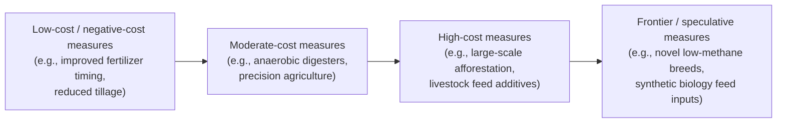
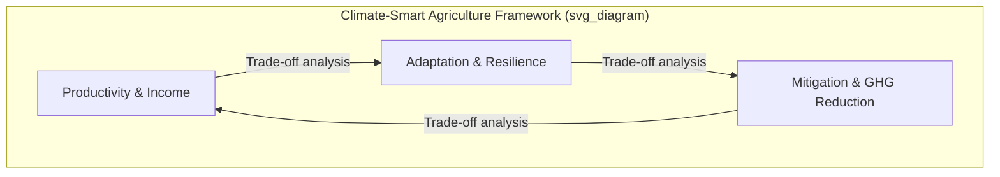

## Climate Change Adaptation and Mitigation in Agriculture

### Conceptual Foundations

Climate change intersects with agriculture through two distinct but complementary policy and economic response channels: **adaptation** and **mitigation**. Understanding their economic logic requires distinguishing them clearly before analyzing their interactions.

**Adaptation** refers to adjustments in agricultural systems, practices, and management in response to actual or expected climate stimuli, moderating harm or exploiting beneficial opportunities. Adaptation is fundamentally a private-good-like response at the farm level, though it has public-good dimensions (e.g., shared infrastructure, information systems).

**Mitigation** refers to actions that reduce greenhouse gas (GHG) emissions or enhance carbon sequestration (sinks), thereby reducing the extent of future climate change. Mitigation in agriculture is largely a public good: an individual farmer's reduction in methane or nitrous oxide emissions benefits the global atmosphere, not primarily the farmer, creating classic incentive problems.

This asymmetry — adaptation benefits accrue locally and immediately; mitigation benefits accrue globally and over long time horizons — is the central economic tension underlying agricultural climate policy design.

---

### The Economics of Climate Change as a Market Failure

Climate change in agriculture is best understood through the lens of **externalities** and **public goods**.

- **GHG emissions from agriculture** (methane from enteric fermentation and rice paddies, nitrous oxide from fertilized soils, CO₂ from land-use change) are negative externalities: the social cost of emissions exceeds the private cost borne by the emitter.
- **Climate stability** is a global public good: non-excludable and non-rival. No individual farmer or country can be excluded from the benefits of a stabilized climate, and one country's enjoyment of climate stability does not diminish another's.

This generates a classic **free-rider problem** at the international level and an **incentive misalignment** at the farm level: farmers bear private costs of mitigation (e.g., adopting lower-emission practices) but capture only a fraction of the global benefit.

**Key Points**

- Mitigation externalities are global and long-term; adaptation benefits are local and immediate — this asymmetry drives divergent policy tools.
- Agriculture is unusual among sectors in being both a significant GHG source and a sector highly vulnerable to climate impacts (a "double exposure").
- Market failure justifies public intervention, but the appropriate instrument (tax, subsidy, market, regulation) depends on transaction costs, measurability, and political economy constraints.

---

### Agriculture's Dual Role: Source and Sink

Agriculture, forestry, and land use collectively account for a substantial share of global anthropogenic GHG emissions — commonly cited estimates place agriculture, forestry, and other land use (AFOLU) at roughly 22–24% of global emissions, though estimates vary by methodology and whether land-use change is included. [Inference: precise percentage varies by source year and accounting boundary]

**Primary agricultural GHG sources:**

| Source | Gas | Mechanism |
| --- | --- | --- |
| Enteric fermentation (livestock) | Methane (CH₄) | Microbial digestion in ruminants |
| Rice paddies | Methane (CH₄) | Anaerobic decomposition in flooded soils |
| Synthetic fertilizer & manure management | Nitrous oxide (N₂O) | Microbial nitrification/denitrification |
| Land-use change (deforestation for cropland/pasture) | Carbon dioxide (CO₂) | Loss of biomass and soil carbon stocks |
| Fossil fuel use (machinery, irrigation pumps) | Carbon dioxide (CO₂) | Combustion |

Agriculture also functions as a **carbon sink** through soil organic carbon sequestration, afforestation, and agroforestry — making it one of the few sectors where the same land unit can shift between net source and net sink depending on management.

---

### Adaptation Economics

#### Autonomous vs. Planned Adaptation

- **Autonomous adaptation**: Spontaneous adjustments by farmers in response to observed climatic changes, without deliberate policy intervention (e.g., shifting planting dates, changing crop varieties). Driven by private profit-maximizing behavior.
- **Planned adaptation**: Deliberate policy-driven interventions requiring public investment (e.g., irrigation infrastructure, crop insurance schemes, early-warning systems, R&D for heat-tolerant cultivars).

The economic rationale for public involvement in planned adaptation rests on market failures: information asymmetries (farmers underestimate long-term climate risk), credit constraints (farmers cannot finance adaptive investments), and public-good infrastructure (large-scale irrigation, weather forecasting systems).

#### The Ricardian Approach to Adaptation Valuation

A widely used empirical method for estimating adaptation potential is the **Ricardian model**, which regresses farmland value (or net revenue) on climate variables, soil characteristics, and socioeconomic controls:

$$V_i = \beta_0 + \beta_1 T_i + \beta_2 T_i^2 + \beta_3 P_i + \beta_4 P_i^2 + \gamma X_i + \varepsilon_i$$

where $V_i$ is farmland value or net revenue per hectare for farm $i$, $T_i$ is temperature, $P_i$ is precipitation, and $X_i$ is a vector of soil and socioeconomic controls.

The quadratic specification allows the model to capture **adaptive capacity implicitly**: because farmland value already reflects farmers' historical adjustments to climate (crop choice, input mix), the estimated climate-value relationship is flatter than a naive "dose-response" model that ignores adaptation. This distinction — the **production function approach** (which holds practices fixed and tends to overstate damages) versus the **Ricardian approach** (which allows practices to adjust and tends to better reflect long-run adaptation) — is a central methodological debate in climate-agriculture economics. [Inference: the degree of over/understatement is empirically contested and varies by region and study design]

#### Adaptation Strategies (Farm-Level)

- **Agronomic**: Shifting planting/harvest dates, crop diversification, drought/heat-tolerant varieties, altered crop rotations
- **Water management**: Drip irrigation, rainwater harvesting, deficit irrigation scheduling
- **Risk management**: Index-based (parametric) crop insurance, diversified income portfolios, forward contracting
- **Structural**: Terracing, windbreaks, greenhouse/protected cultivation
- **Institutional**: Extension services, climate information services, land tenure reform to incentivize long-term investment

#### Barriers to Adaptation

- **Credit constraints**: Capital-intensive adaptations (irrigation, greenhouses) require financing often unavailable to smallholders
- **Information failures**: Farmers may lack accurate, localized climate projections
- **Behavioral factors**: Present bias, risk aversion, and status-quo bias can delay adoption even when adaptation is economically rational
- **Land tenure insecurity**: Renters/sharecroppers have weaker incentives to invest in long-term soil or infrastructure improvements
- **Path dependency**: Sunk costs in existing infrastructure (irrigation systems, storage) create switching costs

---

### Mitigation Economics

#### Marginal Abatement Cost Curves (MACC)

The standard tool for comparing mitigation options across a sector is the **Marginal Abatement Cost Curve**, which ranks mitigation measures by cost per unit of GHG abated (typically $/tCO₂e), from lowest to highest cost.

Some measures exhibit **negative abatement costs** — they reduce emissions while also increasing farm profitability (e.g., precision nitrogen application reduces both N₂O emissions and fertilizer expenditure). The persistence of unadopted negative-cost measures is often cited as evidence of an "efficiency gap" driven by transaction costs, information failures, or hidden costs not captured in engineering-based MACC estimates. [Inference: the size and cause of this gap is debated in the literature — some economists argue apparent negative-cost options are illusory once risk, labor, and transaction costs are properly accounted for]

#### Key Mitigation Practices and Mechanisms

| Practice | GHG Mechanism | Economic Consideration |
| --- | --- | --- |
| No-till/reduced tillage | Increases soil carbon sequestration | Lower fuel/labor cost; yield effects vary by soil type |
| Precision nitrogen management | Reduces N₂O via optimized application | Reduces input cost; requires technical capacity |
| Improved livestock feed (additives, e.g., seaweed-based) | Reduces enteric CH₄ | Feed cost premium vs. emissions reduction; nascent commercial scale |
| Anaerobic digesters (manure management) | Captures CH₄ for energy use | High capital cost; revenue from biogas/electricity sales |
| Agroforestry | Sequesters carbon in woody biomass | Long payback period; competing land-use returns |
| Rice water management (alternate wetting and drying) | Reduces CH₄ from paddies | Can reduce water costs; yield-neutral in most trials |
| Afforestation/reforestation on marginal land | Sequesters carbon | Opportunity cost of foregone agricultural output |

#### Carbon Pricing and Agricultural Offsets

Agriculture is rarely subject to direct carbon pricing (unlike energy or industry) due to **measurement, reporting, and verification (MRV) challenges**: emissions are diffuse, biological, spatially heterogeneous, and difficult to monitor at low cost relative to point-source industrial emissions.

Instead, agriculture typically participates in climate policy through:

1. **Voluntary carbon offset markets**: Farmers generate tradeable credits for verified sequestration (e.g., soil carbon credits) or avoided emissions, sold to buyers seeking to offset their own emissions.
2. **Payments for Ecosystem Services (PES)**: Direct government or private payments for practices generating carbon co-benefits (afforestation subsidies, conservation reserve programs).
3. **Compliance-linked mechanisms**: In some jurisdictions, agricultural offsets can be used by regulated emitters (e.g., under cap-and-trade systems) to meet compliance obligations.

**Additionality** and **permanence** are the two central integrity challenges in agricultural carbon markets:

- *Additionality* requires that the sequestration/reduction would not have occurred without the offset payment (difficult to verify given many practices are already profitable).
- *Permanence* requires that sequestered carbon remains stored; soil carbon can be re-released through subsequent tillage, drought, or land-use reversal, undermining the durability of credits.

---

### The Adaptation–Mitigation Nexus (Synergies and Trade-offs)

Agricultural climate responses are rarely purely adaptive or purely mitigative — many practices generate joint outcomes, sometimes complementary and sometimes conflicting.

**Synergies (win-win practices):**

- Agroforestry: increases resilience to drought/heat (adaptation) while sequestering carbon (mitigation)
- Soil organic matter improvement (cover cropping, compost): improves water retention (adaptation) while sequestering carbon (mitigation)
- Diversified cropping systems: spreads climate risk (adaptation) while often reducing input-intensive emissions (mitigation)

**Trade-offs:**

- Expanded irrigation as an adaptation response can increase energy-related emissions (pumping) and, in flooded systems, methane emissions
- Livestock intensification can improve resilience/income diversification for smallholders while increasing enteric methane emissions
- Land conversion for adaptation-driven crop expansion can release stored soil/biomass carbon

This nexus is formalized in the concept of **Climate-Smart Agriculture (CSA)**, promoted by the FAO, which explicitly frames interventions along three pillars: (1) sustainably increasing productivity and incomes, (2) adapting and building resilience, and (3) reducing/removing GHG emissions where possible. CSA is a framework for prioritization rather than a specific technology set — it requires context-specific trade-off analysis rather than universal prescriptions. [Inference: applicability and ranking of "climate-smart" practices is highly context- and location-dependent, contested in some empirical literature]

---

### Policy Instruments

#### Adaptation-Oriented Policy

- **Public R&D investment**: Development of climate-resilient crop varieties (public good character justifies public funding given limited private appropriability)
- **Agricultural extension**: Disseminating climate information and adaptive practices
- **Index-based insurance subsidies**: Addressing basis risk and adverse selection/moral hazard problems inherent in traditional indemnity-based insurance
- **Infrastructure investment**: Irrigation systems, drought-resistant storage, rural roads (reducing post-harvest climate-related losses)
- **Social safety nets**: Cash transfers or public works programs that reduce vulnerability to climate shocks (ex-post risk coping)

#### Mitigation-Oriented Policy

- **Command-and-control regulation**: Mandated practice standards (e.g., manure management requirements)
- **Market-based instruments**: Carbon taxes (rarely applied directly to farm-level agricultural emissions due to MRV costs), cap-and-trade with agricultural offset provisions
- **Payments for Ecosystem Services (PES)**: Direct compensation for verified sequestration/emission reduction
- **Cross-compliance mechanisms**: Linking existing subsidy payments (e.g., under the EU Common Agricultural Policy) to environmental/climate performance requirements
- **Border carbon adjustments**: Emerging policy tool addressing competitiveness and leakage concerns for emissions-intensive agricultural exports [Unverified: implementation specifics remain in early/pilot stages in most jurisdictions as of publicly available information]

**Example**

A stylized illustration of policy instrument choice under different MRV cost regimes:

| MRV Cost | Preferred Instrument | Rationale |
| --- | --- | --- |
| Low (e.g., verifiable input use, fertilizer sales) | Input taxes/subsidies | Direct, low-cost to administer |
| Moderate (e.g., remote-sensed land cover change) | PES / conservation payments | Verification feasible via satellite monitoring |
| High (e.g., soil carbon flux, enteric methane per animal) | Practice-based standards or voluntary programs | Direct emissions measurement too costly at scale |

---

### Measurement, Uncertainty, and Leakage Concerns

- **Carbon leakage**: Mitigation policy in one jurisdiction can shift emissions-intensive production (e.g., livestock, land clearing) to jurisdictions without comparable regulation, potentially offsetting global mitigation gains. This is a well-documented concern in the trade-and-environment literature, though the empirical magnitude of agricultural leakage varies by study and commodity. [Inference: magnitude of leakage effects is empirically contested and commodity-specific]
- **Baseline uncertainty**: Establishing counterfactual emissions/sequestration baselines for offset crediting involves significant estimation uncertainty, particularly for soil carbon.
- **Discounting and intergenerational equity**: Mitigation benefits accrue over long (multi-decadal to century) time horizons, making the choice of discount rate in cost-benefit analysis a first-order determinant of optimal mitigation effort — a well-known point of contention between economists favoring market-based discount rates (e.g., Nordhaus) and those favoring lower, ethics-based rates (e.g., Stern).

---

### Distributional and Development Considerations

- **Smallholder vulnerability**: Smallholder and subsistence farmers in tropical/semi-arid regions face disproportionate climate exposure combined with the least adaptive capacity (limited capital, insurance access, and diversification options).
- **Gender dimensions**: Women farmers often face compounded constraints in accessing credit, land tenure security, and extension services relevant to adaptation.
- **Common but differentiated responsibilities**: International climate negotiations (UNFCCC framework) recognize that developed countries bear greater historical responsibility for emissions, shaping differentiated mitigation obligations and climate finance flows (e.g., Green Climate Fund) directed toward agricultural adaptation in developing economies.
- **Just transition concerns**: Mitigation policies affecting livestock sectors (a major source of rural livelihoods in many regions) raise distributional questions requiring complementary transition support.

---

### Diagram: Climate Change–Agriculture Feedback System

<svg viewBox="0 0 900 480" xmlns="http://www.w3.org/2000/svg" font-family="Arial, sans-serif">
<text x="450" y="30" text-anchor="middle" font-size="18" font-weight="bold" fill="#1a1a1a">Climate Change–Agriculture Feedback System (svg_diagram)</text>
<rect x="40" y="80" width="220" height="80" rx="8" fill="#e8f0fe" stroke="#4a7ab5" stroke-width="2"/>
<text x="150" y="112" text-anchor="middle" font-size="14" font-weight="bold">Agricultural</text>
<text x="150" y="130" text-anchor="middle" font-size="14" font-weight="bold">GHG Emissions</text>
<text x="150" y="148" text-anchor="middle" font-size="11" fill="#444">(CH4, N2O, CO2)</text>
<rect x="340" y="80" width="220" height="80" rx="8" fill="#fde8e8" stroke="#b54a4a" stroke-width="2"/>
<text x="450" y="112" text-anchor="middle" font-size="14" font-weight="bold">Global Climate</text>
<text x="450" y="130" text-anchor="middle" font-size="14" font-weight="bold">Change</text>
<text x="450" y="148" text-anchor="middle" font-size="11" fill="#444">(temp, precipitation shifts)</text>
<rect x="640" y="80" width="220" height="80" rx="8" fill="#fff4e0" stroke="#c98a2b" stroke-width="2"/>
<text x="750" y="112" text-anchor="middle" font-size="14" font-weight="bold">Agricultural</text>
<text x="750" y="130" text-anchor="middle" font-size="14" font-weight="bold">Production Impacts</text>
<text x="750" y="148" text-anchor="middle" font-size="11" fill="#444">(yield, water stress, pests)</text>
<rect x="340" y="260" width="220" height="80" rx="8" fill="#e8f7e9" stroke="#3f8a4c" stroke-width="2"/>
<text x="450" y="292" text-anchor="middle" font-size="14" font-weight="bold">Adaptation</text>
<text x="450" y="310" text-anchor="middle" font-size="14" font-weight="bold">Responses</text>
<text x="450" y="328" text-anchor="middle" font-size="11" fill="#444">(farm-level + policy)</text>
<rect x="40" y="260" width="220" height="80" rx="8" fill="#f0e8fd" stroke="#7a4ab5" stroke-width="2"/>
<text x="150" y="292" text-anchor="middle" font-size="14" font-weight="bold">Mitigation</text>
<text x="150" y="310" text-anchor="middle" font-size="14" font-weight="bold">Responses</text>
<text x="150" y="328" text-anchor="middle" font-size="11" fill="#444">(emission reduction, sinks)</text>
<rect x="640" y="260" width="220" height="80" rx="8" fill="#e0f4f7" stroke="#2b8ac9" stroke-width="2"/>
<text x="750" y="292" text-anchor="middle" font-size="14" font-weight="bold">Farm Income &</text>
<text x="750" y="310" text-anchor="middle" font-size="14" font-weight="bold">Food Security</text>
<text x="750" y="328" text-anchor="middle" font-size="11" fill="#444">outcomes</text>
<line x1="260" y1="120" x2="340" y2="120" stroke="#333" stroke-width="2" marker-end="url(#arrow)"/>
<line x1="560" y1="120" x2="640" y2="120" stroke="#333" stroke-width="2" marker-end="url(#arrow)"/>
<line x1="750" y1="160" x2="750" y2="260" stroke="#333" stroke-width="2" marker-end="url(#arrow)"/>
<line x1="640" y1="300" x2="560" y2="300" stroke="#333" stroke-width="2" marker-end="url(#arrow)"/>
<line x1="340" y1="300" x2="260" y2="300" stroke="#333" stroke-width="2" marker-end="url(#arrow)"/>
<line x1="150" y1="260" x2="150" y2="160" stroke="#333" stroke-width="2" stroke-dasharray="6,4" marker-end="url(#arrow)"/>
<text x="165" y="210" font-size="10" fill="#555" transform="rotate(-90 165 210)">reduces</text>
<line x1="450" y1="260" x2="450" y2="160" stroke="#333" stroke-width="2" stroke-dasharray="6,4" marker-end="url(#arrow)"/>
<text x="465" y="210" font-size="10" fill="#555" transform="rotate(-90 465 210)">responds to</text>
<defs>
<marker id="arrow" markerWidth="10" markerHeight="10" refX="8" refY="3" orient="auto" markerUnits="strokeWidth">
<path d="M0,0 L0,6 L9,3 z" fill="#333"/>
</marker>
</defs>

<text x="450" y="420" text-anchor="middle" font-size="11" fill="#666" font-style="italic">Solid arrows: causal impact pathway. Dashed arrows: feedback/response pathway.</text>

</svg>

---

### Worked Numerical Example: Cost-Effectiveness Comparison

Suppose a policymaker compares two mitigation interventions for a rice-growing region:

- **Alternate Wetting and Drying (AWD)**: Reduces methane emissions by an estimated 2.5 tCO₂e/hectare/year at an implementation cost of $15/hectare/year (net of water cost savings).
- **Biogas digester subsidy program**: Reduces methane emissions by an estimated 8 tCO₂e/farm/year at a subsidized cost of $200/farm/year.

Cost-effectiveness ratio ($ per tCO₂e abated):

$$\text{CE}_{AWD} = \frac{15}{2.5} = \$6/\text{tCO}_2\text{e}$$

$$\text{CE}_{digester} = \frac{200}{8} = \$25/\text{tCO}_2\text{e}$$

Under a pure cost-minimization objective, AWD dominates on a per-ton basis. However, a comprehensive comparison would also weigh **co-benefits** (digesters provide energy and reduce indoor air pollution from biomass burning; AWD may have water-availability prerequisites not present in all regions) — illustrating why MACC rankings alone are insufficient for policy prioritization without broader multi-criteria analysis. [Inference: figures are illustrative for pedagogical purposes, not empirical estimates from a specific study]

---

### Conclusion

Climate change adaptation and mitigation in agriculture represent two economically distinct response strategies unified by their common origin in market failure: adaptation addresses private and local climate risk exposure, while mitigation addresses a global public-goods problem of GHG accumulation. Effective policy design requires recognizing their frequent synergies (e.g., soil carbon practices) as well as genuine trade-offs (e.g., irrigation expansion increasing energy emissions), and selecting instruments (taxes, PES, insurance, R&D, regulation) matched to the measurement feasibility and public-good character of each specific intervention. The persistent challenges of MRV costs, additionality, permanence, and distributional equity for smallholders remain central unresolved issues shaping the field's ongoing research and policy agenda.

**Related Topics**

- Environmental valuation methods (contingent valuation, hedonic pricing) applied to agricultural externalities
- Agricultural risk management and index-based insurance design
- Carbon markets and offset verification systems (voluntary vs. compliance markets)
- Common Agricultural Policy (CAP) and cross-compliance environmental mechanisms
- Water resource economics and irrigation policy under climate variability
- Land-use change economics and deforestation drivers
- International climate finance mechanisms (Green Climate Fund, Loss and Damage Fund)
- Precision agriculture technology adoption economics
- Discounting and intergenerational welfare analysis in environmental cost-benefit analysis
- Food security and climate shock transmission through global commodity markets