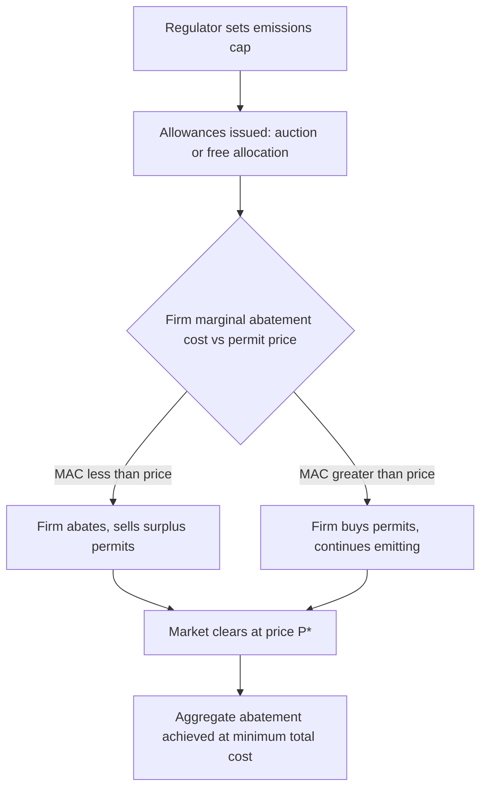
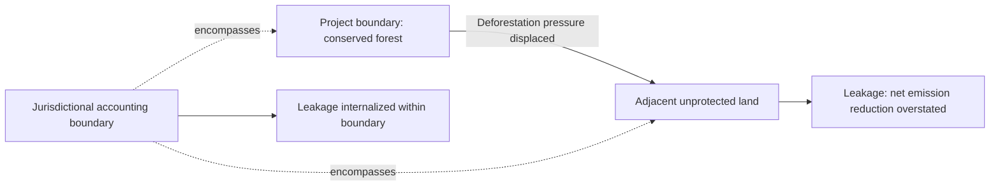
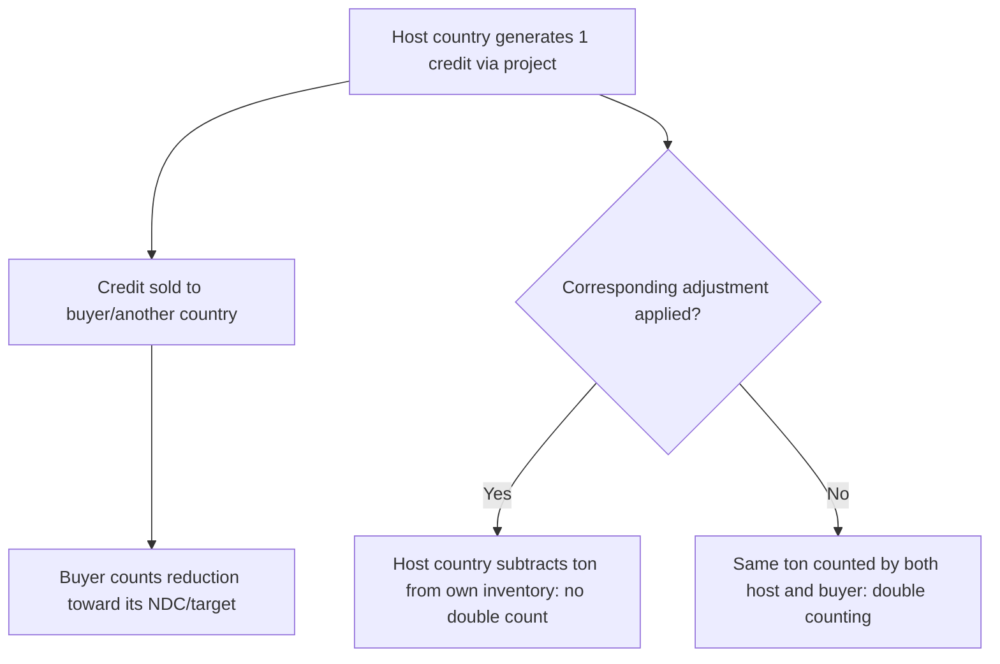

## Carbon Markets and Payments for Ecosystem Services

### Conceptual Foundations

#### Market Failure and Externalities

Carbon markets and payments for ecosystem services (PES) are policy instruments designed to correct market failures arising from environmental externalities. Ecosystem services—carbon sequestration, watershed protection, biodiversity habitat, pollination—are largely public goods or exhibit positive externalities: their benefits are non-excludable and often non-rival, meaning private markets systematically undersupply them relative to the social optimum.

The standard welfare economics framing: a landowner deciding whether to conserve forest versus convert to agriculture only weighs private costs and benefits. The carbon sequestration, biodiversity, and hydrological benefits accruing to society are not captured in that decision, producing a divergence between private and social marginal benefit curves.

$$MB_{social} = MB_{private} + MB_{external}$$

Where the landowner conserves based only on $MB_{private}$, conservation is undersupplied relative to the socially optimal level where $MB_{social} = MC$.

#### Coasean Bargaining vs. Pigouvian Correction

Two theoretical lineages underpin these instruments:

- **Coasean approach**: If property rights are well-defined and transaction costs are low, beneficiaries of ecosystem services can negotiate directly with providers, internalizing the externality without government intervention. PES schemes are often framed as applied Coasean bargains—buyers (downstream water users, carbon emitters) pay upstream/land-based providers directly.
- **Pigouvian approach**: Where transaction costs are high or property rights are ambiguous (as with atmospheric carbon, a true global commons), governments or intermediaries impose taxes, subsidies, or cap-and-trade systems to correct the externality at a systemic level.

Carbon markets typically blend both: a Pigouvian cap-and-trade structure creates a scarcity price for emissions, while the resulting permit trading operates through Coasean-style bilateral or exchange-based transactions.

---

### Carbon Markets: Structure and Mechanisms

#### Compliance vs. Voluntary Markets

**Compliance (regulatory) markets** are created by binding legal caps on emissions, mandated by international agreements, national legislation, or subnational regulation.

- **EU Emissions Trading System (EU ETS)**: cap-and-trade covering power, industry, and aviation
- **California Cap-and-Trade Program**, linked with Québec
- **China National ETS**: currently the largest by covered emissions, initially focused on power sector intensity-based allocation

**Voluntary carbon markets (VCM)** allow corporations, institutions, or individuals to purchase carbon credits to offset emissions outside legal compliance obligations, often for corporate social responsibility, net-zero pledges, or reputational reasons. Key registries: Verra (VCS), Gold Standard, American Carbon Registry (ACR), Climate Action Reserve (CAR).

**Key Points**

- Compliance markets derive value from legal scarcity (the cap); voluntary markets derive value from buyer willingness-to-pay and perceived credibility/additionality
- Prices in compliance markets are typically far higher and less volatile than VCM credit prices due to enforceable demand
- VCM has faced significant credibility scrutiny (see Additionality section below)

#### Cap-and-Trade Mechanics

A regulator sets a total emissions cap $\bar{E}$, declining over time, and issues tradable allowances equal to that cap. Firms must surrender one allowance per ton of $CO_2e$ emitted.

$$\bar{E} = \sum_{i=1}^{n} e_i$$

where $e_i$ is the allocation to firm $i$. Firms with low abatement costs sell surplus allowances to firms with high abatement costs, equalizing marginal abatement cost (MAC) across the economy at the market clearing price $P^*$:

$$MAC_1 = MAC_2 = \dots = MAC_n = P^*$$

This cost-effectiveness result—achieving a given aggregate abatement target at minimum total cost—is the central theoretical justification for cap-and-trade over uniform command-and-control regulation.

**Allocation methods**:

- **Grandfathering**: free allocation based on historical emissions, often used in early phases to ease political transition
- **Auctioning**: allowances sold via periodic auction, generating public revenue and considered more economically efficient (avoids windfall profits, provides clearer price discovery)
- **Benchmarking**: free allocation based on output-based efficiency benchmarks (used to prevent carbon leakage in trade-exposed sectors)

#### Carbon Tax vs. Cap-and-Trade

Both are Pigouvian instruments but differ in which variable is fixed:

| Dimension | Carbon Tax | Cap-and-Trade |
| --- | --- | --- |
| Fixed variable | Price | Quantity (emissions cap) |
| Emissions outcome | Uncertain | Certain (by design) |
| Price volatility | Low/stable | Can be high |
| Revenue | Direct, predictable | Depends on auction share |
| Administrative complexity | Lower | Higher (registry, MRV, trading infrastructure) |

Weitzman's (1974) "Prices vs. Quantities" result is the canonical theoretical reference: under uncertainty about abatement costs, the preferred instrument depends on the relative slopes of marginal benefit and marginal cost curves. When marginal damage costs are relatively flat (as with $CO_2$, since it is a stock pollutant with damages driven by cumulative atmospheric concentration rather than the flow of any single year's emissions) and marginal abatement costs are steep, a price instrument (tax) is generally preferred, though most jurisdictions apply hybrid designs (price floors/ceilings within cap-and-trade) to manage both dimensions.

---

### Agricultural and Forestry Carbon Credits

#### Compliance Pathways for Land-Based Carbon

Agriculture and forestry enter carbon markets primarily through offset protocols within compliance systems or through the VCM, since most compliance caps regulate stationary/industrial emitters directly rather than diffuse agricultural sources.

**Common land-based project types**:

- **Afforestation/Reforestation (A/R)**: planting trees on non-forested land
- **Improved Forest Management (IFM)**: extending rotation ages, reduced-impact logging, increasing standing carbon stock
- **REDD+** (Reducing Emissions from Deforestation and Forest Degradation, plus conservation, sustainable management, and enhancement of forest carbon stocks): a UNFCCC-originated framework, now implemented through jurisdictional and project-based approaches
- **Agricultural soil carbon**: no-till/reduced-till adoption, cover cropping, rotational grazing—sequestering carbon in soil organic matter
- **Avoided grassland conversion**: paying landowners not to convert native grassland to cropland
- **Livestock methane reduction**: feed additives, manure management systems generating methane offset credits

#### Additionality, Permanence, and Leakage

These three concepts are the central technical and credibility challenges of land-based carbon crediting, and are frequently cited in critiques of offset market integrity.

**Additionality**: the requirement that emission reductions or removals would *not* have occurred under a business-as-usual baseline without the carbon finance. This is formalized via counterfactual baseline construction.

$$Credits = E_{baseline} - E_{project}$$

Additionality testing typically uses:

- **Regulatory surplus test**: the practice must exceed legal requirements
- **Financial/investment analysis**: demonstrating the project is not otherwise financially viable without carbon revenue
- **Common practice test**: demonstrating the practice is not already widespread in the reference region

[Unverified] The magnitude of over-crediting in specific historical REDD+ project portfolios has been the subject of contested empirical studies (e.g., independent analyses of Verra-registered projects published in 2023 found substantially lower actual deforestation avoidance than credited in a sampled subset), and estimates vary considerably by methodology and reviewer; treat specific percentage claims as contested rather than settled.

**Permanence**: carbon sequestered in biological sinks (forests, soils) is reversible through fire, disease, drought, or land-use reversal, unlike geological storage. Standard risk-management mechanisms:

- **Buffer pools**: registries withhold a percentage of issued credits (e.g., Verra's AFOLU buffer pool) as insurance against reversal, drawn down if a project experiences a carbon loss event
- **Project-level insurance and monitoring commitments**: typically 20-100 year monitoring periods depending on protocol

**Leakage**: displacement of the emitting or land-clearing activity to another location rather than genuine reduction. If a landowner is paid to conserve one forest parcel, deforestation pressure may simply shift to an adjacent unprotected parcel. Leakage is addressed through:

- Leakage deduction factors applied to credit issuance
- Jurisdictional (rather than project-level) accounting, which internalizes displacement within a larger boundary

#### MRV: Measurement, Reporting, and Verification

Credible carbon crediting depends on robust MRV systems:

- **Measurement**: field-based forest inventory (allometric biomass equations), remote sensing (satellite-based canopy cover, LiDAR for biomass estimation), soil sampling protocols for soil organic carbon (SOC)
- **Reporting**: standardized methodologies filed under a registry protocol (e.g., Verra VM0042 for improved agricultural land management, VM0007 for REDD+)
- **Verification**: third-party auditors (validation/verification bodies, VVBs) confirm reported reductions against the approved methodology before credit issuance

[Inference] Remote-sensing-based MRV (satellite/LiDAR) is increasingly displacing purely plot-based sampling for large-scale forest carbon accounting because it reduces per-hectare monitoring cost, though ground-truthing remains standard practice for calibration and accuracy assurance.

---

### Payments for Ecosystem Services (PES): General Framework

#### Wunder's Definition and Design Criteria

The most widely cited academic definition (Sven Wunder, CIFOR) characterizes PES as a **voluntary transaction** where a **well-defined ecosystem service** (or a land use likely to secure that service) is **bought** by at least one **buyer** from at least one **provider**, **conditional** on provision.

**Five canonical design criteria**:

1. Voluntary transaction
2. Well-defined ecosystem service (or proxy land use)
3. At least one buyer
4. At least one provider
5. Conditionality — payment occurs only if the service is actually delivered

[Inference] In practice, many real-world programs (e.g., broad agri-environmental subsidy schemes) only partially satisfy strict conditionality, since monitoring outcome-based service delivery is often more costly than monitoring input-based compliance (e.g., "did the farmer plant a cover crop" rather than "did soil carbon actually increase"), so many applied schemes are more accurately described as PES-like rather than pure PES.

#### Categories of Ecosystem Services Under PES

| Service Category | Example Mechanism | Typical Buyer |
| --- | --- | --- |
| Carbon sequestration | Forest carbon credits, soil carbon programs | Corporations, compliance entities |
| Watershed services | Water fund payments to upstream landowners | Downstream utilities, municipalities |
| Biodiversity conservation | Habitat banking, conservation easements | Regulators (mitigation), conservation NGOs |
| Landscape beauty/recreation | Ecotourism revenue-sharing | Tourism operators, visitors |
| Pollination services | Agri-environment pollinator habitat payments | Governments, agribusiness |

#### Financing Mechanisms

- **User-financed PES**: direct payment by service beneficiaries (e.g., a bottling company paying upstream farmers for watershed protection)
- **Government-financed PES**: public budget-funded programs, often justified as public good provision where beneficiaries are too diffuse to organize (e.g., China's Sloping Land Conversion Program, the U.S. Conservation Reserve Program)
- **Hybrid**: blended public-private financing, common in large water fund initiatives (e.g., The Nature Conservancy's Latin American water funds)

---

### Case Studies

#### Costa Rica's Pago por Servicios Ambientales (PSA)

Costa Rica's national PES program, established under Forestry Law No. 7575 (1996), is the most frequently cited government-financed PES scheme globally, funded substantially through a national fossil fuel sales tax and, later, World Bank and Global Environment Facility co-financing.

**Structure**: FONAFIFO (Fondo Nacional de Financiamiento Forestal) administers contracts with landowners for four service categories: carbon mitigation, hydrological services, biodiversity conservation, and scenic beauty. Landowners receive fixed per-hectare annual payments over multi-year contracts (typically 5-10 years) conditional on maintaining forest cover, verified through remote sensing and field checks.

[Inference] Empirical evaluations of the program's additionality have found mixed results across time periods—some studies suggest lower additionality in earlier program phases (when enrollment favored land already unlikely to be deforested) with improved targeting efficiency in later phases as the program shifted toward risk-based/priority-area targeting; exact effect sizes vary by study design and time period examined.

#### China's Sloping Land Conversion Program (SLCP / "Grain for Green")

Launched in 1999, one of the largest PES programs by both budget and area, paying farmers to convert cropland on steep slopes to forest or grassland, primarily for soil erosion control and, secondarily, carbon sequestration.

**Key Points**

- Financed and administered by central government, with payments in grain/cash plus seedling subsidies
- Explicit poverty-alleviation co-objective alongside environmental restoration
- [Unverified] Precise long-term compliance rates after payment contracts expired (i.e., whether converted land remained forested once subsidies ended) vary across regional studies and are not uniformly documented

#### Water Funds (Latin America)

Water funds pool contributions from downstream water users (utilities, bottlers, municipalities) into a trust that finances upstream landowners for conservation practices (riparian buffers, avoided deforestation, sustainable grazing) that protect water quality and flow regulation. The Fund for the Protection of Water (FONAG) in Quito, Ecuador, established 2000, is a commonly cited example combining a water utility, an NGO, and a beer company as founding financiers.

---

### Economic Valuation of Ecosystem Services

#### Total Economic Value Framework

Standard environmental economics decomposes ecosystem value into:

$$TEV = UV + NUV = (DUV + IUV + OV) + (BV + EV)$$

Where:

- $DUV$ = Direct Use Value (timber, harvested goods)
- $IUV$ = Indirect Use Value (carbon sequestration, water filtration)
- $OV$ = Option Value (value of preserving future use options)
- $BV$ = Bequest Value (value of preserving for future generations)
- $EV$ = Existence Value (value from mere existence, independent of use)

#### Valuation Methods Relevant to PES Design

- **Revealed preference**: hedonic pricing (property value premiums from proximity to green space), travel cost method (recreational ecosystem value)
- **Stated preference**: contingent valuation, choice experiments—used to estimate willingness-to-pay (WTP) for non-market services, informing PES payment level design
- **Production function approach**: estimating ecosystem service value via its contribution to a marketed output (e.g., pollination's marginal contribution to crop yield)

**Example**

A choice experiment estimating downstream WTP for upstream watershed conservation might present respondents with attribute bundles (water quality improvement, cost per household per year, program duration) and estimate a mixed logit model to recover marginal WTP for a one-unit water quality improvement, which then informs the ceiling for a sustainable water fund payment level.

---

### Price Formation and Market Efficiency Considerations

#### Carbon Price Determinants

$$P_{carbon} = f(\bar{E}, D_{abatement}, Policy_{stringency}, Banking, Offsets_{supply})$$

Compliance carbon prices respond to: cap stringency (declining cap trajectory), industrial output and energy prices (which shift abatement demand), policy credibility (risk of future cap loosening), and the availability of banking (firms holding permits across compliance periods) or borrowing provisions.

[Inference] VCM credit prices are substantially more heterogeneous than compliance allowance prices because credit quality is non-fungible across project types, vintages, and registries—nature-based removal credits with strong co-benefits (biodiversity, community development) typically command a premium over avoided-emissions credits from lower-rigor methodologies, though the exact magnitude of this premium fluctuates with buyer sentiment and market conditions.

#### Double Counting and Corresponding Adjustments

Under the Paris Agreement's Article 6 framework, when a carbon credit generated in one country is sold internationally and counted toward another country's Nationally Determined Contribution (NDC), the host country must apply a "corresponding adjustment"—subtracting that reduction from its own national inventory—to prevent the same ton of abatement being counted twice (once by the seller nation, once by the buyer/credit-user).

---

### Policy Instrument Comparison

**Key Points**

- **Cap-and-trade**: cost-effective, quantity-certain, administratively complex, vulnerable to price volatility and allocation politics
- **Carbon tax**: administratively simpler, price-certain, emissions outcome uncertain, easier to harmonize internationally
- **PES**: flexible and locally tailored, but conditionality/additionality verification costs can be high relative to payment size, and program scale is often budget-constrained rather than market-scaled
- **Offset credits within compliance markets**: extend abatement cost flexibility to sectors (agriculture, forestry) not directly covered by a cap, but introduce additionality/permanence/leakage risk into the integrity of the overall cap

---

### Illustrative Diagram: PES Transaction Structure

<svg xmlns="http://www.w3.org/2000/svg" viewBox="0 0 800 420">
\<style\>
.title{font: bold 16px sans-serif; fill:#1a1a1a;}
.box{fill:#eaf3ea; stroke:#3a7d44; stroke-width:2;}
.boxbuyer{fill:#eaf0f6; stroke:#2e5c8a; stroke-width:2;}
.boxinter{fill:#f6f0ea; stroke:#a8622a; stroke-width:2;}
.label{font: 13px sans-serif; fill:#1a1a1a;}
.small{font: 11px sans-serif; fill:#444;}
.arrow{stroke:#333; stroke-width:2; marker-end:url(#arrowhead);}
\</style\>
<text x="400" y="30" text-anchor="middle" class="title">PES Transaction Structure (svg_diagram)</text>
<rect x="40" y="80" width="180" height="90" rx="8" class="boxbuyer" />
<text x="130" y="115" text-anchor="middle" class="label">Buyer</text>
<text x="130" y="135" text-anchor="middle" class="small">Downstream water utility /</text>
<text x="130" y="150" text-anchor="middle" class="small">Corporate offset purchaser</text>
<rect x="310" y="80" width="180" height="90" rx="8" class="boxinter" />
<text x="400" y="115" text-anchor="middle" class="label">Intermediary</text>
<text x="400" y="135" text-anchor="middle" class="small">Registry / Water Fund /</text>
<text x="400" y="150" text-anchor="middle" class="small">NGO administrator</text>
<rect x="580" y="80" width="180" height="90" rx="8" class="box" />
<text x="670" y="115" text-anchor="middle" class="label">Provider</text>
<text x="670" y="135" text-anchor="middle" class="small">Upstream landowner /</text>
<text x="670" y="150" text-anchor="middle" class="small">Forest manager</text>
<line x1="220" y1="125" x2="305" y2="125" class="arrow" />
<text x="262" y="115" text-anchor="middle" class="small">Payment</text>
<line x1="580" y1="145" x2="495" y2="145" class="arrow" />
<text x="537" y="165" text-anchor="middle" class="small">Verified service</text>
<rect x="310" y="240" width="180" height="110" rx="8" class="boxinter" />
<text x="400" y="270" text-anchor="middle" class="label">MRV System</text>
<text x="400" y="292" text-anchor="middle" class="small">Baseline setting</text>
<text x="400" y="309" text-anchor="middle" class="small">Monitoring</text>
<text x="400" y="326" text-anchor="middle" class="small">Third-party verification</text>
<line x1="400" y1="170" x2="400" y2="235" class="arrow" />
<text x="415" y="205" class="small">Conditionality check</text>
<line x1="670" y1="170" x2="470" y2="245" class="arrow" />
<text x="600" y="215" text-anchor="middle" class="small">Land-use evidence</text>
</svg>

---

### Related Topics

- Additionality quantification methods and baseline scenario modeling (project-level vs. jurisdictional)
- REDD+ jurisdictional accounting architecture and benefit-sharing mechanisms
- Article 6 of the Paris Agreement: internationally transferred mitigation outcomes (ITMOs) and corresponding adjustments
- Soil organic carbon (SOC) measurement protocols and modeled vs. measured MRV approaches
- Agri-environmental schemes and cross-compliance in the EU Common Agricultural Policy (CAP)
- Biodiversity credit markets and habitat/species banking (distinct from carbon-focused instruments)
- Contingent valuation and choice experiment methodology for non-market ecosystem valuation
- Weitzman's Prices vs. Quantities framework and hybrid instrument design (price collars in cap-and-trade)
- Corporate net-zero commitment frameworks (Science Based Targets initiative) and their interaction with VCM demand
- Carbon leakage and border carbon adjustment mechanisms (e.g., EU CBAM) as complements to domestic carbon pricing