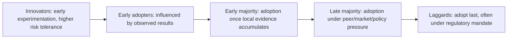
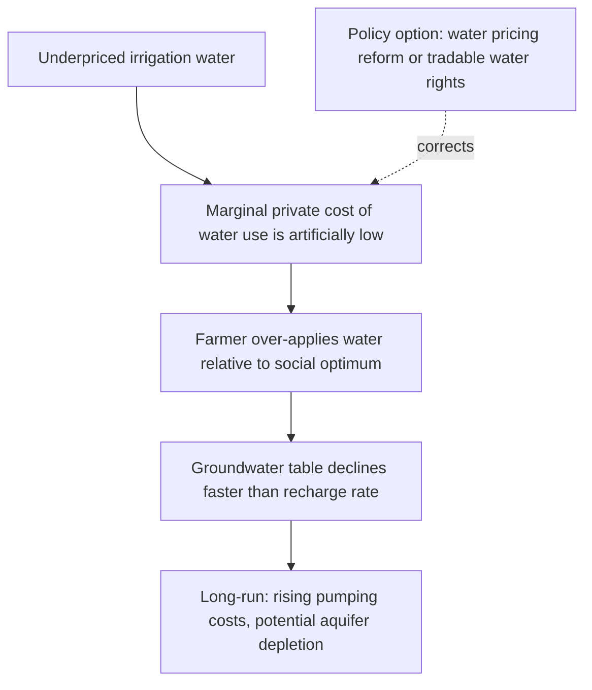

## Sustainable Agriculture Economics

### Conceptual Foundations

#### Defining Sustainability in Agricultural Systems

Sustainable agriculture economics examines farming systems through the lens of maintaining productive capacity across three interdependent dimensions: economic viability, environmental integrity, and social equity — often referred to as the triple bottom line. The economic core of the concept rests on **intertemporal resource allocation**: a production system is sustainable if it does not draw down natural capital stocks (soil fertility, water tables, biodiversity, climate stability) at a rate exceeding their regeneration, thereby preserving the productive potential available to future generations.

This is formalized in weak vs. strong sustainability frameworks:

- **Weak sustainability**: total capital stock (natural capital $K_N$ + produced/manufactured capital $K_M$) must be non-declining, permitting substitution between natural and manufactured capital (e.g., depleted soil fertility offset by synthetic fertilizer investment)
- **Strong sustainability**: certain natural capital stocks are non-substitutable ("critical natural capital") and must be maintained independently, since manufactured capital cannot fully replicate ecosystem functions like pollination or soil structure

$$K_{total,t+1} = K_{N,t+1} + K_{M,t+1} \geq K_{N,t} + K_{M,t}$$

#### The Externality Problem in Conventional Agriculture

Conventional intensive agriculture frequently generates negative externalities not reflected in market prices: nitrogen/phosphorus runoff causing eutrophication, soil erosion, pesticide drift affecting non-target species, groundwater depletion, and greenhouse gas emissions. Because these costs are borne by third parties or by society at large rather than the farm operation, private production decisions diverge from socially optimal ones.

$$MPC < MSC = MPC + MEC$$

Where $MPC$ is marginal private cost, $MEC$ is marginal external cost, and $MSC$ is marginal social cost. Absent correction (via taxes, regulation, or payment schemes), farms will overproduce relative to the socially efficient output level, or underinvest in conservation practices whose benefits accrue partly off-farm.

---

### Natural Capital and Soil as an Economic Asset

#### Soil Capital Depreciation

Soil economics treats topsoil, organic matter, and soil structure as a capital stock yielding a flow of productive services (crop yield). Unsustainable practices — continuous monocropping, excessive tillage, inadequate organic matter replenishment — deplete this stock, which is analogous to running down capital without reinvestment.

A simplified dynamic soil capital model:

$$S_{t+1} = S_t - D(S_t, X_t) + R(M_t)$$

Where $S_t$ is soil capital (proxied by soil organic carbon or productive capacity) at time $t$, $D$ is depletion as a function of stock and management practice $X_t$ (e.g., tillage intensity), and $R$ is regeneration from management investment $M_t$ (e.g., cover cropping, organic amendments). Sustainability requires $R(M_t) \geq D(S_t, X_t)$ over the relevant planning horizon.

**Key Points**

- Soil erosion imposes both **on-site costs** (reduced yields, higher input requirements over time) and **off-site costs** (sedimentation, water quality degradation) — the latter is a classic externality often excluded from farm-level private cost calculations
- Discounted private returns to soil conservation investment are frequently lower than the social discounted return, since farmers with short planning horizons (e.g., tenant farmers, uncertain land tenure) undervalue future soil productivity relative to a landowner with secure long-term tenure

#### Land Tenure and Investment Incentives

Land tenure security is a first-order determinant of conservation investment behavior. Farmers without secure, long-term tenure (short-term leases, insecure customary rights) face a truncated planning horizon and higher effective discount rates applied to conservation benefits that accrue over multi-year timeframes, creating a structural disincentive to invest in soil health, agroforestry, or terracing — even where such investments would be net-present-value positive under secure tenure.

[Inference] Empirical land tenure literature generally finds a positive relationship between tenure security and conservation investment, though the magnitude and significance of this relationship vary across country contexts and study designs, and are not uniform across all conservation practice types.

---

### Economic Analysis of Sustainable Practice Adoption

#### The Adoption Decision Framework

Farmer adoption of sustainable practices (conservation tillage, integrated pest management, crop rotation, agroforestry, precision agriculture) is typically modeled as a constrained utility or profit maximization problem under risk and imperfect information.

$$\max_{X} E[\pi(X)] - \lambda \cdot Var(\pi(X))$$

subject to liquidity, land, labor, and knowledge constraints, where $X$ is the vector of practice choices, $E[\pi]$ is expected profit, $Var(\pi)$ captures production/price risk, and $\lambda$ reflects the farmer's degree of risk aversion.

**Factors commonly identified as influencing adoption**:

- **Transition costs and yield drag**: many sustainable practices (e.g., organic conversion, no-till transition) involve a multi-year adjustment period with reduced yields or increased labor before benefits materialize
- **Risk and uncertainty**: novel practices carry higher perceived production risk, especially where local agronomic knowledge is limited
- **Access to credit**: capital constraints limit ability to bridge the transition period or invest in required equipment (e.g., no-till seed drills)
- **Extension services and information access**: knowledge transfer costs affect the perceived and actual returns to adoption
- **Farm size and tenure**: influences both risk-bearing capacity and planning horizon
- **Output market structure**: existence of premium markets (organic, certified sustainable) that reward the practice

**Example**

A farmer evaluating conversion to no-till corn-soybean rotation faces reduced fuel and labor costs (positive NPV driver) offset against potential yield variability in early transition years and the capital cost of specialized planting equipment. A standard net present value comparison:

$$NPV = \sum_{t=0}^{T} \frac{(R_t - C_t)}{(1+r)^t}$$

would need to capture the full transition trajectory (including a plausible yield-drag period) rather than steady-state post-transition returns alone, since a common analytical error is comparing steady-state sustainable-practice returns to conventional practice returns without accounting for the adjustment cost path.

#### Technology Adoption Curves and Diffusion

Sustainable practice adoption often follows a standard S-shaped (logistic) diffusion pattern consistent with Rogers' diffusion of innovations theory, driven by peer learning, demonstration effects, and declining perceived risk as local adoption rates rise.

---

### Sustainable Agriculture Certification and Market Premiums

#### Certification as a Signaling Mechanism

Because sustainability attributes are largely **credence goods** — consumers cannot verify the production method through inspection or consumption of the product itself — third-party certification (organic, Rainforest Alliance, Fair Trade, regenerative certifications) functions as an economic signaling mechanism to resolve information asymmetry between producers and consumers.

$$P_{certified} = P_{conventional} + Premium$$

Whether the price premium is sufficient to offset the certification cost, yield adjustments, and compliance burden determines the private profitability of certification.

**Key Points**

- Certification imposes both **fixed costs** (initial certification fees, required infrastructure/recordkeeping changes) and **recurring costs** (annual audit fees, documentation)
- Price premiums for certified products (organic, in particular) have been extensively studied; premiums vary substantially by commodity, region, and market channel, and [Unverified] specific premium percentages cited in older studies may not reflect current market conditions given evolving consumer demand and expanded certified supply
- Smallholder farmers often face proportionally higher per-unit certification costs than larger operations due to fixed compliance costs, creating potential barriers to entry into premium markets absent group certification schemes or external subsidy

#### Organic Agriculture Economics

Organic systems typically substitute management-intensive practices (crop rotation, cover cropping, biological pest control) and higher labor input for purchased synthetic inputs. The standard economic comparison involves:

| Factor | Conventional | Organic |
| --- | --- | --- |
| Input costs | Higher (synthetic fertilizer/pesticide) | Lower purchased input cost, higher labor cost |
| Yield | Baseline | [Inference] Typically lower per-hectare yield for many crops, though the yield gap varies substantially by crop type, region, and management quality |
| Output price | Baseline | Premium (variable by market) |
| Transition period | N/A | Multi-year certification transition (commonly 3 years under USDA/EU standards) with conventional-level costs but no price premium |

---

### Payments, Subsidies, and Policy Instruments

#### Agri-Environmental Payment Schemes

Governments frequently use direct payment schemes to correct the externality gap between private and social returns to conservation practices, effectively acting as a form of payment for ecosystem services targeted specifically at farmland.

- **EU Common Agricultural Policy (CAP) eco-schemes**: payments conditional on adopting specified environmental practices (cover cropping, reduced input use, habitat maintenance), layered atop baseline cross-compliance conditions
- **US Conservation Reserve Program (CRP)**: rental payments to farmers for taking environmentally sensitive land out of production and establishing conservation cover
- **Environmental Quality Incentives Program (EQIP)**: cost-share payments for adopting specific conservation practices

$$Payment \geq Opportunity Cost_{farmer} - Private Benefit_{practice}$$

For voluntary participation, the payment must at minimum offset the farmer's forgone income from conventional production net of any private benefit already captured from the practice, otherwise enrollment will not clear the farmer's participation constraint.

#### Input Subsidy Reform and Distortion

Conventional agricultural input subsidies (fertilizer, irrigation water, diesel fuel for pumps) can generate perverse incentives that work against sustainability objectives by lowering the effective marginal cost of input-intensive practices below their true social cost, encouraging overapplication.

**Key Points**

- Underpriced irrigation water is a commonly cited driver of groundwater depletion in intensive agricultural regions, since farmers face little private incentive to adopt water-efficient technology (drip irrigation, deficit irrigation scheduling) when water is priced far below its scarcity value
- Subsidy reform (shifting from input subsidies toward output-neutral or conservation-linked payments) is a recurring policy recommendation in agricultural economics literature, though politically difficult given entrenched distributional effects on existing input-subsidy beneficiaries

---

### Risk, Resilience, and Diversification Economics

#### Portfolio Theory Applied to Cropping Systems

Diversified sustainable systems (polyculture, agroforestry, integrated crop-livestock systems) can be analyzed using a portfolio framework analogous to financial asset diversification, where combining enterprises with imperfectly correlated returns reduces overall farm income variance without proportionally reducing expected return.

$$Var(\pi_{portfolio}) = \sum_i w_i^2 Var(\pi_i) + \sum_i \sum_{j \neq i} w_i w_j Cov(\pi_i, \pi_j)$$

Where $w_i$ is the income share from enterprise $i$. Diversification benefits are maximized when $Cov(\pi_i, \pi_j)$ is low or negative — e.g., a crop-livestock system where drought reduces crop yield but livestock can be sold or maintained on stored feed, partially offsetting income loss.

#### Climate Risk and Adaptive Capacity

Sustainable agriculture economics increasingly incorporates climate risk analysis, since practices that build soil organic matter, water retention, and biodiversity (cover cropping, agroforestry, diversified rotations) are frequently associated with greater resilience to weather variability — a form of risk-reduction "insurance value" that is rarely priced into conventional farm decision models but represents a genuine, if non-market, economic return.

[Inference] The magnitude of yield-stability benefits attributed to regenerative/conservation practices under drought or extreme weather conditions varies considerably across the empirical literature by crop, soil type, and climate context, and should not be generalized as a fixed percentage improvement.

---

### Measuring Sustainability: Economic Indicators

#### Total Factor Productivity and Environmental Adjustment

Standard agricultural productivity metrics (yield per hectare, total factor productivity) can misrepresent sustainability if they do not account for natural capital depletion. **Environmentally adjusted TFP** attempts to net out resource drawdown:

$$TFP_{adjusted} = \frac{Output_t}{Input_t} - \delta \cdot \Delta(NaturalCapitalStock)$$

Where $\delta$ represents a shadow price applied to natural capital depletion (e.g., soil organic matter loss, groundwater drawdown), converting a purely physical productivity measure into one reflecting genuine (sustainability-adjusted) economic performance.

#### Genuine Savings and Agricultural Sector Accounting

At a macroeconomic level, the World Bank's **Genuine (Adjusted Net) Savings** framework extends this logic nationally: an economy's savings rate is adjusted downward for natural resource depletion (including agricultural soil/land degradation) and pollution damages, providing a sustainability-consistent measure of national wealth accumulation that a conventional GDP/savings figure would overstate if resource drawdown is occurring.

**Key Points**

- A country or region can show positive conventional agricultural GDP growth while simultaneously running down its natural capital base — a pattern genuine savings accounting is specifically designed to reveal
- This framework parallels farm-level soil capital depreciation logic scaled to the sectoral/national level

---

### Illustrative Diagram: Sustainability Trade-off Frontier

<svg xmlns="http://www.w3.org/2000/svg" viewBox="0 0 800 460">
\<style\>
.title{font: bold 16px sans-serif; fill:#1a1a1a;}
.axis{stroke:#333; stroke-width:2;}
.curve{fill:none; stroke:#3a7d44; stroke-width:3;}
.curve2{fill:none; stroke:#2e5c8a; stroke-width:3; stroke-dasharray:6,4;}
.label{font: 13px sans-serif; fill:#1a1a1a;}
.small{font: 11px sans-serif; fill:#444;}
.pt{fill:#a8622a;}
\</style\>
<text x="400" y="30" text-anchor="middle" class="title">Yield vs. Environmental Impact Frontier (svg_diagram)</text>
<line x1="90" y1="400" x2="90" y2="60" class="axis" />
<line x1="90" y1="400" x2="740" y2="400" class="axis" />
<text x="400" y="430" text-anchor="middle" class="label">Environmental Impact (input intensity, emissions, resource drawdown)</text>
<text x="45" y="230" text-anchor="middle" class="label" transform="rotate(-90 45 230)">Yield / Output</text>
<path d="M 120 380 C 250 340, 380 180, 700 90" class="curve" />
<text x="620" y="80" class="small" fill="#3a7d44">Conventional intensive frontier</text>
<path d="M 120 390 C 260 300, 400 200, 620 130" class="curve2" />
<text x="450" y="185" class="small" fill="#2e5c8a">Sustainable-practice frontier (efficiency gain)</text>
<circle cx="480" cy="150" r="6" class="pt" />
<text x="495" y="145" class="small">Innovation shifts frontier inward:</text>
<text x="495" y="160" class="small">same yield, lower impact</text>
<circle cx="620" cy="130" r="6" class="pt" />
<line x1="620" y1="130" x2="700" y2="90" stroke="#999" stroke-width="1" stroke-dasharray="3,3" />
<text x="640" y="105" class="small">Remaining gap: technology/</text>
<text x="640" y="118" class="small">knowledge-dependent</text>
</svg>

---

### Related Topics

- Payments for ecosystem services (PES) design applied specifically to on-farm conservation practices
- Soil organic carbon markets and agricultural carbon credit protocols (cross-reference: carbon markets)
- Water pricing, tradable water rights, and groundwater management economics
- Precision agriculture technology adoption and input-use efficiency
- Agroforestry economics and multi-strata production system valuation
- Common Agricultural Policy (CAP) reform economics and eco-scheme design
- Genuine savings, adjusted net national income, and natural capital accounting
- Risk management instruments in agriculture: crop insurance, index-based weather insurance, and their interaction with sustainable practice adoption
- Smallholder credit constraints and their role in sustainable technology adoption barriers
- Life-cycle assessment (LCA) methodology as applied to agricultural product environmental footprinting