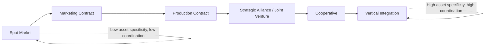
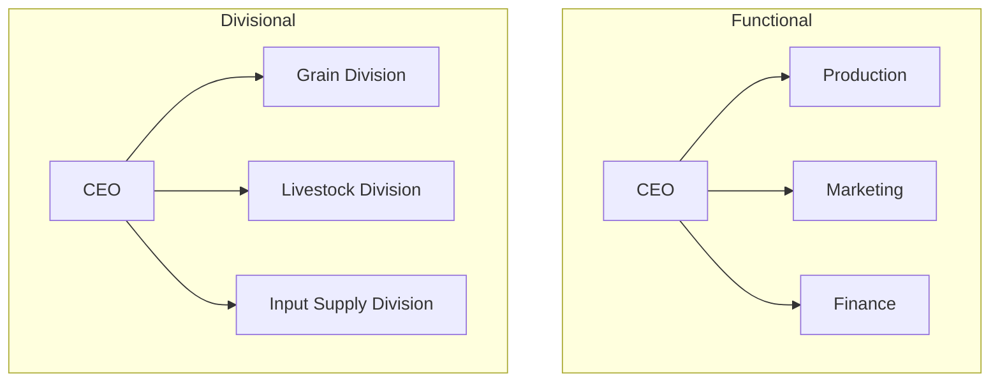

## Agribusiness Organizational Structures

### Definition and Scope

Agribusiness organizational structure refers to the way an agricultural enterprise arranges authority, decision-making rights, division of labor, coordination mechanisms, and ownership claims across its value chain activities — from input supply and production through processing, marketing, and distribution. Structural choice affects transaction costs, incentive alignment, risk-bearing capacity, access to capital, and adaptability to market and biological uncertainty, all of which are central concerns in agribusiness management.

The structural decision is shaped by economic theory on the firm, particularly **transaction cost economics (TCE)** and **agency theory**, both of which explain why agribusinesses choose among spot markets, contracts, vertical integration, and cooperative or hybrid forms.

### Theoretical Foundations

#### Transaction Cost Economics (Coase, Williamson)

A firm exists to internalize transactions that would otherwise be too costly to conduct through the market, due to:

- **Asset specificity**: investments (e.g., specialized processing equipment for a single crop, or site-specific dairy infrastructure) that lose value outside a particular relationship.
- **Uncertainty**: production risk (weather, pests, disease) and market risk (price volatility) increase the cost of writing complete contracts.
- **Frequency**: recurring transactions justify investment in more formal governance structures.

Williamson's framework predicts that as asset specificity and uncertainty rise, firms shift governance from spot markets toward contracts and eventually vertical integration, since the cost of contractual renegotiation and holdup risk exceeds the cost of internal coordination.

$$TC = f(AS, U, F)$$

where $TC$ is transaction cost, $AS$ is asset specificity, $U$ is uncertainty, and $F$ is frequency — all positively related to the likelihood of choosing hierarchical (integrated) governance over market governance.

#### Agency Theory

Agribusiness structures also address the **principal-agent problem**, where owners (principals) must design incentive and monitoring mechanisms to align the behavior of managers, contract growers, or cooperative members (agents) with organizational goals, given information asymmetry.

$$U_P = f(\pi - w(e)) \quad \text{subject to} \quad U_A(e) \geq \bar{U}$$

where $U_P$ is principal utility (residual profit after compensating the agent), $w(e)$ is agent compensation as a function of effort $e$, and the agent's utility must meet a reservation level $\bar{U}$ (participation constraint). This underlies contract design in areas like sharecropping, contract farming, and managerial compensation in agribusiness firms.

### The Governance Spectrum

Agribusiness organizational forms exist along a continuum from pure spot markets to full vertical integration.

#### Spot Markets

Transactions occur at prevailing prices with no ongoing relationship obligation (e.g., grain sold at a local elevator). Low transaction cost when products are homogeneous and quality is easily verified; low coordination and low investment security.

#### Contracts

- **Marketing contracts**: specify price and delivery terms in advance, but production decisions remain with the grower (price risk transferred, production risk retained by grower).
- **Production contracts**: the contractor (processor/integrator) specifies input use, production practices, and often supplies inputs, while the grower supplies land, labor, and facilities in exchange for a fee — common in poultry and hog production. Most production risk shifts to the integrator; grower retains limited discretion.

#### Vertical Integration

The firm owns and directly controls multiple stages of the value chain (e.g., a poultry firm owning hatcheries, feed mills, growing operations, and processing plants).

- **Forward integration**: moving toward the consumer (producer acquiring processing/distribution).
- **Backward integration**: moving toward inputs (processor acquiring farms or input suppliers).

**Key Points**

- Vertical integration reduces transaction costs from holdup and asset specificity but increases fixed costs, organizational complexity, and exposure to production risk across the entire chain.
- Contracting is often a hybrid solution, capturing some coordination benefits of integration without full ownership costs.

#### Cooperatives

A distinct organizational form owned and controlled by member-patrons who are simultaneously the firm's suppliers or customers, governed by principles of user-ownership, user-control, and user-benefit ("the three pillars of cooperation").

### Legal and Ownership Structures

#### Sole Proprietorship

Single owner, unlimited personal liability, minimal regulatory burden, full managerial control. Common for small family farms.

#### Partnership

Two or more owners sharing capital, management, profits, and liabilities.

- **General partnership**: all partners share unlimited liability.
- **Limited partnership (LP)**: general partner(s) manage and bear unlimited liability; limited partners contribute capital with liability capped at investment, but no management role.

#### Corporation

A distinct legal entity separate from its owners (shareholders), providing limited liability.

- **C-Corporation**: subject to corporate income tax; profits distributed as dividends face a second layer of taxation at the shareholder level (double taxation).
- **S-Corporation**: pass-through taxation (income taxed once at shareholder level), subject to restrictions on number and type of shareholders — common structure for mid-sized family agribusinesses seeking liability protection without double taxation.

#### Limited Liability Company (LLC)

Hybrid structure combining the liability protection of a corporation with the pass-through taxation and management flexibility of a partnership. Increasingly common for multi-generational family farm transitions, since ownership shares (membership units) can be divided and transferred among family members while operational control is retained by a managing member.

#### Cooperative (Legal Form)

Structured under separate cooperative statutes (e.g., in the U.S., Capper-Volstead Act protections for agricultural marketing cooperatives). Key legal/financial features:

- **Patronage refunds**: net margins returned to members in proportion to the volume of business each member conducted with the cooperative, rather than in proportion to capital invested.
- **Limited return on equity capital**: cooperative principles typically cap dividends on invested capital to preserve the patronage-based benefit distribution.
- **One-member-one-vote** (traditional) or proportional voting based on patronage (in some modern structures), contrasting with capital-based voting in investor-owned firms.

**Cooperative types**:

- **Marketing cooperatives**: pool and market members' output (e.g., dairy, grain cooperatives).
- **Supply/purchasing cooperatives**: procure inputs (seed, fertilizer, equipment) in bulk for members.
- **Service cooperatives**: provide services such as credit (e.g., Farm Credit System institutions) or utilities (rural electric cooperatives).
- **New Generation Cooperatives (NGCs)**: members purchase tradable delivery rights tied to capital investment, aligning member capital contribution more closely with usage rights than traditional cooperatives — developed partly to address underinvestment problems (see below).

### Internal Organizational Structures (Managerial Design)

Beyond ownership form, agribusinesses choose internal structures for coordinating managerial activity.

#### Functional Structure

Organized by business function (production, marketing, finance, HR, logistics). Efficient for firms with a narrow product line; can create coordination bottlenecks as diversification increases.

#### Divisional Structure

Organized around product lines, geographic regions, or customer segments, each division operating with semi-autonomous management (e.g., a diversified agribusiness with separate grain, livestock, and input-supply divisions). Improves accountability and market responsiveness at the cost of duplicated functions across divisions.

#### Matrix Structure

Combines functional and divisional/project-based reporting lines (e.g., a product manager and a functional manager both have authority over an employee). Useful for firms managing multiple crops/products requiring cross-functional coordination (R&D, regulatory, marketing) but increases the potential for authority conflict.

#### Network/Hybrid Structure

Coordination through contracts and strategic alliances across formally independent firms, common in modern global agri-food supply chains (e.g., a branded food company coordinating a network of independent contract growers, co-packers, and distributors without owning them).

### Structural Choice Along the Value Chain

**Example**

Consider a poultry agribusiness deciding how to organize broiler production.

- **Spot market**: buy live birds from independent growers at market price. High price risk for both parties; low coordination for quality/consistency — rarely used in modern poultry due to high asset specificity of growing facilities.
- **Production contract**: the integrator supplies chicks, feed, and veterinary services; the grower supplies housing, land, and labor; payment is based on a performance-tournament formula comparing the grower's feed conversion ratio to other growers in a settlement group. This is the dominant U.S. broiler industry structure, reflecting high asset specificity (grower housing has few alternative uses) combined with the integrator's need for uniform quality and volume.
- **Full vertical integration**: the firm owns growing facilities directly, eliminating contract negotiation costs entirely but bearing full production risk and requiring large fixed capital investment.

[Inference] The dominance of production contracting over full integration in poultry reflects a balance where the integrator captures most coordination and quality-control benefits of integration while shifting land/building capital requirements and some production risk to growers — though the appropriateness of this risk allocation is a recurring subject of policy and legal debate (e.g., U.S. GIPSA/Packers and Stockyards Act rulemaking).

### Cooperative-Specific Governance Issues

Cooperatives face several structural challenges distinct from investor-owned firms, often analyzed through the "vaguely defined property rights" literature (Cook, 1995):

- **Free-rider problem**: benefits of cooperative investment accrue to all members regardless of individual contribution, weakening incentives for members to support new capital investment.
- **Horizon problem**: members' claims on retained earnings are tied to their period of membership/patronage rather than being freely tradable, discouraging investment in long-payback projects since members may not remain to capture returns.
- **Portfolio problem**: members cannot diversify or adjust their equity stake independent of their patronage relationship, unlike shareholders in a public firm.
- **Control problem**: dispersed member ownership and one-member-one-vote governance can create management oversight and monitoring challenges similar to free-rider problems in public firm governance.

These structural issues motivated hybrid innovations such as **New Generation Cooperatives** (tradable delivery rights) and cooperative conversions to LLC or hybrid stock-cooperative structures in some sectors.

### Comparative Summary

| Structure | Control | Liability | Capital Access | Coordination Strength | Flexibility |
| --- | --- | --- | --- | --- | --- |
| Sole Proprietorship | Full owner control | Unlimited | Limited (owner capital/debt) | Low | High |
| Partnership | Shared among partners | Unlimited (general) | Moderate | Low–Moderate | Moderate |
| Corporation (C-Corp) | Board/shareholders | Limited | High (public capital markets) | High (formal hierarchy) | Moderate |
| LLC | Managing member(s) | Limited | Moderate–High | Moderate–High | High |
| Cooperative | Member-patrons (1 member 1 vote typical) | Limited | Constrained (patron capital, limited equity return) | Moderate | Low–Moderate |
| Contract Farming (hybrid) | Split (grower operations, integrator specs) | Grower retains liability for own operation | Moderate | High | Moderate |
| Vertical Integration | Single firm hierarchy | Limited (if corporate) | High | Highest | Low (high fixed investment) |

### Factors Driving Structural Choice

- **Asset specificity of required investment** (specialized facilities favor contracts/integration over spot markets).
- **Production and price risk** and each party's relative risk-bearing capacity.
- **Economies of scale and scope** across processing and distribution stages.
- **Regulatory environment** (e.g., cooperative tax treatment, anti-trust/fair-practices statutes governing contract terms).
- **Capital intensity and access to external financing.**
- **Need for quality control and traceability**, increasingly important with food safety regulation and branded product differentiation, which pushes toward tighter contractual or integrated coordination.
- **Succession and intergenerational transfer needs** in family-owned operations, often favoring LLC structures for flexible equity transfer.

### Related Topics

- Contract farming design and risk allocation (production vs. marketing contracts)
- Cooperative principles, governance, and New Generation Cooperative models
- Vertical coordination and supply chain integration in agri-food systems
- Agency theory applications in farm management contracts
- Succession planning and business transfer structures for family farms
- Agribusiness mergers, acquisitions, and strategic alliances
- Risk management and contract theory in agricultural value chains
- Farm Credit System and cooperative financial institutions