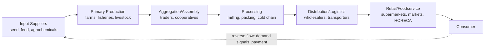
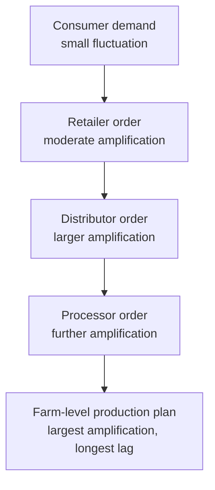
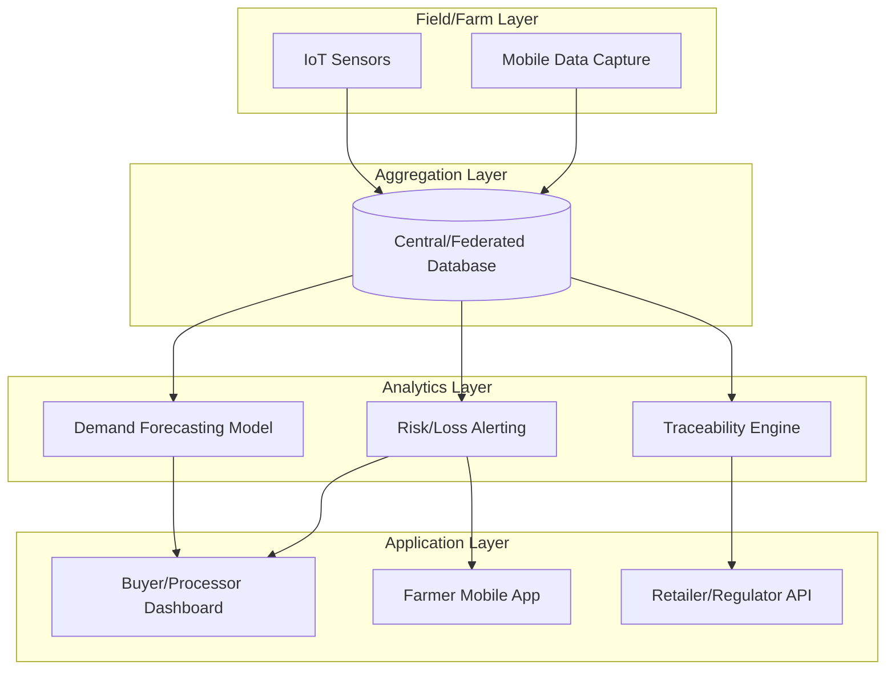

## Supply Chain Management in Food Systems

### Overview

Supply chain management (SCM) in food systems refers to the coordinated planning, control, and optimization of all activities involved in moving agricultural products from primary production through to final consumption. This encompasses production planning, procurement, processing, storage, distribution, retailing, and the reverse flows of information, finance, and product that connect these stages. Food supply chains (FSCs) are distinguished from generic industrial supply chains by the perishability of inputs and outputs, biological production lags, quality and safety regulatory requirements, and high sensitivity to weather and seasonality.

In agribusiness management, SCM is treated as a strategic function rather than a purely logistical one: decisions about chain structure, contracting, and coordination directly affect farm income, food loss, consumer prices, and food security outcomes.

### Core Structure of Food Supply Chains

**Key Points**

- A food supply chain typically has five generic stages: input supply, production (farm level), processing/handling, distribution/logistics, and retail/consumption.
- Each stage transforms the product physically (raw to processed), temporally (harvest to consumption), or spatially (farm to market).
- Value is added at each node, but so is risk of loss, quality degradation, and cost accumulation.

At each node, three flows move in parallel: the **physical flow** of product, the **information flow** (orders, forecasts, quality specs), and the **financial flow** (payments, credit terms). A recurring theme in food SCM is that these three flows often move at different speeds and through different intermediaries, which is a major source of coordination failure — for example, payment terms lagging physical delivery by 30–90 days while product itself is highly perishable.

### Distinctive Characteristics of Food Supply Chains

Food supply chains differ from manufactured-goods supply chains in several structural ways that shape how they must be managed:

- **Perishability**: Products have a finite shelf life, ranging from hours (fresh fish, milk) to months (grains, tubers). This compresses decision windows and increases the cost of delay.
- **Production seasonality and biological lag**: Supply is tied to growing seasons and biological cycles (gestation periods, crop cycles), so production cannot be instantly scaled to meet demand shifts the way manufacturing can.
- **Quality variability**: Agricultural output varies in size, ripeness, moisture content, and nutrient composition due to natural growing conditions, complicating standardization.
- **Spatial dispersion of production**: Farms are numerous, small, and geographically scattered relative to processing and retail nodes, increasing aggregation and transport coordination costs.
- **Food safety and traceability requirements**: Regulatory regimes (e.g., HACCP, ISO 22000) impose documentation and monitoring obligations across every node.
- **Price and yield volatility**: Weather, pests, and global commodity price swings introduce supply-side risk that is largely uninsurable at the farm level without formal instruments.

### Supply Chain Coordination Mechanisms

Coordination refers to how independent actors in the chain align their production, quality, and delivery decisions. The main mechanisms, in increasing order of vertical integration, are:

1. **Spot markets**: Transactions are one-off, price is set at the point of exchange, and there is no ongoing relationship or contractual obligation. Common for undifferentiated staple commodities.
2. **Contract farming/production contracts**: A buyer (processor, exporter, retailer) agrees in advance with producers on price, quantity, quality specifications, and sometimes input provision (seed, credit, extension advice) in exchange for guaranteed delivery.
3. **Cooperative/collective marketing**: Producers pool output through a farmer cooperative or producer organization to achieve scale, bargaining power, and shared logistics/storage infrastructure.
4. **Strategic alliances/partnerships**: Longer-term relational contracts between firms at adjacent stages (e.g., a processor and a distributor) involving shared investment or information systems, short of ownership integration.
5. **Vertical integration**: A single firm owns and operates multiple stages of the chain (e.g., a poultry integrator owning breeding, feed milling, growing, and processing), internalizing coordination through management control rather than contracts.

**Example**

A dairy cooperative in a mid-sized agribusiness structure might combine mechanisms 3 and 2: it markets members' milk collectively (cooperative marketing) while also holding a supply contract with a national processor that specifies minimum daily volume, butterfat content thresholds, and a price formula indexed to a regional benchmark price.

The choice among these mechanisms is typically analyzed through **transaction cost economics (TCE)**: as asset specificity (e.g., specialized cold storage, dedicated processing equipment), uncertainty, and transaction frequency increase, chains tend to move from spot markets toward contracts and vertical integration, because the cost of negotiating and enforcing each individual transaction becomes too high relative to the cost of internal coordination.

### Key Analytical Frameworks

#### Supply Chain Mapping

Supply chain mapping documents the physical flow of product, the actors at each node, the volumes handled, and the value added or captured at each stage. It is the foundational diagnostic tool in agribusiness SCM analysis, typically preceding any intervention design.

#### Value Chain Analysis vs. Supply Chain Analysis

These terms are often used interchangeably but have a technical distinction:

| Dimension | Supply Chain Analysis | Value Chain Analysis |
| --- | --- | --- |
| Primary focus | Physical/logistical flow of goods | Distribution of value added and margins |
| Core question | How does product move efficiently? | Who captures how much value, and why? |
| Typical metrics | Lead time, loss rate, transport cost | Farm-gate share of final price, margin by node |
| Governance lens | Contracts, logistics coordination | Power asymmetry, price transmission |

Value chain analysis, drawing on the work of agricultural economists such as Kaplinsky and Morris, is used to compute the **farmer's share of the consumer price** — a widely cited indicator of chain equity, calculated as:

$$\text{Farmer's Share} = \frac{P_{farmgate}}{P_{retail}} \times 100\%$$

where $P_{farmgate}$ is the price received by the primary producer and $P_{retail}$ is the final consumer price for an equivalent unit of product (adjusted for processing/conversion ratios where the farm product differs physically from the retail product, e.g., live weight vs. carcass weight).

#### The Bullwhip Effect in Food Supply Chains

The **bullwhip effect** describes the amplification of demand variability as orders move upstream through a supply chain: small fluctuations in consumer demand generate progressively larger swings in orders placed by retailers, distributors, processors, and finally primary producers. In food systems, this is compounded by biological production lags — a processor cannot simply "produce more milk" in response to a demand spike the way a factory can run an extra shift, because milk output is bound by herd size and lactation cycles set months earlier.

Causes specific to food SCM include:

- Order batching by intermediaries to meet minimum transport loads (e.g., full truckloads).
- Price fluctuations and promotional buying that cause retailers to over-order during discounts.
- Rationing and shortage gaming, where buyers over-order during perceived scarcity, anticipating supply rationing.
- Poor demand signal transmission, since many smallholder-dominated chains lack real-time point-of-sale data feeding back to producers.

### Post-Harvest Loss and the Cold Chain

Post-harvest loss (PHL) is a central concern in food SCM, particularly in perishable commodity chains. PHL refers to the measurable reduction in quantity or quality of food between harvest and consumption. The Food and Agriculture Organization has historically estimated that roughly one-third of food produced for human consumption is lost or wasted globally, though loss rates vary substantially by commodity and region, and figures should be treated as broad estimates rather than precise universal constants **[Unverified — figures vary by source, methodology, and year of estimate]**.

Loss points typically occur at:

- **Harvest**: mechanical damage, harvesting at incorrect maturity.
- **On-farm handling and storage**: inadequate drying, pest infestation, poor storage structures.
- **Transport**: physical damage, temperature abuse, delays.
- **Processing**: trimming/grading losses, equipment inefficiency.
- **Retail and consumer stages**: display spoilage, over-purchasing, and discard.

The **cold chain** is the temperature-controlled logistics infrastructure (refrigerated storage, reefer trucks, cold rooms at retail) required to slow enzymatic and microbial degradation in perishables. A break in the cold chain at any single node — commonly termed a "cold chain gap" — can negate temperature control maintained at all other nodes, since spoilage processes are generally not reversible. Cold chain investment decisions are typically evaluated against the cost of loss avoided, using a simplified relationship:

$$\text{Net Benefit} = (L_0 - L_1) \times V \times Q - C_{cold chain}$$

where $L_0$ is the baseline loss rate without cold chain investment, $L_1$ is the loss rate with investment, $V$ is the value per unit of product, $Q$ is the quantity handled, and $C_{cold chain}$ is the annualized cost of the cold chain infrastructure.

### Risk Management in Food Supply Chains

Food SCM must explicitly manage several categories of risk:

- **Production risk**: weather, pests, disease outbreaks (e.g., avian influenza in poultry chains) affecting yield and quality.
- **Market/price risk**: commodity price volatility affecting both input costs and output revenue.
- **Institutional risk**: changes in trade policy, sanitary and phytosanitary (SPS) regulations, or subsidy regimes.
- **Logistical/operational risk**: transport disruption, infrastructure failure, labor shortages.
- **Food safety/contamination risk**: pathogen or chemical contamination requiring recall, with reputational and legal consequences.

Common mitigation instruments include forward contracts and futures markets (for price risk), crop and livestock insurance (for production risk), diversified sourcing across multiple regions or suppliers (for logistical and production risk), and traceability systems (for food safety risk, enabling targeted rather than blanket recalls).

### Traceability and Information Systems

Traceability is the capacity to track a food product's movement through the chain and to trace it back to its origin. Regulatory frameworks (e.g., EU General Food Law, FSMA in the United States) increasingly mandate "one-step-back, one-step-forward" traceability, meaning each actor must be able to identify their immediate supplier and immediate customer.

Modern food SCM traceability infrastructure has three common technical layers:

1. **Identification layer**: batch/lot numbering, barcodes, RFID tags, or GS1 standards applied at the point of harvest or packing.
2. **Data capture and transmission layer**: scanning/reading infrastructure at each handoff point, transmitting data to a shared or federated database.
3. **Query/reporting layer**: interfaces (often web or mobile) allowing regulators, buyers, or consumers to query the chain-of-custody for a given batch.

**Blockchain-based traceability** has been piloted in several food supply chains (notably by large retailers for produce and seafood) to create an immutable, shared ledger of transactions across chain nodes, intended to reduce reliance on a single centralized database controlled by one actor. As of current literature, blockchain traceability pilots demonstrate feasibility for high-value or high-risk product lines, but widespread commercial adoption across bulk/commodity food chains remains limited, constrained by the cost of digitizing smallholder-dominated first-mile data capture **[Inference — based on general adoption patterns reported in agrifood technology literature; specific current-state figures should be verified against recent sources]**.

### Digital and Emerging Technologies in Food SCM

Several technology categories are reshaping food SCM operations. Because tool-specific capabilities evolve quickly, the general architecture and design patterns are given here; specific vendor claims should be verified directly.

- **Farm management information systems (FMIS)**: Software platforms integrating field-level data (planting dates, input application, yield) with supply chain planning, feeding production forecasts upstream to buyers.
- **IoT sensor networks**: Temperature, humidity, and location sensors embedded in cold chain logistics (reefer containers, storage facilities) transmitting real-time condition data, enabling exception-based monitoring rather than periodic manual checks.
- **Predictive demand forecasting**: Machine learning models trained on historical sales, weather, and promotional calendar data to reduce the bullwhip effect by improving the accuracy of upstream order signals.
- **Digital marketplaces/B2B platforms**: Platforms connecting smallholder producers directly with aggregators, processors, or retailers, intended to shorten the chain and reduce the number of intermediary margins captured between farm and final buyer.
- **Blockchain/distributed ledger traceability**: As discussed above, primarily deployed for high-value or high-risk/recall-prone product categories.

A general architecture pattern for a modern digital food SCM platform:

### Sustainability and Food Loss/Waste Reduction

Sustainable food SCM incorporates environmental and social objectives alongside economic efficiency, commonly organized around three areas:

- **Food loss and waste (FLW) reduction**: Distinguished technically as "food loss" (occurring at production, post-harvest, and processing stages, generally supply-side driven) versus "food waste" (occurring at retail and consumer stages, generally behavior-driven). This distinction matters because the appropriate intervention differs — loss reduction typically requires infrastructure investment (storage, cold chain), while waste reduction typically requires demand-side behavioral or policy interventions (portion sizing, date labeling reform).
- **Carbon footprint and food miles**: The distance and mode of transport used to move food from production to consumption, used as one (contested) proxy for the environmental impact of a supply chain, though it does not account for production-stage emissions, which for some commodities (e.g., ruminant livestock) dominate total lifecycle emissions.
- **Circular economy integration**: Redirecting supply chain byproducts and waste streams (e.g., processing residues, unsold but edible surplus) into secondary markets such as animal feed, biogas, or food banks/redistribution networks.

### Governance and Policy Considerations

Governments and international bodies intervene in food supply chains through several policy instruments relevant to agribusiness management:

- **Sanitary and Phytosanitary (SPS) measures**: Standards governing food safety and biosecurity, particularly consequential for export supply chains.
- **Market infrastructure investment**: Public investment in rural roads, wholesale markets, and storage facilities to reduce transaction costs and post-harvest loss.
- **Price stabilization mechanisms**: Buffer stocks, minimum support prices, or marketing boards intended to reduce farm-gate price volatility, with debated efficiency trade-offs.
- **Competition policy**: Regulation of buyer concentration (e.g., in retail or processing) to prevent monopsony power from suppressing farm-gate prices.

### Performance Metrics in Food Supply Chain Management

| Metric | Definition | Relevance |
| --- | --- | --- |
| Order fill rate | Percentage of orders fulfilled completely and on time | Measures reliability of downstream delivery |
| Post-harvest loss rate | Percentage of harvested volume lost before reaching the consumer | Core efficiency and sustainability indicator |
| Lead time | Time elapsed from order placement to delivery | Critical for perishables; shorter is generally better |
| Farmer's share of final price | Farm-gate price as a percentage of retail price | Equity/value-distribution indicator |
| Cold chain compliance rate | Percentage of shipment time within specified temperature range | Quality assurance indicator for perishables |
| Traceability coverage | Percentage of volume traceable to origin within required time | Regulatory and food safety indicator |

**Conclusion**

Supply chain management in food systems sits at the intersection of logistics, contract economics, and food safety governance, distinguished from generic industrial SCM primarily by perishability, biological production lags, and the layered public-health stakes of failure. Effective agribusiness management of food supply chains requires selecting coordination mechanisms (spot markets through vertical integration) appropriate to the asset specificity and risk profile of the commodity, investing in loss-reduction infrastructure such as cold chains where the economics justify it, and increasingly, deploying digital traceability and forecasting tools to dampen demand-signal distortion such as the bullwhip effect.

**Related Topics**

- Contract farming design and enforcement mechanisms
- Agricultural commodity price risk management (futures, hedging, insurance)
- Cold chain logistics engineering and refrigeration economics
- Farmer cooperative governance and collective bargaining
- Food loss and waste measurement methodologies (e.g., FAO Food Loss Index)
- Blockchain and IoT applications in agrifood traceability
- Monopsony power and buyer concentration in agricultural markets
- Rural infrastructure investment and market access economics
- Sanitary and phytosanitary (SPS) trade regulation
- Circular economy models for agri-food byproducts