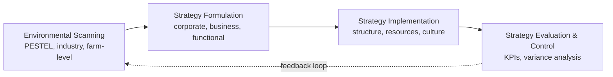
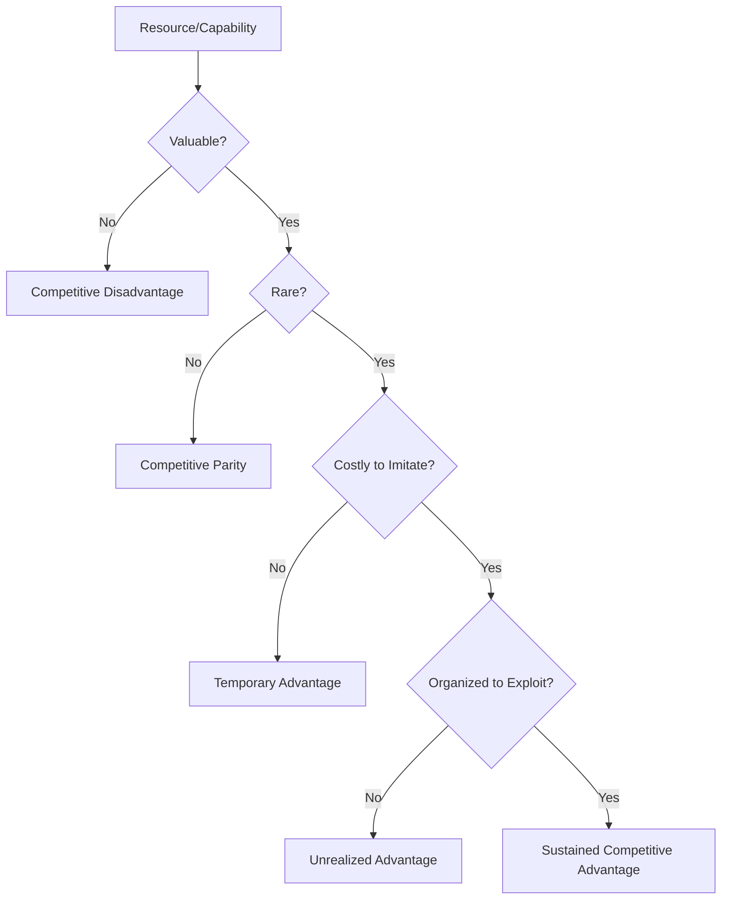

## Strategic Management for Agribusiness Firms

### Overview

Strategic management for agribusiness firms is the process of formulating, implementing, and evaluating cross-functional decisions that enable an agricultural enterprise to achieve sustainable competitive advantage within the constraints specific to food and fiber production. While the analytical toolkit draws heavily from general strategic management theory (Porter's frameworks, the resource-based view, strategic planning cycles), its application to agribusiness is shaped by biological production cycles, commodity price volatility, perishability, policy dependence, and the coexistence of smallholder producers and large vertically integrated firms within the same industry.

Strategic management operates at three organizational levels: **corporate strategy** (which businesses/markets to compete in), **business strategy** (how to compete within a given market), and **functional strategy** (how individual departments — procurement, operations, marketing — support the chosen strategy). Agribusiness firms must apply all three levels while accounting for factors outside typical managerial control, such as weather and international commodity prices.

### The Strategic Management Process

The canonical strategic management cycle applies to agribusiness with domain-specific inputs at each stage:

1. **Environmental scanning**: Assessing external forces (policy, climate, commodity markets, consumer trends) and internal capabilities (land, capital, labor, technology, brand).
2. **Strategy formulation**: Setting mission, objectives, and selecting strategic options at corporate, business, and functional levels.
3. **Strategy implementation**: Allocating resources, restructuring operations, and aligning organizational culture and incentives to the chosen strategy.
4. **Strategy evaluation and control**: Monitoring performance against targets and adjusting for deviations, which in agribusiness must account for exogenous shocks (weather, disease, price swings) separately from managerial execution failures.

### External Environmental Analysis

#### PESTEL Analysis Applied to Agribusiness

The PESTEL framework (Political, Economic, Social, Technological, Environmental, Legal) requires specific adaptation for the agricultural sector:

| Factor | Agribusiness-Specific Considerations |
| --- | --- |
| Political | Agricultural subsidies, trade agreements, tariffs, land reform policy |
| Economic | Commodity price cycles, exchange rate exposure (for exporters/importers), input cost inflation (fuel, fertilizer) |
| Social | Shifting consumer preferences (organic, plant-based, local sourcing), rural labor availability and demographics |
| Technological | Precision agriculture, biotechnology, farm mechanization, digital traceability |
| Environmental | Climate change effects on yield, water scarcity, soil degradation, carbon regulation |
| Legal | Food safety regulation (SPS measures), land tenure law, labor law, environmental compliance |

The **Environmental** factor carries disproportionate weight in agribusiness relative to most other industries, since climate variability directly constrains production volume and quality in ways largely outside firm control, distinguishing agribusiness risk exposure from most manufacturing or service sectors.

#### Porter's Five Forces in Agribusiness

Porter's Five Forces framework requires reinterpretation to reflect structural features common in agricultural industries:

- **Threat of new entrants**: Generally low at the primary production level in developed markets due to high land costs and capital requirements, but low at the trading/aggregation level, where capital barriers are minimal. Entry barriers vary sharply by chain segment.
- **Bargaining power of suppliers**: Input suppliers (seed, fertilizer, agrochemical companies) are frequently oligopolistic multinational firms, giving them substantial pricing power over farm-level producers.
- **Bargaining power of buyers**: Downstream buyers (large processors, supermarket chains) are typically far more concentrated than the numerous, dispersed primary producers who sell to them, creating a structural **monopsony-like** power imbalance at the farm-gate.
- **Threat of substitutes**: High and rising for many commodity categories — plant-based protein substituting for meat, synthetic alternatives substituting for natural fibers, and generic commodity substitution within categories (e.g., different oilseed sources for vegetable oil).
- **Industry rivalry**: Variable by segment; commodity segments compete primarily on price and cost efficiency, while branded/differentiated segments (specialty foods, organic, geographic indications) compete on quality, certification, and brand identity.

**Key Points**

- The characteristic asymmetry in agribusiness Five Forces analysis is the imbalance between fragmented, numerous primary producers and concentrated input suppliers and output buyers — a structural condition sometimes termed the "squeeze" on farm margins.
- This asymmetry is a primary driver of the coordination mechanisms discussed under supply chain management (contract farming, cooperatives, vertical integration) as farms seek to counterbalance concentrated buyer/supplier power.

### Internal Analysis: Resource-Based View (RBV)

The resource-based view holds that sustainable competitive advantage derives from resources and capabilities that are **Valuable, Rare, Inimitable, and Non-substitutable (VRIN)**. Applied to agribusiness, relevant strategic resources include:

- **Land and water rights**: Physically fixed, often difficult to replicate, and increasingly scarce in water-stressed regions — a classic inimitable resource in agricultural strategy.
- **Proprietary genetics/germplasm**: Patented seed varieties or breeding stock represent legally protected, hard-to-imitate resources for firms with breeding programs.
- **Brand equity and certification**: Geographic indications (e.g., protected designation of origin), organic certification, or fair-trade status create differentiation resistant to imitation by uncertified competitors.
- **Supply chain relationships and contracts**: Long-term exclusive contracts with growers or buyers function as relational assets not easily replicated by new entrants.
- **Data and precision agriculture capability**: Proprietary yield, soil, and weather datasets accumulated over time create an increasingly durable informational advantage as data volume compounds.

### Generic Competitive Strategies in Agribusiness

Porter's generic strategy framework maps onto three dominant strategic postures observed in agribusiness firms:

1. **Cost leadership**: Competing on production efficiency and scale economics, typical of commodity grain, oilseed, and bulk livestock production, where products are largely undifferentiated and price is the primary competitive lever. Achieved through mechanization, economies of scale in land and capital, and input cost minimization.
2. **Differentiation**: Competing on attributes beyond price — organic certification, animal welfare standards, geographic origin, non-GMO status, or specialty processing (single-origin coffee, artisanal cheese). Requires investment in certification, marketing, and traceability to substantiate claims to end consumers.
3. **Focus strategy**: Targeting a narrow market segment with either a cost or differentiation approach — for example, a firm specializing exclusively in a niche export crop for a defined international buyer segment.

**Example**

A mid-sized rice milling company can pursue cost leadership by consolidating milling capacity to capture scale economies and competing on price in the bulk commodity market, or it can pursue differentiation by branding a specific rice variety (e.g., a heritage or aromatic variety) with quality certification and premium retail packaging, accepting lower volume in exchange for higher per-unit margin. Attempting both simultaneously without clear segmentation risks the strategic pitfall known as being "**stuck in the middle**" — failing to achieve either the lowest cost structure or a credible differentiated position.

### Corporate-Level Strategic Options

#### Vertical Integration

Agribusiness firms frequently pursue vertical integration to internalize coordination across supply chain stages (see supply chain management), reducing transaction costs and quality control risk. This can be:

- **Backward integration**: A processor acquiring or contracting primary production capacity (e.g., a poultry processor owning breeding and grow-out operations).
- **Forward integration**: A producer moving into processing or retail (e.g., a dairy farm establishing its own branded processing and direct-to-consumer distribution).

#### Diversification

- **Related diversification**: Expanding into adjacent agricultural product lines or value-added processing that leverages existing capabilities (e.g., a grain producer entering animal feed milling).
- **Unrelated diversification**: Expanding into non-agricultural business lines to reduce exposure to commodity price and weather risk, common among large diversified agribusiness conglomerates.

#### Strategic Alliances and Joint Ventures

Given high capital intensity and geographically fixed production, agribusiness firms frequently form joint ventures for market entry into new geographies (particularly relevant for export-oriented firms navigating unfamiliar regulatory environments) or technology-sharing alliances (e.g., partnerships between traditional agribusiness firms and agtech startups for precision agriculture deployment).

### Risk Management as a Core Strategic Function

Unlike many industries where risk management is a secondary support function, in agribusiness it is frequently elevated to a core strategic pillar due to the sector's exposure to exogenous shocks. Key strategic risk categories:

- **Production/yield risk**: Weather, pests, disease — mitigated strategically through geographic diversification of production sites, crop/enterprise diversification, and insurance instruments.
- **Price risk**: Commodity price volatility — mitigated through forward contracts, futures and options hedging, and vertical integration to capture margin across multiple chain stages rather than relying on a single price point.
- **Policy/regulatory risk**: Subsidy changes, trade policy shifts, environmental regulation — mitigated through geographic and market diversification, and active engagement in policy/trade association representation.
- **Reputational/food safety risk**: Contamination events or ethical sourcing controversies — mitigated through traceability investment and quality management systems.

$$\text{Strategic Risk Exposure} = \sum_{i=1}^{n} (P_i \times I_i)$$

where $P_i$ is the probability of risk event $i$ and $I_i$ is the financial impact of that event, summed across the firm's risk portfolio — a simplified expected-value framing used in strategic risk prioritization exercises, though real-world agribusiness risk assessment typically incorporates correlation between risk factors (e.g., drought simultaneously affecting yield and increasing feed costs) rather than treating them as fully independent.

### Strategic Response to Commodity Price Volatility

Agribusiness firms operating in commodity segments face a structural strategic tension: prices are largely set by global supply-demand dynamics outside any single firm's control (**price-taker** behavior), meaning strategic differentiation cannot occur through pricing power in the traditional sense. Strategic responses to this condition include:

- **Cost structure optimization**: Since price cannot be strategically controlled, controlling the cost side of the margin becomes the primary lever for profitability in commodity segments.
- **Operational flexibility**: Building capacity to shift production mix toward whichever commodity offers the most favorable price environment in a given season (crop switching flexibility).
- **Financial hedging**: Using futures, options, and forward contracts to lock in price certainty for a portion of expected output, decoupling firm profitability from short-term price volatility.
- **Value-chain migration**: Moving from pure commodity production toward processing or branded segments of the chain, where price-taking behavior is reduced and margin capture is less exposed to raw commodity price swings.

### Sustainability and ESG as Strategic Considerations

Environmental, Social, and Governance (ESG) factors have moved from peripheral compliance concerns to central strategic considerations for agribusiness firms, driven by:

- **Regulatory pressure**: Carbon accounting and land-use regulation in major export markets (e.g., EU deforestation-related import regulations affecting commodities such as soy, palm oil, and cocoa).
- **Buyer requirements**: Large retail and food service buyers increasingly impose sustainability certification requirements on suppliers as a condition of market access, effectively making certain ESG standards a **strategic necessity** rather than a purely voluntary differentiation choice in export-oriented segments.
- **Access to capital**: Institutional investors and development finance institutions increasingly apply ESG screening criteria to agribusiness lending and investment decisions.

Strategic ESG integration in agribusiness typically spans:

- Carbon footprint measurement and reduction (particularly relevant for livestock and land-use-intensive operations).
- Water stewardship in water-scarce production regions.
- Labor standards and smallholder inclusion in supply chains sourcing from developing-country producers.
- Governance transparency in land acquisition and tenure arrangements.

### Strategic Planning Tools Specific to Agribusiness

#### SWOT Analysis with Agribusiness-Specific Inputs

| Category | Typical Agribusiness Examples |
| --- | --- |
| Strengths | Proprietary genetics, established buyer relationships, owned land/water rights, brand certification |
| Weaknesses | High fixed asset intensity, thin margins in commodity segments, seasonal cash flow gaps |
| Opportunities | Emerging export markets, rising demand for certified/sustainable products, precision agriculture adoption |
| Threats | Climate variability, input cost inflation, trade policy shifts, disease outbreaks, substitute products |

#### Balanced Scorecard Adaptation

The Balanced Scorecard's four standard perspectives (Financial, Customer, Internal Process, Learning & Growth) are commonly extended in agribusiness strategic management with a fifth dimension addressing biological/environmental performance:

- **Financial**: Return on assets, margin per unit, debt-to-equity ratio (relevant given high capital intensity of land and equipment).
- **Customer/Market**: Market share by segment, buyer retention, certification compliance rate.
- **Internal Process**: Yield per hectare, post-harvest loss rate, processing efficiency.
- **Learning & Growth**: Adoption rate of new technology/practices, workforce/farmer training coverage.
- **Environmental/Biological Performance** (agribusiness-specific extension): Soil health indicators, water use efficiency, greenhouse gas emissions intensity per unit of output.

### Organizational Structure Considerations

Strategy implementation in agribusiness firms must reconcile centralized decision-making (for capital allocation, procurement, and branding) with decentralized operational autonomy (for site-specific agronomic decisions responsive to local soil, climate, and pest conditions). Common structural patterns include:

- **Geographic divisional structures**: Common in firms with production spread across multiple climatic zones or countries, since agronomic decision-making is inherently local.
- **Cooperative governance structures**: Farmer-owned cooperatives face a distinct strategic governance challenge — balancing member (farmer-owner) interests, which favor maximizing farm-gate payout, against the cooperative-as-firm's need to retain capital for reinvestment and competitiveness, a tension sometimes termed the cooperative's **"horizon problem."**
- **Hybrid contract-based networks**: Firms coordinating a dispersed network of contracted growers under centralized quality and branding standards, common in poultry and horticultural export sectors.

### Strategy Evaluation and Control

Strategic control in agribusiness must distinguish performance variance attributable to managerial execution from variance attributable to exogenous factors outside management's control (weather, global price movements, disease outbreaks). A commonly applied evaluation approach separates:

- **Controllable variance**: Deviations from strategic targets attributable to operational decisions (input use efficiency, labor productivity, marketing execution).
- **Uncontrollable/exogenous variance**: Deviations attributable to weather, commodity price shifts, or policy changes, which should be evaluated against how effectively the firm's risk management strategy (hedging, insurance, diversification) buffered the impact, rather than treated as straightforward management failure.

This distinction is central to fair performance evaluation in agribusiness strategic control systems, since holding management fully accountable for exogenous shocks can create perverse incentives (e.g., excessive risk aversion or underinvestment) **[Inference — based on general principal-agent and performance evaluation theory applied to agribusiness contexts]**.

### Illustrative Strategy Map (SVG)

<svg xmlns="http://www.w3.org/2000/svg" viewBox="0 0 780 460" font-family="Arial, sans-serif">
<text x="390" y="28" font-size="18" font-weight="bold" text-anchor="middle" fill="#1b3a2b">Agribusiness Strategy Map (svg_diagram)</text>

<rect x="40" y="60" width="700" height="70" rx="8" fill="#eef6ee" stroke="#3f7d4f" stroke-width="1.5" />
<text x="60" y="85" font-size="13" font-weight="bold" fill="#1b3a2b">Corporate Strategy</text>
<text x="60" y="108" font-size="12" fill="#2a2a2a">Vertical integration | Diversification | Geographic expansion | M&amp;A</text>
<rect x="40" y="150" width="700" height="70" rx="8" fill="#eef2f8" stroke="#3f5f7d" stroke-width="1.5" />
<text x="60" y="175" font-size="13" font-weight="bold" fill="#1b2c3a">Business Strategy</text>
<text x="60" y="198" font-size="12" fill="#2a2a2a">Cost leadership | Differentiation (certification, brand) | Focus/niche</text>
<rect x="40" y="240" width="700" height="70" rx="8" fill="#f8f2ee" stroke="#7d5a3f" stroke-width="1.5" />
<text x="60" y="265" font-size="13" font-weight="bold" fill="#3a271b">Functional Strategy</text>
<text x="60" y="288" font-size="12" fill="#2a2a2a">Procurement | Operations/agronomy | Marketing | Risk &amp; hedging | HR</text>
<rect x="40" y="330" width="700" height="90" rx="8" fill="#f4eef8" stroke="#6a3f7d" stroke-width="1.5" />
<text x="60" y="355" font-size="13" font-weight="bold" fill="#2c1b3a">Enabling Foundations</text>
<text x="60" y="378" font-size="12" fill="#2a2a2a">Land/water rights | Proprietary genetics | Data &amp; precision ag | Buyer/grower relationships</text>
<text x="60" y="400" font-size="12" fill="#2a2a2a">Risk management systems | ESG/sustainability compliance</text>

<line x1="390" y1="130" x2="390" y2="150" stroke="#555" stroke-width="2" marker-end="url(#arrow)" />
<line x1="390" y1="220" x2="390" y2="240" stroke="#555" stroke-width="2" marker-end="url(#arrow)" />
<line x1="390" y1="310" x2="390" y2="330" stroke="#555" stroke-width="2" marker-end="url(#arrow)" />
</svg>

**Conclusion**

Strategic management for agribusiness firms applies standard strategic frameworks — PESTEL, Five Forces, RBV, generic strategies, Balanced Scorecard — but requires consistent reinterpretation through the lens of biological production constraints, farm-gate power asymmetry, commodity price-taking behavior, and elevated exogenous risk exposure. The firms that sustain competitive advantage in this sector typically do so not by escaping these structural constraints but by strategically managing them: through vertical coordination to counteract buyer/supplier power imbalances, financial and operational hedging to manage price and yield volatility, and migration toward differentiated or certified market segments where price-taking behavior is reduced.

**Related Topics**

- Transaction cost economics and vertical coordination choice in agribusiness
- Agricultural commodity hedging with futures and options
- Cooperative governance and the horizon problem
- ESG and sustainability certification systems in export agriculture
- Precision agriculture and data-driven competitive advantage
- Agribusiness mergers, acquisitions, and consolidation trends
- Farm-level risk management and crop insurance design
- Branding and geographic indication strategy in specialty agriculture
- Balanced Scorecard adaptation for agricultural enterprises
- Trade policy and its effect on agribusiness corporate strategy