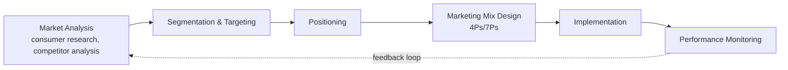

## Marketing Management and Consumer Behavior

### Overview

Marketing management in agribusiness is the process of planning, executing, and controlling the conception, pricing, promotion, and distribution of agricultural and food products to satisfy consumer needs while achieving organizational objectives. Consumer behavior is the complementary analytical discipline studying how individuals and households select, purchase, use, and dispose of food and agricultural products. In agribusiness, these two areas are treated jointly because agricultural marketing decisions — what to produce, how to differentiate it, and how to price and promote it — must be grounded in an accurate understanding of how end consumers actually make food-related decisions.

Agricultural marketing is distinguished from general consumer goods marketing by the biological nature of the product (perishability, quality variability, seasonality), the length and fragmentation of the supply chain between producer and consumer, and the intersection of food purchase decisions with health, cultural identity, and habitual/low-involvement behavior.

### The Marketing Management Process

1. **Market analysis**: Understanding market size, growth, competitive structure, and consumer needs through primary and secondary research.
2. **Segmentation and targeting**: Dividing the heterogeneous consumer market into groups with similar needs, then selecting which segment(s) to serve.
3. **Positioning**: Defining how the product should be perceived relative to competitors in the target consumer's mind.
4. **Marketing mix design**: Translating positioning into specific product, price, place, and promotion decisions.
5. **Implementation and control**: Executing the plan and monitoring performance metrics against objectives, adjusting for market feedback.

### Market Segmentation in Food and Agricultural Markets

Segmentation divides a heterogeneous market into groups sharing similar characteristics or needs, enabling more precise targeting than a mass-market approach. Common segmentation bases applied in agrifood marketing:

- **Demographic segmentation**: Age, household size, income level — e.g., premium organic produce typically targets higher-income households.
- **Geographic segmentation**: Urban vs. rural consumption patterns, regional taste preferences, climate-driven dietary differences.
- **Psychographic segmentation**: Lifestyle and values-based groupings — health-conscious consumers, environmentally motivated consumers, convenience-oriented consumers.
- **Behavioral segmentation**: Purchase occasion (everyday vs. festive/ceremonial consumption), usage rate (heavy vs. light users), and brand loyalty status.
- **Benefit segmentation**: Grouping consumers by the primary benefit sought from a food product — convenience, nutrition, indulgence, or ethical/sustainability credentials.

**Key Points**

- Effective segments must be **measurable** (size and purchasing power can be estimated), **accessible** (reachable through distribution and promotion channels), **substantial** (large enough to be profitably served), and **actionable** (the firm has the capability to design an effective marketing program for that segment).
- Agrifood markets frequently exhibit a **dual-segment structure**: a large price-sensitive commodity segment and a smaller but growing premium/differentiated segment (organic, specialty, certified), requiring firms to choose which segment(s) align with their resource base and strategic positioning.

### Consumer Behavior Fundamentals

#### The Consumer Decision-Making Process

For most everyday food products, this process operates as **low-involvement decision-making**: consumers rely on habit, brand familiarity, and minimal deliberate information search, because the perceived risk and cost of a wrong choice is low relative to durable goods. High-involvement food decisions occur for infrequent, high-cost, or identity-relevant purchases (e.g., selecting a wine for a special occasion, or making a first-time decision to switch to an organic diet).

#### Factors Influencing Food Consumer Behavior

- **Cultural factors**: Religion, tradition, and regional cuisine strongly shape staple food choices and can override price or convenience considerations (e.g., religious dietary restrictions, culturally rooted staple grains).
- **Social factors**: Family roles in food purchasing (who shops, who cooks, who decides), reference group influence, and increasingly, social media influence on food trends.
- **Personal factors**: Age and life-cycle stage, occupation, income, and lifestyle (e.g., time-poor urban professionals favoring convenience/ready-to-eat products).
- **Psychological factors**: Motivation (health, indulgence, status), perception (of quality, safety, or naturalness), learning (habitual repurchase), and beliefs/attitudes toward specific ingredients or production methods.

#### Health Consciousness and the Attitude-Behavior Gap

A well-documented phenomenon in food consumer behavior research is the **attitude-behavior gap** (also termed the intention-behavior gap): consumers frequently report positive attitudes toward healthy, sustainable, or ethically produced food in surveys, but this stated preference does not consistently translate into actual purchase behavior at the point of sale, where price, convenience, and habit often dominate the final decision. This gap is a recurring caution in agrifood marketing research when interpreting consumer survey data as a direct predictor of market demand **[Inference — this is a well-documented pattern in the consumer behavior literature, though the magnitude of the gap varies by product category, market, and study methodology]**.

### The Marketing Mix (4Ps) in Agribusiness

#### Product

Product decisions in agribusiness marketing extend beyond the core physical commodity to include:

- **Quality attributes**: Freshness, grading standards, appearance, nutritional content.
- **Branding**: Increasingly important even for traditionally undifferentiated commodities (e.g., branded bananas, branded rice varieties) as a mechanism to escape pure price competition.
- **Packaging**: Functions as both protection (critical for perishables) and communication (labeling, certification marks, portion sizing for changing household sizes).
- **Certification and labeling**: Organic, fair-trade, non-GMO, geographic indication, and animal welfare certifications function as credence attributes (see below) that consumers cannot verify through inspection or taste alone.

#### Price

Agricultural pricing must account for:

- **Commodity price volatility**: For undifferentiated products, price is often set by broader market/exchange dynamics rather than firm-level strategy (price-taking behavior, as discussed in strategic management).
- **Price elasticity of demand**: Staple foods typically exhibit **inelastic demand** ($|E_d| < 1$), meaning quantity demanded is relatively insensitive to price changes, while discretionary or luxury food items tend to exhibit more elastic demand.

$$E_d = \frac{\%\Delta Q_d}{\%\Delta P}$$

where $E_d$ is the price elasticity of demand, $\%\Delta Q_d$ is the percentage change in quantity demanded, and $\%\Delta P$ is the percentage change in price.

- **Psychological pricing**: Premium certified products (organic, specialty) are frequently priced at a deliberate premium relative to conventional equivalents, partly to signal quality/exclusivity to consumers using price as a quality cue.

#### Place (Distribution)

Distribution channel decisions in agrifood marketing include:

- **Channel length**: Direct-to-consumer (farmers' markets, community-supported agriculture, farm-gate sales) versus multi-tier channels involving wholesalers, distributors, and retailers.
- **Channel intensity**: Intensive distribution (staple commodities aiming for maximum shelf presence) versus selective/exclusive distribution (premium or specialty products limiting outlets to preserve brand positioning).
- **Cold chain requirements**: Distribution channel choice for perishables is constrained by the cold chain infrastructure available in each channel (see supply chain management).
- **E-commerce and direct-to-consumer digital channels**: Increasingly significant, particularly post-pandemic, for specialty and subscription-based food products (meal kits, farm-box subscriptions).

#### Promotion

- **Advertising**: Mass media for broad commodity categories (generic commodity promotion, often funded through commodity checkoff programs) versus targeted digital advertising for differentiated branded products.
- **Sales promotion**: In-store sampling, price discounts, and loyalty programs, particularly influential given the low-involvement nature of most food purchase decisions.
- **Public relations and certification communication**: Communicating credence attributes (sustainability, ethical sourcing) that cannot be directly observed by the consumer.
- **Digital and social media marketing**: Increasingly central for reaching younger consumer segments and communicating food provenance/storytelling, particularly for specialty and direct-to-consumer brands.

### Extended Marketing Mix (7Ps) for Agrifood Services

Where agribusiness marketing intersects with services (agritourism, farm-to-table dining experiences, subscription box services), the extended services marketing mix adds:

- **People**: Staff and farmer-facing interactions that shape perceived authenticity and trust, particularly relevant in direct-to-consumer and experiential agribusiness models.
- **Process**: The operational flow of service delivery (e.g., subscription box fulfillment reliability, farm tour logistics).
- **Physical evidence**: Tangible cues signaling quality and authenticity — farm shop presentation, packaging aesthetics, certification seals visibly displayed.

### Product Attributes and Information Asymmetry

Food product attributes are commonly classified into three categories based on when/how the consumer can verify them, a framework with direct implications for marketing and labeling strategy:

| Attribute Type | Definition | Agrifood Examples |
| --- | --- | --- |
| Search attributes | Verifiable before purchase, through inspection | Size, color, visible ripeness, packaging |
| Experience attributes | Verifiable only after purchase, through consumption | Taste, tenderness, freshness upon use |
| Credence attributes | Not verifiable even after consumption, requiring trust in third-party claims | Organic status, animal welfare standards, fair-trade sourcing, carbon footprint |

**Credence attributes** are of particular strategic importance in agrifood marketing because the consumer must rely entirely on third-party certification, labeling regulation, or brand trust to believe the claim — creating both an opportunity (premium pricing for verified claims) and a risk (reputational damage from greenwashing accusations or certification fraud, since the consumer has no independent means of verification).

### Branding Strategies in Agribusiness

- **Commodity branding**: Applying a brand identity to a traditionally undifferentiated commodity (e.g., a specific banana or pineapple brand) to escape pure price competition through consistent quality assurance and recognition.
- **Geographic indication (GI) branding**: Linking product identity to a specific geographic origin associated with distinctive quality or reputation (e.g., regionally protected cheese, wine, or coffee designations), creating a legally protected differentiation basis unavailable to producers outside the designated region.
- **Co-branding and ingredient branding**: A processed food brand highlighting a specific, recognized agricultural input (e.g., a specific grain or dairy source) to borrow credibility from that ingredient's reputation.
- **Private label/retailer branding**: Retailers marketing agricultural products under their own store brand, typically at a lower price point than manufacturer/producer brands, competing primarily on value rather than differentiation.

### Consumer Trends Shaping Agrifood Marketing

- **Health and wellness orientation**: Rising demand for functional foods, reduced-sugar/reduced-sodium reformulations, and transparency in ingredient sourcing.
- **Sustainability and ethical sourcing**: Growing (though unevenly translated into purchase behavior, per the attitude-behavior gap) consumer interest in environmental and labor practices behind food products.
- **Convenience orientation**: Sustained demand for ready-to-eat, ready-to-cook, and subscription meal solutions, driven by time-constrained urban lifestyles.
- **Provenance and traceability interest**: Growing consumer interest in knowing the origin of food products, intersecting with the traceability systems discussed under supply chain management.
- **Plant-based and alternative protein adoption**: A structural shift affecting demand patterns across the livestock and protein product categories, with adoption rates and market size estimates varying substantially across sources and regions **[Unverified — figures are highly source- and region-dependent and change rapidly; current data should be verified directly]**.

### Marketing Research Methods in Agribusiness

- **Surveys and consumer panels**: Structured data collection on preferences, purchase intentions, and satisfaction, subject to the attitude-behavior gap limitation noted above.
- **Sensory evaluation/taste panels**: Controlled testing of experience attributes (taste, texture, aroma) important for product development and quality benchmarking.
- **Willingness-to-pay (WTP) studies**: Techniques such as contingent valuation and choice experiments used to estimate the price premium consumers will pay for specific attributes (e.g., organic certification, animal welfare standards).
- **Point-of-sale (POS) and scanner data analysis**: Revealed-preference data from actual purchase transactions, often considered more reliable than stated-preference survey data precisely because it captures actual behavior rather than intention.
- **Market basket analysis**: Identifying purchase co-occurrence patterns to inform product placement, bundling, and cross-promotion strategies.

### Performance Metrics in Agrifood Marketing

| Metric | Definition | Relevance |
| --- | --- | --- |
| Market share | Firm's sales as a percentage of total category sales | Competitive position indicator |
| Brand awareness | Percentage of target consumers who recognize the brand | Top-of-funnel marketing effectiveness |
| Price premium capture | Percentage price premium achieved for certified/differentiated products over conventional equivalents | Differentiation strategy effectiveness |
| Repeat purchase rate | Percentage of consumers making repeat purchases within a defined period | Loyalty and satisfaction indicator |
| Distribution/shelf penetration | Percentage of target retail outlets stocking the product | Channel strategy effectiveness |

**Conclusion**

Marketing management and consumer behavior in agribusiness require reconciling standard marketing frameworks — segmentation, the marketing mix, branding strategy — with food-specific realities: the low-involvement, habitual nature of most everyday food purchases, the credence-attribute problem inherent in sustainability and health claims, and a persistent gap between consumers' stated values and their actual purchasing behavior. Agribusiness firms that succeed in differentiated segments typically do so by investing in verifiable certification and traceability to convert credence claims into trusted, marketable attributes, while firms in commodity segments must compete primarily on price, availability, and consistent quality delivered through efficient distribution.

**Related Topics**

- Willingness-to-pay estimation methods for food attributes
- Geographic indication and protected designation of origin systems
- Direct-to-consumer and e-commerce channels in agrifood marketing
- Commodity checkoff programs and generic promotion campaigns
- Sensory evaluation methodology in food product development
- Attitude-behavior gap research in sustainable food consumption
- Private label strategy and retailer brand competition
- Digital and social media marketing for specialty food brands
- Price elasticity estimation for staple versus discretionary foods
- Credence attribute verification and certification fraud risk