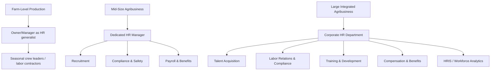

## Human Resource Management in Agribusiness

### Definition and Scope

Human resource management (HRM) in agribusiness is the strategic and operational function of acquiring, developing, motivating, and retaining the workforce needed across the agricultural value chain — from farm production labor through processing, logistics, and corporate management. Agribusiness HRM operates under distinctive constraints relative to general industry HRM: strong seasonality of labor demand, heavy reliance on migrant and temporary labor in many regions, elevated occupational safety risk, geographically dispersed and often rural worksites, and tight interaction with biological production cycles that limit scheduling flexibility.

### Distinctive Features of Agribusiness Labor Markets

#### Seasonality and Labor Demand Volatility

Agricultural labor demand fluctuates sharply with planting, cultivation, and harvest cycles, producing peak demand periods that can require several times the baseline workforce. This creates a fundamental HR planning problem: sizing a stable core workforce versus relying on a flexible, temporary labor pool to meet peak demand without carrying excess labor cost during off-peak periods.

$$L_t = L_{core} + L_{seasonal}(t)$$

where $L_t$ is total labor required at time $t$, $L_{core}$ is the fixed year-round workforce, and $L_{seasonal}(t)$ is the time-varying seasonal labor requirement, typically modeled against the crop or production calendar.

#### Migrant and Guest Worker Programs

Many agribusinesses depend on migrant labor to fill seasonal gaps, governed by country-specific visa and labor programs (e.g., the H-2A temporary agricultural worker program in the United States, the Seasonal Agricultural Worker Programme in the UK, or comparable schemes in Canada and Australia). These programs impose specific compliance obligations:

- Wage floors (often set via an "Adverse Effect Wage Rate" or equivalent mechanism to prevent depression of local wages).
- Housing and transportation provision requirements.
- Recruitment and contract disclosure obligations.
- Restrictions tying worker authorization to a specific employer.

[Unverified] Specific program names, thresholds, and wage-setting mechanisms vary by country and are revised periodically by regulatory agencies, so current program parameters should be verified against the applicable national labor authority before being used for compliance decisions.

#### Occupational Safety Profile

Agricultural work carries elevated risk from heavy machinery, chemical exposure (pesticides, fertilizers), livestock handling, confined spaces (grain bins, silos), heat stress, and repetitive musculoskeletal strain. This drives a heavier compliance and training burden relative to many other industries, typically governed by occupational safety regulators (e.g., OSHA in the U.S., or equivalent national bodies) with agriculture-specific standards.

### Core HRM Functions Applied to Agribusiness

#### Workforce Planning

Forecasting labor needs against the production calendar, combining:

- **Demand forecasting**: projected acreage, livestock units, or processing volume translated into labor-hour requirements.
- **Supply analysis**: availability of local labor, migrant labor program capacity, and mechanization substitution options.
- **Gap analysis and staffing strategy**: determining the mix of permanent staff, seasonal hires, contracted labor, and mechanization investment to close projected gaps.

#### Recruitment and Selection

Recruitment channels in agribusiness commonly include:

- Local and regional labor pools, often supplemented by farm labor contractors (FLCs) or labor agencies specializing in agricultural placement.
- Guest worker program recruitment (subject to the regulatory requirements above).
- Campus and technical/vocational recruitment for management and technical roles (agronomy, food science, supply chain).
- Referral networks, which remain heavily used in rural and seasonal hiring due to trust and speed advantages.

**Key Points**

- Selection criteria for field labor emphasize physical capability, reliability, and willingness to work variable hours; selection for technical/managerial roles emphasizes formal qualifications (agronomy, animal science, food safety, business administration).
- Legal compliance in selection (non-discrimination, work authorization verification) is a critical control point given historical enforcement attention to agricultural labor markets.

#### Compensation and Benefits

Agribusiness compensation structures include:

- **Hourly/daily wage**: standard for most field and processing labor, subject to minimum wage law and, in some programs, prevailing/adverse-effect wage requirements.
- **Piece-rate pay**: compensation tied to units harvested or processed (e.g., pay per bin of fruit picked), which can improve productivity incentives but requires careful design to avoid unsafe work pace and to meet minimum wage guarantees where piece-rate earnings fall short.
- **Salaried compensation**: typical for management, technical, and administrative staff.
- **Performance-based incentives**: bonuses tied to yield, quality grades, safety records, or cost targets, common at supervisory and managerial levels.
- **In-kind benefits**: housing, transportation, and meals are frequently part of total compensation for seasonal and migrant labor, particularly under guest worker program requirements.

$$W_{piece} = \max(r \times Q, W_{min} \times H)$$

where $r$ is the piece rate, $Q$ is units produced, $W_{min}$ is the applicable minimum wage, and $H$ is hours worked — reflecting the common regulatory requirement that piece-rate earnings not fall below the minimum-wage-equivalent floor.

#### Training and Development

- **Safety training**: mandatory for machinery operation, chemical handling (often requiring certified pesticide applicator training), and confined-space entry.
- **Technical/skills training**: equipment operation, livestock handling, food safety protocols (e.g., HACCP, Good Agricultural Practices/GAP certification requirements).
- **Language and cultural orientation**: relevant where a substantial share of the workforce is migrant labor with limited proficiency in the local language.
- **Management development**: succession planning and leadership training, particularly significant in family-owned agribusinesses transitioning across generations.

#### Performance Management

Performance evaluation in agribusiness often blends quantitative production metrics (yield per worker-hour, quality grade rates, safety incident rates) with qualitative supervisory assessment, adapted to the fact that much fieldwork is difficult to directly supervise continuously across dispersed sites.

#### Employee Relations and Labor Law Compliance

- Compliance with wage-and-hour law, including overtime rules (which in some jurisdictions have historically included agricultural exemptions, subject to ongoing legislative change).
- Compliance with child labor restrictions, which in several jurisdictions include agriculture-specific exemptions or age thresholds distinct from other sectors.
- Collective bargaining, where applicable — agricultural labor organizing rights and coverage under general labor relations law vary substantially by jurisdiction, with some countries historically excluding agricultural workers from standard labor relations act coverage.
- Anti-discrimination and workplace harassment policy compliance, extended to cover the housing and transportation contexts common in migrant labor arrangements.

[Inference] Because agricultural labor law frequently diverges from general labor law (via sector-specific exemptions or separate regulatory schemes), agribusiness HR practitioners generally require specialized legal compliance knowledge beyond standard HR training, and specific exemption details should be verified against current statute rather than assumed to be uniform across regions or over time.

### HR Structure Across Agribusiness Firm Types

- **Small/family farms**: HR functions are typically informal, handled directly by the owner-operator or a designated family member, often supplemented by farm labor contractors for seasonal hiring.
- **Mid-size agribusiness**: a dedicated HR manager or small HR team formalizes recruitment, payroll, and compliance, but with limited specialization across HR sub-functions.
- **Large integrated agribusiness/agri-food corporations**: a full corporate HR function with specialized sub-departments, workforce analytics, formal succession planning, and often unionized labor relations at processing facilities.

### Farm Labor Contractors (FLCs) and Third-Party Labor Models

Farm labor contractors are intermediaries who recruit, transport, supervise, and sometimes pay agricultural workers on behalf of growers, allowing growers to outsource the administrative and compliance burden of seasonal labor management. This arrangement raises **joint employer liability** considerations in many jurisdictions — growers may retain legal responsibility for wage, safety, and housing compliance even when a contractor formally employs the workers, depending on the degree of control the grower exercises over working conditions.

**Example**

A vegetable grower needing 200 harvest workers for a six-week window may contract with a licensed FLC rather than directly recruiting, hiring, and managing a temporary payroll. The FLC handles recruitment, transportation, and day-to-day supervision, while the grower typically remains responsible for ensuring the worksite meets safety standards and that wage payments comply with applicable law, since joint employer doctrine in several jurisdictions does not allow growers to fully outsource statutory labor compliance obligations.

### Workforce Analytics and Technology in Agribusiness HR

- **HRIS (Human Resource Information Systems)**: increasingly used to manage multi-site, multi-season workforce data, including certification tracking (e.g., pesticide applicator licenses) and compliance documentation for guest worker programs.
- **Biometric and digital timekeeping**: used to accurately track hours for piece-rate and hourly workers across dispersed field sites, supporting wage-and-hour compliance.
- **Labor forecasting software**: integrates production planning (acreage, planting dates, expected yield) with historical labor productivity data to project staffing needs.
- **Mechanization as a labor substitution strategy**: rising labor costs and labor availability constraints have accelerated investment in mechanical harvesters and precision agriculture technology as a partial substitute for seasonal labor, particularly in labor-intensive specialty crops. [Inference] The pace of this substitution varies substantially by crop, since some specialty crops (e.g., delicate fruit) remain difficult to mechanically harvest without quality loss, making the labor-versus-mechanization tradeoff highly crop-specific.

### Strategic HR Challenges Specific to Agribusiness

- **Labor scarcity**: many regions report persistent shortages of seasonal agricultural labor, driven by demographic shifts, immigration policy changes, and competition from other sectors for low-skill labor.
- **Rural retention**: attracting and retaining skilled managerial and technical talent (agronomists, food scientists, supply chain managers) to rural locations, often requiring above-market compensation or relocation incentives.
- **Succession management**: in family-owned agribusinesses, HR overlaps with estate and succession planning, requiring structured leadership transition processes distinct from typical corporate succession planning.
- **Regulatory complexity across borders**: multinational agribusinesses must manage divergent labor law, safety standards, and guest worker program requirements across the countries in which they operate.
- **Reputational and ESG pressure**: increasing buyer and consumer scrutiny of labor conditions in agricultural supply chains (fair labor certification schemes, ethical sourcing audits) has elevated HR compliance from a purely operational concern to a supply-chain risk management issue.

### Comparative Summary: HR Priorities by Value Chain Stage

| Value Chain Stage | Dominant Labor Type | Key HR Priority | Typical Compensation Model |
| --- | --- | --- | --- |
| Farm production | Seasonal/migrant field labor | Safety training, wage compliance, staffing flexibility | Hourly or piece-rate |
| Post-harvest handling/packing | Seasonal + some permanent | Food safety training, quality consistency incentives | Hourly + performance bonus |
| Processing/manufacturing | Permanent, often unionized | Labor relations, safety (machinery), skills certification | Hourly + benefits, sometimes collective bargaining |
| Distribution/logistics | Permanent, skilled (drivers, logistics staff) | Licensing compliance, retention | Salaried/hourly + benefits |
| Corporate management | Salaried professional/technical staff | Talent development, succession planning | Salary + performance incentives |

### Related Topics

- Farm labor contractor regulation and joint employer liability
- Guest worker program compliance (H-2A and comparable schemes)
- Occupational safety and health management in agricultural operations
- Piece-rate compensation design and wage-and-hour compliance
- Labor economics of agricultural mechanization and technology substitution
- Succession planning in family-owned agribusinesses
- Labor relations and collective bargaining in food processing
- Workforce analytics and HRIS adoption in agribusiness operations