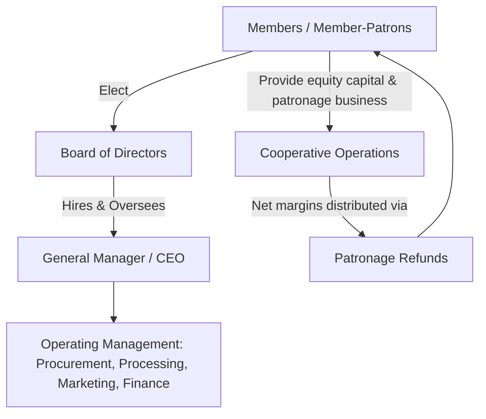

## Cooperative Business Models

### Definition and Foundational Principles

A cooperative is a business entity jointly owned and democratically controlled by the people who use its services — its members — who are simultaneously the firm's owners, patrons (suppliers or customers), and, in many cases, its governing decision-makers. This user-ownership structure distinguishes cooperatives fundamentally from investor-owned firms (IOFs), where ownership and patronage are typically separate.

Cooperative identity is commonly organized around three defining principles, often summarized as the **"user" pillars**:

1. **User-owned**: members provide the cooperative's equity capital.
2. **User-controlled**: members govern the cooperative, traditionally on a one-member-one-vote basis regardless of capital contribution or patronage volume.
3. **User-benefit**: economic benefits (net margins) are distributed to members in proportion to their use of the cooperative (patronage), not their capital investment.

These principles are formalized internationally in the **International Co-operative Alliance (ICA) Statement on the Co-operative Identity**, which lists seven cooperative principles: voluntary and open membership; democratic member control; member economic participation; autonomy and independence; education, training and information; cooperation among cooperatives; and concern for community.

### Economic Rationale for Cooperative Formation

Cooperatives typically emerge to correct market failures affecting agricultural producers, particularly:

- **Market power imbalance**: individual farmers face concentrated buyers (processors) or input suppliers with market power; pooling through a cooperative restores bargaining leverage.
- **Missing markets**: absence of local processing, marketing infrastructure, or credit access in rural areas, which a cooperative can provide collectively when no private firm finds it individually profitable to enter.
- **Risk pooling**: aggregating output across many small producers reduces marketing and price risk relative to individual sale.
- **Economies of scale**: pooling volume enables scale economies in processing, transportation, and marketing unavailable to individual farms.

Economically, a cooperative can be modeled as an extension of the member's farm business — a vertically integrated marketing or purchasing arm collectively owned rather than a separate profit-maximizing entity. This is the basis of the **"cooperative as an extension of the farm"** theoretical view, under which the cooperative's objective is to maximize member net income (farm-gate price for marketing cooperatives, or minimized input cost for supply cooperatives) rather than to maximize its own retained profit.

$$\pi_{member} = (P_{coop} - C) \times Q + Patronage\ Refund$$

where $P_{coop}$ is the price the cooperative pays or receives on the member's behalf, $C$ is the cooperative's operating cost per unit, and $Q$ is the member's volume of business with the cooperative.

### Types of Agricultural Cooperatives

#### Marketing Cooperatives

Pool and market members' agricultural output collectively, capturing scale economies in transportation, processing, grading, and market access. Common in dairy, grain, fruit, and specialty crop sectors. May operate at different stages: assembling and selling raw commodities, or fully processing into branded finished products (e.g., a dairy cooperative that both collects raw milk and manufactures branded cheese or butter).

#### Supply (Purchasing) Cooperatives

Aggregate member demand for inputs — seed, fertilizer, fuel, equipment — to negotiate volume discounts and secure reliable supply, particularly valuable where individual farm purchasing volume is too small to access wholesale pricing.

#### Service Cooperatives

Provide services rather than physical commodity handling:

- **Credit cooperatives**: farm credit associations providing financing tailored to agricultural cash-flow cycles (e.g., the Farm Credit System in the U.S.).
- **Utility cooperatives**: rural electric and telecommunications cooperatives, historically formed where investor-owned utilities found rural service unprofitable.
- **Insurance cooperatives**: mutual and cooperative insurance providers specializing in agricultural risk.

#### Bargaining Cooperatives

Negotiate price and contract terms with processors on behalf of members without necessarily taking possession of the physical product, common in some fruit, vegetable, and specialty crop sectors where processing infrastructure ownership is not the primary objective.

#### New Generation Cooperatives (NGCs)

A structural innovation, prominent from the 1990s onward, designed to address chronic underinvestment problems in traditional cooperatives (see below). Members purchase **tradable delivery rights** tied to capital investment — each unit of delivery right obligates the member to deliver a specific volume and confers a proportional ownership claim, and these rights can be bought and sold among eligible members, more closely linking capital contribution to both control and economic benefit.

### Legal and Governance Structure

- **Board of Directors**: elected by and from the membership, representing member interests and providing strategic oversight, distinct from a professional management team hired to run daily operations.
- **General Manager/CEO**: professional management responsible for operational execution, typically hired by and accountable to the board.
- **Membership structure**: may require a minimum patronage commitment, membership fee, or per-unit capital retain as a condition of membership, depending on cooperative bylaws.

#### Capitalization Mechanisms

Cooperatives face distinctive capital structure challenges since traditional equity markets are not accessible in the same way as for investor-owned firms (shares are generally not freely tradable to non-members, and in many structures are redeemable only at par value rather than appreciating in market value). Common capitalization tools:

- **Member equity/capital stock**: initial member investment, often required at a fixed nominal or par value.
- **Retained patronage refunds (allocated equity)**: a portion of annual net margins allocated to members' capital accounts rather than paid out in cash, effectively financing the cooperative through retained member earnings.
- **Per-unit capital retains**: a fixed deduction per unit of product marketed or input purchased, contributed directly to member equity accounts.
- **Revolving fund equity redemption**: the cooperative redeems (pays out) older allocated equity to members on a rolling schedule (e.g., oldest-first), balancing the need to return capital to members against maintaining sufficient operating capital.
- **Preferred stock / non-voting equity**: in some jurisdictions, cooperatives may issue non-voting preferred shares to outside investors to raise additional capital without diluting member control — a hybrid financing approach used by some larger cooperatives.
- **Debt financing**: bank loans, bonds, and, for agricultural cooperatives in some countries, specialized lending institutions (e.g., CoBank within the U.S. Farm Credit System).

$$E_t = E_{t-1} + R_t - D_t$$

where $E_t$ is member equity at time $t$, $R_t$ is retained patronage allocated to equity in period $t$, and $D_t$ is equity redeemed (distributed back) to members in period $t$.

### Patronage Refunds and Tax Treatment

A defining financial feature of cooperatives is that net margins are returned to members based on **patronage** (volume of business conducted with the cooperative) rather than capital ownership share. In many tax jurisdictions, cooperatives operating under single-taxation (pass-through) principles distribute or allocate net margins to members, who then report and pay tax on those margins individually, avoiding the double taxation that applies to C-corporation dividends. [Unverified] Specific tax code provisions governing cooperative patronage refund treatment (e.g., qualified vs. non-qualified written notices of allocation) vary by jurisdiction and are subject to legislative change, so current treatment should be verified against applicable tax law rather than assumed uniform.

**Key Points**

- Patronage refunds may be distributed partly in cash (often a statutory minimum percentage in jurisdictions with pass-through tax treatment) and partly retained as allocated equity.
- The mix between cash and retained refunds directly affects both member liquidity and the cooperative's internal capital availability — a recurring board-level financial policy decision.

### Structural Challenges: The Vaguely Defined Property Rights Framework

Traditional cooperative structures face a well-documented set of governance and investment challenges, formalized in agricultural economics literature (notably Cook, 1995) as arising from vaguely defined and non-transferable property rights:

- **Free-rider problem**: benefits of cooperative investment (e.g., infrastructure upgrades) accrue to all current and future members regardless of individual capital contribution, weakening incentives for any individual member to fund new investment.
- **Horizon problem**: a member's claim on cooperative earnings is tied to the period of active membership; since equity is not freely tradable at appreciated value, members have reduced incentive to support long-payback investments they may not remain to benefit from.
- **Portfolio problem**: members cannot independently adjust their equity stake in the cooperative separate from their patronage relationship, unlike shareholders who can freely buy or sell stock, limiting members' ability to diversify or exit efficiently.
- **Control problem**: dispersed member ownership under one-member-one-vote governance can create monitoring and oversight challenges analogous to (though distinct from) the shareholder dispersion problem in large public corporations.
- **Influence cost problem**: heterogeneous member interests (e.g., large versus small producers, or producers of differing product quality) can generate costly internal political conflict over cooperative policy and resource allocation.

These challenges have motivated a range of structural innovations, including New Generation Cooperatives (tradable delivery rights), hybrid cooperative-LLC conversions, and, in some cases, full conversion to investor-owned corporate structures or "cooperative-to-IOF" restructuring where member appetite for external capital access outweighs the value of retained cooperative governance.

### Comparative Structure: Cooperative vs. Investor-Owned Firm

| Dimension | Cooperative | Investor-Owned Firm (IOF) |
| --- | --- | --- |
| Ownership basis | Membership (typically tied to patronage) | Share ownership |
| Control | One-member-one-vote (traditional) | One-share-one-vote |
| Benefit distribution | Patronage refunds (proportional to use) | Dividends (proportional to shares held) |
| Equity tradability | Limited/non-tradable in most traditional structures; par-value redemption | Freely tradable, market-priced |
| Capital access | Constrained to member capital, retained earnings, debt | Broad access to public/private equity markets |
| Investment horizon incentive | Weakened by horizon problem | Aligned via tradable share appreciation |
| Primary objective | Maximize member benefit (farm-gate price/input cost) | Maximize firm profit/shareholder value |

### Worked Example: Grain Marketing Cooperative

**Example**

A regional grain cooperative pools wheat from 400 member farms, operating storage and handling infrastructure that no individual farm could justify building alone.

- Members deliver grain to the cooperative's elevator; the cooperative pools, grades, stores, and markets the aggregated volume, capturing better pricing and logistics terms than individual farmers could negotiate independently.
- At fiscal year-end, after covering operating costs, the cooperative allocates net margins back to members in proportion to bushels delivered (patronage), not in proportion to any equity capital invested.
- Suppose net margin per bushel is $0.15, and a member delivered 20,000 bushels during the year: the member's patronage refund allocation is $0.15 \times 20{,}000 = \$3{,}000$, split between a cash payment (e.g., 20% cash, per common practice patterns, though the specific percentage is a board and tax-driven policy choice) and retained allocated equity.
- The retained portion becomes part of the cooperative's operating capital, later redeemed to the member under the cooperative's revolving fund schedule (e.g., after 10–15 years, subject to board discretion and cooperative financial condition). [Inference] Actual redemption timing is discretionary and financial-condition-dependent in most cooperative bylaws, so members should not treat a stated redemption cycle as a guaranteed repayment schedule.

### Contemporary Trends

- **Cooperative consolidation**: mergers among agricultural cooperatives to achieve greater scale economies in processing and marketing, particularly in dairy and grain sectors.
- **Hybrid capital structures**: increasing use of non-traditional financing (preferred stock, strategic partnerships with outside investors) to address chronic undercapitalization while attempting to preserve core member-control principles.
- **Value-added processing expansion**: cooperatives moving further downstream (branded product manufacturing) to capture greater margin, requiring larger and riskier capital commitments than traditional raw commodity handling.
- **Cooperative-to-corporate conversions**: in select cases, cooperatives have converted to investor-owned or hybrid structures to access broader capital markets, trading away some member-control benefits for growth capital.
- **International cooperative federations**: cross-border cooperative alliances and cooperation-among-cooperatives arrangements (per ICA principle six) for shared purchasing, marketing, or technology investment.

### Related Topics

- New Generation Cooperative design and tradable delivery rights
- Cooperative equity redemption and revolving fund capital management
- Agribusiness organizational structures and vertical coordination
- Farm Credit System and agricultural cooperative lending institutions
- Patronage refund taxation and pass-through entity treatment
- Cooperative governance and board of director fiduciary responsibilities
- Vertical integration versus contracting versus cooperative marketing tradeoffs
- Agricultural marketing and bargaining power theory