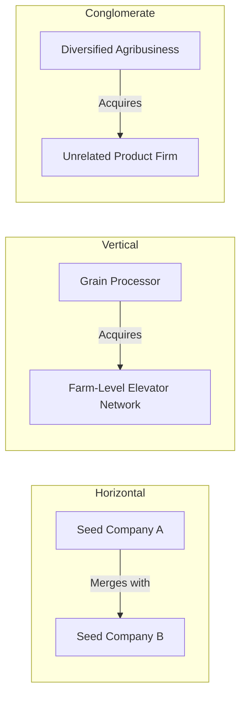
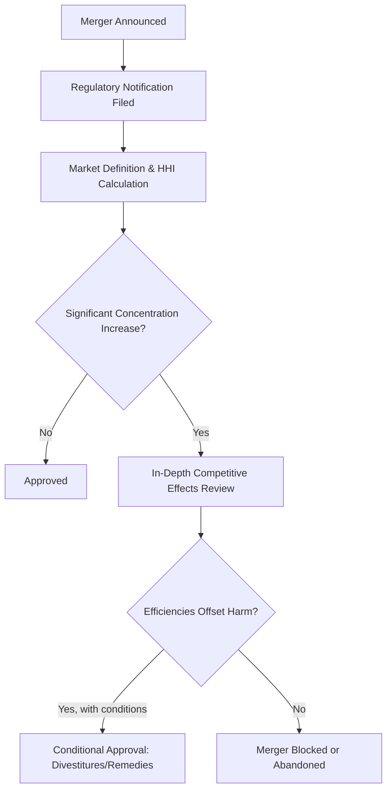

## Mergers, Acquisitions, and Industry Consolidation

### Definition and Scope

Mergers, acquisitions, and industry consolidation refer to the processes through which agribusiness firms combine ownership, control, or operations — either by merging as equals, acquiring another firm, or through broader industry-wide reduction in the number of independent competitors. In agribusiness, consolidation has occurred at multiple value chain stages: input supply (seed, agrochemicals), farm production, grain handling and processing, food manufacturing, and retail distribution, with significant implications for market structure, farmer bargaining power, and food system efficiency.

### Core Definitions

- **Merger**: combination of two firms into a single new entity, typically through a mutual agreement between roughly comparable firms ("merger of equals" in principle, though economic and governance asymmetries are common in practice).
- **Acquisition**: one firm (the acquirer) purchases a controlling interest in another firm (the target), which may continue operating as a subsidiary or be fully absorbed.
- **Consolidation**: a broader industry-level trend of declining firm numbers and rising concentration, resulting from cumulative M&A activity, exit of smaller competitors, or organic growth of dominant firms.

### Types of M&A by Value Chain Relationship

#### Horizontal Mergers

Combination of firms operating at the same value chain stage and producing similar or competing products (e.g., two grain elevator companies merging, or two seed companies combining). Primary economic rationale is scale economies and market share consolidation; primary competitive concern is increased market power and reduced buyer/seller options.

#### Vertical Mergers

Combination of firms at different, sequential value chain stages (e.g., a grain processor acquiring farm-level grain handling facilities, or a food manufacturer acquiring a packaging supplier). Primary rationale relates to transaction cost economics — internalizing coordination that would otherwise require complex contracting — and to securing supply chain control. Primary competitive concern is foreclosure: the merged firm's ability to disadvantage rival firms at the upstream or downstream stage by restricting access to inputs or markets.

#### Conglomerate Mergers

Combination of firms operating in unrelated product markets (e.g., a diversified agribusiness conglomerate acquiring a firm in an entirely separate product category). Rationale often centers on risk diversification, cross-selling opportunities, or portfolio balancing rather than direct operational synergy.

### Economic Rationale for M&A

#### Efficiency-Based Motives

- **Economies of scale**: spreading fixed costs (processing infrastructure, R&D, logistics networks) over larger output volume, reducing average cost.
- **Economies of scope**: leveraging shared capabilities (distribution networks, brand portfolios, R&D platforms) across a broader product range.
- **Transaction cost reduction**: internalizing previously contracted or market-based transactions when asset specificity and coordination needs are high (see vertical integration theory in agribusiness organizational structures).
- **Access to complementary assets**: acquiring proprietary technology, germplasm libraries, distribution rights, or specialized talent unavailable through internal development within a comparable timeframe.

#### Market Power Motives

- **Increased pricing power**: reduced competition can allow the combined firm greater influence over output prices (as a seller) or input/procurement prices (as a buyer, i.e., monopsony power over farm-level sellers).
- **Barrier creation**: consolidated firms may erect capital, regulatory, or intellectual property barriers that limit new entrant competition.

$$HHI = \sum_{i=1}^{n} s_i^2$$

The **Herfindahl-Hirschman Index (HHI)** is the standard market concentration metric used in merger antitrust review, where $s_i$ is the market share (as a percentage) of firm $i$. Regulatory guidelines commonly classify markets with $HHI < 1500$ as unconcentrated, $1500 \le HHI \le 2500$ as moderately concentrated, and $HHI > 2500$ as highly concentrated, with mergers producing large HHI increases in already-concentrated markets receiving heightened antitrust scrutiny. [Unverified] Exact HHI thresholds and review triggers are set by specific national competition authorities (e.g., the U.S. DOJ/FTC Horizontal Merger Guidelines) and are periodically revised, so current thresholds should be verified against the applicable regulator's current guidelines.

### Consolidation Patterns Across the Agribusiness Value Chain

#### Input Supply (Seed and Agrochemicals)

The global seed and crop protection sector has undergone substantial consolidation over recent decades, with a series of major mergers reducing the number of large multinational input suppliers. [Inference] Given the pace of ongoing M&A activity and periodic regulatory action (including required divestitures as merger conditions) in this sector, current market share and firm count figures should be verified via current search rather than relied upon from training data, since specific ownership structures change over time.

#### Farm-Level and Grain Handling

Consolidation at the grain elevator and farm-level handling stage has generally been driven by economies of scale in storage, transportation logistics (unit train loading capacity), and risk management (hedging scale), favoring larger, fewer facilities over the historical model of many small local elevators.

#### Food and Beverage Processing/Manufacturing

Processing and branded food manufacturing has seen substantial consolidation, driven by brand portfolio economies, retailer bargaining power (requiring scale to negotiate with large concentrated retail buyers), and R&D cost-spreading for product innovation.

#### Food Retail and Distribution

Retail consolidation (large grocery chains, foodservice distributors) has increased downstream buyer concentration, which in turn has historically been cited as a driver of upstream consolidation among processors and input suppliers seeking comparable bargaining scale — a dynamic sometimes described in the literature as a "concentration ratchet" moving up the value chain.

### Effects of Consolidation on Farmers and Market Structure

**Key Points**

- **Monopsony concerns**: reduced buyer competition for farm output (fewer processors or grain buyers in a region) can depress farm-gate prices relative to a more competitive buyer market, a concern frequently raised in livestock and grain procurement markets.
- **Reduced choice in inputs**: fewer independent seed and agrochemical suppliers can reduce product variety and potentially raise input prices, though proponents of consolidation argue that scale-driven R&D investment can also accelerate innovation (e.g., new trait development), representing a genuine efficiency-versus-market-power tradeoff debated in the literature.
- **Contract farming leverage**: consolidated processors and integrators may gain increased bargaining leverage in setting production contract terms with individual growers, reinforcing power asymmetries discussed under agribusiness organizational structures.
- **Reduced local market options**: rural communities may experience reduced numbers of local buyers/input suppliers as consolidation proceeds, with implications for rural economic diversity beyond the immediate transaction-level price effect.

[Inference] The net welfare effect of agribusiness consolidation is empirically contested — efficiency gains from scale and innovation must be weighed against market power effects on farm-gate prices and input costs, and the balance likely varies by specific sector, geography, and the degree of residual competition remaining post-merger, rather than being resolvable as a single generalizable conclusion.

### Regulatory Review Process

Most jurisdictions require merger notification and review above defined transaction size thresholds, following a broadly similar analytical process:

1. **Market definition**: defining the relevant product market and geographic market in which competitive effects will be assessed.
2. **Concentration measurement**: calculating pre- and post-merger HHI and the change in HHI ($\Delta HHI$) attributable to the merger.
3. **Competitive effects analysis**: assessing unilateral effects (the merged firm's own incentive to raise prices/reduce output) and coordinated effects (increased risk of tacit or explicit collusion among remaining competitors).
4. **Entry analysis**: assessing whether new entry would be timely, likely, and sufficient to counteract anticompetitive effects.
5. **Efficiencies defense**: assessing whether claimed merger-specific efficiencies (cost savings, innovation gains) are verifiable and sufficient to offset competitive harm.
6. **Remedy determination**: approval, conditional approval (often requiring divestiture of overlapping assets or licensing of technology to a third party), or prohibition.

### Worked Example: Vertical Merger Concentration Analysis

**Example**

Suppose a regional market for soybean processing has four firms with market shares of 35%, 30%, 20%, and 15%.

Pre-merger HHI:

$$HHI_{pre} = 35^2 + 30^2 + 20^2 + 15^2 = 1225 + 900 + 400 + 225 = 2750$$

This market is already classified as highly concentrated under common regulatory thresholds ($HHI > 2500$). If the two largest firms (35% and 30% shares) propose to merge, post-merger HHI becomes:

$$HHI_{post} = 65^2 + 20^2 + 15^2 = 4225 + 400 + 225 = 4850$$

$$\Delta HHI = 4850 - 2750 = 2100$$

A $\Delta HHI$ of this magnitude in an already highly concentrated market would typically trigger intensive antitrust scrutiny under standard merger guidelines, illustrating why horizontal mergers between the largest firms in already-concentrated agribusiness sectors (e.g., major grain processing or input supply markets) face particularly close regulatory review.

### Strategic and Financial Considerations in Agribusiness M&A

- **Valuation methods**: discounted cash flow (DCF) analysis, comparable company/precedent transaction multiples (e.g., EV/EBITDA), and asset-based valuation (relevant given agribusiness firms' often substantial land, facility, and inventory asset bases).
- **Due diligence considerations specific to agribusiness**: commodity price risk exposure, weather/production risk history, environmental liabilities (particularly relevant for processing facilities and livestock operations), water rights and land use permits, and existing grower/supplier contract portfolios and their renewal/termination terms.
- **Post-merger integration challenges**: harmonizing procurement relationships with existing grower networks (particularly sensitive where growers have long-standing cooperative-like relationships with an acquired firm), integrating disparate IT and traceability systems, and managing brand portfolio rationalization in consumer-facing segments.
- **Cross-border considerations**: multinational agribusiness M&A frequently requires clearance from multiple national competition authorities simultaneously, given the global structure of input supply and commodity trading firms, which can extend review timelines and introduce jurisdiction-specific remedy requirements.

### Related Topics

- Agribusiness organizational structures and vertical coordination
- Antitrust and competition policy in agricultural markets
- Market concentration measurement (HHI) and monopsony in farm procurement
- Contract farming and grower bargaining power
- Agribusiness valuation methods and due diligence
- Global seed and agrochemical industry structure
- Cooperative business models as a competitive counterbalance to consolidated buyers
- Supply chain risk management in consolidated agri-food markets