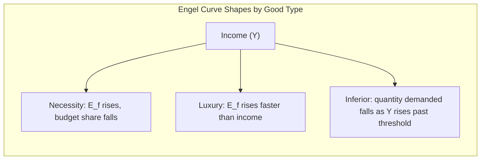

## Food Demand Theory and Engel Curves

### Definition and Conceptual Foundations

Food demand theory studies how consumers allocate income and expenditure toward food, and how food consumption responds to changes in income, prices, and household characteristics. **Engel curves** are the core analytical tool of this theory: functions describing the relationship between household income (or total expenditure) and the quantity or expenditure share devoted to a particular good, most classically food.

Engel curve analysis originates with 19th-century statistician Ernst Engel, whose empirical observation — that the expenditure share devoted to food declines as household income rises, even as absolute food expenditure increases — became formalized as **Engel's Law**, a foundational empirical regularity in consumer demand theory and development economics.

### Engel's Law

$$\frac{\partial (E_f / Y)}{\partial Y} < 0$$

where $E_f$ is food expenditure and $Y$ is household income (or total expenditure). This states that the **budget share** of food falls as income rises, even though absolute food spending $E_f$ typically continues to rise with income (at a diminishing rate). Engel's Law implies food is a **necessity good** in the income-elasticity sense: income-inelastic, with an income elasticity of demand between 0 and 1.

### Income Elasticity of Demand

The income elasticity of demand for food, $\eta_Y$, measures the percentage change in quantity (or expenditure) demanded for a 1% change in income:

$$\eta_Y = \frac{\partial Q}{\partial Y} \times \frac{Y}{Q}$$

Goods are classified by the sign and magnitude of $\eta_Y$:

- **Necessity good**: $0 < \eta_Y < 1$ — expenditure rises with income, but less than proportionally (typical for staple foods).
- **Luxury good**: $\eta_Y > 1$ — expenditure rises more than proportionally with income (typical for high-value or processed foods, restaurant meals, specialty products).
- **Inferior good**: $\eta_Y < 0$ — quantity demanded falls as income rises (classically illustrated by staple starches such as cassava, or lower-cost cereal substitutes, in contexts where rising income allows substitution toward preferred alternatives).

[Inference] The specific classification of a given food item as necessity, luxury, or inferior is empirically estimated and context-dependent — it can vary by country, income level, and time period, so specific elasticity values for particular commodities should be treated as study-specific estimates rather than universal constants.

### Functional Forms of Engel Curves

#### Linear Engel Curve

$$E_f = \alpha + \beta Y$$

Simple but restrictive: implies a constant marginal propensity to spend on food ($\beta$) regardless of income level, which does not capture the declining budget share pattern well across a wide income range.

#### Working-Leser (Linear Expenditure Share) Form

$$w_f = \alpha + \beta \ln(Y)$$

where $w_f = E_f / Y$ is the food budget share. This is the most common empirical specification for testing Engel's Law directly: a negative estimated $\beta$ confirms declining food budget share with income (in log form), consistent with Engel's Law.

#### Double-Log (Constant Elasticity) Form

$$\ln(Q_f) = \alpha + \eta_Y \ln(Y)$$

Here the coefficient $\eta_Y$ is directly interpretable as the constant income elasticity of demand across the estimated range, a convenient but restrictive assumption (elasticity is assumed not to vary with income level).

#### Quadratic Almost Ideal Demand System (QUAIDS) Form

$$w_f = \alpha + \beta \ln(Y) + \lambda [\ln(Y)]^2 + \sum_k \gamma_k \ln(P_k)$$

Extends the Working-Leser form by adding a quadratic income term (capturing non-monotonic income effects, e.g., luxury goods that become necessities at very high income) and price terms for a full demand system, widely used in contemporary applied food demand estimation. This form nests the simpler Almost Ideal Demand System (AIDS) model of Deaton and Muellbauer as a special case when $\lambda = 0$.

### Graphical Representation

### Engel Curve Diagram (svg_diagram)

<svg xmlns="http://www.w3.org/2000/svg" viewBox="0 0 700 450" font-family="Helvetica, Arial, sans-serif">
<text x="350" y="28" text-anchor="middle" font-size="17" font-weight="bold" fill="#1f2d3d">Engel Curves by Good Type (svg_diagram)</text>
<line x1="80" y1="380" x2="650" y2="380" stroke="#333" stroke-width="2" />
<line x1="80" y1="380" x2="80" y2="50" stroke="#333" stroke-width="2" />
<text x="365" y="415" text-anchor="middle" font-size="13" fill="#333">Income (Y)</text>
<text x="35" y="215" text-anchor="middle" font-size="13" fill="#333" transform="rotate(-90 35 215)">Expenditure / Quantity</text>
<path d="M 90 370 Q 250 250 400 200 Q 500 175 640 165" fill="none" stroke="#2f6f4f" stroke-width="3" />
<text x="500" y="150" font-size="12" fill="#2f6f4f" font-weight="bold">Necessity (concave, decelerating)</text>
<path d="M 90 375 L 640 90" fill="none" stroke="#b5541e" stroke-width="3" />
<text x="480" y="105" font-size="12" fill="#b5541e" font-weight="bold">Luxury (convex, accelerating)</text>
<path d="M 90 350 Q 250 220 350 210 Q 480 220 640 300" fill="none" stroke="#7a3d9c" stroke-width="3" />
<text x="440" y="325" font-size="12" fill="#7a3d9c" font-weight="bold">Inferior (rises then falls)</text>
<line x1="80" y1="380" x2="80" y2="50" stroke="#999" stroke-width="1" stroke-dasharray="3,3" />
</svg>

### Bennett's Law and the Diet Transition

A related empirical regularity, **Bennett's Law**, describes how the composition of food consumption shifts with income: as income rises, diets shift from staple starches (cereals, roots, tubers) toward higher-value foods — meat, dairy, fruits, vegetables, processed and convenience foods. This underlies the broader **nutrition transition** and **diet diversification** literature in development and food economics, and connects income-driven Engel curve behavior for aggregate "food" to compositional shifts within the food budget.

**Key Points**

- Engel's Law concerns the *aggregate food budget share*; Bennett's Law concerns the *within-food composition shift*. Both are frequently observed together as income rises: the food share of total budget falls, while the meat/dairy/processed-food share of the food budget rises.
- These compositional shifts have substantial implications for agricultural production planning, land use, and value-added food processing investment as economies develop.

### Applications of Engel Curve Analysis

#### Poverty and Welfare Measurement

Engel curve analysis underlies methods for estimating poverty lines and equivalence scales. The **Engel method** for poverty line estimation identifies the income level at which a household's food budget share equals a reference share observed among households meeting minimum nutritional needs, using the Engel curve's estimated relationship between income and food share.

#### Cost-of-Living and Equivalence Scale Estimation

Because food budget shares vary systematically with household size and composition (not just income), Engel curve estimation is used to derive **equivalence scales** — adjustment factors allowing meaningful income/welfare comparisons across households of different sizes, based on the food-share-equivalent income needed for comparable welfare.

#### Demand Forecasting and Agricultural Planning

Income elasticity estimates from Engel curve analysis feed directly into agricultural commodity demand forecasting: as national income rises, projected shifts in food demand composition (per Bennett's Law) inform investment planning across crop and livestock production, processing capacity, and trade policy.

#### International and Cross-Country Comparisons

Engel's Law is one of the most robustly replicated empirical regularities across countries and time periods in applied economics, and cross-country food budget share comparisons are frequently used as a rough proxy for relative development level, though [Inference] this proxy use requires caution since food price levels, dietary preferences, and non-market food production (subsistence farming) can all distort simple cross-country food-share comparisons independent of underlying income differences.

### Worked Example: Estimating Income Elasticity from Household Survey Data

**Example**

Suppose household survey data yields the following estimated Working-Leser model for a country's food budget share:

$$w_f = 0.55 - 0.06 \ln(Y)$$

At a household income of $Y = \$5{,}000$/year: $w_f = 0.55 - 0.06 \ln(5000) = 0.55 - 0.06(8.517) \approx 0.041$...

To illustrate more directly: suppose two households have incomes of $5,000 and $20,000 respectively.

$$w_f(5000) = 0.55 - 0.06 \times \ln(5000) = 0.55 - 0.511 = 0.039$$

This numerical result is implausibly low for a real food budget share, illustrating a key methodological point: the specific parameter values ($\alpha = 0.55$, $\beta = -0.06$) in this worked example are illustrative placeholders for demonstrating the functional form's mechanics, not empirically estimated coefficients — actual Working-Leser model parameters must be estimated from real household expenditure survey data, and any applied use of this functional form requires such empirical estimation rather than assumed parameter values. [Inference] Typical real-world food budget shares in the Working-Leser literature commonly range from roughly 0.10–0.15 in high-income countries to 0.40–0.60+ in low-income countries, so any fitted model should be checked against this general empirical pattern.

The income elasticity implied by the Working-Leser form at a given income level is derived as:

$$\eta_Y = 1 + \frac{\beta}{w_f}$$

showing that in this specification, elasticity is not constant but varies with the budget share itself, declining (becoming closer to or below 1) as income rises and the food budget share $w_f$ falls, consistent with Engel's Law's implied dynamic.

### Estimation Considerations and Data Sources

- **Data sources**: household expenditure/budget surveys (e.g., national Household Income and Expenditure Surveys, Living Standards Measurement Study surveys) are the standard data source for Engel curve estimation.
- **Endogeneity and measurement issues**: total expenditure (used as a proxy for permanent income) may be endogenous to food consumption decisions in survey data, motivating instrumental variable approaches in more rigorous applied estimation.
- **Household composition adjustment**: raw Engel curve estimation is typically adjusted for household size and demographic composition (adult equivalence scales) to avoid conflating household-size effects with pure income effects.
- **Price effects**: cross-sectional Engel curve estimation typically holds prices constant (since all households in a single survey face similar local prices), meaning income elasticities estimated this way are distinct from, and should not be conflated with, price elasticities of demand (which require price variation to estimate, typically via time-series or cross-market data).

### Comparative Summary: Elasticity Classification

| Elasticity Type | Formula | Necessity | Luxury | Inferior |
| --- | --- | --- | --- | --- |
| Income elasticity ($\eta_Y$) | $\frac{\partial Q}{\partial Y}\frac{Y}{Q}$ | $0 < \eta_Y < 1$ | $\eta_Y > 1$ | $\eta_Y < 0$ |
| Budget share response | Falls with income | Rises with income | Falls with income (approaching zero) |  |
| Typical food examples | Staple grains, basic cereals | Restaurant meals, premium/organic products | Some low-cost starches in specific income transitions |  |

### Related Topics

- Almost Ideal Demand System (AIDS) and QUAIDS estimation
- Bennett's Law and the nutrition transition
- Household equivalence scales and welfare comparison methods
- Poverty line estimation using the Engel method
- Price elasticity of demand and cross-price effects in food systems
- Food consumption forecasting and agricultural demand projection
- Household expenditure survey design and data collection methods
- Diet diversification and food security indicators