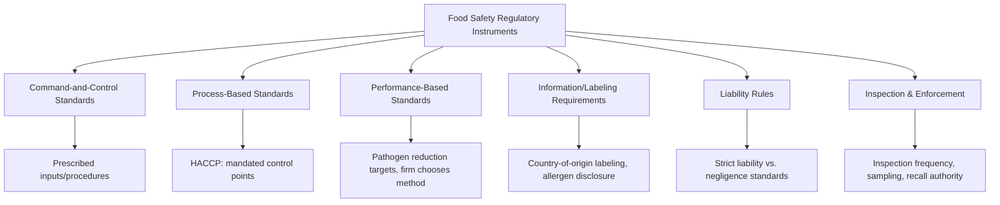

## Food Safety Economics and Regulation

### Definition and Scope

Food safety economics is the study of the market failures, incentive structures, and regulatory instruments governing the prevention and management of foodborne illness risk across the food supply chain. It combines risk economics, information economics, and regulatory design theory to analyze why unregulated markets tend to under-provide food safety, and how public policy — standards, inspection, liability rules, and labeling — can correct this underprovision.

### The Market Failure Rationale for Food Safety Regulation

#### Information Asymmetry

Food safety is a **credence attribute**: unlike search attributes (observable before purchase, e.g., color, size) or experience attributes (observable after consumption, e.g., taste), safety risk is frequently not directly observable by the consumer even after consumption, since foodborne illness may occur with a lag, may be misattributed to other causes, or may not manifest for chronic exposure risks (e.g., certain contaminants). This creates a fundamental information asymmetry between producers/sellers (who have better, though still imperfect, information about their own production practices) and consumers.

$$U_c = E[u(Q, S)]$$

where consumer utility $U_c$ depends on expected utility over food quantity $Q$ and safety $S$, but $S$ is imperfectly observed by the consumer at the point of purchase, unlike price and other search attributes.

#### Externalities

Foodborne illness can generate externalities beyond the individual consumer: transmission of pathogens between household members, healthcare system costs partially borne by public insurance systems, and productivity losses to the broader economy. These costs are not fully internalized by either the producer or the individual consumer's private purchase decision, motivating a public-good-like rationale for minimum safety standards beyond what private liability alone would generate.

#### Underinvestment in Private Safety Effort

Because consumers cannot fully verify safety effort at the point of purchase, individual firms have a private incentive to underinvest in costly safety measures relative to the socially optimal level, since safety investment is costly but only partially rewarded by consumers who cannot observe it directly — a classic **credence good market failure** first formalized in the broader credence goods literature (Darby and Karni, 1973) and widely applied to food safety.

$$MC_S > MPB_S \quad \text{(private firm underinvestment condition, absent regulation)}$$

where $MC_S$ is the marginal cost of additional safety effort and $MPB_S$ is the marginal *private* benefit captured by the firm (which is less than the marginal *social* benefit, $MSB_S$, due to the externality and information asymmetry described above).

### Regulatory Instruments in Food Safety

#### Command-and-Control (Input/Design) Standards

Regulations mandating specific inputs, equipment, or procedures (e.g., required equipment specifications, mandated sanitation procedures). Simple to enforce and verify, but can be economically inefficient if it does not allow firms flexibility to achieve safety outcomes at lowest cost given their specific circumstances.

#### Process-Based Standards: HACCP

**Hazard Analysis and Critical Control Points (HACCP)** is the dominant modern food safety regulatory framework internationally, requiring firms to identify critical control points in their production process where food safety hazards can be prevented, eliminated, or reduced to acceptable levels, and to implement systematic monitoring at those points. HACCP shifts regulatory focus from end-product testing (inspecting the final product) toward preventive process control, reflecting the economic insight that hazard prevention is generally lower-cost than after-the-fact detection and recall, particularly for pathogens that cannot be reliably detected through sampling of a small fraction of output.

#### Performance-Based Standards

Regulations that specify a required safety outcome (e.g., a maximum allowable pathogen prevalence rate in a food category) without prescribing the specific method firms must use to achieve it. This preserves firm-level flexibility to select the least-cost method of compliance, consistent with standard economic efficiency principles for regulatory design, though it requires more sophisticated outcome measurement and verification capacity by the regulator than simple input-based standards.

#### Information-Based Instruments

Labeling requirements (allergen disclosure, country-of-origin labeling, use-by dates) address the credence-good information asymmetry directly by converting some safety-relevant information into a verifiable search attribute, though [Inference] the effectiveness of labeling-based approaches depends heavily on consumer attention and comprehension, which behavioral economics research suggests is often limited — meaning labeling alone is generally treated as a complement to, not a substitute for, process and performance standards rather than a sufficient regulatory instrument on its own.

#### Liability Rules

Legal liability for foodborne illness harm creates an ex-post financial incentive for firms to invest in safety, functioning as a decentralized regulatory mechanism alongside direct government standards.

- **Negligence standard**: firm is liable only if it failed to exercise a reasonable standard of care, requiring proof of fault.
- **Strict liability standard**: firm is liable for harm caused by its product regardless of fault or negligence, shifting more of the incentive burden onto sellers to prevent harm proactively rather than merely meeting a minimum due-care threshold.

[Unverified] The specific liability standard applied to food safety cases varies by jurisdiction and product category, and has evolved through case law over time, so the applicable standard in a specific context should be verified against current law rather than assumed.

#### Inspection and Enforcement

Regulatory agencies conduct facility inspections, product sampling, and, where hazards are identified, mandate or oversee recalls. Economic analysis of inspection design addresses the **optimal inspection frequency problem**: balancing the marginal cost of additional inspection against the marginal expected harm reduction from earlier hazard detection, often modeled using principal-agent and enforcement game theory (e.g., how inspection probability interacts with firm compliance incentives under imperfect and costly monitoring).

### Cost-Benefit Analysis in Food Safety Regulation

Regulatory food safety standards are commonly justified and calibrated using formal cost-benefit analysis, comparing the estimated cost of compliance against the estimated value of illness/mortality risk reduction.

$$NB = \sum_t \frac{B_t - C_t}{(1+r)^t}$$

where $B_t$ is the monetized benefit (avoided illness, avoided mortality risk, avoided healthcare and productivity costs) in period $t$, $C_t$ is compliance cost in period $t$, and $r$ is the discount rate.

#### Valuing Health Benefits: Cost-of-Illness and Value of Statistical Life

- **Cost-of-illness (COI) approach**: sums direct medical costs and indirect productivity losses attributable to foodborne illness episodes, providing a lower-bound estimate of benefit since it excludes pain, suffering, and risk-aversion value.
- **Value of Statistical Life (VSL)**: derived from revealed- or stated-preference studies of how much individuals are willing to pay for small reductions in mortality risk, then scaled to estimate the implied value of preventing one statistical death, used as the standard approach in most contemporary regulatory cost-benefit analysis for mortality risk reduction.

$$VSL = \frac{WTP}{\Delta p}$$

where $WTP$ is the aggregate willingness to pay for a risk reduction and $\Delta p$ is the corresponding reduction in mortality probability across the affected population. [Unverified] Specific VSL figures used by regulatory agencies vary by jurisdiction, are periodically updated, and are a frequent subject of methodological debate, so current applicable VSL values should be verified against the relevant regulatory agency's current guidance rather than assumed from a fixed figure.

### Worked Example: Cost-Benefit Analysis of a Pathogen Reduction Standard

**Example**

A regulator is evaluating a proposed HACCP-based standard intended to reduce Salmonella contamination in poultry processing.

- Estimated annual compliance cost across the industry: $150 million.
- Estimated reduction in foodborne illness cases: 50,000 fewer cases per year.
- Estimated average cost-of-illness per case (medical + productivity loss): $2,000.
- Estimated reduction in foodborne-illness-attributable deaths: 5 fewer deaths per year.
- Assumed VSL: $10 million per statistical life.

Annual monetized benefit:

$$B = (50{,}000 \times \$2{,}000) + (5 \times \$10{,}000{,}000) = \$100{,}000{,}000 + \$50{,}000{,}000 = \$150{,}000{,}000$$

Net benefit:

$$NB = B - C = \$150{,}000{,}000 - \$150{,}000{,}000 = \$0$$

This illustrates a marginal case where estimated benefits approximately equal costs — a common outcome zone in real food safety rulemaking, where the net-benefit conclusion is highly sensitive to the specific VSL, cost-of-illness, and illness-reduction estimates used, each of which typically carries substantial estimation uncertainty. [Inference] Because these inputs (case reduction estimates, VSL values, cost-of-illness figures) are themselves modeled estimates rather than direct observations, sensitivity analysis across plausible input ranges is standard regulatory practice, and a single point-estimate net benefit figure should generally be interpreted alongside its uncertainty range rather than treated as a precise result.

### Firm-Level Food Safety Investment Incentives

Beyond regulatory compliance, firms may voluntarily exceed minimum safety standards where doing so protects brand reputation, reduces recall/liability risk exposure, or satisfies buyer requirements imposed by large retailers or export markets (private food safety standards, e.g., GlobalG.A.P., BRC, SQF certification schemes, which often exceed minimum public regulatory requirements as a condition of market access to major retail or export buyers).

**Key Points**

- Private standards can substitute for or complement public regulation, particularly in export supply chains where buyer-imposed certification requirements enforce safety practices beyond what the exporting country's domestic regulatory floor requires.
- Reputation and repeat-purchase incentives can partially offset the credence-good underinvestment problem, though [Inference] this mechanism is generally considered incomplete on its own, since a single severe safety failure can generate consumer learning about product-category risk broadly (spillover effects across a food category or brand family) rather than being fully internalized in the responsible firm's own reputation alone, limiting the strength of reputation as a sole safety-incentive mechanism.

### Recall Economics

A food safety recall imposes direct costs (product destruction, logistics, notification) and reputational costs (lost future sales, potential broader category demand depression) on the responsible firm. Recall policy design (mandatory vs. voluntary recall authority, public notification requirements) affects firm incentives for early hazard detection and self-reporting.

$$\pi_{recall} = -(C_{direct} + C_{reputation} + C_{liability})$$

[Inference] The relative magnitude of direct versus reputational recall costs varies substantially by firm size, brand strength, and market structure — a well-established branded firm in a concentrated market segment typically faces proportionally larger reputational cost exposure than an unbranded commodity producer, which affects the relative strength of voluntary safety investment incentives across firm types.

### International Trade Dimensions

Food safety standards also function as **non-tariff measures** in international trade, governed at the multilateral level primarily by the WTO's **Sanitary and Phytosanitary (SPS) Agreement**, which permits countries to set food safety import standards but requires that such standards be based on scientific risk assessment rather than serving as disguised trade protectionism. This creates ongoing tension between legitimate food safety risk management and the potential for safety standards to be used, deliberately or inadvertently, as a competitive barrier against imports — a recurring subject of trade dispute settlement.

### Comparative Summary: Regulatory Approaches

| Approach | Compliance Flexibility | Regulatory Verification Burden | Best Suited For |
| --- | --- | --- | --- |
| Command-and-control (input) | Low | Low (easy to inspect inputs) | Simple, homogeneous hazards |
| Process-based (HACCP) | Moderate | Moderate (requires process audit capacity) | Complex processing with identifiable control points |
| Performance-based | High | High (requires outcome measurement) | Sophisticated firms, mature regulatory capacity |
| Labeling/information | High (consumer choice preserved) | Low–Moderate | Complementing, not replacing, safety standards |
| Liability (ex-post) | High | Depends on judicial system capacity | Decentralized incentive alongside ex-ante regulation |

### Related Topics

- HACCP system design and critical control point analysis
- Value of Statistical Life estimation methods and regulatory use
- Credence goods and information asymmetry in food markets
- Private food safety certification standards (GlobalG.A.P., BRC, SQF)
- WTO Sanitary and Phytosanitary Agreement and trade dispute cases
- Food recall policy design and firm reputation economics
- Foodborne illness cost-of-illness estimation methodology
- Traceability systems and supply chain food safety verification