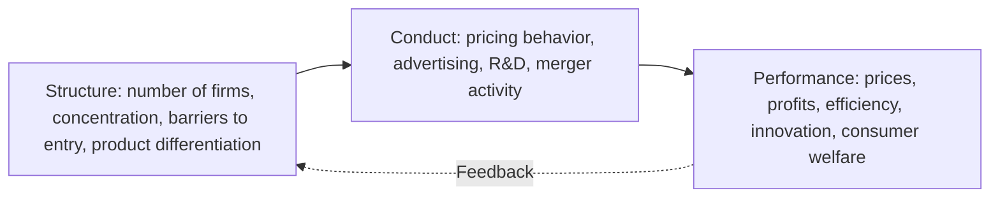
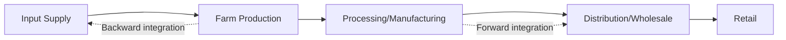

## Food Industry Structure and Vertical Integration

### Definition and Scope

Food industry structure refers to the organization of firms, market power, and coordination mechanisms across the food value chain — from primary agricultural production through processing, distribution, and retail. Vertical integration describes the extent to which a single firm owns and controls multiple, sequential stages of this chain, as opposed to relying on market transactions or contracts to coordinate between independently owned firms at each stage. Understanding industry structure and the vertical integration decision is central to analyzing pricing behavior, market power, efficiency, and the distribution of value along the food chain.

### The Structure-Conduct-Performance (SCP) Paradigm

The traditional industrial organization framework applied to food industry analysis is the **Structure-Conduct-Performance paradigm**, which posits a causal chain from market structure to firm behavior to economic outcomes.

- **Structure**: market concentration (number and size distribution of firms), barriers to entry, degree of product differentiation, vertical relationships between stages.
- **Conduct**: pricing strategy, advertising and branding investment, R&D intensity, merger and acquisition activity, contract design with suppliers/buyers.
- **Performance**: resulting prices, profit margins, allocative and productive efficiency, rate of innovation, and consumer welfare outcomes.

[Inference] The SCP paradigm has been substantially refined in modern industrial organization theory (particularly via game-theoretic models emphasizing conduct as strategic and structure as partly endogenous to conduct, rather than a strict one-way causal chain), but SCP remains a widely used organizing framework in applied food industry analysis for its clarity and empirical tractability.

### Measuring Market Structure

#### Concentration Ratios and HHI

$$CR_n = \sum_{i=1}^{n} s_i$$

The **n-firm concentration ratio** ($CR_n$) sums the market shares $s_i$ of the largest $n$ firms (commonly $CR_4$ or $CR_8$ in food industry analysis). The **Herfindahl-Hirschman Index (HHI)**, $HHI = \sum s_i^2$, is a more sensitive measure that weights larger firms more heavily and is the standard metric used in merger antitrust review (see mergers, acquisitions, and industry consolidation).

#### Price-Cost Margins and Market Power Indicators

Beyond concentration measures, applied food industry research estimates market power directly through price-cost margin analysis or structural econometric models (e.g., New Empirical Industrial Organization methods) that infer the degree of market power from observed pricing behavior relative to a competitive benchmark, since concentration alone is an imperfect proxy for actual market power exercised.

### Vertical Integration: Definition and Forms

**Vertical integration** occurs when a single firm owns and directly controls production at two or more sequential stages of the value chain that would otherwise be coordinated through separate, independently owned firms transacting via markets or contracts.

- **Backward integration**: a firm expands ownership toward earlier (upstream) stages — e.g., a food processor acquiring farm production assets or input supply operations.
- **Forward integration**: a firm expands ownership toward later (downstream) stages — e.g., a producer acquiring processing or retail/distribution capacity.
- **Balanced/full integration**: a firm owns the complete chain from input supply through retail.

### Theoretical Rationale for Vertical Integration

#### Transaction Cost Economics

As established in transaction cost theory (Williamson), vertical integration becomes the preferred governance form as **asset specificity**, **uncertainty**, and **transaction frequency** rise, since the cost of writing, monitoring, and enforcing complete contracts across independent firms eventually exceeds the cost of internal coordination.

$$TC = f(AS, U, F)$$

This is the same framework applied to agribusiness organizational structures generally, but here focused specifically on the choice between market coordination, contracting, and full ownership integration across the food chain.

#### Double Marginalization

A key efficiency rationale for vertical integration is the elimination of **double marginalization**: when two firms at successive value chain stages each independently set a markup over marginal cost, the resulting final price is higher (and total industry output lower) than if a single integrated firm set price to maximize combined chain profit.

Consider an upstream firm with marginal cost $c$ selling to a downstream firm, who then sells to final consumers facing demand $Q(P) = a - bP$.

Under separate firms, the upstream firm sets wholesale price $w$ as a markup over $c$, and the downstream firm sets retail price $P$ as a markup over $w$ — compounding two markups. Under vertical integration, the single firm sets price as a single markup directly over $c$:

$$P_{integrated} < P_{separate}$$

Vertical integration internalizes this pricing externality between successive stages, generally increasing total output and reducing final consumer price relative to the double-marginalization outcome, holding market power constant at each stage — a classic efficiency-enhancing rationale for vertical integration distinct from pure market power motives.

#### Foreclosure and Market Power Motives

Conversely, vertical integration can raise competitive concerns through **foreclosure**: an integrated firm may restrict rival firms' access to an essential upstream input or downstream distribution channel, disadvantaging competitors who lack equivalent integrated access. This is the core competitive concern reviewed in vertical merger antitrust analysis (see mergers, acquisitions, and industry consolidation), distinguishing efficiency-driven integration from market-power-driven integration — a distinction that is often difficult to establish empirically in specific cases and is a recurring subject of applied antitrust economics debate.

**Key Points**

- Vertical integration is not unambiguously pro-competitive or anti-competitive; its welfare effect depends on whether the efficiency gains (e.g., eliminated double marginalization, better quality/traceability coordination) outweigh potential foreclosure effects in the specific market context.
- Regulatory review of vertical mergers (unlike straightforward horizontal mergers) requires assessing this efficiency-versus-foreclosure tradeoff explicitly, which is analytically more complex than horizontal concentration analysis alone.

### Degrees of Vertical Coordination

Vertical integration represents the extreme end of a broader **vertical coordination spectrum**, which also includes intermediate hybrid forms:

| Coordination Form | Ownership | Control Mechanism | Example |
| --- | --- | --- | --- |
| Spot market | Separate, independent | Price signal only | Commodity grain sold at prevailing market price |
| Marketing contract | Separate | Pre-agreed price/delivery terms | Forward contract for crop delivery |
| Production contract | Separate | Contractor specifies inputs/practices | Poultry/hog production contracts |
| Strategic alliance/JV | Shared/partial | Joint governance agreement | Co-branded product development partnership |
| Vertical integration | Single firm | Direct managerial hierarchy | Integrated poultry firm owning hatchery through processing |

This spectrum reflects the same transaction-cost logic discussed under agribusiness organizational structures: firms select the coordination form that minimizes total transaction and production costs given the specific asset specificity, risk, and quality-control requirements of the product in question.

### Food Retail Concentration and Buyer Power

Downstream, food retail has experienced substantial consolidation in many countries, creating concentrated buyer power (**monopsony** or **oligopsony** power) vis-à-vis upstream processors and, indirectly, farm-level suppliers. This buyer power can manifest as:

- **Slotting fees and listing requirements**: payments retailers require from suppliers for shelf space access, functioning partly as a rent-extraction mechanism enabled by retail concentration.
- **Private label competition**: retailers developing store-brand products that compete directly with branded manufacturer products, leveraging the retailer's direct consumer access and shelf-space control.
- **Bargaining leverage in supply contracts**: concentrated retail buyers can negotiate more favorable pricing and terms from processors/manufacturers than a more fragmented retail sector would permit, with effects that can propagate upstream to farm-gate pricing.

[Inference] The degree to which retail buyer power effects are ultimately passed back to farm-level suppliers, versus absorbed by intermediate processors, depends on the relative concentration and bargaining power at each intermediate stage — a chain-specific empirical question rather than a fixed general rule, requiring case-by-case market analysis.

### Worked Example: Double Marginalization Numerical Illustration

**Example**

Suppose downstream demand is $Q = 100 - P$, and the upstream firm's marginal cost of the input is $c = \$10$ per unit. Assume both upstream and downstream firms have monopoly power at their respective stage and each sets a standard monopoly markup.

**Separate firms (sequential monopoly)**: The downstream firm treats the wholesale price $w$ as its marginal cost and maximizes profit given demand $Q = 100 - P$, yielding the standard monopoly result $P^* = \frac{a + w}{2}$ (from $MR = MC$ with linear demand $Q = a - P$, here $a = 100$). The upstream firm, anticipating downstream demand for the input equal to $Q = 100 - P = 100 - \frac{100+w}{2} = 50 - \frac{w}{2}$, treats this as its own downstream demand curve and sets $w$ to maximize its own profit, again applying a monopoly markup over its cost $c = 10$:

Upstream inverse demand for input: $w = 100 - 2Q$ (from $Q = 50 - w/2$). Upstream marginal revenue: $MR_{up} = 100 - 4Q$. Setting $MR_{up} = c = 10$: $100 - 4Q = 10 \implies Q = 22.5$, so $w = 100 - 2(22.5) = 55$.

Downstream then sets $P = \frac{100 + 55}{2} = 77.5$, giving final quantity $Q = 100 - 77.5 = 22.5$.

**Integrated firm**: A single vertically integrated firm maximizes profit directly over final demand $Q = 100 - P$ with total marginal cost $c = 10$: $MR = 100 - 2Q = 10 \implies Q = 45$, so $P = 100 - 45 = 55$.

**Result**: $P_{separate} = \$77.50$ versus $P_{integrated} = \$55.00$, and $Q_{separate} = 22.5$ versus $Q_{integrated} = 45$ — vertical integration in this example roughly doubles output and substantially lowers final consumer price purely by eliminating the double markup, holding market power (monopoly at each stage) constant. This numerical result demonstrates the double marginalization mechanism specifically; real-world magnitude of this effect depends on the actual degree of market power present at each stage, which in more competitive markets would be smaller than in this stylized dual-monopoly example.

### Empirical Trends in Food Industry Structure

[Inference] Food processing, manufacturing, and retail sectors in many economies have exhibited a long-run trend toward increased concentration over recent decades, driven by economies of scale, brand-building costs, retail consolidation pressure, and merger activity — but the specific current concentration levels, leading firms, and market share figures for any particular food subsector change over time with ongoing M&A activity and should be verified via current search rather than assumed from general historical knowledge, given the dynamic nature of this industry segment.

### Related Topics

- Mergers, acquisitions, and industry consolidation in agribusiness
- Agribusiness organizational structures and transaction cost economics
- Double marginalization and vertical pricing externalities
- Retail buyer power, slotting fees, and private label competition
- Market concentration measurement (HHI, concentration ratios)
- Contract farming and vertical coordination mechanisms
- Antitrust and competition policy in food and agricultural markets
- New Empirical Industrial Organization methods for market power estimation