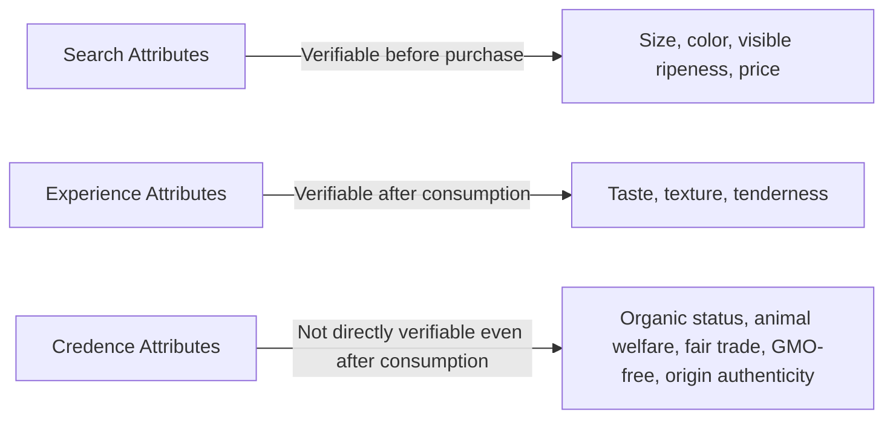
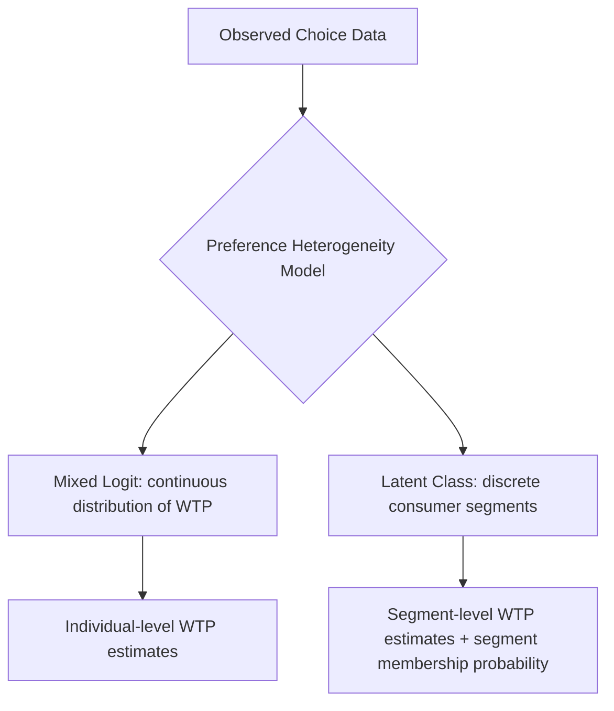

## Consumer Preferences for Quality Attributes

### Definition and Scope

Consumer preferences for quality attributes concerns how buyers value the multiple, often non-price characteristics of food and agricultural products — nutritional content, taste, appearance, origin, production method, safety, and ethical/environmental attributes — and how these preferences shape market demand, product differentiation, and pricing. This area draws primarily on **hedonic price theory** and **attribute-based demand modeling**, extending standard consumer theory beyond treating goods as homogeneous units to treating them as bundles of valued characteristics.

### Lancaster's Characteristics Approach

The theoretical foundation for quality attribute analysis is Lancaster's (1966) characteristics-based consumer theory, which reframes consumer utility as derived not directly from goods themselves, but from the underlying characteristics those goods embody.

$$U = u(z_1, z_2, ..., z_n)$$

$$z_j = \sum_i a_{ij} x_i$$

where utility $U$ is a function of characteristics $z_j$ (e.g., protein content, sweetness, freshness, brand reputation), and each characteristic $z_j$ is produced by combining goods $x_i$ according to fixed characteristic-content coefficients $a_{ij}$. This reformulation allows economic analysis of quality differentiation, since a single "good" (e.g., "apples") is understood as a bundle of characteristics that varies across specific product variants (variety, ripeness, origin, certification status).

### Classification of Product Attributes: Search, Experience, and Credence Goods

A foundational classification (Nelson, 1970; Darby and Karni, 1973) distinguishes quality attributes by when and how consumers can verify them, which is central to understanding both consumer valuation behavior and the appropriate policy/labeling response.

- **Search attributes**: verifiable by inspection prior to purchase (size, visual appearance, package information).
- **Experience attributes**: verifiable only after consumption (taste, tenderness, freshness perception).
- **Credence attributes**: not reliably verifiable even after consumption without third-party certification or testing (organic production method, animal welfare standards, fair trade sourcing, carbon footprint, geographic origin authenticity).

**Key Points**

- Credence attributes create the strongest information asymmetry and are the primary justification for third-party certification, labeling regulation, and traceability systems, since consumers cannot verify these attributes through their own experience regardless of repeated purchase.
- Willingness to pay for credence attributes depends heavily on consumer trust in the certifying or labeling mechanism, making certification scheme credibility itself an economically consequential variable.

### Hedonic Price Analysis of Quality Attributes

**Hedonic pricing** is the principal empirical method for estimating the implicit market value of individual quality attributes, decomposing an observed market price into the sum of implicit prices for each embodied characteristic.

$$P_i = \beta_0 + \sum_k \beta_k z_{ik} + \varepsilon_i$$

where $P_i$ is the observed price of product variant $i$, $z_{ik}$ is the level of characteristic $k$ in variant $i$, and $\beta_k$ is the implicit (hedonic) price of characteristic $k$, interpreted as the marginal willingness to pay for a one-unit increase in that characteristic, holding other characteristics constant.

$$\beta_k = \frac{\partial P_i}{\partial z_{ik}}$$

This method has been widely applied in agricultural and food economics to estimate the implicit price premiums for attributes such as protein content in wheat, marbling grade in beef, organic certification, geographic indication labeling, and fair trade certification.

### Willingness to Pay (WTP) Estimation Methods

#### Stated Preference: Contingent Valuation and Choice Experiments

Directly elicit consumer WTP for specific attributes through hypothetical purchase scenarios.

- **Contingent valuation**: asks respondents directly for their maximum WTP for a described product with specific attributes.
- **Discrete choice experiments**: present respondents with repeated choice sets among product alternatives that vary systematically in attributes (including price), estimating marginal WTP for each attribute via random utility modeling:

$$U_{ij} = \beta X_{ij} + \varepsilon_{ij}, \qquad MWTP_k = -\frac{\beta_k}{\beta_{price}}$$

Choice experiments are generally preferred in contemporary applied work over simple contingent valuation for multi-attribute quality questions, since they allow simultaneous estimation of marginal values across several attributes rather than requiring a separate scenario for each.

#### Revealed Preference: Experimental Auctions

**Experimental economics auction methods** (e.g., Vickrey second-price auctions, Becker-DeGroot-Marschak mechanism) elicit WTP for specific product attributes using real purchase incentives rather than hypothetical scenarios, addressing the hypothetical bias concern associated with pure stated-preference methods. Participants bid real money for products with varying attribute combinations (e.g., conventional versus certified-organic versions of the same base product), with the auction mechanism designed to be incentive-compatible (truth-revealing) under standard auction theory assumptions.

#### Revealed Preference: Market/Scanner Data Hedonic Analysis

Using observed retail scanner data or market transaction data to estimate hedonic price functions directly from actual purchase behavior, avoiding hypothetical bias entirely but limited to attributes that vary within existing market offerings and observable pricing data.

### Common Quality Attributes Studied in Food Economics

#### Nutritional and Compositional Attributes

Protein content, fat content, fiber content, and similar compositional characteristics, particularly relevant in commodity grading systems (e.g., wheat protein premiums, beef marbling grades) where quality attributes directly affect processing value and are often subject to formal grading standards that create objective, verifiable attribute measures.

#### Production Method and Credence Attributes

- **Organic certification**: consistently found to command a price premium across many studied markets and product categories, [Inference] though the specific magnitude of the organic premium varies substantially by product category, region, and market maturity, and current premium levels should be checked against recent market data rather than assumed fixed.
- **Animal welfare attributes**: cage-free/free-range labeling, and similar production-method claims for livestock products.
- **Environmental attributes**: carbon footprint labeling, sustainable/regenerative agriculture claims, water-use disclosure.
- **Fair trade and ethical sourcing certification**: particularly studied in coffee, cocoa, and other tropical commodity markets with significant developing-country producer bases.
- **GMO status**: non-GMO or GMO-free labeling, an area of substantial consumer preference heterogeneity and, in some jurisdictions, mandatory labeling requirements.

#### Geographic Origin and Terroir

**Geographic Indications (GIs)** — legally protected labels certifying that a product's quality or reputation is substantially attributable to its geographic origin (e.g., Champagne, Parmigiano-Reggiano, Roquefort) — represent a distinctive category combining credence attribute signaling with legal intellectual property protection, generally found to command significant price premiums tied to the reputational and (in some cases) genuine quality-differentiating value of the protected origin designation.

#### Appearance and Sensory Attributes

Visual appearance (color uniformity, size, blemish-free status), and where directly measurable, sensory panel-scored attributes (taste intensity, texture ratings) used particularly in specialty and premium product segment differentiation (e.g., specialty coffee cupping scores, wine quality ratings).

### Preference Heterogeneity and Market Segmentation

Consumer WTP for quality attributes is rarely homogeneous across the population; standard analysis accounts for this heterogeneity through:

- **Mixed logit (random parameters logit) models**: allow attribute coefficients (and therefore implied WTP) to vary randomly across individuals in choice experiment estimation, rather than assuming a single population-average WTP.
- **Latent class models**: identify discrete consumer segments with distinct preference structures (e.g., a "premium quality-focused" segment versus a "price-sensitive" segment) from observed choice data, without requiring the segments to be pre-defined by observable demographics.
- **Demographic and psychographic segmentation**: linking WTP for specific attributes (e.g., organic, local origin) to observable consumer characteristics such as income, education, health consciousness, and environmental attitudes.

### Worked Example: Hedonic Price Estimation for Beef Quality Grade

**Example**

Suppose a hedonic price regression is estimated on retail beef price data:

$$P = 4.20 + 0.85(Marbling) + 0.30(Tenderness) - 0.05(Days\_Aged) + \varepsilon$$

where $P$ is price per pound ($), $Marbling$ is a standardized marbling score, $Tenderness$ is a standardized sensory tenderness score, and $Days\_Aged$ is days since processing (illustrative coefficients for demonstration purposes, not empirically estimated values).

The coefficient on $Marbling$ (0.85) is interpreted as the implicit price: consumers are willing to pay an additional $0.85 per pound for each one-unit increase in the standardized marbling score, holding tenderness and aging constant — directly informing the price premiums embedded in USDA-style quality grading systems (e.g., Prime versus Choice versus Select grades, which are substantially driven by marbling score differences). The negative coefficient on $Days\_Aged$ illustrates that, in this specification, consumers discount price as time since processing increases, consistent with freshness being a valued (if imperfectly observed) experience/search attribute.

### Policy and Market Design Implications

**Key Points**

- **Certification and labeling schemes** exist substantially to convert credence attributes into effectively search-like attributes at the point of purchase, addressing the information asymmetry that would otherwise prevent quality-differentiated markets for these attributes from functioning efficiently (following the theoretical logic of Akerlof's "market for lemons," where unverifiable quality can lead to market unraveling absent a credible signaling mechanism).
- **Grading standards** (e.g., USDA grades, EU quality classification schemes) serve a similar market-facilitating function for attributes that are objectively measurable but costly for individual buyers to assess without standardized testing.
- **Geographic Indication protection** functions partly as intellectual property law and partly as a quality-signaling mechanism, with economic effects on both producer price premiums and the broader regional reputation externality captured collectively rather than by any single producer.
- Understanding attribute-level WTP is directly commercially relevant for product development, premium positioning strategy, and packaging/labeling design across the food industry, connecting this analytical area closely to applied agribusiness marketing strategy.

### Comparative Summary: Attribute Type and Valuation Method Fit

| Attribute Type | Verifiability | Preferred Valuation Method | Example |
| --- | --- | --- | --- |
| Search | Before purchase | Hedonic pricing on market data | Size, visible ripeness |
| Experience | After consumption | Hedonic pricing, sensory panel + market data | Taste, tenderness |
| Credence | Not directly verifiable | Choice experiments, experimental auctions, stated preference | Organic, animal welfare, origin authenticity |

### Related Topics

- Lancaster's characteristics approach to consumer theory
- Hedonic pricing models in agricultural commodity grading
- Discrete choice experiments and random utility modeling
- Geographic Indications and intellectual property in food branding
- Experimental auction methods (Vickrey, BDM mechanism) for WTP elicitation
- Food safety economics and credence good market failure
- Certification and eco-labeling scheme design
- Market segmentation and preference heterogeneity modeling