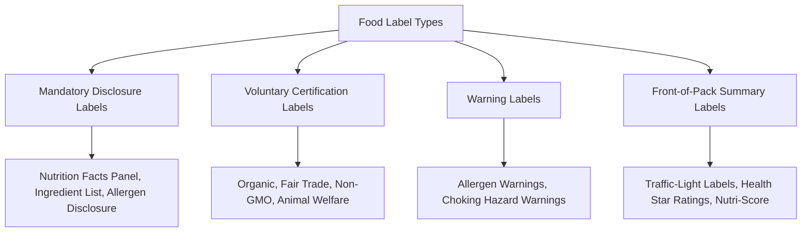

## Food Labeling and Information Economics

### Definition and Scope

Food labeling and information economics studies how the provision, design, and regulation of product information affects consumer decision-making, market efficiency, and welfare in food markets. It applies the economics of information — particularly theories of asymmetric information, signaling, and screening — to explain why unregulated markets may under-provide reliable product information, and how labeling policy can correct resulting inefficiencies. This area is closely linked to, and builds directly on, the credence-goods framework central to both food safety economics and consumer preferences for quality attributes.

### The Information Economics Foundation

#### Asymmetric Information and Market Unraveling

Food labeling policy is grounded in Akerlof's (1970) foundational analysis of information asymmetry in markets ("market for lemons"), applied to food quality and safety attributes that sellers know better than buyers. Where quality is unobservable to buyers and unverifiable even after purchase (credence attributes), and sellers cannot credibly and costlessly signal true quality, the market can **unravel**: low-quality sellers free-ride on the market price for average quality, average quality declines, price-sensitive buyers exit, and in the extreme case, the market for genuinely high-quality goods can collapse entirely absent a credible information mechanism.

$$P^* = E[Q | \text{market average}]$$

Absent a reliable signal, rational buyers price products at the *expected* quality across the pooled market, rather than at the true quality of any specific product — which penalizes genuinely high-quality sellers relative to what they would receive if quality were verifiable, and can drive them out of the market over successive rounds of adverse selection.

#### Signaling and Screening

Two theoretical mechanisms address this unraveling problem:

- **Signaling** (Spence): the informed party (seller) takes a costly, observable action that is credible precisely because it would be too costly for a low-quality seller to mimic (e.g., costly third-party certification that only genuinely compliant producers can economically sustain).
- **Screening**: the uninformed party (buyer, or a regulator acting on buyers' behalf) designs a mechanism — such as mandatory disclosure requirements or standardized testing — to induce sellers to reveal quality information, or to directly verify it independent of seller cooperation.

Food labeling regulation functions predominantly as a **screening mechanism**, mandating standardized disclosure that sellers cannot selectively withhold, converting otherwise unverifiable credence attributes into effectively search-like attributes at the point of purchase.

### Types of Food Labels by Function

#### Mandatory Disclosure Labels

Government-required minimum information disclosure, typically including standardized nutrition facts panels, ingredient lists (often ordered by weight), allergen declarations, and net quantity/weight statements. These address the baseline information asymmetry problem for attributes considered sufficiently important to warrant universal, non-optional disclosure.

#### Voluntary Certification Labels

Third-party or government-administered certification schemes (organic, fair trade, non-GMO verification, animal welfare certification) that sellers may choose to obtain and display, typically at a cost (certification fees, compliance with underlying production standards), functioning as the costly-signal mechanism in the signaling framework above. Certification credibility depends heavily on the certifying body's independence, monitoring rigor, and enforcement — a weak or captured certification scheme can fail to solve the underlying information problem even if the label itself is displayed.

#### Warning Labels

Mandated disclosure of specific risk information (allergens, choking hazards for certain products), generally justified on stronger paternalistic/externality grounds than general quality information, given the acute and sometimes severe consequences of non-disclosure for affected consumers.

#### Front-of-Pack Summary Labels

Simplified, standardized visual summaries of overall nutritional quality (e.g., traffic-light color coding, star ratings, single summary scores), designed specifically to address the bounded-rationality problem: standard nutrition facts panels, while comprehensive, require significant cognitive effort to interpret and compare across products, and front-of-pack systems aim to reduce this processing cost.

### Behavioral Economics of Label Design

**Key Points**

- Standard information economics assumes that providing accurate information is sufficient for rational consumers to make welfare-improving choices; behavioral economics research has substantially qualified this assumption, finding that **label format, not just label accuracy, materially affects consumer behavior**.
- **Limited attention**: consumers often do not read or process detailed labels at the point of purchase, particularly under time pressure, motivating interest in simplified summary formats that require less cognitive processing.
- **Framing effects**: how nutritional information is presented (e.g., "low in sugar" versus displaying raw sugar grams; traffic-light red/amber/green coding versus numeric percentages) can influence purchase decisions independent of the underlying information content, since format affects the ease and salience of information processing.
- **Reference point effects**: labels expressed relative to a daily reference intake (e.g., "% Daily Value") can shift perceived healthiness relative to labels showing only absolute quantities, even when the underlying nutritional facts are identical.

[Inference] The empirical evidence on which specific front-of-pack labeling format most effectively shifts purchasing behavior toward healthier choices is an active and evolving research area with results that vary by study design, population, and specific label format tested, so claims about the relative effectiveness of specific labeling systems (e.g., traffic-light versus single summary score systems) should be checked against current comparative research rather than treated as settled.

### Economic Effects of Mandatory Labeling

#### Effects on Consumer Welfare

Mandatory disclosure can improve consumer welfare by reducing search costs and enabling better-informed choices consistent with individual preferences, but the magnitude of welfare gain depends on:

- Whether consumers actually attend to and correctly interpret the disclosed information (per the behavioral considerations above).
- Whether the disclosed attribute is one consumers place meaningful value on, versus attributes of largely academic interest to regulators but limited actual demand-shifting effect.

#### Effects on Firm Behavior and Product Reformulation

Mandatory labeling can induce **product reformulation**: firms may adjust product composition (e.g., reducing sodium, sugar, or trans fat content) in response to mandatory disclosure requirements, particularly where disclosure creates reputational or competitive pressure once nutritional content becomes salient and comparable across competing products — an indirect behavioral effect of labeling policy operating through firm incentives rather than direct consumer information processing alone.

#### Compliance Costs

Labeling regulation imposes direct compliance costs on firms: reformulation and testing costs, packaging redesign, and ongoing verification/certification costs (particularly for voluntary certification schemes requiring periodic third-party audit). These costs are relevant to the cost-benefit analysis frameworks used in food safety and labeling regulatory design, paralleling the cost-benefit methodology discussed under food safety economics and regulation.

### Country-of-Origin Labeling (COOL) as an Applied Case

**Country-of-origin labeling** requirements — mandating disclosure of a food product's country of origin — illustrate several information economics themes in a concentrated applied policy area:

- **Consumer rationale**: some consumers value origin information as a proxy for perceived quality, safety standards, or as an ethical/patriotic preference, treating origin as a credence-adjacent attribute that labeling converts into a search attribute.
- **Trade policy tension**: COOL requirements have historically generated international trade disputes, since origin labeling can function (deliberately or inadvertently) as a **non-tariff barrier** disadvantaging imported products relative to domestic ones, connecting this topic to the WTO Sanitary and Phytosanitary Agreement and broader trade policy framework discussed under food safety economics and regulation. [Unverified] Specific COOL policy requirements and their trade dispute history vary substantially by country and have been subject to significant legal and legislative change over time, so current COOL requirements in any specific jurisdiction should be verified against current regulation rather than assumed.

### Worked Example: Simplified Signaling Model of Organic Certification

**Example**

Consider a market where producer quality (true organic production cost adherence) is either High-cost-compliant ($H$) or Low-cost-non-compliant ($L$), with $c_H > c_L$ representing the cost of genuinely meeting organic production standards versus not.

Suppose certification requires a fixed compliance/audit cost $F$ per year. For certification to function as a credible (separating) signal:

$$F < (P_{organic} - P_{conventional}) \times Q - c_H \times Q \quad \text{(H-type: profitable to certify)}$$

$$F > (P_{organic} - P_{conventional}) \times Q - c_L \times Q \quad \text{(L-type: not profitable to certify, since it would require actually incurring } c_H \text{-level costs or facing detection/decertification)}$$

This illustrates the core separating-equilibrium logic: for certification to credibly distinguish genuinely compliant producers from non-compliant ones, the certification and monitoring cost structure must be calibrated such that it remains profitable for truly compliant producers to certify, while remaining unprofitable (or infeasible, given audit/enforcement risk) for non-compliant producers to fraudulently obtain certification. If monitoring is too weak (certification can be obtained without genuine compliance at low audit-detection risk), the separating equilibrium breaks down and certification loses its information value — the central design challenge underlying certification scheme credibility.

### International and Comparative Labeling Frameworks

Labeling regulatory approaches vary substantially across jurisdictions in both mandatory disclosure scope and front-of-pack summary system design (e.g., Nutri-Score in parts of Europe, Health Star Rating in Australia/New Zealand, and various national nutrition facts panel formats elsewhere). [Unverified] Given the pace of ongoing regulatory revision in this area across multiple jurisdictions, current specific labeling system requirements and adoption status in any given country should be verified via current search rather than relied upon from general background knowledge.

### Comparative Summary: Information Problem and Labeling Response

| Attribute Category | Information Problem | Typical Labeling Response |
| --- | --- | --- |
| Nutritional content | Costly for consumers to assess without disclosure | Mandatory nutrition facts panel |
| Allergens | Severe consequence of non-disclosure | Mandatory allergen warning labels |
| Organic/production method | Fully unverifiable credence attribute | Voluntary third-party certification |
| Overall diet quality | Bounded rationality in interpreting detailed panels | Front-of-pack summary systems |
| Geographic origin | Consumer preference for provenance, trade policy relevance | Mandatory or voluntary COOL |

### Related Topics

- Credence goods and information asymmetry (Akerlof, Darby-Karni frameworks)
- Consumer preferences for quality attributes and hedonic pricing
- Food safety economics and HACCP-based regulation
- Behavioral economics of choice architecture and nudge interventions
- Certification scheme design and third-party audit credibility
- Country-of-origin labeling and non-tariff trade barriers
- Front-of-pack nutrition labeling system comparative effectiveness
- Product reformulation incentives under mandatory disclosure regulation