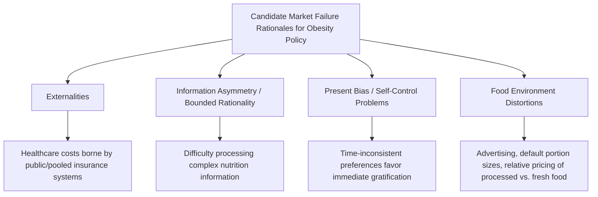

## Obesity and Public Health Economics

### Definition and Scope

Obesity and public health economics examines the economic causes and consequences of rising body weight and diet-related non-communicable disease, and evaluates the policy instruments available to address them. It integrates food demand theory, behavioral economics of dietary choice, health economics, and welfare analysis to address a central applied question: to what extent does obesity reflect a market failure warranting government intervention, versus a matter of informed individual preference that policy should not override.

### Measuring Obesity and Its Economic Burden

Obesity is most commonly measured using **Body Mass Index (BMI)**:

$$BMI = \frac{weight_{kg}}{height_{m}^2}$$

with standard classification thresholds (e.g., overweight and obese categories) used in epidemiological and economic surveillance, though [Unverified] specific classification thresholds and their clinical/policy application have been subject to ongoing revision and debate (including population-specific adjustments and critiques of BMI as a measure), so current classification standards should be verified against current public health guidance rather than assumed fixed.

#### Cost-of-Illness Estimation

Economic burden estimates for obesity typically combine:

- **Direct medical costs**: healthcare expenditure attributable to obesity-related conditions (type 2 diabetes, cardiovascular disease, certain cancers, musculoskeletal conditions).
- **Indirect costs**: productivity losses from absenteeism, presenteeism (reduced on-the-job productivity), premature mortality, and disability.

$$C_{obesity} = C_{direct} + C_{indirect}$$

[Inference] Aggregate national or global cost-of-obesity estimates vary substantially across studies depending on methodology (attributable fraction assumptions, discount rates, included cost categories), so any specific aggregate cost figure should be treated as a study-specific estimate rather than a single agreed value, and current estimates should be checked via search given the ongoing accumulation of new cost-of-illness research.

### Is Obesity a Market Failure? The Core Policy Debate

The economic case for public intervention in obesity policy rests on identifying genuine market failures, since standard welfare economics holds that informed, rational individual food choices — even those leading to weight gain — do not by themselves justify government intervention absent a market failure or externality.

#### Externality Argument

Where healthcare costs are pooled — through public health insurance systems, employer-sponsored insurance risk pooling, or cross-subsidization within private insurance markets — an individual's obesity-related healthcare costs are partly borne by others in the risk pool rather than fully internalized by the individual, creating a genuine externality that provides a standard efficiency rationale (distinct from paternalism) for policy intervention such as taxation of goods contributing to the externality-generating behavior.

$$MSC = MPC + MEC$$

where $MSC$ is marginal social cost, $MPC$ is marginal private cost borne by the consumer, and $MEC$ is the marginal external cost imposed on the risk-pooled healthcare system — mirroring the standard Pigouvian externality framework applied elsewhere in environmental and public economics.

#### Information and Bounded Rationality Arguments

As discussed under nutrition economics and dietary choice, bounded rationality in processing complex nutritional information can lead to systematically suboptimal choices even relative to the consumer's own informed preferences, providing an information-based (rather than purely paternalistic) rationale for simplified labeling and information policy.

#### Present Bias and Self-Control Arguments

**Time-inconsistent preferences** (quasi-hyperbolic discounting) imply that a consumer's choices at the moment of consumption may systematically diverge from what that same consumer's own "long-run self" would prefer, given full deliberation. This is the theoretical basis for **"libertarian paternalism"** or "asymmetric paternalism" policy approaches — interventions designed to help consumers act more consistently with their own stated long-run preferences (e.g., default option changes, commitment devices) without eliminating choice, distinguished from stronger paternalistic approaches that override stated preferences entirely.

[Inference] Whether present-bias-based policy justifications constitute a genuine "market failure" in the strict welfare-economic sense, or instead represent a different (preference-based) rationale for intervention, remains a genuinely contested question in the underlying behavioral welfare economics literature, and reasonable economists differ on how much normative weight to place on revealed present-biased choices versus inferred long-run preferences.

#### Food Environment and Market Distortion Arguments

Some economists argue that existing food environments are themselves shaped by market distortions — including agricultural subsidy structures that may lower relative prices of certain processed food inputs, concentrated food industry advertising targeting price-insensitive attention channels (particularly toward children), and retail/restaurant choice architecture optimized for firm profit rather than consumer welfare — constituting a less standard but economically arguable rationale for correcting the resulting relative price and information environment rather than treating individual choice as occurring in a neutral market setting.

### Policy Instruments

#### Price-Based Instruments: Sugar-Sweetened Beverage and "Fat" Taxes

Taxation of specific nutritionally targeted categories (most commonly sugar-sweetened beverages) is the most widely implemented and studied price-based obesity policy instrument.

$$Q_d = Q_0 \times (1 + \eta_p \times \%\Delta P)$$

where $\eta_p$ is the own-price elasticity of demand for the taxed good. Tax effectiveness depends critically on:

- **Own-price elasticity of the taxed good**: more elastic demand implies a larger quantity response to a given tax-induced price increase.
- **Cross-price elasticity with untaxed substitutes**: a tax's net health effect depends on whether consumers substitute toward healthier or comparably unhealthy untaxed alternatives (e.g., substituting from taxed sugar-sweetened beverages to untaxed high-calorie alternatives would undermine the tax's intended health effect).
- **Pass-through rate**: the extent to which the tax is passed through to retail consumer prices versus absorbed by producers/retailers in reduced margins, which is itself an empirical question dependent on market structure and competitive conditions.

[Inference] The empirical literature on sugar-sweetened beverage tax effectiveness shows meaningful but study-specific variation in estimated price elasticities, pass-through rates, and net health outcome effects across different implemented tax jurisdictions, so specific quantitative effect estimates should be drawn from current, jurisdiction-specific evaluation studies rather than treated as a single generalizable effect size.

#### Subsidy-Based Instruments

Subsidizing healthier food categories (fruits and vegetables, in some program designs) to shift relative prices in the opposite direction from taxation, often implemented within food assistance program design (e.g., incentive programs that provide matching funds for fruit/vegetable purchases within food assistance benefit structures) rather than as broad-based price subsidies, given the substantial fiscal cost of universal healthy-food subsidization.

#### Information and Choice Architecture Instruments

Nutrition labeling (including front-of-pack simplified systems, discussed under food labeling and information economics), menu labeling requirements in restaurant/foodservice settings, and default-option nudges (e.g., default beverage or side-dish options in institutional food service settings) targeting the bounded-rationality and present-bias mechanisms discussed above.

#### Regulatory Instruments

Restrictions on child-directed advertising for nutritionally poor foods, school nutrition standards, portion size or serving standards in specific contexts, and, in some jurisdictions, more direct restrictions such as sales restrictions on specific high-sugar products in certain settings.

#### Built Environment and Access Instruments

Zoning and incentive policies affecting the local food retail environment (addressing the food desert hypothesis discussed under nutrition economics), physical activity infrastructure investment (parks, walkability), though [Inference] as noted under nutrition economics, the evidence on built-environment interventions' direct effect on obesity outcomes is mixed and context-dependent rather than uniformly supportive of strong effect sizes.

### Worked Example: Sugar-Sweetened Beverage Tax Incidence and Effect

**Example**

Suppose a city imposes a $0.01 per ounce tax on sugar-sweetened beverages, and pre-tax price is $0.10 per ounce, with an estimated own-price elasticity of demand of $\eta_p = -1.2$ (illustrative parameter for demonstrating the calculation mechanics).

Assuming full pass-through of the tax to retail price (a simplifying assumption; actual pass-through rates are an empirical question dependent on market competitiveness):

$$\%\Delta P = \frac{0.01}{0.10} = 10\%$$

$$\%\Delta Q = \eta_p \times \%\Delta P = -1.2 \times 10\% = -12\%$$

A 10% price increase from the tax would, under this illustrative elasticity assumption, be associated with an estimated 12% reduction in quantity demanded. However, the *net health effect* depends further on substitution patterns: if consumers substitute a meaningful share of the reduced sugar-sweetened beverage consumption toward other caloric beverages or foods, the net caloric/health effect would be smaller than the raw 12% quantity reduction in the taxed category alone suggests — illustrating why cross-price substitution analysis, not just own-price elasticity, is essential to evaluating a tax's actual public health effectiveness, not merely its effectiveness at reducing consumption of the specifically taxed good.

### Regressivity and Distributional Considerations

**Key Points**

- Sin taxes on food/beverage categories are frequently criticized as **regressive** — since lower-income households tend to spend a larger *share* of income on the taxed goods, and in some studies show higher baseline consumption of taxed categories, the tax burden as a share of income falls disproportionately on lower-income households.
- Proponents counter that health *benefits* from reduced consumption may also disproportionately accrue to lower-income populations if baseline consumption and associated health risk are higher in these groups, meaning the health-benefit distribution may partially or fully offset the tax-burden distribution — an empirical question about the relative magnitude of these offsetting distributional effects rather than a settled conclusion.
- Revenue recycling design (e.g., directing sugar-sweetened beverage tax revenue toward health programs targeted at affected communities) is a common policy design response intended to address regressivity concerns directly, though [Inference] the effectiveness of such revenue recycling in fully offsetting regressive tax incidence is itself an empirical and design-dependent question rather than automatically achieved by revenue earmarking alone.

### Comparative Summary: Obesity Policy Instruments

| Instrument | Mechanism | Primary Market Failure Addressed | Key Limitation |
| --- | --- | --- | --- |
| SSB/fat taxes | Price increase on targeted goods | Externality (pooled healthcare costs) | Substitution to untaxed alternatives; regressivity |
| Healthy food subsidies | Price decrease on targeted goods | Externality; access | Fiscal cost; limited effect without complementary policy |
| Nutrition/menu labeling | Reduces information processing cost | Bounded rationality | Limited attention/engagement with labels |
| Advertising restrictions (child-directed) | Reduces persuasive marketing exposure | Bounded rationality in vulnerable population | Enforcement and definitional challenges |
| Default/choice architecture nudges | Alters default option, not choice set | Present bias/self-control | Effect size often smaller than price instruments |
| Built environment/access policy | Alters food environment | Access-related market gaps | Mixed empirical evidence on direct effect |

### Related Topics

- Nutrition economics and dietary choice
- Sugar-sweetened beverage taxation and price elasticity estimation
- Behavioral economics and present-bias/self-control models
- Food labeling and information economics
- Health insurance risk pooling and externality theory
- Food desert research and spatial food access economics
- Cost-of-illness estimation methodology in public health economics
- Libertarian paternalism and choice architecture policy design