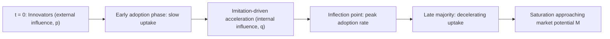

## Technology Adoption and Diffusion Models

### Definition and Scope

Technology adoption and diffusion models study how new agricultural technologies — improved seed varieties, mechanization, precision agriculture tools, digital platforms, biotechnology — spread through farmer populations over time, and what factors determine both the speed of diffusion and the ultimate share of farmers who adopt. This field combines econometric adoption modeling (analyzing individual farmer adoption decisions) with aggregate diffusion modeling (analyzing population-level spread patterns over time), and is foundational to agricultural extension policy, technology targeting, and innovation investment decisions.

### The Individual Adoption Decision: Theoretical Foundations

#### Expected Utility Framework

The standard microeconomic model treats technology adoption as a decision under uncertainty, where a farmer adopts a new technology if its expected utility exceeds that of the existing practice.

$$Adopt = 1 \text{ if } E[U(\pi_{new})] > E[U(\pi_{old})]$$

where $\pi_{new}$ and $\pi_{old}$ are the profit distributions under the new and existing technology respectively, and expectation is taken over the farmer's subjective probability distribution of outcomes, which may itself differ from the true underlying distribution during early adoption phases before learning occurs.

#### Threshold/Latent Variable Model

Empirically, adoption is commonly modeled using a latent variable (index function) framework, where an unobserved net benefit index $Y_i^*$ determines observed binary adoption behavior $Y_i$:

$$Y_i^* = \beta X_i + \varepsilon_i, \qquad Y_i = 1 \text{ if } Y_i^* > 0, \text{ else } 0$$

where $X_i$ is a vector of farmer, farm, and technology characteristics, and $\varepsilon_i$ is an unobserved error term. This is typically estimated via **probit** or **logit** regression, given the binary nature of the observed adoption outcome.

$$Pr(Y_i = 1 | X_i) = \Phi(\beta X_i) \quad \text{(probit)} \quad \text{or} \quad \frac{e^{\beta X_i}}{1 + e^{\beta X_i}} \quad \text{(logit)}$$

### Determinants of Adoption

**Key Points**

- **Farmer characteristics**: age, education, farming experience, risk aversion, and access to information all shape adoption likelihood. [Inference] The literature shows generally consistent (though not universal) findings that education and access to information are positively associated with adoption across many studied contexts, while the direction and magnitude of age effects vary across studies and contexts, so specific directional claims for any given determinant should be checked against context-specific evidence rather than assumed uniform.
- **Farm characteristics**: farm size, land tenure security, soil quality, and access to irrigation affect both the profitability and feasibility of adopting specific technologies — larger or more secure-tenure farms often face lower relative fixed costs of adoption and stronger long-horizon investment incentives.
- **Economic factors**: relative profitability of the new technology, upfront capital cost, availability and cost of credit, and output/input price ratios.
- **Risk and uncertainty**: farmer risk aversion combined with production or price uncertainty associated with the new technology; risk-averse farmers may delay adoption of technologies with higher expected but more variable returns, even when expected profitability favorably exceeds that of the existing practice.
- **Institutional and infrastructure factors**: access to extension services, input supply chain reliability, output market access, and land tenure institutions.
- **Social factors**: peer effects, social learning, and network position within the farming community (discussed further below).

### Diffusion Models: Aggregate Adoption Over Time

While individual-level adoption models explain *who* adopts and *why*, diffusion models explain the *time path* of aggregate adoption across a population, typically producing the empirically well-documented **S-shaped (sigmoid) adoption curve**: slow initial uptake, an accelerating middle phase, and a decelerating approach toward a ceiling adoption rate.

#### Bass Diffusion Model

The **Bass Diffusion Model** (Bass, 1969), originally developed for consumer durable goods but widely applied to agricultural technology diffusion, models the rate of adoption as driven by two forces: innovation (independent adoption, not influenced by others) and imitation (adoption influenced by prior adopters).

$$\frac{dN(t)}{dt} = \left[p + q\frac{N(t)}{M}\right][M - N(t)]$$

where $N(t)$ is cumulative adopters at time $t$, $M$ is the market potential (ceiling number of eventual adopters), $p$ is the coefficient of innovation (external influence, e.g., mass media, extension campaigns), and $q$ is the coefficient of imitation (internal influence, e.g., peer/social learning effects). The resulting cumulative adoption curve is S-shaped, with the inflection point (peak adoption rate) occurring earlier when $q$ is large relative to $p$ (imitation-dominated diffusion) and later, with a flatter curve, when $p$ dominates.

#### Adoption Curve Diagram (svg_diagram)

<svg xmlns="http://www.w3.org/2000/svg" viewBox="0 0 700 420" font-family="Helvetica, Arial, sans-serif">
<text x="350" y="28" text-anchor="middle" font-size="17" font-weight="bold" fill="#1f2d3d">S-Curve Technology Diffusion (svg_diagram)</text>
<line x1="80" y1="360" x2="640" y2="360" stroke="#333" stroke-width="2" />
<line x1="80" y1="360" x2="80" y2="50" stroke="#333" stroke-width="2" />
<text x="360" y="395" text-anchor="middle" font-size="13" fill="#333">Time</text>
<text x="35" y="205" text-anchor="middle" font-size="13" fill="#333" transform="rotate(-90 35 205)">Cumulative Adoption</text>
<path d="M 90 350 C 200 348, 280 320, 340 250 S 480 100, 620 75" fill="none" stroke="#2f6f4f" stroke-width="3" />
<line x1="80" y1="90" x2="640" y2="90" stroke="#999" stroke-width="1" stroke-dasharray="4,4" />
<text x="600" y="82" font-size="11" fill="#666">Market potential (M)</text>
<circle cx="340" cy="250" r="5" fill="#b5541e" />
<text x="350" y="240" font-size="11" fill="#b5541e">Inflection point</text>

<text x="120" y="345" font-size="10.5" fill="#333">Innovators</text>

<text x="230" y="300" font-size="10.5" fill="#333">Early Adopters</text>

<text x="360" y="200" font-size="10.5" fill="#333">Early Majority</text>

<text x="470" y="130" font-size="10.5" fill="#333">Late Majority</text>

<text x="560" y="95" font-size="10.5" fill="#333">Laggards</text>

</svg>

### Rogers' Diffusion of Innovations Framework

A complementary, more sociologically grounded framework — Rogers' (1962) **Diffusion of Innovations** theory — classifies adopters into categories based on relative timing of adoption, and identifies technology-level attributes that influence diffusion speed.

#### Adopter Categories

Based on the assumption of a roughly normal distribution of adoption timing, standard categories (by cumulative percentage of the eventual adopter population) are: **innovators** (~2.5%), **early adopters** (~13.5%), **early majority** (~34%), **late majority** (~34%), and **laggards** (~16%). [Inference] These specific percentage breakdowns derive from Rogers' original theoretical framework based on a normal distribution assumption and are a stylized heuristic rather than an empirically fixed law that holds precisely across all specific technology diffusion cases.

#### Technology Attributes Affecting Diffusion Speed

Rogers identifies five perceived technology characteristics that influence the rate of adoption:

- **Relative advantage**: the degree to which the innovation is perceived as better than the practice it supersedes.
- **Compatibility**: consistency with existing values, past experiences, and needs of potential adopters.
- **Complexity**: the degree of difficulty in understanding and using the innovation (inversely related to adoption speed).
- **Trialability**: the extent to which the innovation can be experimented with on a limited basis before full commitment.
- **Observability**: the degree to which results of the innovation are visible to others, which directly feeds the imitation/social learning mechanism central to the Bass model's $q$ parameter.

### Social Learning Models

Building on the imitation mechanism in the Bass model, **social learning models** in agricultural economics (notably associated with Foster and Rosenzweig's work on Green Revolution technology adoption) formalize how farmers update their beliefs about a new technology's profitability by observing outcomes on neighbors' or peers' plots, addressing the information uncertainty that constrains early adoption.

$$E[\theta | \text{observed outcomes}] = \text{updated belief about technology profitability, via Bayesian updating}$$

As more neighbors adopt and their outcomes become observable, uncertainty about the technology's true profitability under local conditions declines, reducing the informational barrier to adoption for subsequent farmers — a mechanism that generates the accelerating middle phase of the S-curve endogenously from information dynamics, rather than merely from exogenous imitation preference as in the reduced-form Bass model.

**Key Points**

- Social learning models distinguish **learning-by-doing** (a farmer's own experience with the technology over successive seasons) from **learning-from-others** (observing neighbors' outcomes), both of which contribute to reduced uncertainty and increased adoption likelihood over time.
- This framework has direct implications for extension program design: strategically targeting influential or well-observed "model farmers" for initial technology introduction can accelerate subsequent diffusion through the observability/social learning channel, a widely used practical strategy in agricultural extension programming.

### Adoption Intensity vs. Adoption Decision

Applied adoption research distinguishes between the **binary adoption decision** (whether a farmer adopts at all) and **adoption intensity** (the extent or scale of adoption, e.g., share of land area planted to a new variety, or degree of input intensity under a new practice), since these can have different determinants and are often modeled using different econometric approaches.

$$Intensity_i = \gamma Z_i + \mu_i \quad \text{(conditional on } Y_i = 1\text{)}$$

This two-stage structure is often estimated using a **Heckman selection model** or a **double-hurdle model**, which separately models the adoption decision (first hurdle) and the intensity of adoption conditional on adoption occurring (second hurdle), since factors determining whether a farmer adopts at all may differ from factors determining how extensively they adopt.

### Disadoption and Non-Adoption

Diffusion models increasingly account for **disadoption** (farmers who adopt and later abandon a technology) and persistent non-adoption, rather than assuming adoption is a one-way, permanent state. [Inference] Reasons for disadoption documented in the literature include realized profitability falling short of expectations formed during the initial adoption decision, changing relative input/output prices, technology-specific agronomic problems emerging over time (e.g., pest resistance developing to a previously effective technology), and changing farmer circumstances (land tenure change, labor availability change) — the relative importance of these factors is context and technology-specific rather than generalizable to a single dominant explanation.

### Worked Example: Estimating a Logit Adoption Model

**Example**

Suppose a study estimates the following logit model of adoption of a drought-tolerant maize variety:

$$Pr(Adopt = 1) = \frac{1}{1 + e^{-(\beta_0 + \beta_1 Education + \beta_2 FarmSize + \beta_3 ExtensionContact)}}$$

with illustrative estimated coefficients $\beta_0 = -2.1$, $\beta_1 = 0.15$ (years of education), $\beta_2 = 0.08$ (hectares), $\beta_3 = 0.9$ (extension contact, binary) — illustrative parameters for demonstrating model mechanics, not empirically estimated values for any specific real study.

For a farmer with 6 years of education, 2 hectares, and extension contact ($=1$):

$$Index = -2.1 + 0.15(6) + 0.08(2) + 0.9(1) = -2.1 + 0.9 + 0.16 + 0.9 = -0.14$$

$$Pr(Adopt=1) = \frac{1}{1+e^{0.14}} = \frac{1}{1+1.150} \approx 0.465$$

This illustrates the standard logit prediction mechanics: given this farmer's specific characteristics, the model predicts an estimated 46.5% probability of adoption. The marginal effect of a change in any single characteristic (e.g., an additional extension contact) can be computed by recalculating the predicted probability with that variable's value changed, holding others constant — illustrating why extension access, in this illustrative specification, has a comparatively large estimated effect on predicted adoption probability relative to the other included variables.

### Policy Applications

- **Extension program design**: targeting model/lead farmers to accelerate social learning-driven diffusion, sequencing information campaigns to complement rather than substitute for peer observation effects.
- **Technology targeting**: identifying farmer and farm characteristics associated with higher expected adoption probability and profitability, to prioritize limited extension resources toward contexts where technology fit is strongest.
- **Credit and input market policy**: addressing capital constraints identified as adoption barriers through targeted credit access or input subsidy programs, particularly relevant where upfront technology cost is a binding constraint independent of expected long-run profitability.
- **Risk mitigation policy**: index insurance and other risk-transfer mechanisms designed to reduce the risk-aversion barrier to adoption of technologies with favorable expected but variable returns.
- **Digital agriculture and precision agriculture diffusion**: contemporary application of these same adoption/diffusion frameworks to newer technology categories (variable-rate application, farm management software, remote sensing tools), where [Inference] adoption barriers and diffusion patterns are still being actively characterized in an evolving empirical literature, given the relative recency of many digital agriculture tools relative to the longer-studied historical Green Revolution technology adoption literature.

### Comparative Summary: Adoption and Diffusion Frameworks

| Framework | Level of Analysis | Core Mechanism | Primary Output |
| --- | --- | --- | --- |
| Expected utility/threshold model | Individual farmer | Expected profit comparison under uncertainty | Binary adoption probability |
| Bass Diffusion Model | Population/aggregate | Innovation (p) + imitation (q) | S-shaped cumulative adoption curve over time |
| Rogers' Diffusion of Innovations | Population, adopter categories | Technology attributes + adopter characteristics | Adopter category classification, diffusion speed prediction |
| Social learning model | Individual, with peer interaction | Bayesian belief updating from observed outcomes | Adoption probability evolving endogenously with peer adoption |
| Double-hurdle/Heckman model | Individual, two-stage | Separate adoption decision and intensity decision | Adoption probability + conditional intensity |

### Related Topics

- Agricultural extension program design and delivery models
- Precision agriculture and digital farming technology adoption
- Risk management and index insurance in technology adoption decisions
- Green Revolution technology diffusion and social learning literature
- Credit constraints and agricultural technology investment
- Econometric methods for binary and censored outcome models (probit, logit, Heckman, double-hurdle)
- Agricultural research and development investment prioritization
- Land tenure security and technology investment incentives