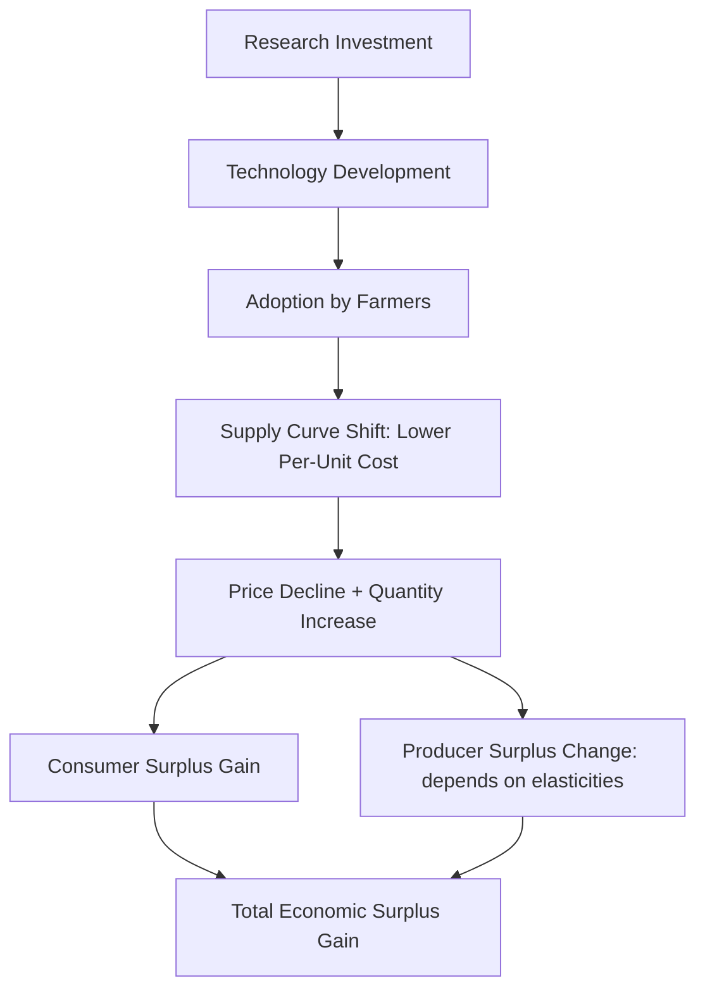
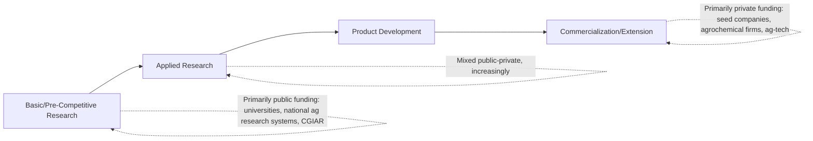

## Agricultural Research and Development Economics

### Definition and Scope

Agricultural research and development (R&D) economics studies the investment, production, and returns to research generating new agricultural technologies — improved crop varieties, production practices, mechanization, and biotechnology — and the institutional arrangements (public, private, and international) governing agricultural innovation. This field addresses why agricultural R&D exhibits distinctive market failure characteristics relative to R&D in other sectors, how research returns are measured, and how public and private roles in the agricultural innovation system should be structured.

### The Public Goods Rationale for Public Agricultural R&D

Agricultural research, particularly basic and pre-competitive research, has historically been treated as exhibiting **public good characteristics** — non-rivalry (one farmer's use of improved knowledge does not diminish its availability to others) and, especially prior to strong intellectual property enforcement, **non-excludability** (difficulty preventing non-payers from benefiting, since knowledge and, in some cases, biological materials like seed can be replicated or saved by farmers).

$$MSB_{research} > MPB_{research}$$

Where marginal social benefit ($MSB$) of research investment exceeds marginal private benefit ($MPB$) captured by any individual private investor, private R&D investment tends to fall below the socially optimal level — the standard public goods underinvestment result, providing the core economic rationale for public funding of agricultural research (via national agricultural research systems, international agricultural research centers, and university-based research).

### Rate of Return Analysis

The dominant empirical approach for justifying and evaluating agricultural R&D investment is **rate of return (ROR) analysis**, measuring the economic surplus generated by research relative to research cost.

#### Economic Surplus Framework

Agricultural research that increases productivity (shifts the supply curve outward, or reduces per-unit production costs) generates economic surplus distributed between producers and consumers, depending on the elasticities of supply and demand and the extent of the supply shift.

$$\Delta TS = \Delta PS + \Delta CS$$

where $\Delta TS$ is the change in total economic surplus attributable to the research-induced technology, decomposed into changes in producer surplus ($\Delta PS$) and consumer surplus ($\Delta CS$). The standard graphical framework models a research-induced downward (rightward) shift in the supply curve resulting from cost-reducing technology adoption.

#### Internal Rate of Return Calculation

The **Internal Rate of Return (IRR)** on agricultural research investment is the discount rate that equates the present value of research benefits (economic surplus generated over time, net of adoption lags) to the present value of research costs.

$$\sum_{t=0}^{T} \frac{B_t - C_t}{(1+r)^t} = 0$$

where $B_t$ is the economic surplus benefit in year $t$ (typically zero or near-zero during the research and initial adoption-lag period, then rising as adoption diffuses per the S-curve diffusion pattern discussed under technology adoption models, before eventually declining as the technology becomes obsolete or superseded), and $C_t$ is research cost in year $t$. The IRR $r$ that satisfies this equation is compared to a benchmark opportunity cost of capital to assess whether the research investment was (or is projected to be) economically justified.

[Inference] A substantial body of empirical agricultural R&D rate-of-return studies, spanning many decades and countries, has generally found high average estimated returns to public agricultural research relative to typical capital market benchmarks, though individual study estimates vary considerably by methodology, research category, country, and time period, and are also subject to well-documented methodological critiques (including publication bias toward high-return studies and attribution challenges in isolating research's specific contribution to observed productivity growth) — so any specific aggregate rate-of-return figure should be treated as a study-specific and methodology-dependent estimate rather than a single settled value.

### Research Lags and Adoption Lags

A methodologically important feature of agricultural R&D evaluation is accounting for substantial time lags between research investment and realized economic benefit:

- **Research lag**: the time from initial research investment to development of a usable technology (e.g., years of plant breeding required to develop and field-test a new variety).
- **Adoption lag**: the time from technology availability to widespread farmer adoption, following the S-curve diffusion pattern discussed under technology adoption and diffusion models.
- **Depreciation/obsolescence**: the technology's economic benefit eventually declines as it is superseded by newer research or as pest/disease pressure erodes its relative advantage (e.g., resistance breakdown in disease-resistant varieties over time).

$$B_t = f(t - t_{research\_lag} - t_{adoption\_lag}) \times [1 - \delta(t)]$$

where $\delta(t)$ represents an obsolescence/depreciation function reducing benefit over time as the technology ages relative to alternatives. Because these lags can span a decade or more between initial investment and peak realized benefit, R&D rate-of-return calculations are highly sensitive to lag structure assumptions and the discount rate applied.

### Research Spillovers

Agricultural research benefits frequently **spill over** geographically and across research boundaries, complicating attribution and creating additional public-goods-related underinvestment concerns at sub-national, national, and international levels:

- **Geographic/agroecological spillovers**: research conducted in one region can benefit farmers in other regions with similar agroecological conditions, without those regions having contributed to research funding.
- **International spillovers**: international agricultural research centers (e.g., those within the CGIAR system) explicitly aim to generate internationally transferable research benefits, particularly for crops and challenges relevant across multiple developing countries.
- **Cross-commodity and cross-sector spillovers**: basic research (e.g., in plant genetics or soil science) frequently generates applications beyond its originally targeted crop or purpose.

[Inference] The existence of substantial spillovers reinforces the public goods underinvestment argument at a national level specifically, since an individual country's research investment may generate benefits partially captured by other countries, potentially reducing any single country's private incentive to invest at the internationally efficient level absent coordinated international research funding mechanisms.

### Public vs. Private Roles in the Agricultural Innovation System

#### Intellectual Property and the Shifting Public-Private Balance

The historical public-goods rationale for predominantly public agricultural R&D funding has been substantially reshaped by the strengthening of **intellectual property rights** in agricultural biotechnology — plant variety protection, utility patents on genetic traits, and hybrid seed technology (which creates a natural excludability mechanism, since hybrid seed saved and replanted by farmers loses the yield advantage of the parent generation, unlike open-pollinated varieties).

This IP strengthening has enabled substantially increased **private sector investment** in applied agricultural research and product development, particularly in seed genetics, crop protection chemistry, and precision agriculture technology, while public research investment has increasingly concentrated on more basic/pre-competitive research, research for crops and problems with limited private commercial return (e.g., orphan crops important in developing-country food security but with limited commercial seed market potential), and research with strong public-good characteristics such as environmental and natural resource management research.

**Key Points**

- The public-private research balance varies substantially by crop and research category: major commodity crop breeding in wealthy countries has seen substantial private investment growth, while research on crops important primarily to smallholder farmers in developing countries, and research on ecosystem services or resource conservation, remains predominantly publicly and internationally funded, given weaker private commercial return potential in these categories.
- This divergence has motivated ongoing policy debate about appropriate public research investment levels and targeting, particularly for research categories where private investment incentives remain structurally weak regardless of IP protection strength.

### The International Agricultural Research System

The **CGIAR** (Consultative Group on International Agricultural Research) system represents the primary institutional mechanism for internationally coordinated public agricultural research targeting developing-country food security and agricultural productivity, operating through a network of international agricultural research centers historically associated with Green Revolution crop breeding achievements and continuing research across crop genetics, natural resource management, and agricultural policy. [Unverified] Specific current CGIAR institutional structure, funding levels, and research center organization have been subject to periodic reform and reorganization, so current organizational details should be verified via current search rather than assumed from general background knowledge given the dynamic nature of international research governance arrangements.

### Worked Example: Simplified Economic Surplus Calculation

**Example**

Suppose agricultural research produces a new wheat variety that reduces per-unit production cost by 10%, in a market with linear supply and demand, initial equilibrium price $P_0 = \$5$/bushel and quantity $Q_0 = 1{,}000{,}000$ bushels, supply elasticity $\epsilon_s = 1.0$, and demand elasticity $\epsilon_d = -0.5$ (illustrative parameters for demonstrating the calculation approach).

Using the standard economic surplus approximation for a parallel supply shift of proportional size $k$ (here $k = 0.10$, a 10% reduction in marginal cost):

$$\Delta TS \approx P_0 Q_0 \times k \times \left(1 - \frac{k}{2}\times\frac{\epsilon_s}{\epsilon_s + |\epsilon_d|}\right)$$

This is a standard simplified surplus-change approximation formula used in agricultural research evaluation literature; applying the given illustrative values:

$$\Delta TS \approx (5 \times 1{,}000{,}000) \times 0.10 \times \left(1 - \frac{0.10}{2} \times \frac{1.0}{1.0+0.5}\right)$$

$$\Delta TS \approx 500{,}000 \times \left(1 - 0.05 \times 0.667\right) \approx 500{,}000 \times (1 - 0.033) \approx 500{,}000 \times 0.967 \approx \$483{,}500$$

This illustrates the mechanics of the standard economic surplus approximation used to estimate the annual gross benefit from a cost-reducing agricultural technology, given assumed elasticities and market size — in applied research evaluation studies, this annual benefit figure would then be projected forward across the technology's adoption and depreciation profile (per the lag structure discussion above) and discounted back to calculate present value and internal rate of return relative to actual research cost, rather than being treated as a single-year total benefit figure in isolation.

### Distribution of Research Benefits Between Producers and Consumers

The division of total surplus gain between producers ($\Delta PS$) and consumers ($\Delta CS$) depends on the relative elasticities of supply and demand:

$$\frac{\Delta PS}{\Delta CS} \approx \frac{|\epsilon_d|}{\epsilon_s}$$

More elastic supply relative to demand tends to shift a larger *share* of research-generated surplus toward consumers (via lower prices) rather than toward producers, since more elastic supply implies producers expand output substantially in response to the cost reduction, competing away much of the potential producer surplus gain through increased output and lower equilibrium price. [Inference] This theoretical elasticity-based distribution result is well-established in the agricultural research evaluation literature, though the specific empirical division observed in any given historical case depends on the actual elasticities prevailing in that specific market and time period, which vary across commodities and contexts.

### Comparative Summary: Research Category and Funding Source

| Research Category | Typical Excludability | Primary Funding Source | Example |
| --- | --- | --- | --- |
| Basic/pre-competitive research | Low (non-excludable knowledge) | Public (universities, national systems) | Plant genomics, soil science |
| Applied breeding, major commodity crops | Moderate–High (with IP protection) | Increasingly private | Hybrid corn, patented trait genetics |
| Orphan/subsistence crop research | Low (limited commercial market) | Public/international (CGIAR, national systems) | Cassava, millet, cowpea breeding |
| Natural resource/environmental research | Low (public good characteristics) | Public | Soil conservation, water management research |
| Precision agriculture/ag-tech development | High (proprietary software/hardware) | Private | Farm management software, sensor technology |

### Related Topics

- Technology adoption and diffusion models
- Intellectual property rights in plant breeding and biotechnology
- CGIAR system and international agricultural research governance
- Economic surplus theory and welfare measurement in applied policy analysis
- Green Revolution history and productivity growth accounting
- Public goods theory and market failure in innovation economics
- Agricultural extension systems and research-to-farmer knowledge transfer
- Total factor productivity growth measurement in agriculture