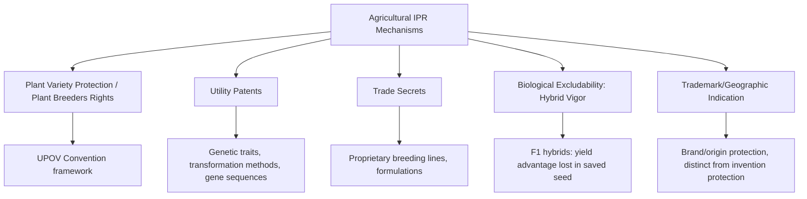
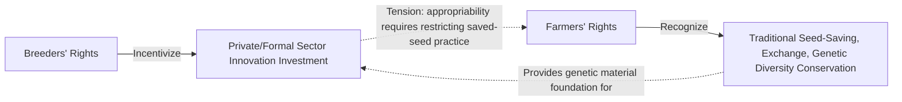

## Intellectual Property Rights in Agriculture

### Definition and Scope

Intellectual property rights (IPR) in agriculture are the legal mechanisms that grant innovators — plant breeders, biotechnology firms, and agricultural researchers — exclusive rights to control the use, reproduction, and sale of protected genetic materials, technologies, and inventions for a defined period. IPR economics analyzes how these legal protections address the appropriability problem inherent in agricultural innovation, shape the balance between private R&D investment incentive and the traditionally public-good character of agricultural knowledge (as discussed under agricultural research and development economics), and generate ongoing distributional and access tensions, particularly between commercial breeders and smallholder farmers in developing countries.

### The Economic Rationale for Agricultural IPR

#### The Appropriability Problem

Agricultural genetic innovation faces a distinctive **appropriability problem**: unlike many industrial inventions, a new plant variety, once released, can often be **self-replicated** by the purchaser (farmers saving and replanting seed), meaning an innovator's investment in developing the variety can be captured by subsequent generations of users without further payment to the innovator, absent some legal or biological mechanism restricting this practice.

$$\pi_{innovator} = (P - MC) \times Q_{first\_sale} \quad \text{(without protection, absent hybrid vigor loss)}$$

Without IPR protection (or a natural biological excludability mechanism such as hybrid vigor loss — see below), an innovator captures return only from the initial sale, since farmers can save seed for subsequent seasons at zero marginal cost, sharply reducing the innovator's ability to recoup research investment relative to the social value the innovation generates over its full useful life across all subsequent plantings.

#### Correcting Underinvestment

As established under agricultural R&D economics, the public goods characteristics of agricultural innovation lead to private underinvestment relative to the socially optimal level, absent an appropriability mechanism. IPR is the primary legal instrument intended to correct this underinvestment by artificially creating excludability — granting the innovator a legally enforceable exclusive right, thereby increasing $MPB_{research}$ toward $MSB_{research}$ and restoring private incentive to invest in variety development and biotechnology research.

### Major IPR Mechanisms in Agriculture

#### Plant Variety Protection (Plant Breeders' Rights)

**Plant Variety Protection (PVP)**, also called **Plant Breeders' Rights**, is a sui generis (specifically designed) form of intellectual property protecting new, distinct, uniform, and stable plant varieties, internationally coordinated primarily through the **UPOV Convention** (International Union for the Protection of New Varieties of Plants). PVP grants breeders exclusive rights over propagating material of a protected variety for a defined term, while traditionally including a **farmer's privilege** (also called farm-saved seed exemption) allowing farmers to save and replant seed from their own harvest for their own use, though not to sell it commercially, distinguishing PVP from the generally stronger exclusivity of utility patents.

[Unverified] Specific UPOV convention terms (including the scope and conditions of the farmer's privilege, which has narrowed under more recent UPOV convention revisions relative to earlier versions) vary depending on which UPOV convention version a given country has adopted, and current national implementation details should be verified against the applicable country's current law rather than assumed uniform across jurisdictions.

#### Utility Patents

**Utility patents** applied to agricultural biotechnology (genetically modified traits, gene sequences, transformation methods, and in some jurisdictions, the plant varieties themselves) generally provide stronger and broader exclusivity than PVP, typically without an equivalent farmer's privilege exemption — meaning a patented trait's protection can extend to prohibiting farmers from saving and replanting patented seed even for their own subsequent-season use, a legally and economically significant distinction from PVP's traditional farmer's privilege.

**Key Points**

- The shift toward utility patent protection for agricultural biotechnology (particularly prominent in genetically modified crop traits) has been a major driver of the substantial private-sector R&D investment growth observed in commercial seed and biotechnology markets, since it provides stronger appropriability than PVP alone.
- This same shift has generated significant legal and policy controversy regarding farmer seed-saving rights, given the loss of the farmer's privilege exemption that traditionally applied under PVP-only protection regimes.

#### Trade Secrets

Proprietary breeding lines, parental inbred lines used in hybrid seed production, and certain formulation or process information are frequently protected as **trade secrets** rather than through formal patent or PVP registration, particularly where the underlying genetic material or process can be kept confidential without public disclosure (unlike patents, which require public disclosure of the invention in exchange for protection).

#### Biological Excludability: Hybrid Seed Technology

**F1 hybrid seed** technology provides a distinctive **biological** (rather than purely legal) excludability mechanism: crossing two genetically distinct inbred parent lines produces a first-generation (F1) hybrid exhibiting **heterosis** (hybrid vigor), but seed saved from this F1 generation and replanted (F2) exhibits substantially reduced yield and uniformity due to genetic segregation, since the favorable hybrid vigor is not reliably inherited by subsequent generations. This creates a strong economic incentive for farmers to purchase fresh hybrid seed each season regardless of formal legal IP protection, and was a major driver of private hybrid seed industry development (particularly in maize) well before modern biotechnology patent protection became prevalent.

### Distributional and Access Tensions

#### Farmers' Rights vs. Breeders' Rights

A central and enduring tension in agricultural IPR policy is the balance between **breeders' rights** (the legal protections discussed above, intended to incentivize commercial innovation investment) and **farmers' rights** — a broader concept, formally recognized in certain international instruments (notably the FAO International Treaty on Plant Genetic Resources for Food and Agriculture), encompassing farmers' traditional practices of saving, using, exchanging, and selling farm-saved seed, and recognition of farmer and indigenous community contributions to the conservation and development of plant genetic diversity over generations, which underlies much of the genetic material used in modern commercial breeding programs.

[Inference] This tension is a genuinely contested area of ongoing international policy debate rather than one with a settled economic resolution, since reasonable economic and ethical arguments exist on multiple sides regarding the appropriate balance between incentivizing formal-sector innovation investment and preserving traditional farmer seed system practices and equitable benefit-sharing from genetic resources, particularly in the specific context of developing-country smallholder agriculture where formal seed markets may be less developed and traditional seed systems play a larger practical role.

#### Access and Benefit-Sharing for Genetic Resources

The **Convention on Biological Diversity** and its **Nagoya Protocol**, along with the FAO International Treaty on Plant Genetic Resources for Food and Agriculture, establish international frameworks governing access to genetic resources and the fair and equitable sharing of benefits arising from their use — addressing concerns that commercial breeders and biotechnology firms in wealthier countries have historically accessed genetic diversity originating in developing countries (including farmer-developed landraces and wild crop relatives) without corresponding benefit-sharing arrangements with the countries or communities of origin. [Unverified] Specific access and benefit-sharing legal requirements and their practical implementation vary substantially by country and have been subject to ongoing international negotiation, so current specific requirements should be verified against current international agreement text and national implementing legislation rather than assumed from general background knowledge.

### Economic Effects of Strengthened Agricultural IPR

#### Effects on Private R&D Investment

[Inference] Empirical research generally finds that strengthened IPR protection, particularly the shift toward utility patents for biotechnology traits, has been associated with substantial increases in private agricultural biotechnology R&D investment in the countries and crop categories where such protection has been most robustly implemented, though isolating the specific causal contribution of IPR strengthening from other concurrent factors (general biotechnology scientific advancement, market consolidation, changing regulatory approval pathways) is methodologically challenging, and study-specific findings should be consulted for precise quantitative effect estimates.

#### Effects on Seed Prices and Farmer Costs

Strengthened IPR, by design, allows innovators to capture greater returns from their innovation, which in practice is generally reflected in higher seed prices for patent-protected or PVP-protected varieties relative to unprotected varieties or farm-saved seed, representing the direct cost side of the IPR-innovation-incentive tradeoff from the farmer's perspective — the central empirical question in evaluating any specific IPR policy change is whether the resulting productivity gains and yield improvements from IPR-incentivized innovation are sufficient to offset the higher input cost for adopting farmers, which is a context- and technology-specific empirical question rather than one with a universal answer.

#### Effects on Market Structure

As discussed under mergers, acquisitions, and industry consolidation and food industry structure and vertical integration, strengthened IPR protection has been identified as a contributing factor in the substantial consolidation observed in the global seed and agricultural biotechnology industry, since IP-protected proprietary trait technology can function as a barrier to entry and a driver of scale-related merger activity, though [Inference] IPR strengthening is one of several contributing factors to this consolidation trend (alongside general economies of scale and scope in biotechnology R&D), and its relative contribution versus other consolidation drivers is not straightforward to isolate empirically.

### Worked Example: Simplified IPR Appropriability Comparison

**Example**

Consider a breeder who invests $10 million developing a new soybean variety expected to be planted on 500,000 hectares over its useful commercial life, with an assumed technology fee of $15/hectare under full patent protection with no seed-saving allowed.

Under **full patent protection** (no seed saving): the breeder can potentially capture technology fee revenue on hectares planted across the full commercial life if farmers must purchase new seed each season, though actual realized revenue depends on the adoption path (per the S-curve diffusion pattern discussed under technology adoption models) rather than immediate full-market capture.

Under a **PVP-only regime with farmer's privilege** (farm-saved seed permitted for own use): the breeder captures technology fee revenue only on hectares planted with newly purchased seed, and farmers who save and replant seed from their own harvest in subsequent seasons do not generate additional technology fee revenue for the breeder in those seasons — reducing the breeder's total capturable revenue relative to the full patent scenario, all else equal.

This stylized comparison illustrates the core economic mechanism by which the choice between patent-level and PVP-level protection directly affects an innovator's revenue capture and, consequently, ex-ante investment incentive — it is not a specific empirical prediction for any real soybean variety, since actual farmer seed-saving behavior, technology fee levels, and adoption paths vary substantially by crop, region, and specific market conditions.

### Comparative Summary: IPR Mechanisms in Agriculture

| Mechanism | Farmer Seed-Saving Allowed? | Typical Duration | Disclosure Requirement | Example Application |
| --- | --- | --- | --- | --- |
| Plant Variety Protection (PVP) | Generally yes, for own use (farmer's privilege) | Fixed term (commonly ~20-25 years, varies by jurisdiction) | Variety description, DUS testing | Conventional crop varieties |
| Utility patent | Generally no | Fixed term (commonly ~20 years from filing, varies by jurisdiction) | Full technical disclosure | GM traits, gene sequences, transformation methods |
| Trade secret | N/A (no legal seed-saving restriction; protection is via confidentiality) | Indefinite, while secrecy maintained | None (protection depends on non-disclosure) | Proprietary parent inbred lines |
| Hybrid seed (biological) | Technically allowed, but economically unattractive | N/A (ongoing biological mechanism, not a legal term) | None required | F1 hybrid maize, and other hybrid crops |

### Related Topics

- Agricultural research and development economics and rate of return analysis
- Mergers, acquisitions, and industry consolidation in seed/biotechnology
- FAO International Treaty on Plant Genetic Resources and farmers' rights
- Convention on Biological Diversity and access/benefit-sharing frameworks
- Technology adoption and diffusion models for patented agricultural technology
- Hybrid seed economics and heterosis
- Genetically modified crop regulation and market access
- Seed system development in smallholder agricultural contexts