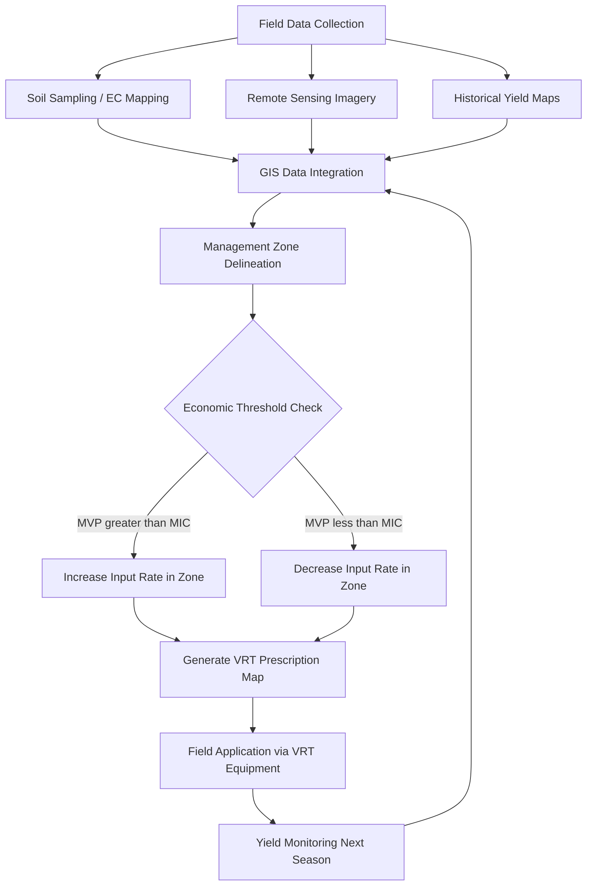

## Precision Agriculture and Digital Technologies

### Definition and Scope

Precision agriculture (PA) is a farm management approach that uses data, technology, and site-specific information to optimize input application, resource use, and decision-making across spatial and temporal variability within fields. It shifts management from uniform, field-level treatment to variable-rate, site-specific treatment based on observed or predicted conditions.

The economic core of precision agriculture is the reduction of input waste and yield loss caused by treating heterogeneous land as if it were homogeneous. Every field has spatial variability in soil fertility, moisture, pest pressure, and topography; PA technologies aim to measure that variability and match input intensity to it.

### Core Technology Components

**Global Navigation Satellite Systems (GNSS/GPS)**

Provides sub-meter to centimeter-level positioning used for auto-steering, field mapping, and geo-referencing all other data layers. Real-Time Kinematic (RTK) correction achieves 2–4 cm accuracy, essential for controlled traffic farming and precise seed/input placement.

**Geographic Information Systems (GIS)**

Software layer that stores, analyzes, and visualizes spatial data — yield maps, soil maps, elevation, imagery — as overlaid layers to identify management zones.

**Remote Sensing**

- Satellite imagery (multispectral, e.g., Sentinel-2, Landsat) for vegetation indices like $NDVI = \frac{NIR - Red}{NIR + Red}$
- Unmanned Aerial Vehicles (UAVs/drones) with RGB, multispectral, or thermal sensors for higher-resolution, on-demand scouting
- Proximal sensors (tractor-mounted optical sensors, e.g., GreenSeeker, Crop Circle) measuring canopy reflectance in real time

**Variable Rate Technology (VRT)**

Machinery capable of adjusting application rates (seed, fertilizer, pesticide, water) on the go according to a prescription map or real-time sensor feedback. Two control approaches:

- Map-based VRT: pre-loaded prescription map drives the controller
- Sensor-based VRT: real-time sensor readings adjust rates instantaneously (no pre-built map needed)

**Yield Monitoring**

Combine-mounted sensors (mass flow, moisture) combined with GNSS produce georeferenced yield maps, the foundational dataset for identifying management zones and evaluating input ROI.

**Farm Management Information Systems (FMIS)**

Software platforms (e.g., John Deere Operations Center, Climate FieldView) that aggregate machine data, imagery, and records into a unified dashboard for record-keeping, compliance, and decision support.

**IoT Sensor Networks**

In-field soil moisture probes, weather stations, and telemetry devices feeding continuous data streams for irrigation and pest-model decision support.

### Economic Rationale

**Input Cost Optimization**

PA's central economic proposition is applying inputs only where and when economically justified, rather than at a flat field-average rate. The relevant decision rule for any input follows the marginal principle: apply input up to the point where marginal value product (MVP) equals marginal input cost (MIC):

$$MVP = P_y \cdot \frac{\partial Y}{\partial X} = P_x = MIC$$

where $P_y$ is output price, $Y$ is yield, $X$ is input quantity, and $P_x$ is input price. Because response functions $\frac{\partial Y}{\partial X}$ vary spatially (due to soil, moisture, and other factors), a single field-average rate is economically suboptimal on both high- and low-responsive zones — over-applying in some, under-applying in others.

**Yield Response Heterogeneity**

Management zones with different response functions justify differentiated rates. A zone with high nutrient-use efficiency may have a higher economically optimal rate than a low-efficiency zone, even under identical crop prices.

**Cost-Benefit Structure**

- Fixed costs: capital investment in GNSS receivers, sensors, VRT-capable equipment, software subscriptions
- Variable/marginal costs: reduced input waste, potentially reduced labor
- Benefits: input savings, yield gains, reduced environmental externalities (runoff, leaching), and often price premiums or compliance value from sustainability certification

**Break-Even and Adoption Threshold**

[Inference] Adoption tends to be justified at larger farm sizes because fixed technology costs are spread over more hectares, lowering per-hectare technology cost — though the precise break-even scale depends heavily on local equipment costs, labor prices, and crop margins, and is not a fixed universal threshold.

### Key Data Analytics Methods

**Management Zone Delineation**

Clustering algorithms (k-means, fuzzy c-means) applied to layered data (yield history, soil EC, elevation, NDVI) to partition a field into zones with relatively homogeneous response characteristics.

**Yield Gap Analysis**

Comparing actual yield against attainable yield (given local climate/soil) or against the field's own highest-performing zones to quantify recoverable value.

**Spatial Regression and Geostatistics**

Kriging and other interpolation methods estimate values (e.g., soil nutrient levels) at unsampled points from sparse soil sampling grids, reducing sampling cost while preserving spatial resolution.

**Machine Learning Applications**

- Yield prediction from multispectral/weather time series
- Pest and disease detection from image classification (CNNs) on drone or camera imagery
- Optimal input recommendation via regression or reinforcement learning models trained on historical yield-response data

### Practical Example: Variable-Rate Nitrogen Prescription

**Example**

A 100-hectare maize field is divided into three management zones based on historical yield maps and soil organic matter:

| Zone | Yield Potential (t/ha) | N Response | Recommended N Rate (kg/ha) |
| --- | --- | --- | --- |
| A (high) | 11 | High | 220 |
| B (medium) | 8.5 | Medium | 170 |
| C (low, compacted) | 6 | Low | 120 |

Compared to a flat field-average rate of 175 kg/ha, this VRT prescription:

- Avoids over-application (and nitrate leaching risk) in Zone C
- Avoids under-application (and yield loss) in Zone A
- [Inference] Typically reduces total nitrogen use by 5–15% while maintaining or improving yield, though the actual outcome depends on the accuracy of zone delineation and seasonal weather.

### Adoption Determinants (Farm Economics Perspective)

**Key Points**

- **Farm size**: Larger operations more easily amortize fixed technology costs
- **Farmer education/human capital**: Technical literacy correlates with adoption likelihood and effective use
- **Access to credit**: Capital-intensive equipment requires financing access
- **Data connectivity infrastructure**: Rural broadband/cellular coverage constrains cloud-based FMIS use
- **Land tenure security**: Owner-operators face different incentive structures than short-term tenants for capital investment
- **Extension services and dealer support**: Availability of agronomic support for interpreting data outputs
- **Risk perception**: Uncertainty about ROI under variable weather and price conditions dampens adoption in risk-averse smallholder contexts

### Barriers and Constraints

**Key Points**

- High upfront capital cost relative to smallholder income, especially in developing-country contexts
- Data interoperability issues across proprietary platforms (vendor lock-in)
- Data ownership and privacy concerns — who owns farm-generated data (farmer, equipment manufacturer, or third-party platform) remains a contested policy and contractual issue
- Connectivity gaps in rural areas limiting real-time data transmission
- Requirement for technical skill to interpret maps and translate them into decisions
- [Speculation] Return on investment can be difficult to isolate econometrically from confounding factors like weather variability across seasons, making farm-level ROI studies methodologically challenging

### Environmental and Policy Dimensions

Precision agriculture is frequently promoted as a mechanism to reconcile productivity growth with environmental sustainability goals by reducing nutrient runoff, pesticide drift, and water overuse. This links PA to:

- Agri-environmental payment schemes that may condition subsidies on adoption of precision nutrient management
- Carbon credit and sustainability certification programs requiring documented input-use data
- Regulatory nutrient management plans (e.g., in nitrate-vulnerable zones) where VRT-generated records serve as compliance evidence

### System Architecture Overview (svg_diagram)

<svg xmlns="http://www.w3.org/2000/svg" viewBox="0 0 900 460" font-family="Arial, sans-serif">
<text x="450" y="30" font-size="18" font-weight="bold" text-anchor="middle" fill="#1a1a1a">Precision Agriculture Data Flow (svg_diagram)</text>

<rect x="30" y="60" width="180" height="70" rx="8" fill="#e8f4ea" stroke="#4a7c59" stroke-width="2" />
<text x="120" y="90" font-size="13" text-anchor="middle" fill="#2d4a35">GNSS / RTK</text>
<text x="120" y="110" font-size="13" text-anchor="middle" fill="#2d4a35">Positioning</text>
<rect x="230" y="60" width="180" height="70" rx="8" fill="#e8f4ea" stroke="#4a7c59" stroke-width="2" />
<text x="320" y="90" font-size="13" text-anchor="middle" fill="#2d4a35">Remote Sensing</text>
<text x="320" y="110" font-size="13" text-anchor="middle" fill="#2d4a35">(Satellite/UAV/Sensor)</text>
<rect x="430" y="60" width="180" height="70" rx="8" fill="#e8f4ea" stroke="#4a7c59" stroke-width="2" />
<text x="520" y="90" font-size="13" text-anchor="middle" fill="#2d4a35">Yield Monitors</text>
<text x="520" y="110" font-size="13" text-anchor="middle" fill="#2d4a35">(Combine sensors)</text>
<rect x="630" y="60" width="180" height="70" rx="8" fill="#e8f4ea" stroke="#4a7c59" stroke-width="2" />
<text x="720" y="90" font-size="13" text-anchor="middle" fill="#2d4a35">IoT Sensors</text>
<text x="720" y="110" font-size="13" text-anchor="middle" fill="#2d4a35">(Soil/Weather)</text>

<line x1="120" y1="130" x2="400" y2="190" stroke="#888" stroke-width="1.5" />
<line x1="320" y1="130" x2="420" y2="190" stroke="#888" stroke-width="1.5" />
<line x1="520" y1="130" x2="470" y2="190" stroke="#888" stroke-width="1.5" />
<line x1="720" y1="130" x2="500" y2="190" stroke="#888" stroke-width="1.5" />

<rect x="310" y="190" width="280" height="70" rx="8" fill="#dbe9f5" stroke="#2c6187" stroke-width="2" />
<text x="450" y="220" font-size="14" font-weight="bold" text-anchor="middle" fill="#1a3d52">GIS / FMIS Platform</text>
<text x="450" y="240" font-size="12" text-anchor="middle" fill="#1a3d52">Data integration &amp; storage</text>
<line x1="450" y1="260" x2="450" y2="300" stroke="#888" stroke-width="1.5" />

<rect x="230" y="300" width="180" height="70" rx="8" fill="#f5ecd9" stroke="#a67c2e" stroke-width="2" />
<text x="320" y="330" font-size="13" text-anchor="middle" fill="#5c4610">Analytics: Zoning,</text>
<text x="320" y="350" font-size="13" text-anchor="middle" fill="#5c4610">ML prediction</text>
<rect x="490" y="300" width="180" height="70" rx="8" fill="#f5ecd9" stroke="#a67c2e" stroke-width="2" />
<text x="580" y="330" font-size="13" text-anchor="middle" fill="#5c4610">Prescription Map</text>
<text x="580" y="350" font-size="13" text-anchor="middle" fill="#5c4610">Generation</text>
<line x1="320" y1="370" x2="450" y2="410" stroke="#888" stroke-width="1.5" />
<line x1="580" y1="370" x2="450" y2="410" stroke="#888" stroke-width="1.5" />

<rect x="300" y="410" width="300" height="40" rx="8" fill="#f5d9d9" stroke="#a13a3a" stroke-width="2" />
<text x="450" y="435" font-size="14" font-weight="bold" text-anchor="middle" fill="#5c1a1a">VRT Field Execution</text>
</svg>

### Decision Workflow Diagram

### Regional Considerations (Philippines Context)

[Inference] In smallholder-dominated systems such as much of Philippine agriculture, full-scale VRT/GNSS adoption faces stronger capital and scale constraints than in large mechanized farms; cooperative-based service provision (shared drone scouting, custom-hire VRT application) and mobile-based advisory tools are commonly proposed adaptations, though the specific adoption rate and effectiveness data for any given locality should be verified against current Department of Agriculture or IRRI program reports rather than assumed.

### **Next Steps**

- Remote sensing and vegetation indices (NDVI, NDRE) in crop monitoring
- Farm Management Information Systems (FMIS) architecture and data interoperability standards
- Econometric methods for evaluating precision agriculture ROI (yield-response function estimation)
- Smallholder technology adoption models (Diffusion of Innovation, Technology Acceptance Model in agri-tech)
- Digital agriculture policy: data ownership, privacy, and interoperability regulation
- Climate-smart agriculture and its overlap with precision agriculture practices
- Agricultural drone (UAV) economics: service-provider vs. ownership models