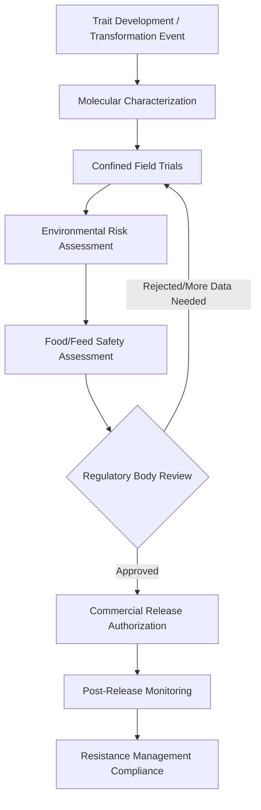

## Biotechnology and Genetically Modified Crops

### Definition and Scope

Agricultural biotechnology encompasses techniques that manipulate biological organisms, cells, or molecules to develop or improve agricultural products. Genetically modified (GM) crops — also called genetically engineered (GE) or transgenic crops — are a specific subset created by directly altering an organism's genome using recombinant DNA technology, transferring genes across species boundaries in ways not achievable through conventional breeding alone.

The economic significance of this technology lies in its capacity to alter production functions: shifting yield potential, reducing input requirements (particularly pesticides), and changing risk profiles for farmers facing pest, disease, or abiotic stress pressure.

### Core Technology Categories

**Transgenic Modification (Traditional GM)**

Insertion of foreign genes, typically via *Agrobacterium tumefaciens*-mediated transformation or gene gun (biolistic) methods. Common traits:

- **Bt crops**: incorporate genes from *Bacillus thuringiensis* producing insecticidal proteins (Cry toxins), conferring resistance to specific insect pests (e.g., Bt cotton against bollworm, Bt corn against corn borer)
- **Herbicide-tolerant (HT) crops**: genes (e.g., from soil bacteria) confer tolerance to specific herbicides, most notably glyphosate ("Roundup Ready" crops), allowing broad-spectrum weed control without crop damage

**Genome Editing (Newer Generation)**

Techniques such as CRISPR-Cas9, TALENs, and zinc-finger nucleases enable precise editing of an organism's own genome (knockouts, small edits) without necessarily introducing foreign DNA. This distinction matters regulatorily: some jurisdictions classify gene-edited crops without foreign DNA insertion differently from transgenic GMOs.

**Marker-Assisted Selection (MAS) and Genomic Selection**

Not GM in the regulatory sense — these use DNA markers to accelerate conventional breeding by identifying desirable genetic traits without direct genome alteration, often discussed alongside GM technologies as part of the broader agricultural biotechnology toolkit.

**Tissue Culture and Micropropagation**

Biotechnology used for rapid clonal propagation of disease-free planting material (e.g., banana, sugarcane, potato), distinct from genetic modification but part of the same broader biotech toolkit.

### Economic Theory of Adoption

**Production Function Shift**

GM technology can be modeled as an innovation that shifts the production frontier. For pest-resistant traits, the effect operates primarily through **damage abatement** rather than raw yield potential:

$$Y = f(X) \cdot D(Z)$$

where $Y$ is realized yield, $f(X)$ is potential yield given conventional inputs $X$, and $D(Z)$ is a damage-control function (ranging 0 to 1) representing the proportion of potential yield preserved given pest-control input $Z$ (including the genetic trait itself). Bt technology increases $D(Z)$ by controlling target pests without additional pesticide application.

**Cost Structure Changes**

- Reduced variable costs: fewer pesticide applications (labor, chemical, application equipment/fuel)
- Increased seed costs: technology fees embedded in GM seed prices, often reflecting a share of the value created
- Net effect on farm profit depends on the balance between pesticide savings, yield stabilization value, and the seed price premium

**Farmer Surplus and Technology Fee Capture**

Because most commercial GM traits are patented, seed companies price technology through licensing fees. Economic surplus from the innovation is divided between:

- Technology developers (via seed price premium/license fees)
- Farmers (via reduced production costs and/or yield gains net of the premium)
- Consumers (if downstream commodity prices fall due to supply increases)

[Inference] The precise surplus split depends on market structure (degree of seed market concentration), the size of the yield/cost advantage, and the competitive pressure from non-GM seed alternatives — this varies significantly by crop and country and should not be generalized as a fixed ratio.

### Practical Example: Bt Cotton Cost-Benefit Comparison

**Example**

| Cost/Benefit Item | Conventional Cotton | Bt Cotton |
| --- | --- | --- |
| Seed cost (per ha) | Lower | Higher (technology fee) |
| Insecticide applications (bollworm) | 6–8 sprays | 1–2 sprays |
| Insecticide cost | Higher | Lower |
| Yield loss from bollworm damage | Higher, variable | Lower, more stable |
| Labor for spraying | Higher | Lower |
| Net margin | Baseline | [Inference] Frequently higher in high-pest-pressure regions, though gains are context-dependent on pest pressure levels, seed price, and cotton market price |

This illustrates the damage-abatement mechanism: the primary benefit is variance reduction and cost avoidance rather than a raw increase in genetic yield potential.

### Regulatory and Biosafety Framework

**Key Points**

- **Cartagena Protocol on Biosafety**: international framework governing transboundary movement of living modified organisms, to which most countries (including the Philippines) are signatories
- **National biosafety frameworks**: typically require multi-tier risk assessment (molecular characterization, environmental risk assessment, food/feed safety assessment) before commercial release
- **Philippines-specific context**: The Philippines was among the first Asian countries to approve commercial GM crop cultivation (Bt corn, approved early 2000s) and operates under Department of Agriculture / Bureau of Plant Industry biosafety regulations (Joint Department Circular framework). [Unverified] Current specific approval status of individual GM crop events should be verified against the most recent Bureau of Plant Industry or ISAAA/regulatory database records, as approvals and events change over time.
- **Labeling requirements**: vary widely by jurisdiction — mandatory GM labeling in the EU, no mandatory disclosure historically in the US federal system prior to the 2022 National Bioengineered Food Disclosure Standard, varying enforcement in developing countries

### Global Adoption Patterns

**Key Points**

- Dominant GM crops globally by planted area: soybean, maize, cotton, canola
- Leading adopting countries: United States, Brazil, Argentina, Canada, India (cotton)
- [Inference] Adoption in Sub-Saharan Africa and parts of Asia remains comparatively limited, constrained by regulatory approval delays, public opposition, and seed system infrastructure gaps rather than purely technical suitability — exact current area figures should be checked against the latest ISAAA or USDA FAS reports since these change annually

### Yield and Productivity Evidence

**Key Points**

- Meta-analyses (e.g., published agricultural economics literature) generally find positive average yield effects for Bt crops in pest-pressure-affected regions, with substantial variance across studies and locations
- Herbicide-tolerant crop yield effects are typically smaller and operate more through cost/labor savings and improved weed management timing than direct yield gain
- [Speculation] Long-run yield trend contributions of GM traits versus concurrent conventional breeding improvements are difficult to fully disentangle econometrically, since both occur simultaneously in commercial seed lines

### Resistance Management and Externalities

**Refuge Strategy**

Bt crop deployment typically requires planting a percentage of non-Bt "refuge" area to delay evolution of pest resistance to Bt toxins, following resistance management theory from population genetics. Non-compliance risk creates a negative externality: individual farmer non-compliance can accelerate resistance development affecting the broader farming community using the same technology.

**Herbicide Resistance in Weeds**

Widespread glyphosate-tolerant crop adoption has been associated in the literature with the evolution of glyphosate-resistant weed populations in various regions, creating a feedback loop requiring either higher herbicide doses, multiple herbicide modes of action, or a return to mechanical weed control — an economic cost dimension often described as a "resistance treadmill."

### Intellectual Property and Market Structure

**Key Points**

- GM traits are typically protected by patents (in jurisdictions recognizing biological patents) or plant variety protection mechanisms
- Seed industry consolidation has been a notable structural trend, concentrating GM trait development and seed distribution among a smaller number of large agribusiness firms
- Licensing agreements often restrict farmer seed-saving for patented GM varieties, a departure from traditional farmer seed-saving practice, with associated debates over farmer rights and seed sovereignty
- [Inference] This IP structure is frequently cited in agricultural economics literature as a factor in observed seed price trends, though the magnitude of the effect is debated and depends on competitive dynamics in each specific seed market

### Consumer and Trade Dimensions

**Key Points**

- Segmented international markets exist for GM versus non-GM commodities, particularly for export to GM-labeling-sensitive markets (e.g., EU imports of non-GM soy/maize command different segregation requirements)
- Identity preservation and segregation systems (separate storage, transport, certification) impose additional supply chain costs to maintain non-GM product streams
- Public acceptance varies substantially by country and is shaped by food safety perception, environmental concern, and trust in regulatory institutions rather than solely by scientific risk assessment outcomes

### Adoption Decision Framework (svg_diagram)

<svg xmlns="http://www.w3.org/2000/svg" viewBox="0 0 900 420" font-family="Arial, sans-serif">
<text x="450" y="30" font-size="18" font-weight="bold" text-anchor="middle" fill="#1a1a1a">Farmer GM Seed Adoption Decision (svg_diagram)</text>
<rect x="360" y="55" width="180" height="55" rx="8" fill="#e8f4ea" stroke="#4a7c59" stroke-width="2" />
<text x="450" y="88" font-size="13" text-anchor="middle" fill="#2d4a35">Pest/Weed Pressure</text>
<line x1="450" y1="110" x2="450" y2="150" stroke="#888" stroke-width="1.5" />
<rect x="330" y="150" width="240" height="55" rx="8" fill="#dbe9f5" stroke="#2c6187" stroke-width="2" />
<text x="450" y="183" font-size="13" text-anchor="middle" fill="#1a3d52">Estimate Damage Abatement Gain</text>
<line x1="450" y1="205" x2="450" y2="245" stroke="#888" stroke-width="1.5" />
<rect x="330" y="245" width="240" height="55" rx="8" fill="#f5ecd9" stroke="#a67c2e" stroke-width="2" />
<text x="450" y="270" font-size="13" text-anchor="middle" fill="#5c4610">Compare: Seed Premium</text>
<text x="450" y="288" font-size="13" text-anchor="middle" fill="#5c4610">vs. Pesticide + Yield Savings</text>
<line x1="450" y1="300" x2="450" y2="330" stroke="#888" stroke-width="1.5" />
<polygon points="450,330 560,365 450,400 340,365" fill="#f5d9d9" stroke="#a13a3a" stroke-width="2" />
<text x="450" y="360" font-size="12" text-anchor="middle" fill="#5c1a1a">Net Benefit</text>
<text x="450" y="376" font-size="12" text-anchor="middle" fill="#5c1a1a">Positive?</text>

<text x="590" y="360" font-size="13" fill="`#2d4a35`">Yes → Adopt GM Seed</text>

<text x="590" y="385" font-size="13" fill="`#a13a3a`">No → Conventional Seed</text>

</svg>

### Regulatory Approval Pathway Diagram

### **Related Topics**

- Damage-abatement modeling and pest-control economics
- Seed industry market structure and concentration in agribusiness
- Intellectual property rights and plant variety protection law
- International trade policy: SPS measures and GM commodity segregation
- CRISPR gene editing regulatory divergence across countries
- Farmer risk behavior and technology adoption under uncertainty
- Bt resistance management and refuge compliance economics
- Comparative economics of GM vs. organic vs. conventional cropping systems