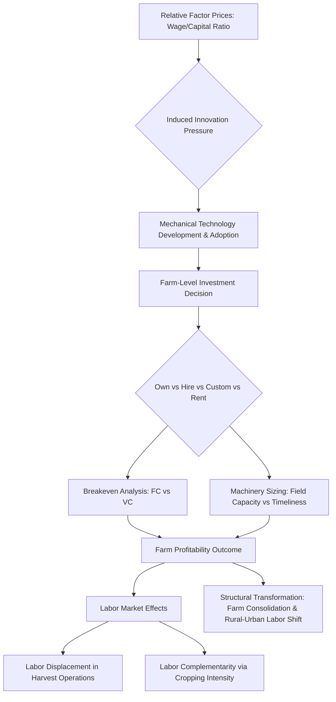

## Economics of Agricultural Mechanization

### Definition and Scope

Agricultural mechanization economics is the branch of agricultural economics that analyzes the costs, benefits, and decision rules governing the substitution of mechanical, animal, and human power sources across farm operations. It spans the selection, financing, operation, and replacement of equipment ranging from hand tools and draft animals to tractors, combines, and precision-agriculture systems, and it evaluates how these choices affect farm profitability, labor markets, productivity, and rural structural change.

The core economic problem is a factor-substitution problem: capital (machinery) is substituted for labor (and sometimes land, via intensification) subject to prices, farm size, technology availability, and risk. Mechanization decisions are simultaneously **micro** (an individual farm's investment choice) and **macro** (aggregate effects on rural employment, food prices, and structural transformation).

### Historical and Theoretical Foundations

**Induced Innovation Theory**

The dominant theoretical framework, developed by Hayami and Ruttan (1971), holds that the direction of agricultural technical change is induced by relative factor scarcity. Where labor is scarce and land abundant (e.g., historical United States), mechanical innovation dominates. Where land is scarce and labor abundant (e.g., historical Japan), biological and chemical innovation (yield-enhancing inputs) dominates. This explains divergent mechanization trajectories across countries with similar income levels but different factor endowments.

**Induced innovation model:**

$$\frac{MP_K}{MP_L} = \frac{P_K}{P_L}$$

where $MP_K$ and $MP_L$ are the marginal products of capital and labor, and $P_K$ and $P_L$ are their respective prices. As $P_L/P_K$ rises (labor becomes relatively expensive), farms and equipment suppliers are induced to develop and adopt labor-saving (mechanical) technology.

**Farm Mechanization Stages**

A widely used descriptive framework classifies mechanization into stages:

1. **Hand-tool technology** — human muscle power, minimal capital
2. **Animal-draft technology** — draft animals (oxen, water buffalo, horses) with animal-drawn implements
3. **Mechanical-power technology** — engine-powered equipment (two-wheel tillers, four-wheel tractors, combine harvesters)
4. **Precision/digital technology** — GPS guidance, variable-rate application, autonomous and robotic systems

Countries and regions do not always pass through these stages sequentially; technology "leapfrogging" (e.g., direct adoption of small four-wheel tractors without an intermediate animal-draft-heavy phase) is well documented, particularly where machinery rental markets lower entry barriers.

### Core Economic Concepts

**Factor Substitution and the Marginal Rate of Technical Substitution (MRTS)**

Mechanization is fundamentally a movement along (or shift of) an isoquant, substituting capital for labor while holding output constant.

$$MRTS_{LK} = -\frac{dK}{dL} = \frac{MP_L}{MP_K}$$

A profit-maximizing farm mechanizes a given operation when the cost of substituting a machine for labor is less than the labor cost saved, adjusted for any output or quality effects.

**Cost Categories in Machinery Economics**

Machinery costs are conventionally split into two categories that behave very differently with respect to use intensity:

*Fixed (ownership) costs* — incurred regardless of use:

- Depreciation
- Interest on invested capital (opportunity cost)
- Taxes
- Insurance
- Shelter/housing

*Variable (operating) costs* — incurred in proportion to use:

- Fuel and lubricants
- Repairs and maintenance
- Labor (operator wages)

**Total and average cost per hectare:**

$$TC = FC + (VC \times h)$$

$$AC = \frac{FC}{h} + VC$$

where $h$ is annual hours (or hectares) of use. Because fixed costs are spread over more units as usage rises, **average cost per hectare declines with utilization**, which is the central driver of economies of scale in mechanization and the rationale for custom hiring, machinery rings, and cooperative ownership.

**Depreciation Methods**

Common methods used in machinery cost budgeting:

- **Straight-line:** $D = \frac{P - S}{n}$, where $P$ = purchase price, $S$ = salvage value, $n$ = useful life in years
- **Declining-balance:** $D_t = r \times BV_{t-1}$, where $r$ is a fixed rate and $BV_{t-1}$ is prior book value
- **Sum-of-years'-digits:** accelerated depreciation weighting early years more heavily

Straight-line is most common in farm management extension budgets for its simplicity, though declining-balance more closely mirrors actual resale-value decay for machinery, which tends to lose value fastest in the first few years.

**Opportunity Cost of Capital**

Interest on the average investment is typically calculated as:

$$\text{Interest} = \frac{P + S}{2} \times i$$

where $i$ is the discount or borrowing rate. This "average investment" method approximates the declining capital tied up in the asset over its life.

### The Machinery Investment (Own vs. Hire vs. Custom) Decision

**Breakeven Analysis**

The central practical tool is the breakeven acreage/hours comparison between owning a machine and hiring custom operations (or renting).

$$h^* = \frac{FC_{own}}{VC_{custom} - VC_{own}}$$

Below the breakeven usage level $h^*$, custom hiring is cheaper because the farm avoids fixed costs; above it, ownership is cheaper because fixed costs are spread thinner. This single relationship underlies most machinery-selection decision aids in farm management.

**Decision Options**

| Option | Fixed Cost Exposure | Flexibility | Typical Use Case |
| --- | --- | --- | --- |
| Full ownership | High | Timeliness control | Large, stable acreage |
| Custom hire | None (pay per unit) | High | Small/marginal acreage, one-off operations |
| Machinery rental | Low-moderate | Moderate | Seasonal peak operations |
| Cooperative/ring ownership | Shared | Moderate | Mid-size farms pooling capital |
| Leasing | Low upfront, contract-bound | Moderate | Capital-constrained operations |

**Timeliness Costs**

A frequently underweighted factor is the **timeliness cost** — yield or quality loss from performing an operation (planting, harvesting) outside its agronomic optimum window because machinery capacity is insufficient to cover the farm's area within that window. Larger or additional machinery reduces timeliness losses but raises fixed costs, creating an optimization trade-off:

$$\text{Total Relevant Cost} = FC + VC + \text{Timeliness Cost}(capacity)$$

Timeliness cost functions are typically modeled as increasing (often convexly) as the days required to complete an operation extend beyond the agronomic optimum.

### Field Capacity and Machinery Sizing

Machinery economics requires matching equipment capacity to farm size and available field days.

**Theoretical field capacity:**

$$C_t = \frac{W \times S}{10}$$

where $C_t$ is capacity in hectares/hour, $W$ is effective working width in meters, and $S$ is speed in km/h (constant 10 converts units).

**Effective (actual) field capacity** incorporates field efficiency $E_f$ (accounting for turning, overlap, and idle time):

$$C_e = C_t \times E_f$$

**Required machine size** given available working days:

$$W = \frac{A}{D \times H \times S \times E_f / 10}$$

where $A$ is total area to cover, $D$ is available field days, and $H$ is working hours per day. This calculation directly ties agronomic timeliness constraints (planting/harvest windows) to the economically optimal machine size — oversizing wastes fixed-cost capacity in most years; undersizing generates chronic timeliness losses.

### Labor Market and Structural Effects

**Labor Displacement vs. Labor Absorption**

Mechanization's labor effects are operation-specific and are commonly separated into:

- **Labor-displacing mechanization**: substitutes machines for tasks with abundant labor supply (e.g., large-scale harvesting equipment in labor-surplus economies), potentially depressing rural wages or displacing workers absent alternative employment.
- **Labor-facilitating (or land-augmenting) mechanization**: relieves bottleneck operations (e.g., land preparation, irrigation pumping) that constrain the timing of other labor-intensive operations, thereby increasing total labor demand for those subsequent tasks and enabling multiple cropping.

Empirical evidence, especially from South and Southeast Asia, indicates that mechanization of land preparation and irrigation historically tended to be labor-complementary (enabling higher cropping intensity and yields, which raised labor demand for weeding, transplanting, and harvesting), whereas mechanization of harvesting and threshing tends to be more directly labor-displacing. [Inference: the direction and magnitude of these effects are context-dependent and vary by crop, region, and the tightness of local labor markets; results in the literature are not uniform across all settings.]

**Structural Transformation**

At the macro level, mechanization interacts with the broader structural transformation of economies: as mechanization raises labor productivity per farm worker, it can enable farm consolidation (larger, fewer farms) and release labor to non-farm sectors — a process central to the Lewis dual-economy model and later agricultural development theory. Whether displaced agricultural labor is successfully absorbed into non-farm employment (a precondition for mechanization to be welfare-improving in the aggregate) depends on the pace of industrial/urban job creation relative to the pace of farm labor release.

### Farm Size, Scale Economies, and Access

**Scale Economies in Machinery**

Because fixed costs dominate machinery cost structures, average cost per hectare falls sharply with farm size up to a point, then often flattens (an L-shaped long-run average cost curve), rather than continuing to decline indefinitely — a key empirical finding used to argue that mechanization's scale advantages are exhaustible and do not necessarily favor unlimited farm consolidation.

**Custom Hiring Markets and Small-Farm Access**

In smallholder-dominated agricultural systems, custom hiring markets (privately or cooperatively operated machinery services, sometimes described as "Uber for tractors" models) are the principal mechanism allowing small farms to access mechanization economies of scale without capital ownership. These markets convert a farm's mechanization decision from an investment problem into a service-procurement problem, substantially lowering the capital barrier and altering the traditional relationship between farm size and mechanization access.

### Diagram: Machinery Ownership vs. Custom-Hire Breakeven

<svg xmlns="http://www.w3.org/2000/svg" viewBox="0 0 720 460" font-family="Helvetica, Arial, sans-serif">
<text x="360" y="28" text-anchor="middle" font-size="17" font-weight="bold" fill="#1a1a1a">Own vs. Custom-Hire Cost Breakeven (svg_diagram)</text>

<line x1="80" y1="400" x2="660" y2="400" stroke="#333" stroke-width="2" />
<line x1="80" y1="400" x2="80" y2="60" stroke="#333" stroke-width="2" />
<text x="370" y="435" text-anchor="middle" font-size="13" fill="#333">Annual Area Covered (hectares, h)</text>
<text x="30" y="230" text-anchor="middle" font-size="13" fill="#333" transform="rotate(-90 30 230)">Total Cost (currency)</text>

<line x1="80" y1="400" x2="620" y2="90" stroke="#c0392b" stroke-width="2.5" />
<text x="560" y="105" font-size="12" fill="#c0392b" font-weight="bold">Custom Hire (VC_custom × h)</text>

<line x1="80" y1="330" x2="620" y2="150" stroke="#2471a3" stroke-width="2.5" />
<text x="560" y="140" font-size="12" fill="#2471a3" font-weight="bold">Own (FC + VC_own × h)</text>

<line x1="80" y1="330" x2="80" y2="400" stroke="#2471a3" stroke-width="2" stroke-dasharray="4,3" />
<text x="90" y="368" font-size="11" fill="#2471a3">FC (fixed cost)</text>

<circle cx="330" cy="230" r="5" fill="#27ae60" />
<line x1="330" y1="230" x2="330" y2="400" stroke="#27ae60" stroke-width="1.5" stroke-dasharray="4,3" />
<line x1="80" y1="230" x2="330" y2="230" stroke="#27ae60" stroke-width="1.5" stroke-dasharray="4,3" />
<text x="335" y="225" font-size="12" fill="#27ae60" font-weight="bold">Breakeven h*</text>

<text x="160" y="390" font-size="12" fill="#555">Custom hire cheaper</text>

<text x="460" y="390" font-size="12" fill="#555">Ownership cheaper</text>

</svg>

### Risk, Finance, and Credit Considerations

Mechanization investment decisions differ from routine input purchases in three financially significant ways:

1. **Lumpiness**: machinery is a discrete, large capital outlay rather than a divisible input, exposing the farm to indivisibility risk if farm size does not fully utilize capacity.
2. **Illiquidity and resale risk**: used-equipment markets are thinner in many developing regions, raising the effective cost of exit or downsizing.
3. **Credit access**: mechanization is frequently credit-constrained; formal collateral requirements, interest rates, and loan tenor mismatches with machinery payback periods are commonly cited barriers in smallholder mechanization studies, motivating policy interest in leasing and hire-purchase schemes.

**Net Present Value (NPV) Investment Rule**

The standard capital budgeting criterion applied to a machinery purchase:

$$NPV = -P + \sum_{t=1}^{n} \frac{(B_t - C_t)}{(1+r)^t} + \frac{S}{(1+r)^n}$$

where $B_t$ are annual benefits (labor savings, timeliness gains, yield effects), $C_t$ are annual operating costs, $r$ is the discount rate, and $S$ is terminal salvage value. Investment is justified when $NPV > 0$; the **internal rate of return (IRR)** (the discount rate at which $NPV = 0$) is commonly reported alongside NPV in extension and appraisal literature. [Note: actual realized returns depend on utilization rates, resale markets, and input/output price paths, all of which are uncertain at the time of purchase.]

### Externalities and Environmental Dimensions

Mechanization economics increasingly incorporates external costs and benefits beyond direct farm profitability:

- **Soil compaction**: heavier machinery can degrade soil structure, imposing a long-run productivity cost not captured in short-run machinery cost budgets.
- **Fuel use and emissions**: mechanized operations shift energy source from human/animal metabolic energy to fossil fuels, altering the farm's energy balance and carbon footprint.
- **Reduced post-harvest losses**: mechanized harvesting and threshing can reduce grain losses relative to manual methods in some contexts, an efficiency gain sometimes offsetting labor-displacement concerns.
- **Precision agriculture and input-use efficiency**: GPS-guided and variable-rate technologies can reduce over-application of seed, fertilizer, and agrochemicals, generating both private cost savings and positive environmental externalities.

### Country and Regional Patterns

- **High-income, land-abundant economies (e.g., North America, Australia)**: mechanization historically substituted for scarce farm labor on large landholdings, consistent with induced innovation theory; capital-intensive, large-scale equipment dominates.
- **East Asia (e.g., Japan, South Korea)**: land scarcity and rising rural wages drove adoption of small, land-saving mechanization (mini-tillers, small combines) suited to fragmented paddy plots, alongside heavy reliance on custom hiring services and cooperatives.
- **South Asia**: rapid rise of private custom-hire tractor and combine-harvester markets has enabled mechanization access for smallholders without proportional farm consolidation, a pattern extensively documented in recent development economics literature.
- **Sub-Saharan Africa**: mechanization rates remain comparatively low; constraints commonly cited include fragmented and often insecure landholding, thin machinery and spare-parts markets, credit access, and lower relative wage rates that reduce the induced-innovation pressure toward mechanical substitution, though country-level heterogeneity is substantial. [Inference: aggregate regional generalizations mask wide variation across countries and farming systems within the region.]

### Policy Instruments Affecting Mechanization

| Instrument | Mechanism | Typical Objective |
| --- | --- | --- |
| Subsidized machinery credit/hire-purchase | Lowers effective capital cost | Accelerate adoption among capital-constrained farms |
| Import tariff reduction on equipment | Lowers acquisition price | Increase equipment availability/affordability |
| Custom-hiring center support | Public/cooperative provision of rental services | Extend access to small farms |
| Fuel subsidies | Lowers variable operating cost | Support continued equipment use |
| Extension/training programs | Reduces operational and maintenance skill barriers | Improve utilization efficiency, reduce breakdown losses |
| Minimum wage / labor regulation | Alters relative factor prices | Indirectly induces (or discourages) mechanization |

### Analytical Framework Summary

### Worked Example: Breakeven Between Ownership and Custom Hire

A farm is evaluating purchase of a combine harvester versus continuing to use custom-hire services.

**Given:**

- Purchase price ($P$): 3,000,000 (local currency)
- Salvage value after 10 years ($S$): 500,000
- Annual fixed costs (depreciation, interest, insurance, shelter): 380,000/year
- Variable cost if owned ($VC_{own}$): 900/hectare
- Custom-hire rate ($VC_{custom}$): 2,200/hectare

**Breakeven calculation:**

$$h^* = \frac{FC_{own}}{VC_{custom} - VC_{own}} = \frac{380{,}000}{2{,}200 - 900} = \frac{380{,}000}{1{,}300} \approx 292 \text{ hectares/year}$$

**Interpretation:** If the farm (individually, or pooled with neighbors under a cooperative arrangement) harvests fewer than approximately 292 hectares per year, custom hiring is the lower-cost option. Above that threshold, ownership becomes economically preferable, assuming stated costs hold and the machine is fully utilized within its available field days. This is the standard decision rule taught in farm machinery management and is directly transferable to other equipment types (tractors, planters, sprayers) by substituting the relevant fixed and variable cost estimates.

### Common Pitfalls in Mechanization Cost Analysis

- Ignoring the opportunity cost of capital (using only depreciation, omitting interest on investment)
- Comparing average cost at an assumed usage level rather than performing full breakeven analysis across the relevant usage range
- Omitting timeliness costs, which can reverse an apparently favorable ownership decision at farm sizes near the breakeven point
- Using list price rather than realistic resale-adjusted depreciation schedules
- Failing to account for labor market effects when mechanization is evaluated purely at the private farm level, understating broader social costs or benefits

**Related Topics**

- Farm machinery selection and replacement models
- Custom hiring markets and machinery service provision
- Precision agriculture economics and variable-rate technology adoption
- Labor economics of agricultural structural transformation
- Capital budgeting and investment appraisal in farm management
- Induced innovation theory (Hayami-Ruttan model)
- Post-harvest loss economics and mechanized harvesting/threshing
- Agricultural credit markets and hire-purchase financing schemes
- Rural labor markets and the Lewis dual-economy model
- Environmental economics of soil compaction and farm energy use