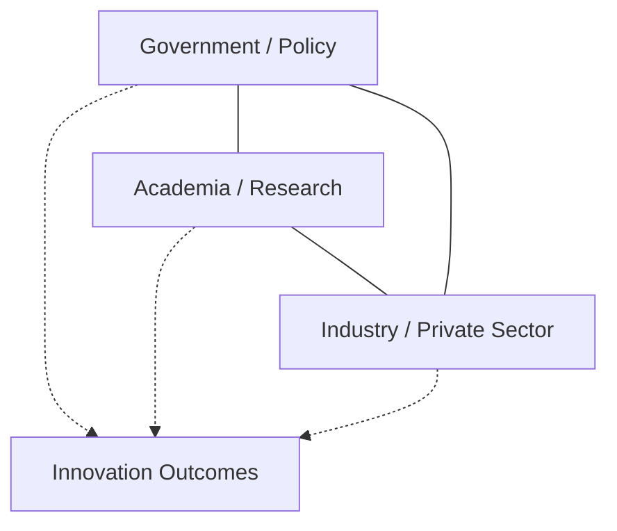
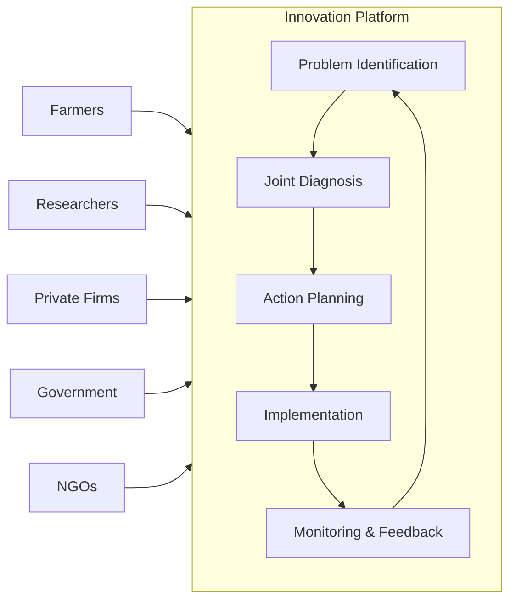

## Innovation Systems and Public-Private Partnerships

### Definition and Conceptual Foundations

An **agricultural innovation system (AIS)** is the network of organizations, individuals, and institutions that bring new products, processes, and forms of organization into economic use in agriculture, together with the institutions and policies that affect their behavior and performance. The framework shifts analysis away from a linear "research → extension → farmer" transfer-of-technology (ToT) model toward a systemic view in which innovation emerges from interaction, feedback, and co-learning among many actors.

**Key Points**

- Innovation is treated as a **social and interactive process**, not merely the output of scientific research.
- The unit of analysis is the **system of relationships**, not an isolated institution (e.g., a single research station).
- Innovation includes technical change (new seed varieties, machinery), institutional change (new contract forms, cooperatives), and organizational change (new market linkages, service models).
- The approach explicitly incorporates non-technical drivers: policy, finance, market demand, informal norms, and power relations.

### From National Agricultural Research Systems to Innovation Systems

**National Agricultural Research Systems (NARS)** — the earlier dominant framework — centered on public research institutes and universities generating technologies for dissemination via extension services. Limitations that motivated the shift to AIS include:

- Weak feedback loops from farmers and markets back into research agendas.
- Underestimation of the role of the private sector, NGOs, and farmer organizations in generating and adapting knowledge.
- Failure to account for enabling/disabling institutional environments (land tenure, credit access, input markets).
- Poor explanation of why technically sound innovations often failed to scale.

$$\text{ToT Model: } R \rightarrow E \rightarrow F$$

$$\text{AIS Model: } \{R, E, F, P, M, G, C\} \leftrightarrow \{R, E, F, P, M, G, C\}$$

Where $R$ = research, $E$ = extension, $F$ = farmers, $P$ = private sector, $M$ = markets, $G$ = government/policy, $C$ = civil society — all nodes interacting bidirectionally rather than in a single downstream chain.

### Core Components of an Agricultural Innovation System

**1. Actors (Nodes)**

- Public research organizations (national institutes, universities, international agricultural research centers)
- Public extension and advisory services
- Private input suppliers (seed, agrochemical, machinery firms)
- Agribusiness and value-chain actors (processors, traders, exporters)
- Farmer organizations and cooperatives
- NGOs and civil society organizations
- Financial institutions (banks, microfinance, insurers)
- Regulatory and standard-setting bodies

**2. Institutions (Rules of the Game)**

- Formal: intellectual property law, seed certification regimes, phytosanitary standards, land tenure law
- Informal: social norms around knowledge sharing, trust, and reciprocity within farming communities

**3. Interactions and Linkages**

- Knowledge flows (research findings, indigenous knowledge, market intelligence)
- Contractual relationships (input supply agreements, outgrower schemes)
- Financial flows (grants, credit, investment)
- Collaborative platforms (innovation platforms, multi-stakeholder forums)

**4. Enabling Environment**

- Macroeconomic and trade policy
- Infrastructure (roads, ICT, storage, irrigation)
- Education and human capital

### The Triple Helix and Quadruple Helix Models

The **Triple Helix** model describes innovation as arising from structured interaction among three institutional spheres:

Extensions add a fourth helix — **civil society / users** (farmer organizations, consumer groups) — producing the **Quadruple Helix**, which is particularly relevant to agriculture because farmers are simultaneously users, adapters, and co-producers of innovation, not passive recipients.

### Public-Private Partnerships (PPPs) in Agriculture: Definition and Rationale

A **public-private partnership** in agricultural innovation is a formal or semi-formal arrangement in which public sector entities (ministries, research institutes, development agencies) and private sector entities (agribusiness firms, input companies, financial institutions) jointly commit resources — financial, technical, or human — toward a shared innovation or development objective, with agreed risk- and benefit-sharing arrangements.

**Economic rationale for PPPs:**

- **Public goods problem**: basic agricultural research often has high spillovers and low appropriability, discouraging private investment; public funding corrects this underinvestment.
- **Complementary asset gaps**: public research may generate germplasm or technology but lack distribution networks, seed multiplication capacity, or market access that private firms possess.
- **Risk-sharing**: high-risk, long-gestation innovations (e.g., new crop varieties requiring 8–12 years of breeding) benefit from shared financial exposure.
- **Transaction cost reduction**: coordinated platforms reduce duplication and search costs relative to fragmented bilateral deals.

### Typology of Agricultural PPP Models

| Model Type | Description | Illustrative Focus |
| --- | --- | --- |
| Research PPPs | Joint public-private R&D on varieties, traits, or technologies | Crop breeding, biotech trait development |
| Input-supply PPPs | Public breeding combined with private seed multiplication/distribution | Hybrid seed commercialization |
| Extension/advisory PPPs | Private firms delivering advisory services under public frameworks or co-funding | Digital advisory platforms, agri-input dealer networks |
| Market-access PPPs | Public facilitation of private procurement/outgrower linkages | Contract farming schemes, warehouse receipt systems |
| Infrastructure PPPs | Joint financing of shared infrastructure | Irrigation systems, cold chains, rural roads |
| Financial PPPs | Blended finance combining public guarantees with private lending | Agricultural credit guarantee funds, index insurance |

### Innovation Platforms as a Governance Mechanism

**Innovation platforms (IPs)** are a widely used operational tool within AIS and PPP frameworks: multi-stakeholder spaces (physical or virtual) where actors along a value chain or around a common problem convene to identify constraints, negotiate solutions, and coordinate joint action.

**Typical innovation platform structure:**

**Key Points**

- Platforms function best with a **neutral facilitator** to manage power asymmetries between large firms and smallholder farmer groups.
- Success depends on clear **incentive alignment**: each actor must derive a benefit proportional to its contribution for the platform to persist beyond donor-funded pilot phases.
- [Inference] Platforms with externally imposed (donor-driven) agendas tend to show weaker sustainability once external funding ends, compared to platforms that emerge from actor-identified problems, though outcomes are highly context-dependent.

### Economic Analysis of Underinvestment and the Case for Intervention

Agricultural innovation exhibits classic **public goods** and **market failure** characteristics that justify PPP intervention:

- **Non-excludability and non-rivalry** of basic research findings (e.g., a new breeding methodology can be used by multiple firms without depletion) reduce private incentive to invest, since returns cannot be fully captured (a "free-rider problem").
- **Externalities**: knowledge spillovers from one firm's innovation benefit competitors and the wider sector, again reducing private appropriable returns below the socially optimal level of investment.
- **Asymmetric information**: smallholder farmers face information gaps about technology performance, and private firms may face information gaps about smallholder demand and willingness to pay, both of which slow technology diffusion.

The socially optimal level of R&D investment $R^*$ exceeds the privately optimal level $R_p$ whenever the marginal social return $MSR$ exceeds the marginal private return $MPR$:

$$MSR(R) > MPR(R) \implies R^* > R_p$$

PPPs are, in this framing, an institutional mechanism to close the gap between $R^*$ and $R_p$ by using public funds or public convening power to internalize part of the externality for private partners.

### Intellectual Property and Benefit-Sharing in PPPs

A central design challenge in research PPPs is structuring **intellectual property (IP) rights** and **benefit-sharing** so that:

- Public breeding institutes retain rights to use germplasm for further public research and for smallholder/subsistence-oriented dissemination.
- Private partners obtain sufficient exclusivity (e.g., limited-term commercial licenses) to justify their investment in scale-up, marketing, and distribution.
- Royalty and licensing structures do not price technologies out of reach for smallholder farmers, often addressed via **tiered or segmented licensing** (e.g., free or low-cost access for subsistence farmers, commercial royalties for large-scale/export-oriented use).

**Example**

A public national research institute develops a drought-tolerant maize variety. Under a PPP licensing agreement:

- The institute retains the right to distribute foundation seed to public seed agencies and NGOs serving smallholders at no or nominal royalty.
- A private seed company receives a non-exclusive commercial license to multiply and market certified seed under its own brand, paying a per-bag royalty to the institute.
- A royalty-sharing formula might allocate, for instance, a percentage of gross seed sales back to the research institute to fund continued breeding — the exact percentage is a negotiated, case-specific parameter rather than a fixed standard.

### Governance and Contractual Structures

PPPs vary along a spectrum of formality:

**Governance elements typically specified in a formal agreement:**

- Scope of collaboration and defined deliverables/milestones
- Financial contribution schedule from each party
- IP ownership, licensing, and royalty terms
- Risk allocation (technical failure, market failure, regulatory delay)
- Exit clauses and dispute resolution mechanisms
- Monitoring, evaluation, and reporting obligations

### Risks, Failure Modes, and Governance Challenges

**Key Points**

- **Elite capture**: benefits of PPPs can disproportionately accrue to larger, better-connected farmers or firms, marginalizing smallholders and women farmers unless deliberate inclusion mechanisms are built into platform design.
- **Asymmetric bargaining power**: large agribusiness partners may dominate negotiation of terms relative to public research institutes or farmer cooperatives with less technical/legal capacity.
- **Mission drift**: public partners may shift research agendas toward commercially attractive crops/traits at the expense of orphan crops or subsistence-oriented priorities.
- **Sustainability beyond pilot funding**: many PPPs are donor-initiated and struggle to continue once external grant funding ends, since the underlying business case for continued private participation was never fully tested.
- **Accountability gaps**: blended public-private structures can create ambiguity over who is accountable for social/environmental outcomes versus commercial performance.
- [Inference] Empirical evaluations of agricultural PPPs generally find highly heterogeneous outcomes across contexts, making broad generalizations about "PPP effectiveness" difficult without reference to a specific program design and country setting.

### Monitoring and Evaluation Frameworks

Evaluating AIS/PPP performance typically uses a combination of:

- **Input/output indicators**: funding leveraged (public $ per private $ mobilized), number of technologies co-developed, number of farmers reached.
- **Process indicators**: frequency and quality of stakeholder interaction, platform functionality, trust-building measures.
- **Outcome/impact indicators**: technology adoption rates, yield and income effects, equity of benefit distribution (disaggregated by farm size, gender).
- **Systemic indicators**: change in institutional capacity, policy responsiveness, and the density/quality of innovation networks over time (often assessed via social network analysis).

A commonly cited leverage metric is the **public-private funding leverage ratio**:

$$L = \frac{\text{Private Sector Contribution}}{\text{Public Sector Contribution}}$$

Higher $L$ is often used as a proxy for private sector confidence in the partnership's commercial viability, though [Inference] a high ratio alone does not guarantee equitable smallholder benefit and should be interpreted alongside outcome and equity indicators.

### Illustrative Institutional Architecture Diagram

<svg xmlns="http://www.w3.org/2000/svg" viewBox="0 0 800 460" font-family="Arial, sans-serif">
<text x="400" y="28" text-anchor="middle" font-size="18" font-weight="bold" fill="#1a1a1a">Agricultural Innovation System with PPP Layer (svg_diagram)</text>
<rect x="30" y="60" width="220" height="90" rx="8" fill="#dbe9f5" stroke="#2f6690" stroke-width="1.5" />
<text x="140" y="90" text-anchor="middle" font-size="13" font-weight="bold" fill="#1a1a1a">Public Sector</text>
<text x="140" y="110" text-anchor="middle" font-size="11" fill="#333">Research Institutes,</text>
<text x="140" y="126" text-anchor="middle" font-size="11" fill="#333">Extension, Ministries</text>
<rect x="290" y="60" width="220" height="90" rx="8" fill="#f5e6d3" stroke="#a5682a" stroke-width="1.5" />
<text x="400" y="90" text-anchor="middle" font-size="13" font-weight="bold" fill="#1a1a1a">Private Sector</text>
<text x="400" y="110" text-anchor="middle" font-size="11" fill="#333">Agribusiness, Input Firms,</text>
<text x="400" y="126" text-anchor="middle" font-size="11" fill="#333">Processors, Financiers</text>
<rect x="550" y="60" width="220" height="90" rx="8" fill="#e0f0dc" stroke="#3f7d3f" stroke-width="1.5" />
<text x="660" y="90" text-anchor="middle" font-size="13" font-weight="bold" fill="#1a1a1a">Civil Society</text>
<text x="660" y="110" text-anchor="middle" font-size="11" fill="#333">Farmer Orgs, Cooperatives,</text>
<text x="660" y="126" text-anchor="middle" font-size="11" fill="#333">NGOs</text>
<rect x="230" y="210" width="340" height="80" rx="8" fill="#efe0f5" stroke="#7a3f9c" stroke-width="1.5" />
<text x="400" y="240" text-anchor="middle" font-size="13" font-weight="bold" fill="#1a1a1a">Public-Private Partnership</text>
<text x="400" y="258" text-anchor="middle" font-size="11" fill="#333">Shared financing, IP agreements,</text>
<text x="400" y="274" text-anchor="middle" font-size="11" fill="#333">joint governance structure</text>
<rect x="230" y="340" width="340" height="80" rx="8" fill="#f5d9d9" stroke="#a53f3f" stroke-width="1.5" />
<text x="400" y="370" text-anchor="middle" font-size="13" font-weight="bold" fill="#1a1a1a">Innovation Outcomes</text>
<text x="400" y="388" text-anchor="middle" font-size="11" fill="#333">New technologies, market access,</text>
<text x="400" y="404" text-anchor="middle" font-size="11" fill="#333">institutional change</text>
<line x1="140" y1="150" x2="330" y2="210" stroke="#555" stroke-width="1.5" />
<line x1="400" y1="150" x2="400" y2="210" stroke="#555" stroke-width="1.5" />
<line x1="660" y1="150" x2="470" y2="210" stroke="#555" stroke-width="1.5" />
<line x1="400" y1="290" x2="400" y2="340" stroke="#555" stroke-width="2" marker-end="url(#arrow)" />
</svg>

### Case Illustrations of PPP Models (Generic Patterns)

**Example**

- **Hybrid seed commercialization**: a public breeding program develops parent lines; a network of small and medium private seed companies license the parent lines to produce and sell hybrid seed under a shared brand or quality-certification scheme, with public regulators certifying seed quality.
- **Digital advisory PPP**: a government extension department partners with a private mobile network operator and an agritech firm to deliver SMS/app-based agronomic advisory and market price information, with the public partner providing agronomic content validation and the private partner providing distribution infrastructure and user data analytics.
- **Contract farming with public facilitation**: a government agency brokers agreements between a processing company and farmer cooperatives, providing extension support and quality standards enforcement while the private processor guarantees offtake at a pre-agreed price formula.

### Policy Levers to Strengthen AIS and PPP Effectiveness

- Competitive and matching-grant funding mechanisms that require demonstrated private co-investment
- Legal and regulatory clarity on IP ownership, seed certification, and biosafety to reduce transaction costs for private entrants
- Capacity-building support for farmer organizations to improve their negotiating position within platforms and PPP contracts
- Investment in boundary-spanning organizations (innovation brokers, platform facilitators) that reduce coordination costs among heterogeneous actors
- Long-term, predictable public research funding to sustain the upstream public goods component that private partners rely on but will not fund themselves

### Related Topics

- Agricultural research and development (R&D) investment and returns analysis
- Technology adoption and diffusion models in agriculture (e.g., Bass diffusion model, adoption-decision frameworks)
- Value chain analysis and vertical coordination in agribusiness
- Contract farming and outgrower scheme design
- Intellectual property rights and plant variety protection (UPOV frameworks)
- Agricultural extension and advisory service reform
- Digital agriculture and ICT-based advisory platforms
- Blended finance and agricultural credit guarantee mechanisms
- Smallholder market access and inclusive value chains
- Institutional economics of agricultural development (transaction cost theory, property rights theory)