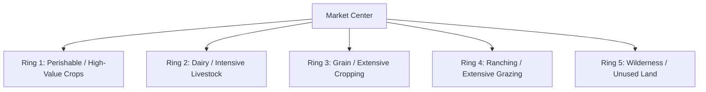
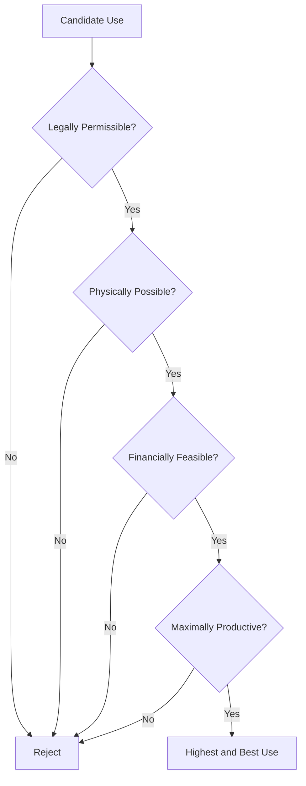

## Land Markets and Land Valuation

### Conceptual Foundations of Land as an Economic Asset

Land occupies a distinctive position in economic theory because it combines the characteristics of a **factor of production**, a **durable capital asset**, and a **store of value**. Its economic peculiarities shape both how land markets function and how land is valued:

**Key Points**

- **Fixed supply**: the aggregate physical quantity of land is essentially inelastic in the short and long run (Ricardo's classical assumption), though the supply of land *for a specific use* (e.g., convertible from agricultural to urban use) is elastic.
- **Immobility**: land cannot be relocated, so its value is inseparable from its location and the surrounding economic environment.
- **Heterogeneity**: no two parcels are identical in soil quality, topography, water access, or location, making land markets inherently thin and imperfectly competitive compared to markets for standardized commodities.
- **Durability**: land does not physically depreciate the way machinery does, though its productive capacity can degrade (erosion, salinization) or improve (irrigation, drainage) through use and investment.
- **Multifunctionality**: land simultaneously provides productive value (agricultural output), asset value (collateral, wealth storage), and amenity/social value (cultural, ecological).

### Theoretical Basis of Land Value: Rent Theory

Classical and neoclassical economics ground land value in the concept of **economic rent** — the return to land arising from its fixed supply rather than from any cost of production.

**Ricardian differential rent** arises because land parcels differ in fertility/location; rent on a given parcel equals the value of output on that parcel minus the value of output achievable on the marginal (least productive) land in cultivation, using the same labor and capital inputs:

$$R_i = (P \cdot Y_i) - (P \cdot Y_m)$$

where $R_i$ is rent on parcel $i$, $P$ is output price, $Y_i$ is yield on parcel $i$, and $Y_m$ is yield on the marginal parcel.

**Von Thünen's location rent** extends this by showing that, even on land of uniform fertility, rent varies with distance to market due to transport costs:

$$R = Y(P - C) - Y \cdot t \cdot d$$

where $Y$ is yield per unit area, $P$ is market price, $C$ is production cost per unit, $t$ is transport cost per unit per unit distance, and $d$ is distance to market. This yields the classic concentric-ring pattern of land use intensity declining with distance from a central market.

The **capitalization principle** links the flow value of rent to the stock value of land: the market value of land equals the present discounted value of the stream of expected future rents.

$$V = \sum_{t=1}^{\infty} \frac{R_t}{(1+r)^t}$$

For a constant expected rent in perpetuity, this simplifies to:

$$V = \frac{R}{r}$$

where $V$ is land value, $R$ is annual net rent, and $r$ is the discount rate (often approximated by the capitalization rate). This relationship is the theoretical bridge between rent theory and the income-based approaches to land valuation used in practice.

### Structure and Characteristics of Land Markets

**Types of land market transactions:**

- **Sales markets**: outright transfer of ownership (fee simple title)
- **Rental/lease markets**: temporary transfer of use rights (cash rent, share tenancy, fixed-term lease)
- **Mortgage/collateral markets**: land used to secure credit
- **Land-use conversion markets**: transactions involving rezoning from agricultural to non-agricultural use

**Sources of market imperfection specific to land:**

- **Thinness**: few transactions per unit time in any given local market, making price discovery difficult and comparable sales scarce.
- **High transaction costs**: legal transfer costs, survey and title verification costs, and search costs are often large relative to transaction value, especially in jurisdictions with weak land administration systems.
- **Imperfect and asymmetric information**: buyers often lack full information on soil quality, water rights, or encumbrances; sellers may have private information about productivity or contamination.
- **Restricted transferability**: customary tenure systems, communal land rights, inheritance law, foreign ownership restrictions, and farm-size ceilings can all constrain who may buy, sell, or lease land.
- **Segmentation**: land sale markets and land rental markets often do not clear at consistent implied rates of return, reflecting different risk profiles, credit constraints, and non-pecuniary motives (e.g., land as social status or inheritance asset) among market participants.

### The Sales-to-Rental Value Gap

An empirical regularity widely discussed in land economics is that agricultural land sale prices frequently imply an inverse capitalization rate ($R/V$) that is **lower** than prevailing returns on comparable-risk assets, meaning land appears "overpriced" relative to its current agricultural income stream when using a simple capitalization model.

Explanations include:

- **Non-agricultural value components**: expectation of future conversion to residential/commercial/industrial use, embedding an **option value** for future rezoning.
- **Land as a hedge and store of value**: particularly in contexts with underdeveloped financial markets, limited pension systems, or inflation concerns, land purchases carry a wealth-storage motive distinct from productive returns.
- **Non-pecuniary and amenity value**: lifestyle, prestige, and cultural attachment to land ownership.
- **Government payments and policy capitalization**: subsidies, price supports, or tax preferences on agricultural land become capitalized into land values, raising sale prices without a corresponding rise in "pure" agricultural income.
- [Inference] The relative weight of each explanation varies substantially by country and by proximity to urbanizing areas, so no single factor should be treated as universally dominant.

### Land Rental Markets and Tenancy Arrangements

**Fixed cash rent**: tenant pays a predetermined amount regardless of output; tenant bears full production and price risk, landlord bears none.

**Share tenancy (sharecropping)**: landlord and tenant divide output (and often input costs) according to an agreed share $s$, so the tenant's realized income is:

$$\pi_{\text{tenant}} = s \cdot P \cdot Y - c \cdot L$$

where $s$ is the tenant's output share, $Y$ is yield, $P$ is price, $c$ is the tenant's cost per unit of input $L$. Share tenancy partially pools risk between landlord and tenant but has long been analyzed (Marshallian inefficiency argument) as creating a disincentive for tenant effort, since the tenant bears the full marginal cost of effort but receives only share $s$ of the marginal output.

$$MC_{\text{tenant}} = s \cdot MP_L$$

compared to the socially efficient condition $MC = MP_L$, implying under-application of effort/inputs relative to the efficient level whenever $s < 1$. [Unverified as a universal empirical claim] Subsequent literature has qualified this "Marshallian inefficiency" result substantially, showing that monitoring, interlinked contracts, and repeated-game reputational effects can mitigate or eliminate the predicted inefficiency in many real-world settings.

**Key Points on tenancy choice:**

- Risk-averse tenants with limited access to insurance or credit markets may prefer share contracts over fixed cash rent despite the theoretical efficiency loss, because share contracts transfer part of production risk to the landlord.
- Contract choice is also shaped by monitoring costs, tenant reputation, land quality variability, and the landlord's own risk preferences and outside options.

### Land Valuation: Purposes and Standards

Land valuation is conducted for multiple distinct purposes, each of which can imply a different valuation basis:

| Purpose | Typical Valuation Basis |
| --- | --- |
| Market sale/purchase | Market value (highest and best use) |
| Taxation (property/land tax) | Assessed value (often a statutory fraction of market value) |
| Compulsory acquisition/eminent domain | Fair market value, sometimes with compensation for severance damages |
| Mortgage lending/collateral | Market value with lender-conservative adjustments |
| Farm succession/inheritance | Fair value, sometimes with agricultural-use restrictions |
| Financial reporting | Fair value per applicable accounting standards |

**Market value** is generally defined as the estimated price at which an asset would exchange between a willing buyer and a willing seller, in an arm's-length transaction, after proper marketing, with both parties acting knowledgeably and without compulsion.

### The Three Standard Approaches to Land Valuation

**1. Sales Comparison (Market) Approach**

Estimates value by comparing the subject parcel to recently sold, comparable parcels, adjusting for differences in size, location, soil quality, improvements, and access.

$$V_{\text{subject}} = V_{\text{comparable}} + \sum_i A_i$$

where $A_i$ represents adjustment amounts for each differing characteristic $i$ (e.g., +/- value for soil class, water rights, road frontage).

**Key Points**

- Most reliable when an active, transparent market with sufficient comparable transactions exists.
- Least reliable in thin markets or where comparables differ substantially in highest-and-best-use potential.
- Adjustments are frequently derived via **hedonic regression** (see below) to make them systematic rather than purely subjective.

**2. Income Capitalization Approach**

Directly applies the capitalization principle: estimates the present value of expected net income the land can generate.

$$V = \frac{NOI}{r}$$

where $NOI$ is net operating income (gross farm revenue minus operating expenses, excluding financing costs) and $r$ is the capitalization rate, typically derived from market evidence on comparable land sale price-to-income ratios or from a build-up method combining a risk-free rate, risk premium, and illiquidity premium.

For land with expected income growth at rate $g$, the **Gordon growth (constant growth) model** applies:

$$V = \frac{NOI_1}{r - g}, \quad r > g$$

**Key Points**

- Well suited to purely agricultural land with stable, observable income streams (cash rent comparables are often used directly as a proxy for $NOI$).
- Sensitive to the choice of $r$; small changes in the capitalization rate produce large changes in estimated value, so the rate must be empirically grounded, not assumed.

**3. Cost Approach**

Rarely used for raw land itself (since land cannot be "reproduced"), but applied to value **improvements** (irrigation infrastructure, drainage, farm buildings) by estimating replacement cost less depreciation, then adding this to a separately estimated land value.

$$V_{\text{property}} = V_{\text{land}} + (RC - D)$$

where $RC$ is replacement cost of improvements and $D$ is accrued depreciation (physical, functional, and external/economic obsolescence).

### Hedonic Pricing Models

The **hedonic pricing method** treats land value as a function of a bundle of characteristics, estimated via regression of observed sale prices on parcel attributes:

$$\ln(V) = \beta_0 + \beta_1 \text{SoilQuality} + \beta_2 \text{Distance} + \beta_3 \text{Rainfall} + \beta_4 \text{Slope} + \beta_5 \text{WaterAccess} + \varepsilon$$

The estimated coefficients $\beta_i$ represent the **implicit (shadow) price** of each characteristic — the marginal contribution of, for example, one additional unit of soil quality index to land value, holding other characteristics constant.

**Key Points**

- Widely used in academic and policy research to isolate the value of specific attributes (e.g., proximity to irrigation canals, exposure to flood risk, or agri-environmental designations) that are not separately traded.
- Requires a sufficiently large and representative sample of transactions; results can be sensitive to model specification and omitted variable bias (e.g., unobserved soil fertility correlated with price).
- Frequently used to estimate the **capitalization of policy interventions** into land value — for example, measuring how agri-environmental payment eligibility or irrigation infrastructure investment is reflected in subsequent land sale prices.

### Highest and Best Use (HBU) Analysis

A foundational valuation concept: land should be valued according to its **highest and best use** — the reasonably probable and legal use that is physically possible, financially feasible, and results in the highest value, not necessarily its current use.

**Four sequential tests of HBU:**

**Key Points**

- HBU analysis is central to understanding the **urban fringe land value premium**: agricultural land near expanding urban areas is often valued according to its conversion potential (residential/commercial development) rather than its agricultural income, since that use test yields a higher value under the "maximally productive" criterion.
- This creates the empirical phenomenon of agricultural land price gradients rising sharply with proximity to urban boundaries, independent of underlying soil productivity.

### Land Fragmentation, Consolidation, and Market Efficiency

**Land fragmentation** — ownership or operation of multiple, spatially dispersed and often small parcels by a single farm household — arises from inheritance practices (partible inheritance), historical land reform allocation methods, and risk-diversification motives (spreading plots across different microenvironments reduces covariate risk from localized weather or pest events).

**Economic costs of fragmentation:**

- Increased travel time and transport costs between plots
- Difficulty achieving economies of scale in mechanization
- Boundary/border strip losses (land taken up by paths and boundaries between plots)
- Higher transaction costs in coordinating water use, pest control, and crop rotation

**Land consolidation programs** (government-facilitated exchange or reallocation of fragmented parcels into fewer, larger, contiguous holdings) aim to reduce these costs but face implementation challenges including verifying comparable value across exchanged parcels, resistance to disrupting existing land-based social ties, and high administrative cost.

### Land Tenure Security and Its Capitalization into Value

**Tenure security** — the certainty that landholders will not be arbitrarily deprived of their rights — affects land value and market functioning through several channels:

- **Investment incentive channel**: secure tenure encourages long-term investment (soil conservation, tree planting, irrigation), which raises land productivity and hence value.
- **Collateral channel**: formal, transferable title enables land to be used as loan collateral, increasing access to credit and thereby its liquidity value.
- **Transaction cost channel**: clear, registered title reduces the cost and risk of verifying ownership in a sale, narrowing the gap between what a buyer is willing to pay and what an insecure seller can credibly offer.

[Inference] Empirical land-titling studies show generally positive but variably sized effects of formalized tenure on land value and investment; effect magnitude depends heavily on the pre-existing strength of customary tenure institutions, since formal titling adds less value where customary systems already provide strong de facto security.

### Land Taxation and Its Market Effects

**Land value tax (LVT)**, a tax levied on the unimproved value of land rather than on structures or total property value, is analyzed in land economics for its distinctive efficiency property: because land supply is fixed, a tax on land value is **non-distortionary** at the margin — it does not reduce the quantity of land supplied, unlike taxes on labor or capital which can reduce the incentive to supply those factors.

$$V_{\text{after-tax}} = \frac{R - T}{r}$$

where $T$ is the annual tax on land. Under a pure, permanently anticipated land value tax, the tax is theoretically borne entirely by the landowner at the time of imposition (capitalized into a one-time reduction in land value) rather than passed to future users, since land supply cannot contract in response to the tax.

**Key Points**

- In practice, agricultural land is more commonly taxed via output-based, area-based, or use-value assessment schemes rather than pure unimproved land value, partly for administrative simplicity and partly for political economy reasons (protecting farm income from purely speculative-value-based tax assessment).
- **Use-value assessment** (also called "current use valuation") taxes agricultural land based on its value in continued agricultural use rather than its market value under highest-and-best-use, reducing tax pressure that might otherwise force conversion of farmland at the urban fringe.

### Land Market Policy Interventions

- **Land registration and cadastral system development**: reduces information asymmetry and transaction costs, a widely used pre-condition for functioning formal land markets.
- **Farm size ceilings/floors and ownership restrictions**: intended to prevent excessive concentration or fragmentation but can constrain efficiency-enhancing transactions.
- **Land banks**: public or quasi-public entities that acquire, hold, and reallocate land (e.g., for consolidation, young-farmer entry programs, or environmental set-asides).
- **Pre-emption rights (right of first refusal)**: granted to sitting tenants, neighboring farmers, or public bodies in some jurisdictions to influence who acquires land coming to market.
- **Foreign ownership restrictions**: applied in many jurisdictions specifically to agricultural land, reflecting food-security and rural-community policy objectives distinct from general property market policy.

### Illustrative Diagram: Land Value Determination Framework

<svg xmlns="http://www.w3.org/2000/svg" viewBox="0 0 800 420" font-family="Arial, sans-serif">
<text x="400" y="28" text-anchor="middle" font-size="18" font-weight="bold" fill="#1a1a1a">Land Value Determination Framework (svg_diagram)</text>
<rect x="30" y="60" width="200" height="80" rx="8" fill="#dbe9f5" stroke="#2f6690" stroke-width="1.5" />
<text x="130" y="90" text-anchor="middle" font-size="12" font-weight="bold" fill="#1a1a1a">Physical Attributes</text>
<text x="130" y="108" text-anchor="middle" font-size="10" fill="#333">Soil, Slope, Climate,</text>
<text x="130" y="122" text-anchor="middle" font-size="10" fill="#333">Water Access</text>
<rect x="300" y="60" width="200" height="80" rx="8" fill="#f5e6d3" stroke="#a5682a" stroke-width="1.5" />
<text x="400" y="90" text-anchor="middle" font-size="12" font-weight="bold" fill="#1a1a1a">Location Factors</text>
<text x="400" y="108" text-anchor="middle" font-size="10" fill="#333">Distance to Market,</text>
<text x="400" y="122" text-anchor="middle" font-size="10" fill="#333">Urban Proximity</text>
<rect x="570" y="60" width="200" height="80" rx="8" fill="#e0f0dc" stroke="#3f7d3f" stroke-width="1.5" />
<text x="670" y="90" text-anchor="middle" font-size="12" font-weight="bold" fill="#1a1a1a">Institutional Factors</text>
<text x="670" y="108" text-anchor="middle" font-size="10" fill="#333">Tenure Security,</text>
<text x="670" y="122" text-anchor="middle" font-size="10" fill="#333">Policy, Taxation</text>
<rect x="230" y="190" width="340" height="70" rx="8" fill="#efe0f5" stroke="#7a3f9c" stroke-width="1.5" />
<text x="400" y="220" text-anchor="middle" font-size="13" font-weight="bold" fill="#1a1a1a">Expected Net Rent Stream (R)</text>
<text x="400" y="240" text-anchor="middle" font-size="10" fill="#333">Agricultural income + option value of conversion</text>
<rect x="250" y="300" width="300" height="70" rx="8" fill="#f5d9d9" stroke="#a53f3f" stroke-width="1.5" />
<text x="400" y="330" text-anchor="middle" font-size="13" font-weight="bold" fill="#1a1a1a">Capitalized Land Value</text>
<text x="400" y="350" text-anchor="middle" font-size="12" fill="#333">V = R / r</text>
<line x1="130" y1="140" x2="330" y2="190" stroke="#555" stroke-width="1.5" />
<line x1="400" y1="140" x2="400" y2="190" stroke="#555" stroke-width="1.5" />
<line x1="670" y1="140" x2="470" y2="190" stroke="#555" stroke-width="1.5" />
<line x1="400" y1="260" x2="400" y2="300" stroke="#555" stroke-width="2" marker-end="url(#arrow2)" />
</svg>

### Worked Example: Income Capitalization Calculation

**Example**

A 50-hectare parcel generates average annual gross farm revenue of $45,000, with operating expenses (excluding land rent/financing) of $18,000, yielding $NOI = \$27{,}000$. If comparable land sales in the area imply a capitalization rate of $r = 4.5\%$:

$$V = \frac{27{,}000}{0.045} = \$600{,}000$$

This implies a per-hectare value of $12,000. If a nearby, otherwise similar parcel sells for $18,000 per hectare, the price differential of $6,000 per hectare may reflect a market-perceived option value for future non-agricultural conversion, a locational premium, or capitalized subsidy/policy value not captured in the pure agricultural $NOI$ figure — distinguishing between these explanations requires additional hedonic or market analysis rather than the income approach alone.

### Related Topics

- Ricardian rent theory and the theory of differential land productivity
- Land tenure systems and property rights institutions (customary, freehold, leasehold)
- Land reform and redistribution policy design
- Urban-rural land use conversion and urban fringe economics
- Water rights and their capitalization into agricultural land value
- Agricultural credit markets and land as collateral
- Land use planning, zoning, and agricultural land preservation policy
- Environmental and ecosystem service valuation of land (payments for ecosystem services)
- Farm succession, inheritance law, and intergenerational land transfer
- Real estate appraisal standards and professional valuation methodology (e.g., USPAP, IVSC standards)