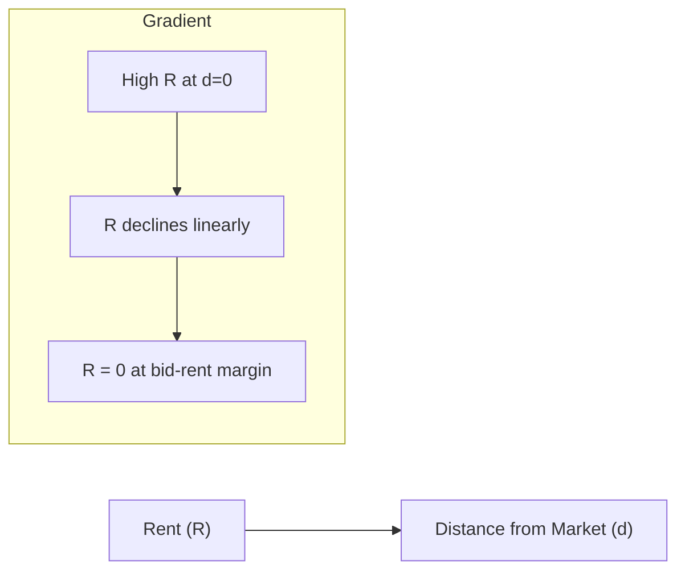
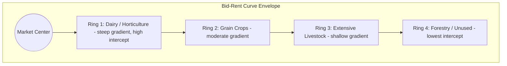
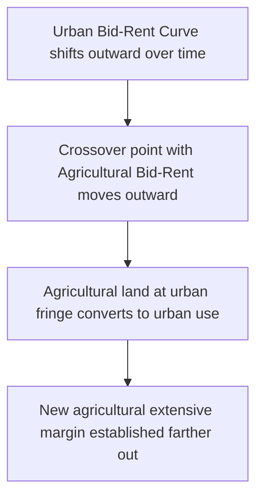

## Land Use Decisions and Rent Theory

### Conceptual Overview

Rent theory provides the analytical core for explaining **why particular parcels of land are allocated to particular uses**. It treats land-use choice as an economic optimization problem: among all feasible uses of a parcel, the use that generates the highest capitalized value (economic rent) is the one that will prevail in a competitive land market, because it is the use for which occupiers can outbid all others.

**Key Points**

- Land-use decisions are modeled as the outcome of **competitive bidding** among alternative uses (crops, livestock, forestry, urban development) for a fixed supply of land.
- The theory explains both *which* use occupies a given parcel and *how intensively* that use is applied.
- Rent, in this framework, is a **residual** — the surplus remaining after paying all other factors of production (labor, capital, management) their opportunity cost.

### Economic Rent: Definition and Origins

**Economic rent** is the payment to a factor of production in excess of the minimum amount required to keep that factor in its current use (its opportunity cost/transfer earnings). Because the aggregate supply of land is fixed, all payments to land beyond the minimal amount needed to bring it into a use are, in principle, pure economic rent.

$$\text{Economic Rent} = \text{Total Payment to Land} - \text{Transfer Earnings}$$

**David Ricardo's differential rent theory** (1817) established the foundational insight: rent arises not because land is scarce in an absolute sense but because land parcels differ in quality, and rent is bid up on superior parcels by competition among users for the surplus those parcels can generate over the least productive (marginal) land in use.

$$R_i = P(Y_i - Y_m)$$

where $R_i$ is rent per unit area on parcel $i$, $P$ is the market price of output, $Y_i$ is yield per unit area on parcel $i$, and $Y_m$ is yield on the marginal (no-rent) parcel — the least productive land still in cultivation.

**Key Points**

- On the marginal parcel, $Y_i = Y_m$, so $R_m = 0$: the marginal parcel earns zero rent, confirming that rent is a differential surplus, not a payment required to bring land into use per se.
- As population/demand grows and cultivation is extended onto progressively less fertile land, $Y_m$ falls, which — holding $P$ constant — *raises* rent on all superior, previously-cultivated parcels. This was central to Ricardo's argument about the long-run distributive shift toward landowners as an economy grows.
- Rent, in this classical view, is **price-determined, not price-determining**: output price is set by production costs on the marginal parcel, and rent is the residual surplus on better land, not a cost that feeds forward into the price of output.

### Von Thünen's Location Theory: Rent as a Function of Distance

Johann Heinrich von Thünen (1826) extended rent theory to explicitly incorporate **spatial location**, showing that even land of *uniform fertility* generates differential rent purely as a function of distance from a central market, due to transport costs.

$$R = Y(P - C) - Y t d$$

where $R$ = rent per unit area, $Y$ = yield per unit area, $P$ = market price per unit output, $C$ = production cost per unit output, $t$ = transport cost per unit output per unit distance, and $d$ = distance from the market center.

Rearranging, rent declines linearly with distance:

$$R(d) = Y(P - C) - (Yt)d$$

This is a straight-line **rent gradient** with vertical intercept $Y(P-C)$ (rent at the market center, $d=0$) and slope $-Yt$ (rate of rent decline per unit distance, steeper for crops with higher transport costs or lower value-to-weight/bulk ratios).

**Bid-rent curves for multiple crops:** each land use has its own rent gradient, differing in intercept (net revenue per unit area at the center) and slope (transport-cost sensitivity per unit distance). The land-use pattern observed at any distance $d$ is determined by whichever use has the **highest bid-rent** at that distance — the "upper envelope" of all bid-rent curves.

**Key Points**

- Crops with **high transport costs relative to value** (perishable produce, dairy, fresh vegetables) have steep bid-rent gradients and are located closest to market, since transport cost erodes their rent quickly with distance.
- Crops with **low transport costs relative to value** or storable, non-perishable outputs (grain, extensive livestock) have flatter gradients and can be located farther from market while remaining competitive.
- The resulting spatial pattern is a set of **concentric rings** (von Thünen rings) of land use around the market center, ordered by declining rent-gradient steepness.
- The theory generalizes beyond a single market point to multiple market centers, transport networks of varying cost/speed, and modifications for topography, producing distorted rather than perfectly concentric rings in real landscapes.

### The Intensive Margin: How Intensively Land Is Used

Beyond determining *which* use occupies land, rent theory also explains the **intensity** of input application on a given parcel via the standard marginal productivity condition. A profit-maximizing land user applies variable inputs (labor, fertilizer, capital) up to the point where marginal cost equals marginal revenue product:

$$P \cdot MP_L = w$$

where $P$ is output price, $MP_L$ is the marginal physical product of the variable input $L$, and $w$ is the input's unit cost. Land quality affects this condition because higher-quality land typically exhibits a higher marginal product schedule for any given input level, leading to both higher optimal input intensity *and* higher rent on superior land — the two are jointly determined, not independent outcomes.

**Key Points**

- Near the market center (or on high-quality land), lower effective input costs (via reduced transport cost or higher inherent productivity) justify more intensive input use — a form of **intensive margin** adjustment.
- At the outer edge of cultivation (the **extensive margin**), the parcel generates zero rent, and further extension of cultivation beyond that margin is unprofitable given prevailing prices and costs.
- Both margins shift together in response to output price changes: a price increase extends the extensive margin outward (bringing new marginal land into cultivation) and raises intensity at the intensive margin (more input use per unit area) simultaneously.

### The Land-Use Conversion (Extensive Margin) Decision

The decision to convert land from one use to another (e.g., from agricultural to urban/industrial use) is modeled as a discrete choice among competing bid-rent functions. Land is allocated to whichever use offers the **highest bid rent** at a given location and point in time:

$$\text{Use}^*(d, t) = \arg\max_{k} R_k(d, t)$$

where $R_k(d,t)$ is the bid-rent of use $k$ at distance $d$ and time $t$. As urban bid-rent curves shift outward over time (due to population growth, income growth, or infrastructure improvements reducing commuting/transport costs), the crossover point at which urban bid-rent exceeds agricultural bid-rent moves progressively farther from the urban core, converting agricultural land at the fringe to urban use.

**Key Points**

- This framework explains observed **urban sprawl** and the persistent conversion of high-quality peri-urban farmland, since urban bid-rent typically exceeds agricultural bid-rent well before the land's agricultural productivity is exhausted — conversion is driven by *relative* bid-rent, not by agricultural land quality declining.
- The **option value of future conversion** (discussed further below) means landowners near the urban fringe may rationally leave land fallow or under-farm it in anticipation of future rezoning, since the expected discounted value of future urban use can exceed continued agricultural rent even before conversion is legally permitted.
- Zoning and land-use planning regulation directly intervene in this bid-rent competition by legally restricting which uses are permissible at a given location, effectively capping the achievable bid-rent for prohibited uses at zero regardless of the underlying economic bid.

### Land Rent and the Theory of the Firm's Location Decision

From the individual farm or firm's perspective, the land-use decision can be framed as **profit-maximizing site selection**: a firm compares expected profit (net of land rent) across candidate sites and selects the site/use combination maximizing profit, given the site-specific rent it must pay to occupy that location.

$$\pi(d) = P \cdot Y - C \cdot Y - w L - R(d)$$

At the market-clearing rent, $\pi(d)$ is driven to zero (or to the normal return on management/entrepreneurship) across all currently occupied uses at their respective locations, since competitive bidding for land transfers any location-specific surplus into rent rather than leaving it as pure profit — this is the spatial equivalent of the zero-economic-profit condition in long-run competitive equilibrium.

### Quasi-Rent, Scarcity Rent, and Monopoly Rent: Distinguishing Related Concepts

**Key Points**

- **Pure/economic rent**: return to a factor in strictly fixed total supply (classical land rent); persists indefinitely since supply cannot respond to price.
- **Quasi-rent**: return to a factor that is fixed in supply *only in the short run* (e.g., a specific irrigation investment or drainage system already sunk into land); in the long run, supply of the improvement can be increased, eroding the quasi-rent toward the normal return on capital.
- **Scarcity rent**: rent arising specifically from absolute scarcity of a resource relative to demand, sometimes distinguished from Ricardian *differential* rent, which arises from quality variation even when total supply is not binding.
- **Monopoly rent**: rent arising from restricted access or control over land by a single or few owners (rather than from underlying productivity differences), allowing rent extraction above the competitive level.

Distinguishing these matters for policy: a tax on pure economic rent is non-distortionary (rent-seeking behavior aside), because it does not reduce a fixed supply, whereas a tax that reduces the *quasi-rent* return to a sunk agricultural improvement (e.g., an irrigation system) can discourage future investment in similar improvements, since that supply is not fixed in the relevant time horizon.

### Rent Theory and Land-Use Policy Applications

**Agricultural zoning and farmland preservation**: by legally capping non-agricultural bid-rent (e.g., prohibiting residential subdivision) in designated agricultural zones, policy directly alters the outcome of the bid-rent competition described above, preserving farmland even where market bid-rent for conversion would otherwise exceed agricultural bid-rent.

**Land value taxation**: as previously noted, taxing the rent component of land value (rather than output or capital) is theoretically non-distortionary with respect to land-use *intensity*, since it does not alter the relative ranking of bid-rent curves across uses — though it can influence *which* use is chosen if the tax is applied differentially across uses (e.g., preferential agricultural-use assessment effectively subsidizes agricultural bid-rent relative to its true market alternative).

**Environmental and conservation set-asides**: payments for ecosystem services or conservation easements function as an artificial addition to the "bid-rent" for conservation use, intended to make conservation competitive with agricultural or development bid-rent at the margin where it would otherwise lose the bidding competition.

$$R_{\text{conservation}} + \text{Payment} \geq R_{\text{agriculture or development}}$$

### Worked Numerical Example

**Example**

Consider three land uses competing for parcels at varying distances from a market center, each with a linear bid-rent function $R_k(d) = a_k - b_k d$ (rent in $/hectare, $d$ in kilometers):

- Horticulture: $R_H(d) = 3000 - 250d$
- Grain cropping: $R_G(d) = 1200 - 40d$
- Extensive grazing: $R_E(d) = 400 - 5d$

**Crossover between Horticulture and Grain** (where $R_H = R_G$):

$$3000 - 250d = 1200 - 40d \implies 1800 = 210d \implies d \approx 8.57 \text{ km}$$

Horticulture dominates from $d=0$ to $d \approx 8.57$ km; beyond that, grain cropping offers higher bid-rent.

**Crossover between Grain and Grazing** (where $R_G = R_E$):

$$1200 - 40d = 400 - 5d \implies 800 = 35d \implies d \approx 22.86 \text{ km}$$

Grain cropping dominates from $d \approx 8.57$ km to $d \approx 22.86$ km; beyond that, extensive grazing offers higher bid-rent.

**Extensive margin (grazing rent reaches zero):**

$$400 - 5d = 0 \implies d = 80 \text{ km}$$

Beyond 80 km, no use in this set generates positive rent, and land would remain uncultivated (or shift to a use not modeled here, such as forestry) under these assumptions.

### Illustrative Diagram: Bid-Rent Curves and Land-Use Zonation

<svg xmlns="http://www.w3.org/2000/svg" viewBox="0 0 820 480" font-family="Arial, sans-serif">
<text x="410" y="28" text-anchor="middle" font-size="18" font-weight="bold" fill="#1a1a1a">Bid-Rent Curves and Land-Use Zonation (svg_diagram)</text>
<line x1="80" y1="400" x2="760" y2="400" stroke="#333" stroke-width="1.5" />
<line x1="80" y1="400" x2="80" y2="60" stroke="#333" stroke-width="1.5" />
<text x="420" y="430" text-anchor="middle" font-size="12" fill="#333">Distance from Market (d)</text>
<text x="40" y="230" text-anchor="middle" font-size="12" fill="#333" transform="rotate(-90 40 230)">Rent (R)</text>

<line x1="80" y1="90" x2="290" y2="400" stroke="#a53f3f" stroke-width="2.5" />
<text x="140" y="150" font-size="11" fill="#a53f3f" font-weight="bold">Horticulture (steep)</text>

<line x1="80" y1="220" x2="530" y2="400" stroke="#2f6690" stroke-width="2.5" />
<text x="330" y="270" font-size="11" fill="#2f6690" font-weight="bold">Grain Cropping (moderate)</text>

<line x1="80" y1="340" x2="700" y2="400" stroke="#3f7d3f" stroke-width="2.5" />
<text x="560" y="365" font-size="11" fill="#3f7d3f" font-weight="bold">Extensive Grazing (shallow)</text>

<circle cx="290" cy="400" r="0" fill="none" />
<line x1="215" y1="60" x2="215" y2="400" stroke="#999" stroke-width="1" stroke-dasharray="4,4" />
<text x="215" y="55" text-anchor="middle" font-size="10" fill="#666">Crossover 1</text>
<line x1="530" y1="60" x2="530" y2="400" stroke="#999" stroke-width="1" stroke-dasharray="4,4" />
<text x="530" y="55" text-anchor="middle" font-size="10" fill="#666">Crossover 2</text>
<line x1="700" y1="60" x2="700" y2="400" stroke="#999" stroke-width="1" stroke-dasharray="4,4" />
<text x="700" y="55" text-anchor="middle" font-size="10" fill="#666">Extensive Margin (R=0)</text>

<text x="150" y="418" text-anchor="middle" font-size="10" fill="`#a53f3f`">Horticulture Zone</text>

<text x="370" y="418" text-anchor="middle" font-size="10" fill="`#2f6690`">Grain Zone</text>

<text x="610" y="418" text-anchor="middle" font-size="10" fill="`#3f7d3f`">Grazing Zone</text>

</svg>

### Modern Extensions and Critiques of Classical Rent Theory

**Key Points**

- **Alonso's urban bid-rent model** (1964) formalized von Thünen's framework for urban residential and commercial land use, incorporating household utility maximization over land consumption and commuting cost, extending rent theory beyond agriculture into urban economics.
- **Option value and irreversibility**: modern treatments incorporate real-options theory, recognizing that land-use decisions (especially conversion to a use difficult to reverse, such as urban development) carry an option value of waiting, which can cause landowners to delay conversion even when current bid-rent for the new use exceeds current agricultural rent, if there is a positive probability of even higher future returns and conversion is costly to reverse.
- **Non-market and multifunctional values**: pure rent theory, focused on marketed agricultural or urban output, has been extended to incorporate the capitalized value of non-market ecosystem services, amenity value, and existence values, which do not enter through a conventional output-price channel but nonetheless affect the competitive bid-rent for land in conservation or amenity-oriented uses.
- [Inference] The classical Ricardian and von Thünen frameworks remain foundational pedagogically and retain substantial explanatory power for broad land-use patterns, but contemporary applied land-use models generally supplement them with econometric (hedonic, discrete-choice) methods to capture the multidimensional and often non-linear determinants of real-world land-use outcomes.

### Related Topics

- Land markets and land valuation (capitalization, hedonic pricing, highest-and-best-use)
- Urban economics and the Alonso-Muth-Mills model of urban spatial structure
- Real options theory applied to irreversible land-use conversion decisions
- Agricultural zoning, farmland preservation policy, and land-use regulation
- Payments for ecosystem services and conservation easement design
- Spatial equilibrium models and location theory in regional economics
- Land value taxation and the economics of non-distortionary taxation
- Agricultural intensification and the extensive/intensive margin distinction
- Transport economics and its role in shaping agricultural land-use patterns
- Farmland fragmentation and consolidation economics