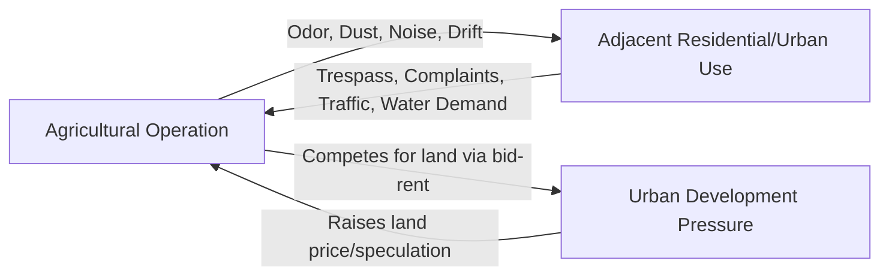
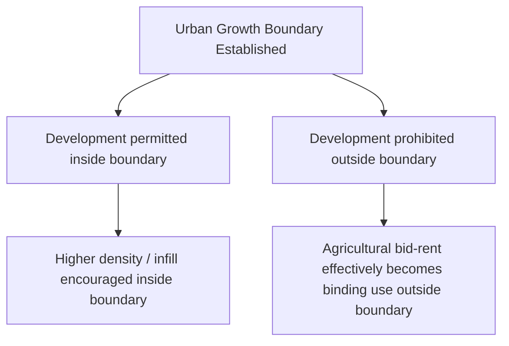
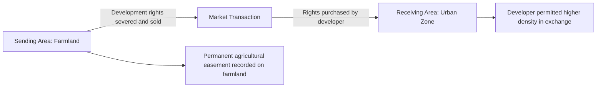

## Urban-Rural Land Use Conflicts

### Conceptual Overview

Urban-rural land use conflict refers to the friction, negative externalities, and competing claims that arise where urban and agricultural/rural land uses meet, overlap, or compete for the same land base — most intensely at the **urban-rural fringe** (also called the peri-urban interface). These conflicts are a direct, applied manifestation of the bid-rent competition described in land-use rent theory, but they also involve non-market frictions — nuisance externalities, regulatory jurisdiction disputes, and social/cultural tension between newcomers and long-established agricultural communities — that pure rent-maximization models do not fully capture.

**Key Points**

- Conflict arises both **spatially** (competition for the same parcels) and **functionally** (incompatible activities in close proximity, even without a direct land-transfer dispute).
- The peri-urban fringe is characterized by rapid, often unplanned land-use transition, weak or contested zoning enforcement, and high land-price volatility.
- Conflicts are bidirectional: agricultural operations impose externalities on nearby residential uses (odor, noise, dust, pesticide drift), while urban expansion imposes externalities on agricultural operations (trespass, vandalism, land price speculation, infrastructure disruption, water competition).

### Economic Drivers of Urban-Rural Conflict

**1. Bid-Rent Differentials at the Fringe**

As established in rent theory, urban and suburban land uses typically generate higher bid-rent than agricultural uses at locations within commuting or logistical range of urban centers, since urban use captures agglomeration economies, higher population density value, and non-agricultural income potential.

$$R_{\text{urban}}(d) > R_{\text{agriculture}}(d) \quad \text{for } d < d^*$$

where $d^*$ is the crossover distance. Conflict intensifies precisely in the zone approaching $d^*$, where the two uses are in closest competitive proximity and where land-use transition is most active and contested.

**2. Externalities Between Adjacent Uses**

Agricultural and urban/residential uses generate **negative externalities on each other** when adjacent, independent of any direct land-transfer competition:

- **Agriculture-to-urban externalities**: odor from livestock operations, noise from machinery (especially night operations, e.g., irrigation pumping or harvest), dust from tillage, agrochemical/pesticide drift onto residential properties, slow-moving farm equipment on shared roads.
- **Urban-to-agriculture externalities**: trespass and vandalism on farm property, theft of equipment or produce, complaints/litigation against long-established farm practices by new residents ("right-to-farm" disputes), increased traffic congestion on rural roads, light pollution affecting livestock or crops, and competition for water resources (municipal water demand competing with irrigation withdrawal).

**3. Land Price Speculation and the Impermanence Syndrome**

As urban expansion approaches, farmland near the fringe experiences the **"impermanence syndrome"** (a term from the land economics literature): farmers anticipating eventual conversion reduce long-term investment (soil conservation, drainage, capital equipment, orchard/perennial establishment) because the expected holding horizon under agricultural use is shortened by anticipated sale for development.

$$I^* = \arg\max_I \left[ \sum_{t=0}^{T} \frac{\pi_t(I)}{(1+r)^t} \right], \quad T = \min(T_{\text{economic life}}, T_{\text{expected conversion}})$$

where $I$ is investment level and $T$ is the effective planning horizon. As the expected time to conversion $T_{\text{expected conversion}}$ shortens, optimal investment $I^*$ falls, since the returns to long-lived investments cannot be fully recovered before the land exits agricultural use.

**Key Points**

- This creates a **self-reinforcing cycle**: reduced agricultural investment leads to visibly declining or stagnant farm operations, which in turn reinforces the perception (and speculative expectation) that conversion is imminent, further depressing investment.
- Speculative land holding — purchasing agricultural land primarily for anticipated future conversion value rather than current agricultural income — inflates land prices beyond levels justified by agricultural income capitalization, pricing out farmers seeking to expand or enter, a dynamic sometimes termed the **agricultural land price premium** at the urban fringe.

### Typology of Urban-Rural Land Use Conflicts

| Conflict Type | Description | Example Manifestation |
| --- | --- | --- |
| Nuisance/externality conflict | Incompatible adjacent activities generate spillover costs | Odor complaints against a hog operation from new subdivision residents |
| Competitive land conversion conflict | Direct competition for the same parcel between agricultural and development use | Farmland sale to a residential developer over a farmer's expansion bid |
| Infrastructure/resource competition | Shared, scarce resources contested across uses | Groundwater withdrawal competition between municipal supply and irrigation |
| Regulatory/jurisdictional conflict | Overlapping or contested authority over land-use decisions | Disputes between county agricultural zoning and municipal annexation authority |
| Right-to-farm/legal conflict | Legal disputes over the priority of pre-existing agricultural use versus new residential rights | Nuisance lawsuits against established farms by newly arrived residents |
| Access and infrastructure conflict | Competing demands on shared rural infrastructure | Farm equipment traffic versus commuter traffic on narrow rural roads |

### Policy Instruments to Manage Urban-Rural Conflict

**1. Agricultural Zoning and Urban Growth Boundaries**

Legally restrict non-agricultural development within designated agricultural zones or within a defined containment boundary around urban areas, directly capping the bid-rent achievable by conversion uses in protected zones (as discussed in the rent-theory framework: policy sets $R_{\text{non-agricultural}} = 0$ by legal prohibition within the zone, regardless of the underlying market bid).

**Key Points**

- Effective primarily where enforcement capacity and political durability are strong; boundaries subject to frequent revision or variance-granting tend to generate speculative anticipation of future boundary expansion, partially undermining their intended effect.
- [Inference] Empirical assessments of urban growth boundaries show mixed results on farmland preservation outcomes, with effectiveness strongly dependent on regional growth pressure, boundary rigidity, and complementary policy instruments, rather than the boundary mechanism alone.

**2. Purchase/Transfer of Development Rights (PDR/TDR)**

**Purchase of Development Rights (PDR)**: a public agency or land trust pays a farmland owner to permanently relinquish the right to develop the land for non-agricultural use, while the owner retains agricultural use rights and ownership.

$$\text{PDR Payment} \approx V_{\text{unrestricted}} - V_{\text{agricultural-use-only}}$$

**Transfer of Development Rights (TDR)**: development rights are severed from a "sending area" (agricultural land to be preserved) and sold to developers who use them to exceed baseline density limits in a designated "receiving area" (already slated for urban growth), creating a market mechanism that compensates farmland owners without direct public expenditure.

**Key Points**

- TDR programs require a credible, well-functioning receiving-area market with genuine developer demand for additional density; without sufficient demand, development rights have low or zero market value, undermining the incentive for farmland owners to participate.
- Both mechanisms directly address the impermanence syndrome by removing the speculative conversion value from the farmland owner's calculus, restoring incentive for long-term agricultural investment.

**3. Right-to-Farm Legislation**

Statutory protections that limit the ability of new residents to bring nuisance litigation against pre-existing, normally-operated agricultural activities, on the rationale that farms have a legitimate priority claim where they were established prior to nearby residential development ("coming to the nuisance" doctrine).

**Key Points**

- Reduces legal uncertainty and litigation cost for established farm operations facing encroaching residential development.
- [Inference] Effectiveness varies by the specificity of statutory language (e.g., whether protection applies only to "generally accepted agricultural practices" and whether it covers practice intensification/changes over time), and by whether the law preempts local nuisance ordinances or merely provides an affirmative defense.

**4. Buffer Zones and Transitional Land Use Design**

Physical or regulatory buffer strips (setback requirements, vegetative screening, transitional low-density zoning) placed between incompatible adjacent uses to reduce the physical intensity of externality spillovers (noise, odor, drift) without prohibiting either use outright.

**5. Differential/Use-Value Property Tax Assessment**

As discussed in land valuation, assessing farmland for property tax purposes based on its agricultural-use value rather than its market (highest-and-best-use) value reduces the tax-driven pressure to convert land, since holding land under agricultural use does not require paying tax on its speculative development value.

**6. Water Rights Allocation and Groundwater Management Districts**

Formal allocation systems (prior appropriation, correlative rights, permit-based withdrawal limits) and groundwater management districts are used specifically to mediate the resource-competition dimension of urban-rural conflict, allocating scarce water among municipal, industrial, and irrigation demands under conditions of growing aggregate competition.

### Right-to-Farm Litigation Dynamics: A Simplified Framework

The economic logic of right-to-farm disputes can be represented as a comparison of the marginal social cost imposed by the agricultural externality against the marginal benefit of continued agricultural operation, but with a **priority-in-time** legal overlay that departs from pure Coasean bargaining assumptions:

$$\text{Nuisance Claim Upheld} \iff MSC_{\text{externality}} > MB_{\text{agriculture}} \text{ AND priority-in-time protection does not apply}$$

**Key Points**

- Absent legal intervention, a pure Coase-theorem framing would predict that, with well-defined property rights and low transaction costs, the party who values the disputed use more highly would compensate the other to reach an efficient outcome regardless of initial legal entitlement.
- In practice, transaction costs are rarely low at the urban-rural interface — numerous, dispersed residential parties face high coordination costs to negotiate collectively with a single farm operator (or vice versa) — which is a central economic rationale for right-to-farm statutes as a substitute for costly case-by-case bargaining or litigation.

### Illustrative Diagram: Anatomy of the Urban-Rural Fringe Conflict Zone

<svg xmlns="http://www.w3.org/2000/svg" viewBox="0 0 820 440" font-family="Arial, sans-serif">
<text x="410" y="28" text-anchor="middle" font-size="18" font-weight="bold" fill="#1a1a1a">Urban-Rural Fringe Conflict Zone (svg_diagram)</text>
<rect x="40" y="80" width="180" height="280" fill="#dbe9f5" stroke="#2f6690" stroke-width="1.5" />
<text x="130" y="70" text-anchor="middle" font-size="12" font-weight="bold" fill="#1a1a1a">Urban Core</text>
<rect x="220" y="80" width="200" height="280" fill="#f0d9e8" stroke="#a5397a" stroke-width="1.5" />
<text x="320" y="70" text-anchor="middle" font-size="12" font-weight="bold" fill="#1a1a1a">Fringe Conflict Zone</text>
<rect x="420" y="80" width="360" height="280" fill="#e0f0dc" stroke="#3f7d3f" stroke-width="1.5" />
<text x="600" y="70" text-anchor="middle" font-size="12" font-weight="bold" fill="#1a1a1a">Agricultural Zone</text>

<rect x="235" y="100" width="170" height="50" rx="6" fill="#fff" stroke="#a5397a" stroke-width="1" />
<text x="320" y="122" text-anchor="middle" font-size="10" fill="#333">Speculative land</text>
<text x="320" y="138" text-anchor="middle" font-size="10" fill="#333">holding / impermanence</text>
<rect x="235" y="160" width="170" height="50" rx="6" fill="#fff" stroke="#a5397a" stroke-width="1" />
<text x="320" y="182" text-anchor="middle" font-size="10" fill="#333">Odor/noise/dust</text>
<text x="320" y="198" text-anchor="middle" font-size="10" fill="#333">nuisance complaints</text>
<rect x="235" y="220" width="170" height="50" rx="6" fill="#fff" stroke="#a5397a" stroke-width="1" />
<text x="320" y="242" text-anchor="middle" font-size="10" fill="#333">Trespass, vandalism,</text>
<text x="320" y="258" text-anchor="middle" font-size="10" fill="#333">traffic conflicts</text>
<rect x="235" y="280" width="170" height="50" rx="6" fill="#fff" stroke="#a5397a" stroke-width="1" />
<text x="320" y="302" text-anchor="middle" font-size="10" fill="#333">Water/resource</text>
<text x="320" y="318" text-anchor="middle" font-size="10" fill="#333">competition</text>

<line x1="220" y1="200" x2="235" y2="200" stroke="#333" stroke-width="2" marker-end="url(#arrowR)" />
<line x1="420" y1="230" x2="405" y2="230" stroke="#333" stroke-width="2" marker-end="url(#arrowL)" />
<text x="410" y="400" text-anchor="middle" font-size="11" fill="#555">Urban expansion pressure (leftward) vs. agricultural externality spillover (rightward)</text>

</svg>

### Worked Illustrative Example

**Example**

A dairy operation has operated on a 200-hectare parcel for 40 years. Over the past decade, a residential subdivision has been built on adjacent land previously in agricultural use, following its sale to a developer who outbid the dairy farmer's expansion offer (a bid-rent-driven conversion). New residents subsequently file nuisance complaints regarding manure odor and early-morning milking-related noise.

- **Without right-to-farm protection**: the dairy operator faces potential litigation and injunctive restriction on operating hours or manure management practices, raising compliance costs and potentially forcing a reduction in herd size or operational changes not otherwise economically justified by production considerations.
- **With right-to-farm protection**: provided the operation is conducted using generally accepted agricultural practices and predates the residential development, the statute provides an affirmative defense against nuisance claims, shifting the effective cost of the externality onto the residential newcomers (who accepted the pre-existing land-use context) rather than the established agricultural operator.
- **Underlying land economics**: the conflict here originated from a bid-rent-driven conversion decision (the developer's bid exceeded agricultural bid-rent) that created an incompatible land-use adjacency; the right-to-farm statute is a policy response addressing the resulting externality dispute, but it does not reverse or address the original land-conversion decision itself.

### Emerging Dimensions of Urban-Rural Conflict

**Key Points**

- **Renewable energy siting conflicts**: utility-scale solar and wind installations increasingly compete with agricultural use for land near transmission infrastructure, generating a parallel form of urban/infrastructure-versus-agriculture bid-rent competition, along with visual and community-character disputes distinct from traditional residential-agricultural conflict.
- **Exurban "hobby farm" and lifestyle-block development**: low-density residential development marketed with agricultural or rural amenity value can fragment agricultural land bases without full conversion to conventional urban use, complicating zoning categories designed around a binary urban/agricultural distinction.
- **Climate and water-stress intensification**: growing water scarcity in many regions is intensifying urban-agricultural water competition specifically, adding a resource-scarcity dimension to fringe conflicts that is likely to grow in salience independent of physical land-conversion pressure. [Speculation] The relative weight of water-competition conflict versus direct land-conversion conflict may shift further toward water disputes in water-stressed regions as urban populations continue to grow, though this trajectory is regionally contingent and not a universal pattern.

### Related Topics

- Land use decisions and rent theory (bid-rent curves, extensive and intensive margins)
- Land markets and land valuation (highest-and-best-use, option value of conversion)
- Zoning, urban growth boundaries, and land-use planning law
- Purchase/transfer of development rights program design
- Water rights allocation systems and groundwater management
- Right-to-farm legislation and agricultural nuisance law
- Peri-urban agriculture and urban agriculture systems
- Coase theorem and transaction-cost economics of externality resolution
- Renewable energy land-use siting and agrivoltaics
- Rural infrastructure planning and shared-resource governance