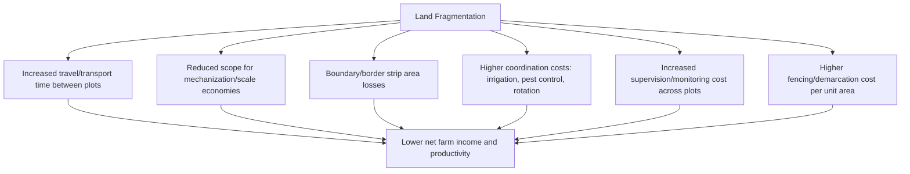
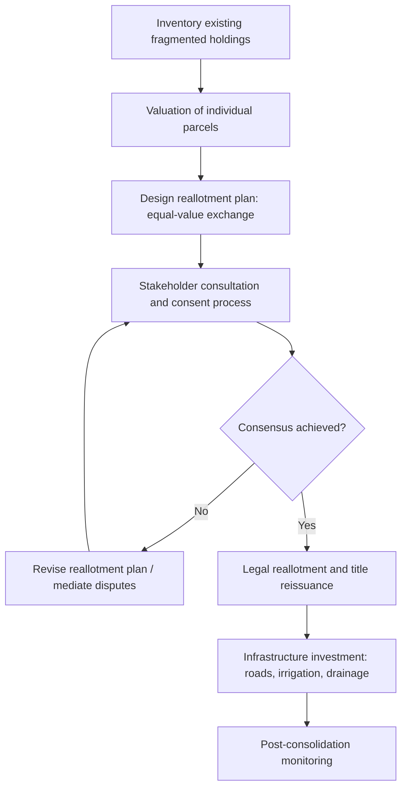

## Land Fragmentation and Consolidation

### Conceptual Overview

**Land fragmentation** refers to a condition in which a single farm household's operational landholding consists of multiple, spatially separated, non-contiguous parcels, often of small individual size, rather than a single consolidated block. **Land consolidation** (also called land reallotment or land readjustment) refers to the deliberate reorganization — typically government-facilitated — of fragmented parcels into fewer, larger, contiguous holdings to reduce the economic costs associated with fragmentation.

**Key Points**

- Fragmentation is distinct from small farm size per se: a farm can be small but consolidated (one small contiguous block) or large but highly fragmented (many small dispersed parcels summing to a large total area).
- Fragmentation is typically measured using indices combining **parcel number, average parcel size, and spatial dispersion** (distance between parcels), rather than any single metric alone.
- Fragmentation is a near-universal historical feature of smallholder agriculture, observed across highly diverse tenure systems, from Western Europe's historical open-field systems to contemporary smallholder systems in Asia, Africa, and Eastern Europe post-decollectivization.

### Measuring Fragmentation

Several indices are used in the land economics literature to quantify fragmentation:

**Simpson's Index of fragmentation** (adapted from ecology), measuring the probability that two randomly selected units of land from a holding belong to different parcels:

$$SI = 1 - \sum_{i=1}^{n} \left(\frac{a_i}{A}\right)^2$$

where $a_i$ is the area of parcel $i$, $A$ is total holding area ($A = \sum a_i$), and $n$ is the number of parcels. $SI$ ranges from 0 (single consolidated parcel) toward 1 (many small, equally-sized parcels).

**Januszewski's Index**, incorporating parcel count directly:

$$J = \frac{\sqrt{\sum a_i}}{\sum \sqrt{a_i}}$$

Ranges from near 0 (highly fragmented) to 1 (single parcel, no fragmentation).

**Simple descriptive metrics** commonly reported alongside formal indices:

- Number of parcels per holding
- Average parcel size ($\bar{a} = A/n$)
- Average distance between parcels or average distance from farmstead to parcels
- Shape irregularity indices (perimeter-to-area ratios), since irregularly shaped parcels also raise operational costs independent of fragmentation across separate parcels

### Causes of Land Fragmentation

**1. Inheritance Systems (Partible Inheritance)**

The dominant structural driver in most historical and contemporary contexts: **partible inheritance** customs or laws divide a deceased landholder's property equally (or according to a formula) among multiple heirs, progressively subdividing holdings across generations.

$$n_{t+1} = n_t \times h$$

where $n_t$ is the number of parcels at generation $t$ and $h$ is the average number of heirs per landholding generation — illustrating how fragmentation compounds multiplicatively absent counteracting consolidation, land sales, or out-migration of some heirs.

**2. Historical Land Reform and Allocation Methods**

Land reform and resettlement programs have frequently allocated land to beneficiaries in multiple non-contiguous plots — often deliberately, to ensure equitable access to land of varying quality (see risk diversification below) — creating fragmentation as a direct policy outcome rather than an inheritance-driven process.

**3. Risk Diversification Motive**

Households may voluntarily hold or seek dispersed plots across different microenvironments (varying soil type, elevation, flood exposure, or microclimate) as a strategy to reduce **covariate production risk** — the risk that a single localized shock (pest outbreak, hailstorm, flash flood) destroys the household's entire crop.

$$\text{Var}(Y_{\text{total}}) = \sum_i \text{Var}(Y_i) + 2\sum_{i<j} \text{Cov}(Y_i, Y_j)$$

If plots are spatially dispersed such that shocks affecting them are less correlated (lower $\text{Cov}(Y_i, Y_j)$), aggregate output variance for the household is reduced relative to holding an equivalent total area in a single contiguous block subject to a single spatially-correlated shock.

**Key Points**

- [Inference] This risk-diversification rationale is well established theoretically and supported in several empirical studies, but its quantitative importance relative to inheritance-driven fragmentation varies substantially by context, and inheritance-driven fragmentation frequently persists well beyond what risk-diversification alone would predict as optimal.

**4. Land Market Purchase Patterns**

Piecemeal land purchases over time — buying whatever parcels become available for sale near an existing holding, rather than assembling a single contiguous block — can generate fragmentation even in market-based (non-inheritance-driven) land acquisition contexts, particularly where land sales are infrequent and spatially scattered.

**5. Communal and Customary Tenure Allocation Practices**

In some customary tenure systems, periodic reallocation of communal land among household members has historically produced dispersed, non-contiguous holdings as an equity-preserving mechanism within the community, distinct from both inheritance and market-driven causes.

### Economic Costs of Fragmentation

**Key Points**

- **Travel time costs**: labor and time spent moving between dispersed plots (and transporting inputs/outputs) is unproductive time not directly contributing to output, effectively raising the labor cost per unit of cultivated area.
- **Mechanization constraints**: small, irregularly shaped, and dispersed parcels limit the economic viability of larger machinery, since machinery has fixed costs per field entry/exit (turning, setup) that are better amortized over larger contiguous areas.
- **Boundary/border losses**: land occupied by paths, boundary strips, and access ways between numerous small parcels represents area removed from productive cultivation; this loss scales with the number of parcel boundaries rather than total area.
- **Coordination costs**: activities requiring coordination across a contiguous area (shared irrigation channel management, coordinated pest control, crop rotation planning) become more costly to organize when a household's or community's plots are interspersed with other owners' plots.
- **Elevated per-unit-area costs generally**: the sum of these effects is typically modeled as fragmentation lowering total factor productivity for a given total farmed area, relative to an equivalent-area consolidated holding.

A stylized production relationship incorporating a fragmentation penalty:

$$Y = A \cdot f(L, K) \cdot (1 - \phi \cdot SI)$$

where $Y$ is total output, $A$ is total factor productivity absent fragmentation effects, $f(L,K)$ is the standard production function in labor and capital, $SI$ is the fragmentation index, and $\phi$ is a parameter representing the productivity penalty per unit of fragmentation — an empirically estimated parameter rather than a theoretical constant, and one that [Inference] appears to vary substantially by crop type, terrain, and available transport infrastructure across studies.

### Potential Offsetting Benefits of Fragmentation

**Key Points**

- **Risk pooling**, as discussed above, is the most commonly cited offsetting benefit, particularly significant in rainfed or otherwise weather-exposed farming systems with limited access to formal crop insurance.
- **Staggered cropping/harvest timing**: dispersed plots across different microclimates or elevations can allow staggered planting and harvest, smoothing labor demand peaks and potentially improving labor-use efficiency across the season.
- **Diversified soil-type access**: different plots may be suited to different crops, allowing a single household to cultivate a more diverse crop portfolio than a single consolidated parcel of uniform soil type would permit.
- [Inference] Whether these benefits outweigh the coordination and transport costs of fragmentation is highly context-dependent (climate variability, crop portfolio, infrastructure quality), which is part of why land consolidation program outcomes are empirically mixed rather than uniformly positive.

### Land Consolidation: Objectives and Approaches

**Primary objectives of formal land consolidation programs:**

- Reduce the number of parcels per holding and increase average parcel size
- Improve parcel shape regularity (reduce perimeter-to-area ratio)
- Reduce average distance between a household's parcels and between parcels and the farmstead/village
- Rationalize the rural road and irrigation infrastructure network alongside the reallotment
- In some programs, simultaneously formalize/clarify land tenure and update cadastral records

**Key Points**

- The central technical and political challenge is designing a reallotment in which each participant receives new, consolidated parcel(s) of **equivalent value** (not necessarily equivalent area, given quality differences) to what they surrendered, requiring accurate parcel-level valuation as a prerequisite (linking directly to land valuation methodology).
- Programs vary in their degree of compulsion: **voluntary consolidation** (requiring unanimous or high-threshold consent among affected landholders) versus **compulsory consolidation** (state-mandated reallotment, historically used in some European land consolidation programs and in socialist-era and post-socialist land reforms).
- Complementary infrastructure investment (new access roads to consolidated parcels, irrigation network redesign) is frequently bundled with the reallotment itself, since consolidation without matching infrastructure investment may not fully realize potential efficiency gains.

### Implementation Challenges

**Key Points**

- **Valuation disputes**: disagreement over the relative value of exchanged parcels (differing soil quality, water access, distance to market) is the most common source of conflict and delay in consolidation programs, directly implicating land valuation methodology and its inherent subjectivity in thin, heterogeneous land markets.
- **Social and cultural attachment to specific plots**: land parcels often carry inherited, ancestral, or sentimental value beyond their measurable economic characteristics, creating resistance to exchange even where the offered replacement parcel is objectively of equivalent or superior economic value.
- **Administrative and financial cost**: consolidation requires detailed cadastral surveying, valuation, legal processing, and dispute resolution capacity, which can be substantial relative to available public administrative budgets, particularly in developing-country contexts.
- **Elite capture risk**: as with other land-related interventions, politically or socially influential landholders may be able to secure more favorable reallotment terms than smallholders with less bargaining power or legal literacy, potentially undermining the equity intent of consolidation.
- **Gender and intra-household equity**: consolidation processes that register consolidated titles only in the name of a (often male) household head can inadvertently weaken the land rights previously held (formally or informally) by women or other household members across the fragmented original parcels.
- **Temporary disruption costs**: the consolidation process itself (survey, negotiation, legal transfer, potential fallow periods during transition) imposes short-run transaction and opportunity costs on participating farmers, which must be weighed against long-run efficiency gains.

### Historical and Regional Consolidation Approaches (Generic Patterns)

**Example**

- **Structured European-style land consolidation** (patterns historically used across parts of Western and Northern Europe from the 19th century onward): state or cooperative-facilitated exchange of fragmented parcels into consolidated blocks, often paired with rural road and drainage infrastructure programs, using formal cadastral valuation and a legally mandated consent/appeals process.
- **Post-collectivization land reform consolidation** (patterns observed across parts of post-socialist Central and Eastern Europe and parts of Asia): restitution or redistribution of formerly collectivized land frequently reintroduced or exacerbated fragmentation, as land was returned to numerous heirs of original pre-collectivization owners or distributed in small equal shares among cooperative members, prompting a subsequent wave of consolidation-oriented policy and land-market-based re-aggregation.
- **Voluntary land-pooling/land-banking mechanisms**: some jurisdictions have used land banks or farmer-cooperative land-pooling arrangements as a market-based alternative to compulsory state-led consolidation, allowing gradual, opt-in aggregation of farmed area (whether through leasing, cooperative joint operation, or eventual sale) without direct state reallotment of title.

### Land Fragmentation Reduction Through Land Markets (Without Formal Consolidation Programs)

In many contexts, gradual fragmentation reduction (or at least prevention of further fragmentation) occurs organically through **land rental and sales markets**, without a formal state consolidation program:

- **Land rental market consolidation of operational holdings**: even where ownership remains fragmented across many small titleholders (e.g., absentee heirs), rental markets can allow a smaller number of active farm operators to lease and operationally consolidate land into larger *farmed* (though not necessarily titled) units, partially separating the ownership-fragmentation problem from the operational-scale problem.
- **Land sales market-driven aggregation**: as agricultural labor migrates out of farming and land markets mature, some fragmentation is reduced organically as remaining farmers purchase or lease adjoining parcels from exiting neighbors — though this process can be slow where land markets are thin or transaction costs are high, and does not resolve fragmentation for households that retain ownership without consolidating their own dispersed holdings.
- [Inference] The relative effectiveness of market-based versus state-led consolidation in achieving comparable fragmentation reduction outcomes depends heavily on the maturity and transaction-cost structure of local land rental and sales markets, and is not resolved uniformly in the literature.

### Worked Numerical Example

**Example**

A household holds 4 parcels: 0.8 ha, 0.5 ha, 1.2 ha, and 0.3 ha (total $A = 2.8$ ha).

**Simpson's Index:**

$$SI = 1 - \left[\left(\frac{0.8}{2.8}\right)^2 + \left(\frac{0.5}{2.8}\right)^2 + \left(\frac{1.2}{2.8}\right)^2 + \left(\frac{0.3}{2.8}\right)^2\right]$$

$$SI = 1 - [0.0816 + 0.0319 + 0.1837 + 0.0115] = 1 - 0.3087 = 0.691$$

An $SI$ of 0.691 indicates substantial fragmentation (closer to 1, the theoretical maximum for many small equal-sized parcels, than to 0).

**Januszewski's Index:**

$$J = \frac{\sqrt{2.8}}{\sqrt{0.8}+\sqrt{0.5}+\sqrt{1.2}+\sqrt{0.3}} = \frac{1.673}{0.894+0.707+1.095+0.548} = \frac{1.673}{3.244} = 0.516$$

A consolidation program merging these 4 parcels into a single 2.8 ha contiguous block would reduce $SI$ to 0 and raise $J$ to 1, representing the theoretical maximum consolidation outcome for this holding, before accounting for any efficiency gains that would follow from reduced boundary loss, travel time, and mechanization constraints.

### Illustrative Diagram: Fragmentation vs. Consolidation

<svg xmlns="http://www.w3.org/2000/svg" viewBox="0 0 820 380" font-family="Arial, sans-serif">
<text x="410" y="28" text-anchor="middle" font-size="18" font-weight="bold" fill="#1a1a1a">Fragmented vs. Consolidated Holdings (svg_diagram)</text>

<text x="200" y="55" text-anchor="middle" font-size="13" font-weight="bold" fill="`#1a1a1a`">Before: Fragmented</text>

<rect x="60" y="70" width="60" height="50" fill="`#dbe9f5`" stroke="`#2f6690`" stroke-width="1.5" />

<rect x="160" y="90" width="40" height="35" fill="`#f5e6d3`" stroke="`#a5682a`" stroke-width="1.5" />

<rect x="90" y="150" width="70" height="60" fill="`#e0f0dc`" stroke="`#3f7d3f`" stroke-width="1.5" />

<rect x="200" y="60" width="35" height="30" fill="`#f5d9d9`" stroke="`#a53f3f`" stroke-width="1.5" />

<rect x="240" y="140" width="45" height="40" fill="`#efe0f5`" stroke="`#7a3f9c`" stroke-width="1.5" />

<text x="150" y="240" text-anchor="middle" font-size="10" fill="#555">Same household's plots</text>

<text x="150" y="255" text-anchor="middle" font-size="10" fill="#555">scattered among others' land</text>

<line x1="330" y1="150" x2="420" y2="150" stroke="#333" stroke-width="2" marker-end="url(#arrowC)" />
<text x="375" y="135" text-anchor="middle" font-size="10" fill="#333">Consolidation</text>

<text x="620" y="55" text-anchor="middle" font-size="13" font-weight="bold" fill="`#1a1a1a`">After: Consolidated</text>

<rect x="500" y="70" width="240" height="180" fill="`#dbe9f5`" stroke="`#2f6690`" stroke-width="2" />

<text x="620" y="165" text-anchor="middle" font-size="11" fill="#333">Single contiguous block</text>

<text x="620" y="240" text-anchor="middle" font-size="10" fill="#555">Equivalent total value/area,</text>

<text x="620" y="255" text-anchor="middle" font-size="10" fill="#555">reallotted to one household</text>

</svg>

### Related Topics

- Land markets and land valuation (parcel valuation methods underlying equal-value reallotment)
- Land use decisions and rent theory (productivity and cost implications of parcel scale)
- Land tenure systems and property rights institutions
- Inheritance law and intergenerational farm transfer
- Agricultural mechanization economics and farm size efficiency
- Risk management and diversification strategies in smallholder agriculture
- Cadastral systems and land registration infrastructure
- Cooperative farming and land-pooling arrangements
- Post-collectivization land reform and restitution economics
- Gender and land rights in tenure reform processes