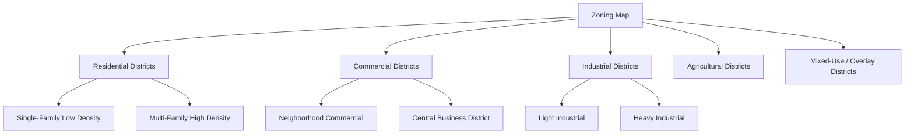
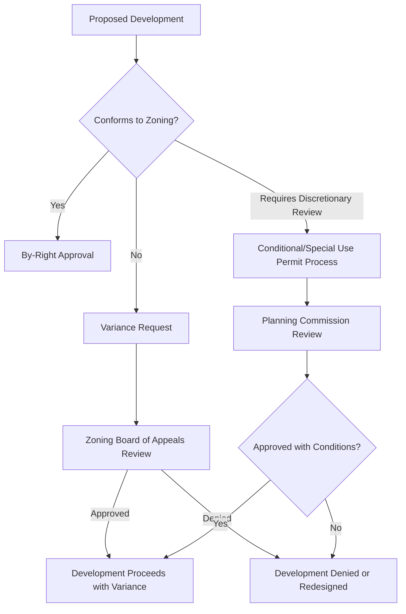

## Zoning and Land Use Regulation

### Conceptual Overview

**Zoning** is a form of land use regulation in which a governing authority (typically municipal, county, or regional) legally partitions a jurisdiction into designated districts (zones), within which only specified categories of land use are permitted, and within which further rules govern density, building form, and use intensity. Zoning and broader **land use regulation** (which also includes subdivision control, environmental permitting, and building codes) represent direct governmental intervention into the land market's bid-rent allocation process described in rent theory, substituting administrative rules for pure market competition in determining land use outcomes.

**Key Points**

- Zoning is fundamentally an exercise of the **police power** — the government's authority to regulate private conduct and property for public health, safety, and welfare — rather than a taking of property requiring compensation, though this boundary is itself a major area of legal and economic dispute (discussed below).
- Regulation directly alters the bid-rent competition outcome by legally capping achievable rent for prohibited uses at a given location, effectively setting $R_{\text{prohibited use}} = 0$ regardless of the underlying market bid for that use.
- Land use regulation encompasses far more than zoning alone: subdivision regulations, building codes, environmental permitting (wetlands, floodplains), agricultural land preservation statutes, and historic preservation ordinances all constrain land use choice through distinct legal mechanisms.

### Economic Rationale for Land Use Regulation

**1. Externality Correction**

The dominant economic justification: land uses generate externalities (both positive and negative) that are not captured in private market transactions, leading to a divergence between private and social optimum use absent regulation.

$$MSC = MPC + MEC$$

where $MSC$ is marginal social cost, $MPC$ is marginal private cost, and $MEC$ is marginal external cost. Zoning separating incompatible uses (e.g., heavy industry from residential) is a direct policy response to negative externalities (noise, pollution, traffic) that a pure market-bid-rent allocation would not internalize.

**2. Public Goods Provision and Coordination**

Zoning facilitates coordinated provision of public infrastructure (roads, utilities, schools) by providing predictability about future land-use patterns and density, reducing the risk of infrastructure being under- or over-sized relative to eventual development.

**3. Fiscal Zoning and Local Public Finance**

Municipalities reliant on local property tax revenue may use zoning to attract land uses generating high tax revenue relative to public service cost (e.g., commercial/industrial uses, or large-lot single-family housing that limits school-age population per unit of tax base) — a phenomenon termed **fiscal zoning**, distinct from pure externality-correction rationale.

**4. Preservation of Agricultural and Open Space Amenity Value**

As discussed in urban-rural conflict and land value contexts, agricultural and conservation zoning is used to prevent bid-rent-driven conversion of farmland or open space to development, on the rationale that agricultural/open-space value includes non-market components (food security, landscape amenity, ecosystem services) not fully reflected in the landowner's private conversion decision.

### The Standard Zoning Framework

**Use zoning** establishes permitted use categories per district:

**Dimensional/bulk zoning controls**, layered on top of use restrictions, regulate the physical form and intensity of development within each use category:

- **Density limits**: maximum dwelling units per hectare/acre, floor-area ratio (FAR) caps
- **Height limits**: maximum building height
- **Setback requirements**: minimum distance from lot lines to structures
- **Lot coverage limits**: maximum percentage of a lot that may be covered by structures
- **Minimum lot size**: smallest permissible parcel for a given use (particularly consequential in agricultural zoning, where large minimum lot sizes are used to prevent subdivision into non-viable farm units)

**Floor-area ratio (FAR)** is a commonly used density metric:

$$FAR = \frac{\text{Total Building Floor Area}}{\text{Lot Area}}$$

A FAR of 1.0 permits a building with floor area equal to the lot area (e.g., a single-story building covering the full lot, or a two-story building covering half the lot).

### Zoning Administration Mechanisms

**Key mechanisms:**

- **Variance**: an authorized exception from a specific dimensional zoning requirement (e.g., a reduced setback) granted when strict application would cause unusual hardship, typically requiring demonstration that the hardship is unique to the parcel and not self-created.
- **Conditional/special use permit**: authorization for a use that is not permitted by-right in a district but may be allowed subject to specific conditions and discretionary review (e.g., a religious institution or hospital in a residential district).
- **Rezoning/zoning map amendment**: a legislative change to a parcel's zoning district classification, typically requiring public hearings and governing-body approval, and often the mechanism through which agricultural land at the fringe undergoes the "crossover" from agricultural to development-eligible status discussed in rent theory.
- **Nonconforming use**: a use that lawfully existed prior to a zoning change that would no longer permit it; typically "grandfathered" to continue but subject to restrictions on expansion, reconstruction after destruction, or transfer.

### Agricultural and Rural Land Use Zoning Instruments

**Key Points**

- **Exclusive agricultural zoning**: prohibits non-agricultural uses (including most residential subdivision) within designated agricultural districts, directly implementing the extensive-margin protection discussed in land-use rent theory.
- **Large-lot (minimum acreage) zoning**: requires a large minimum parcel size for any permitted dwelling in agricultural zones, intended to discourage residential subdivision by making it economically unattractive relative to continued agricultural use, though [Inference] evidence on the effectiveness of large-lot zoning alone (absent complementary instruments) in actually preventing farmland conversion is mixed, since large-lot rural residential development itself consumes substantial land per dwelling.
- **Agricultural protection zoning combined with right-to-farm provisions**: often paired, as discussed under urban-rural conflict, since zoning alone addresses the land-conversion dimension of conflict but not the nuisance-externality dimension between adjacent uses.
- **Cluster/conservation subdivision zoning**: permits residential development at standard overall density but requires concentration of building lots on a portion of the parcel while preserving the remainder as open space or continued agricultural use, aiming to accommodate some development pressure while limiting fragmentation of the agricultural land base.

### Zoning and Property Rights: The Regulatory Takings Question

A central legal-economic issue in land use regulation is the boundary between a legitimate exercise of police power (uncompensated) and a **regulatory taking** requiring just compensation under takings/expropriation law, since regulation that eliminates most or all economically viable use of a property can be functionally equivalent to physical expropriation.

**Key Points**

- Regulatory takings analysis typically examines: (a) the economic impact of the regulation on the property owner, (b) the extent of interference with reasonable investment-backed expectations, and (c) the character of the government action — factors weighed case-by-case rather than through a fixed formula, and the specific legal test/threshold varies substantially across jurisdictions.
- Regulations that deprive an owner of **all economically viable use** of land are generally treated as requiring compensation in many legal systems, whereas partial diminutions in value from otherwise valid land use regulation (including most conventional zoning) generally are not.
- This distinction is economically significant for agricultural and conservation zoning specifically: down-zoning farmland to prohibit development (reducing its value from development-eligible bid-rent to agricultural-only bid-rent) has been challenged in various jurisdictions as an uncompensated taking, with outcomes varying by the severity of the value reduction and the specific legal framework applied.
- [Unverified as a universal rule] The precise legal threshold distinguishing compensable regulatory takings from non-compensable regulation differs substantially across countries and even across sub-national jurisdictions within the same country, so no single numerical or categorical threshold can be stated as globally applicable.

### Economic Effects of Zoning: Efficiency and Equity Considerations

**Potential efficiency benefits:**

- Internalizes negative externalities between incompatible adjacent uses more predictably than case-by-case nuisance litigation (lower transaction costs than the Coasean bargaining alternative in high-transaction-cost settings).
- Provides development certainty that can lower risk premiums in land and infrastructure investment.
- Coordinates complementary infrastructure investment with anticipated land-use patterns.

**Potential efficiency costs and criticisms:**

- **Restricts supply responsiveness**: overly restrictive zoning (particularly density limits and minimum lot sizes in high-demand urban areas) constrains housing supply elasticity, which economic research widely links to elevated urban housing costs where demand is strong and zoning is highly restrictive.
- **Exclusionary effects**: large-lot minimum zoning and prohibition of multi-family housing have been documented to raise the cost of entry into certain jurisdictions, with distributive effects that concentrate the burden on lower-income households seeking housing in high-opportunity areas.
- **Rent-seeking and regulatory capture risk**: since zoning decisions (particularly rezoning approvals) can generate large windfall gains or losses in land value, the process is vulnerable to lobbying, political influence, and capture by incumbent property owners seeking to restrict competitive development ("insider" homeowners opposing new supply that would house "outsiders").
- **Uncertainty and discretionary approval costs**: zoning systems relying heavily on discretionary variance/conditional-use processes (rather than clear by-right standards) can generate substantial delay, legal, and holding costs for development, which are ultimately reflected in land and housing prices.

$$\text{Windfall/Wipeout} = V_{\text{post-rezoning}} - V_{\text{pre-rezoning}}$$

This "windfalls and wipeouts" phenomenon — large, discontinuous changes in land value triggered purely by a regulatory reclassification decision — is a recurring theme in the political economy of zoning, since it creates strong incentives for landowners to lobby for favorable rezoning and for existing residents to resist rezoning that might introduce unwanted nearby development.

### Zoning's Interaction with Rent Theory and Land Markets

Zoning directly modifies the bid-rent framework developed in rent theory: absent regulation, land use at any location is determined by the highest bid-rent among all feasible uses; zoning legally eliminates certain uses from the feasible set at specific locations, which can be represented as constraining the maximization problem:

$$\text{Use}^*(d) = \arg\max_{k \in K(d)} R_k(d), \quad K(d) \subseteq K$$

where $K(d)$ is the *zoning-permitted* subset of all possible uses $K$ at location $d$, rather than the full unconstrained set. Where the unconstrained profit-maximizing use is excluded from $K(d)$ by zoning, the land is allocated to the highest bid-rent use *among those still permitted*, and the foregone rent differential between the unconstrained optimum and the zoning-constrained outcome represents the private cost of the regulation borne by the landowner (though this cost may be offset, partially or fully, by external benefits captured elsewhere, such as compatible-use property owners nearby or the broader public).

### Comparative Regulatory Approaches

| Regulatory Approach | Mechanism | Typical Context |
| --- | --- | --- |
| Euclidean (use-based) zoning | Separates uses into single-use districts | Traditional U.S. municipal zoning model |
| Performance zoning | Regulates measurable impact (noise, traffic, emissions) rather than prescribing use category directly | Some U.S. jurisdictions seeking flexibility |
| Form-based codes | Regulates building form/design rather than use, permitting mixed use within a district | Urban infill and traditional neighborhood development contexts |
| Agricultural protection zoning | Restricts non-agricultural uses in designated rural/agricultural districts | Farmland preservation programs |
| Urban growth boundaries | Contains development within a defined perimeter | Regional/metropolitan-scale growth management |
| Land use planning without zoning (rare) | Relies on nuisance law, deed covenants, or minimal regulation | A small number of jurisdictions historically operating with minimal formal zoning |

### Illustrative Diagram: Zoning's Effect on the Bid-Rent Outcome

<svg xmlns="http://www.w3.org/2000/svg" viewBox="0 0 820 440" font-family="Arial, sans-serif">
<text x="410" y="28" text-anchor="middle" font-size="18" font-weight="bold" fill="#1a1a1a">Zoning Constraint on Bid-Rent Outcome (svg_diagram)</text>
<line x1="80" y1="380" x2="760" y2="380" stroke="#333" stroke-width="1.5" />
<line x1="80" y1="380" x2="80" y2="70" stroke="#333" stroke-width="1.5" />
<text x="420" y="410" text-anchor="middle" font-size="12" fill="#333">Distance from Market (d)</text>
<text x="45" y="225" text-anchor="middle" font-size="12" fill="#333" transform="rotate(-90 45 225)">Bid-Rent (R)</text>

<line x1="80" y1="100" x2="450" y2="380" stroke="#a53f3f" stroke-width="2" stroke-dasharray="6,4" />
<text x="180" y="150" font-size="11" fill="#a53f3f" font-weight="bold">Urban Bid-Rent (unconstrained)</text>

<line x1="80" y1="260" x2="700" y2="380" stroke="#3f7d3f" stroke-width="2.5" />
<text x="500" y="330" font-size="11" fill="#3f7d3f" font-weight="bold">Agricultural Bid-Rent</text>

<line x1="280" y1="70" x2="280" y2="380" stroke="#2f6690" stroke-width="2.5" stroke-dasharray="2,2" />
<text x="280" y="60" text-anchor="middle" font-size="11" fill="#2f6690" font-weight="bold">Zoning Boundary</text>
<rect x="80" y="390" width="200" height="20" fill="#dbe9f5" opacity="0.6" />
<text x="180" y="405" text-anchor="middle" font-size="9" fill="#2f6690">Development permitted</text>
<rect x="280" y="390" width="420" height="20" fill="#e0f0dc" opacity="0.6" />
<text x="490" y="405" text-anchor="middle" font-size="9" fill="#3f7d3f">Agricultural use mandated (development excluded despite higher unconstrained bid-rent)</text>
</svg>

### Worked Example: Fiscal Impact of a Rezoning Decision

**Example**

A 40-hectare agricultural parcel at the urban fringe has a current agricultural-use bid-rent capitalized value of $8,000/hectare ($320,000 total). Market evidence from comparable recently-rezoned parcels indicates that, if rezoned for residential development, the same parcel would command approximately $45,000/hectare ($1,800,000 total) — the unconstrained urban bid-rent.

- **Windfall from rezoning approval**: $\$1{,}800{,}000 - \$320{,}000 = \$1{,}480{,}000$, accruing entirely to the landowner upon a favorable rezoning decision, independent of any productive investment by the owner.
- **Policy tools sometimes used to capture part of this windfall for public benefit** include rezoning/development impact fees, negotiated infrastructure contribution requirements, or, in some jurisdictions, a specific "betterment" or windfall tax on rezoning-driven land value gains.
- This example illustrates concretely why rezoning decisions at the urban-agricultural fringe are frequently associated with intense lobbying and political contestation: the value at stake in a single administrative decision can be very large relative to the landowner's existing equity position.

### Related Topics

- Land use decisions and rent theory (bid-rent curves and the extensive margin)
- Urban-rural land use conflicts (right-to-farm law, urban growth boundaries)
- Land markets and land valuation (highest-and-best-use, option value of rezoning)
- Regulatory takings law and eminent domain/compulsory acquisition
- Urban housing supply elasticity and affordability economics
- Purchase/transfer of development rights programs
- Local public finance and fiscal zoning incentives
- Environmental land use permitting (wetlands, floodplain, and habitat regulation)
- Form-based codes and new urbanist planning approaches
- Political economy of land-use regulatory capture