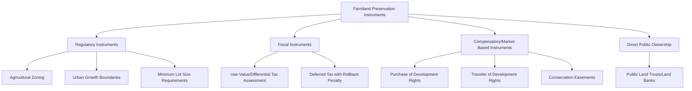
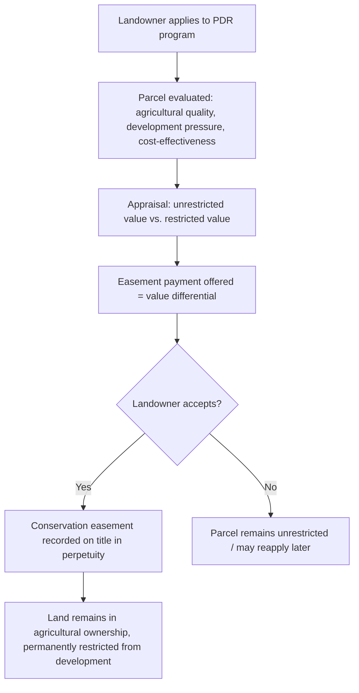

## Farmland Preservation Policy

### Conceptual Overview

Farmland preservation policy encompasses the set of legal, fiscal, and market-based instruments designed to prevent or slow the conversion of agricultural land to non-agricultural uses, particularly at the urban-rural fringe where bid-rent competition from development uses would otherwise drive conversion despite the land's continued agricultural productivity. Preservation policy is the applied policy response to the land-use conversion dynamics established in rent theory and to the market failures that cause private conversion decisions to diverge from the socially optimal rate of farmland retention.

**Key Points**

- Preservation policy rests on the premise that farmland generates **positive externalities and non-market values** — food security, open space amenity, rural economic base, ecosystem services, agricultural heritage — that are not captured in a landowner's private bid-rent calculation and are therefore under-provided by an unregulated land market.
- Policy instruments range along a spectrum from purely **regulatory** (zoning-based restriction with no compensation) to purely **market-based/compensatory** (paying landowners for foregone development value) to purely **fiscal** (using tax incentives to alter the relative return to agricultural versus development use).
- No single instrument is generally regarded as sufficient in isolation; effective preservation programs typically combine multiple instruments (e.g., agricultural zoning plus use-value tax assessment plus a purchase-of-development-rights program) targeting different points of the conversion-incentive structure.

### The Economic Rationale for Farmland Preservation

**1. Market Failure: Externalities and Non-Market Values**

$$V_{\text{private}}(\text{agriculture}) < V_{\text{private}}(\text{development}) \quad \text{but} \quad V_{\text{social}}(\text{agriculture}) \text{ may exceed } V_{\text{social}}(\text{development})$$

when non-market values (open space amenity, ecosystem services, food security option value) are included in the social calculation but are absent from the landowner's private bid-rent comparison, resulting in a privately rational but socially excessive rate of conversion.

**2. Irreversibility and Option Value**

Land conversion from agricultural to urban/built use is largely **irreversible** in practical terms — reconverting built land back to productive agricultural soil is technically difficult and economically rare. This asymmetry justifies applying an **option value** framework: society may rationally prefer to delay/limit conversion to preserve future flexibility, even where current bid-rent analysis alone might favor conversion, since the reverse transition (development back to farmland) is not readily available if future circumstances change.

$$\text{Total Value of Preservation} = \text{Current Use Value} + \text{Option Value of Future Flexibility}$$

**3. The Impermanence Syndrome as a Compounding Market Failure**

As discussed under urban-rural conflict, the anticipation of eventual conversion itself depresses agricultural investment in fringe areas, creating a self-reinforcing dynamic in which under-investment accelerates the visible decline of agricultural viability, which in turn increases perceived conversion likelihood — a dynamic that preservation policy aims to interrupt by providing credible, durable assurance against future conversion.

**4. Cumulative and Threshold Effects**

**Key Points**

- Individual parcel conversion decisions may appear economically marginal in isolation, but cumulative fragmentation of an agricultural landscape below a critical mass can undermine the viability of remaining farms by eroding shared agricultural service infrastructure (input suppliers, equipment dealers, processing facilities, agricultural support networks) that depend on a sufficient local farming base.
- [Inference] This threshold/critical-mass effect is widely cited as a rationale for preserving contiguous blocks of farmland rather than scattered individual parcels, though the precise threshold at which agricultural support infrastructure becomes unviable is empirically difficult to establish and likely varies by region and commodity.

### Typology of Farmland Preservation Instruments

### Regulatory Instruments

**Agricultural zoning** and **urban growth boundaries**, detailed extensively under zoning and land use regulation, directly restrict the legally permissible use of land within designated agricultural districts, capping achievable development bid-rent at zero within the protected area regardless of underlying market demand for conversion.

**Key Points**

- Regulatory instruments are administratively low-cost relative to compensatory approaches (no direct payment required) but face the greatest exposure to the **regulatory takings** legal challenge discussed under zoning, since they can substantially reduce a landowner's asset value without direct compensation.
- Regulatory durability is a central concern: zoning classifications can be legislatively reversed by a future governing body, making regulatory-only preservation less permanent than instruments involving a recorded legal easement or purchased property interest.

### Fiscal Instruments: Differential/Use-Value Assessment

**Use-value assessment** (also called current-use valuation or differential assessment) taxes agricultural land based on its value in continued agricultural use rather than its market value under highest-and-best-use (typically development potential), directly addressing the property-tax-driven pressure toward conversion.

$$\text{Tax Liability} = t \times V_{\text{agricultural-use}} \quad \text{rather than} \quad t \times V_{\text{market (HBU)}}$$

Since $V_{\text{market}}$ often substantially exceeds $V_{\text{agricultural-use}}$ at the urban fringe (reflecting the development bid-rent premium), use-value assessment can produce a very large reduction in the landowner's annual tax burden relative to market-value assessment.

**Rollback/deferred tax penalty**: many use-value assessment programs impose a penalty (recapture of some or all of the tax savings accumulated over prior years, sometimes with interest) if and when the land is subsequently converted to non-agricultural use, intended to discourage landowners from using the program purely as a low-cost speculative land-banking strategy while awaiting eventual development.

$$\text{Rollback Liability} = \sum_{i=1}^{n} \left[ t \times (V_{\text{market},i} - V_{\text{agricultural},i}) \right]$$

summed over the $n$ years the land was enrolled at the differential rate prior to conversion.

**Key Points**

- Use-value assessment alone, without a rollback penalty or combined with other instruments, has been criticized as primarily subsidizing large landholders and speculative land-banking near urban fringes rather than genuinely preserving long-term agricultural use, since it reduces the cost of holding land in nominal agricultural use while awaiting a future, still-unrestricted conversion opportunity.
- [Inference] The effectiveness of use-value assessment as a genuine preservation tool (rather than a tax-reduction benefit incidentally available to land eventually converted anyway) appears to depend substantially on whether it is paired with a meaningful rollback penalty and/or additional regulatory or easement-based restrictions.

### Compensatory/Market-Based Instruments

**Purchase of Development Rights (PDR) / Conservation Easements**

A landowner voluntarily and permanently sells (or donates, often for tax benefit) the development rights associated with a parcel to a government agency or qualified land trust, while retaining ownership and agricultural use rights. The easement is recorded against the property title and binds all future owners.

$$\text{PDR Payment} = V_{\text{unrestricted (market/HBU)}} - V_{\text{agricultural-use-restricted}}$$

**Key Points**

- PDR is **voluntary and compensatory**, avoiding the regulatory-takings exposure associated with pure zoning restriction, since the landowner is paid the market value of the right being extinguished.
- The easement is typically **permanent and runs with the land title**, providing greater durability than zoning, which can be legislatively altered.
- Program cost-effectiveness depends heavily on **targeting criteria**: programs typically prioritize parcels combining high agricultural soil quality, significant development pressure (high differential between unrestricted and agricultural value, meaning the land is genuinely at risk), and contiguity with other preserved or agricultural land (to achieve the critical-mass effect noted above).
- Funding constraints are a persistent limitation: PDR programs require substantial upfront public (or land-trust-raised) capital, and demand from willing sellers frequently exceeds available program funding in high-pressure fringe areas.

**Transfer of Development Rights (TDR)**

As detailed under urban-rural conflict, TDR programs sever development rights from agricultural "sending areas" and allow their sale to developers seeking increased density in designated "receiving areas," creating a market-based compensation mechanism that does not require direct public expenditure (the receiving-area developer, not the public treasury, funds the payment to the sending-area farmland owner).

**Key Points**

- TDR requires a credible receiving-area market with genuine developer demand for the additional density rights; without this, development rights carry low or negligible market value, undermining farmland owner participation incentives.
- TDR programs are more complex to administer than PDR (requiring careful sending/receiving area designation, a functioning rights registry, and market-making mechanisms), but can achieve preservation at lower direct public fiscal cost.

### Direct Public Ownership and Land Trusts

**Key Points**

- Public agencies or nonprofit land trusts can directly acquire farmland (via purchase, donation, or bequest) and either operate it directly, lease it to farm operators under agricultural-use covenants, or hold it pending eventual transfer to a qualified farmer, functioning as a form of **agricultural land bank**.
- This approach is typically the most fiscally intensive per unit of land preserved (full acquisition cost versus the development-value differential paid under PDR) but provides the strongest preservation guarantee and can additionally address farmland access barriers for new/beginning farmers by leasing preserved land at below-market agricultural rents.

### Comparative Assessment of Preservation Instrument Types

| Instrument | Compensation Required | Durability | Fiscal Cost to Public | Takings Litigation Risk |
| --- | --- | --- | --- | --- |
| Agricultural zoning | No | Legislatively reversible | Low (administrative only) | Moderate to high |
| Urban growth boundary | No | Legislatively reversible | Low to moderate | Moderate |
| Use-value tax assessment | No (foregone tax revenue) | Reversible upon conversion (subject to rollback) | Moderate (foregone revenue) | Low |
| Purchase of development rights | Yes, full differential value | Permanent (recorded easement) | High (upfront capital) | Very low (voluntary/compensated) |
| Transfer of development rights | Yes, market-based (developer-funded) | Permanent (recorded easement) | Low (market-funded) | Very low (voluntary/compensated) |
| Direct public/land trust ownership | Yes, full acquisition value | Permanent (public/trust ownership) | Very high (full acquisition cost) | None (voluntary sale) |

### Program Design Considerations: Targeting and Cost-Effectiveness

A recurring technical challenge in preservation program design (particularly PDR) is allocating limited program funds efficiently across candidate parcels. A common evaluative approach uses a **cost-effectiveness ratio** comparing an agricultural quality/significance score to the easement acquisition cost:

$$CE_i = \frac{Q_i}{C_i}$$

where $Q_i$ is a composite agricultural significance score for parcel $i$ (incorporating soil quality, farm size, contiguity with other protected land, and development pressure) and $C_i$ is the estimated easement acquisition cost for that parcel. Programs typically rank and prioritize funding toward parcels with the highest $CE_i$, subject to budget constraints.

**Key Points**

- Prioritizing parcels under the highest immediate development pressure (highest differential value, hence highest nominal PDR payment) can be more expensive per parcel than prioritizing parcels under lower pressure, creating a genuine trade-off between "saving the land most at risk" and "achieving the most acres preserved per public dollar spent."
- [Inference] There is no universally agreed resolution to this trade-off in the literature; program design choices reflect differing policy priorities (urgency of loss versus cost-effective total acreage preserved) rather than a single objectively correct targeting formula.

### Interaction Effects Among Instruments

**Key Points**

- **Zoning and PDR are frequently complementary**: agricultural zoning reduces (but does not eliminate) development pressure and, correspondingly, reduces the differential value (and hence the PDR payment required) to secure a permanent easement, making PDR programs more cost-effective in areas with baseline zoning protection already in place.
- **Use-value assessment and PDR interact through the rollback mechanism**: land already under a permanent PDR easement is, by construction, no longer at risk of the conversion-triggered rollback penalty relevant to use-value assessment, since development is legally foreclosed regardless of the tax assessment basis.
- **Combining instruments can raise the effective preservation "floor"** while allowing gradual escalation of protection intensity as development pressure increases: baseline zoning restriction, layered with use-value tax relief, layered with voluntary PDR enrollment for landowners willing to accept permanent restriction, provides multiple complementary lines of protection rather than relying on any single instrument's durability.

### Illustrative Diagram: Preservation Instrument Interaction

<svg xmlns="http://www.w3.org/2000/svg" viewBox="0 0 820 400" font-family="Arial, sans-serif">
<text x="410" y="28" text-anchor="middle" font-size="18" font-weight="bold" fill="#1a1a1a">Layered Farmland Preservation Instruments (svg_diagram)</text>
<rect x="100" y="70" width="620" height="80" rx="8" fill="#dbe9f5" stroke="#2f6690" stroke-width="1.5" />
<text x="410" y="100" text-anchor="middle" font-size="13" font-weight="bold" fill="#1a1a1a">Layer 1: Agricultural Zoning / Growth Boundary</text>
<text x="410" y="120" text-anchor="middle" font-size="10" fill="#333">Baseline regulatory restriction, low cost, legislatively reversible</text>
<rect x="150" y="170" width="520" height="80" rx="8" fill="#f5e6d3" stroke="#a5682a" stroke-width="1.5" />
<text x="410" y="200" text-anchor="middle" font-size="13" font-weight="bold" fill="#1a1a1a">Layer 2: Use-Value Tax Assessment</text>
<text x="410" y="220" text-anchor="middle" font-size="10" fill="#333">Reduces holding cost, rollback penalty discourages speculative use</text>
<rect x="200" y="270" width="420" height="80" rx="8" fill="#e0f0dc" stroke="#3f7d3f" stroke-width="1.5" />
<text x="410" y="300" text-anchor="middle" font-size="13" font-weight="bold" fill="#1a1a1a">Layer 3: Purchase/Transfer of Development Rights</text>
<text x="410" y="320" text-anchor="middle" font-size="10" fill="#333">Permanent, compensated, recorded easement</text>

<text x="410" y="385" text-anchor="middle" font-size="10" fill="#555">Increasing permanence and cost, decreasing legal reversibility, moving downward</text>

</svg>

### Worked Numerical Example

**Example**

A 60-hectare farm at the urban fringe has an appraised unrestricted (development-eligible) value of $32,000/hectare ($1,920,000 total) and an appraised agricultural-use-restricted value of $9,500/hectare ($570,000 total).

**PDR payment calculation:**

$$\text{PDR Payment} = 1{,}920{,}000 - 570{,}000 = \$1{,}350{,}000$$

If the landowner accepts, the farm remains permanently in agricultural use (title retained, easement recorded), and the landowner receives $1,350,000 while continuing to farm the land and, in most programs, continuing to receive any ongoing agricultural income.

**Comparison with direct public acquisition:**

$$\text{Full Acquisition Cost} = \$1{,}920{,}000 \quad \text{vs.} \quad \text{PDR Cost} = \$1{,}350{,}000$$

PDR achieves the preservation objective (permanent removal of development potential) at approximately 70% of the cost of full public acquisition in this example, since the landowner retains the agricultural-use value component of the property rather than requiring the public to purchase and then separately dispose of or lease that value back.

### Related Topics

- Zoning and land use regulation (agricultural zoning, growth boundaries, regulatory takings)
- Urban-rural land use conflicts (impermanence syndrome, right-to-farm law)
- Land use decisions and rent theory (bid-rent framework underlying conversion pressure)
- Land markets and land valuation (appraisal methods underlying PDR/TDR payment calculation)
- Conservation easement law and land trust administration
- Property tax policy and local public finance
- New and beginning farmer land access programs
- Ecosystem services valuation and payments for ecosystem services
- Regulatory takings jurisprudence and eminent domain law
- Agricultural land trusts and land banking institutions