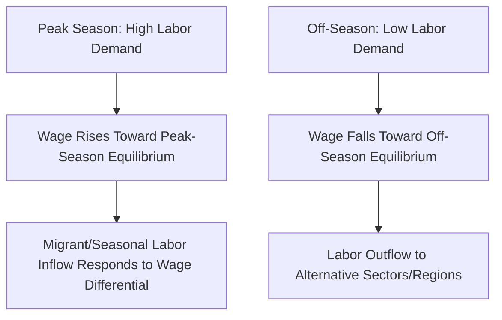

## Farm Labor Markets and Wage Determination

### Conceptual Overview

Farm labor markets govern how agricultural labor is allocated, priced, and compensated, and they exhibit several structural features that distinguish them from labor markets in other sectors: strong seasonality, spatial dispersion, significant informality, a high incidence of migrant and hired labor alongside family labor, and labor demand derived directly from biological production cycles rather than continuous manufacturing schedules. Wage determination in this sector reflects the interaction of standard labor supply-and-demand forces with these agriculture-specific structural features.

**Key Points**

- Agricultural labor markets are frequently **segmented** into distinct sub-markets: family labor, permanent hired labor, and seasonal/casual hired labor, each governed by different compensation norms, contractual arrangements, and degrees of market-based wage determination.
- Labor demand in agriculture is a **derived demand**, dependent on output prices, input costs, and the biologically determined timing of production activities (planting, cultivation, harvest), producing pronounced seasonal demand peaks and troughs.
- Farm labor markets in many countries exhibit substantial **informality** (unwritten contracts, cash payment, limited social insurance coverage), which affects both the applicability of standard labor market models and the enforceability of minimum wage and labor standards regulation.

### The Derived Demand for Farm Labor

Labor demand in agriculture derives from the value of the marginal product of labor (VMPL), following standard neoclassical labor demand theory, but with production-cycle-specific timing:

$$VMP_L = P \cdot MP_L$$

where $P$ is output price and $MP_L$ is the marginal physical product of labor. A profit-maximizing farm operator hires labor up to the point where:

$$VMP_L = w$$

where $w$ is the wage rate. Because $MP_L$ varies sharply across the production cycle (near-zero during dormant periods, very high during planting and especially harvest, when delay imposes large output losses from spoilage or weather risk), labor demand is highly seasonal even where output price and technology are constant.

**Key Points**

- Harvest-period labor demand is often **highly inelastic in timing** (though not necessarily in wage) because delaying harvest risks crop loss from weather, pest pressure, or spoilage, giving farm operators strong incentive to secure sufficient labor at the critical harvest window even at elevated wage rates.
- This seasonality is the central structural feature distinguishing agricultural labor markets from most other sectors and underlies much of the sector's reliance on migrant, seasonal, and contract labor arrangements to meet peak demand without maintaining a permanent year-round workforce at peak-period size.

### Labor Supply in Agriculture

**Sources of farm labor supply:**

- **Family labor**: unpaid or implicitly compensated labor from farm household members, historically the dominant source of labor on smallholder and family farms.
- **Permanent hired labor**: year-round employees, typically on larger commercial operations, often compensated with a base wage plus, in some arrangements, housing or in-kind benefits.
- **Seasonal/casual hired labor**: workers engaged for specific, time-bounded tasks (planting, weeding, harvest), often paid daily or piece-rate wages, with high turnover and limited job security.
- **Migrant labor**: workers relocating (domestically or internationally) to follow seasonal demand peaks across regions or crops, a labor supply mechanism specifically adapted to agriculture's spatial and temporal demand variability.
- **Contract labor via intermediaries**: labor contractors or crew leaders who recruit, organize, transport, and sometimes directly employ groups of workers on behalf of farm operators, common in labor-intensive horticultural and fruit/vegetable production.

**The farm household labor supply decision** (for family labor) is typically modeled using an agricultural household model, in which the household allocates time between on-farm work, off-farm wage labor, and leisure/home production, subject to a full-income budget constraint:

$$\max_{L_f, L_o, T_l} U(C, T_l) \quad \text{s.t.} \quad C = \pi(L_f) + w_o L_o + \text{non-labor income}$$

$$T = L_f + L_o + T_l$$

where $L_f$ is on-farm labor time, $L_o$ is off-farm wage labor time, $T_l$ is leisure/home-production time, $\pi(L_f)$ is farm profit as a function of on-farm labor input, $w_o$ is the off-farm wage rate, and $T$ is total time endowment.

**Key Points**

- Under the **separability assumption** (functioning labor markets allow the household to hire in or sell out labor at the prevailing wage without affecting production decisions), the household's production decision (how much on-farm labor to use) can be analyzed independently of its consumption/leisure decision, simplifying the model considerably.
- Where labor markets are **missing, thin, or subject to high transaction costs** (a common condition in many smallholder farming contexts, particularly for family labor substitutability), the separability assumption fails, and production and consumption decisions become jointly determined — the household's own labor supply and demand for hired-in labor cannot be analyzed independently of its consumption preferences.

### Wage Determination Mechanisms

**1. Competitive Spot Market Wage Determination**

In relatively thick, competitive local labor markets, the wage adjusts to equate aggregate labor supply and demand at each point in the production cycle:

$$w^* : L^D(w^*) = L^S(w^*)$$

This produces the characteristic **seasonal wage pattern** in agricultural labor markets: wages rise during peak-demand periods (planting, harvest) as farm operators compete for a labor supply that is less than fully elastic in the very short run, and fall during slack periods.

**2. Piece-Rate Wage Systems**

Common for harvest-stage tasks where output is easily measured per worker (e.g., kilograms of fruit picked, rows weeded), piece rates compensate workers based on measured output rather than time worked:

$$\text{Earnings} = r \times Q$$

where $r$ is the piece rate per unit and $Q$ is the worker's measured output quantity.

**Key Points**

- Piece rates align worker effort incentives with output (reducing the monitoring cost the employer would otherwise bear under a time-wage system, since output itself substitutes for direct effort supervision) and allow workers of differing productivity to self-select into higher effort/earnings.
- Piece rates transfer some **income risk** to the worker (earnings vary with the worker's own productivity and with exogenous factors such as crop yield density on a given day/plot), whereas time wages transfer that risk to the employer.
- Piece-rate systems require the employer to be able to measure output cheaply and accurately per worker; tasks where individual output attribution is difficult (collective tasks, quality-sensitive work requiring careful rather than fast handling) are less amenable to pure piece-rate compensation.

**3. Efficiency Wage Considerations**

In some farm labor contexts — particularly where monitoring individual worker effort is costly and output is not easily attributable to individual workers (e.g., certain livestock care or complex machinery operation tasks) — employers may pay wages **above the market-clearing level** as an efficiency wage, to reduce turnover, increase effort via the threat of job loss if caught shirking, and attract higher-quality applicants.

$$w_e > w^*$$

where $w_e$ is the efficiency wage paid and $w^*$ is the competitive market-clearing wage. [Inference] Efficiency wage considerations are more commonly discussed in the context of permanent, skill-intensive farm labor roles than in highly seasonal, easily-monitored piece-rate harvest labor, where the underlying rationale (reducing shirking under costly monitoring) is less binding.

**4. Institutional and Regulatory Wage Floors**

Minimum wage laws, collective bargaining agreements (where agricultural unionization exists), and, in some jurisdictions, guest-worker program-specific prevailing wage requirements (e.g., an "Adverse Effect Wage Rate" mechanism used in some agricultural guest-worker visa programs, intended to prevent imported labor from depressing wages for domestic workers) act as regulatory floors on the wage determination process, potentially binding above the unregulated market-clearing wage in low-wage regions or seasons.

### Labor Market Segmentation and Dual Labor Markets

Agricultural labor markets frequently exhibit characteristics of **dual/segmented labor markets**:

| Segment | Characteristics | Wage Determination |
| --- | --- | --- |
| Primary/permanent segment | Year-round employment, higher skill requirements, greater job security, often includes benefits | Closer to standard competitive or efficiency-wage determination |
| Secondary/casual segment | Seasonal, high turnover, lower skill barriers, limited benefits/protections | More spot-market, piece-rate, or informally negotiated |
| Migrant/contract-labor segment | Recruited via intermediaries, often geographically or legally distinct labor pool | Wage may be set by contractor/crew leader, subject to intermediary markup and monitoring costs |

**Key Points**

- Segmentation can arise both from genuine skill/productivity differences and from **institutional barriers** (legal status restrictions for migrant workers, limited information/mobility for casual workers, contractor intermediation reducing direct worker-employer wage negotiation) that constrain labor mobility between segments.
- Where migrant or contract labor faces restricted outside options (e.g., visa status tied to a specific employer, debt obligations to a labor recruiter), wage determination can depart substantially from a competitive-market outcome, since the worker's effective bargaining power and mobility are constrained independent of the underlying labor supply-and-demand balance.

### Migrant Labor and International Labor Flows in Agricultural Wage Determination

**Key Points**

- Cross-border and inter-regional migrant labor flows respond to **wage differentials** net of migration costs (transport, information, legal/documentation costs, and the risk/cost of irregular migration status where applicable), functioning as an equilibrating mechanism that can narrow (though rarely eliminate) wage gaps between labor-sending and labor-receiving agricultural regions.
- **Guest-worker/temporary agricultural visa programs** are a specific institutional mechanism used in several countries to formally regulate migrant agricultural labor supply, typically incorporating minimum wage floors, housing/transportation requirement standards, and employer-specific work authorization, all of which directly shape the wage-setting environment beyond a pure supply-and-demand model.
- [Inference] The empirical literature on the wage impact of guest-worker programs on domestic agricultural wages shows mixed findings, varying by program design, regional labor market conditions, and the degree to which the guest-worker wage floor is set above or near the prevailing local market wage.

### The Role of Labor Contractors and Intermediation

In many horticultural and fruit/vegetable production systems, **farm labor contractors (FLCs)** or crew leaders serve as intermediaries between farm operators and individual workers, recruiting crews, managing logistics (transportation, sometimes housing), supervising work, and often serving as the workers' direct legal employer of record even though the work is performed on another operator's farm.

**Key Points**

- Intermediation reduces the farm operator's direct labor-management transaction costs (recruitment, scheduling, supervision, compliance administration) but introduces a **markup** between what the operator pays the contractor and what the worker ultimately receives, and can create accountability gaps for labor standards compliance if oversight of contractors is weak.
- Wage-setting in contractor-intermediated arrangements reflects a **three-party negotiation** (operator-contractor rate, contractor-worker rate) rather than a direct two-party wage bargain, and the contractor's own market power (over both the operator seeking labor and the workers seeking employment) can affect the resulting wage split.

### Seasonal Wage Cycles: A Stylized Framework

Combining the demand-side seasonality and supply-side migration response yields a stylized seasonal equilibrium wage path:

$$w^*(t) = f\big(L^D(t), L^S(t)\big)$$

where $t$ indexes the point in the agricultural production cycle. During peak-demand periods, $L^D(t)$ shifts outward faster than $L^S(t)$ can adjust in the immediate term (labor supply response to a wage increase requires time for migration, recruitment, or reallocation from other activities), producing a temporary wage premium that erodes as labor supply catches up (via migration inflow or reallocation from off-season activities) over the following days/weeks of the peak period.

### Worked Numerical Example

**Example**

A vegetable farm's harvest-period marginal value product of labor is estimated as $VMP_L(n) = 180 - 2n$ (in local currency per worker-day, where $n$ is the number of workers hired that day). The prevailing off-season regional wage is 60/day, but during the harvest peak, in-migration of seasonal workers is limited in the very short run, and the farm faces an upward-sloping short-run labor supply curve for that specific week: $w^S(n) = 40 + 3n$.

**Short-run equilibrium** (setting $VMP_L = w^S$):

$$180 - 2n = 40 + 3n \implies 140 = 5n \implies n = 28 \text{ workers}$$

$$w^* = 40 + 3(28) = 124 \text{ per worker-day}$$

This short-run peak-period wage of 124/day substantially exceeds the off-season wage of 60/day, illustrating how demand-side seasonality combined with short-run labor supply inelasticity (limited immediate migration/reallocation response) produces the pronounced within-year wage swings characteristic of agricultural labor markets. As the peak period continues and additional seasonal/migrant labor supply responds to the elevated wage (supply curve becomes flatter/shifts outward over subsequent days), the equilibrium wage would be expected to moderate toward a lower, more sustained peak-season level.

### Illustrative Diagram: Seasonal Wage and Labor Demand Cycle

<svg xmlns="http://www.w3.org/2000/svg" viewBox="0 0 820 420" font-family="Arial, sans-serif">
<text x="410" y="28" text-anchor="middle" font-size="18" font-weight="bold" fill="#1a1a1a">Seasonal Farm Labor Demand and Wage Cycle (svg_diagram)</text>
<line x1="80" y1="370" x2="760" y2="370" stroke="#333" stroke-width="1.5" />
<line x1="80" y1="370" x2="80" y2="60" stroke="#333" stroke-width="1.5" />
<text x="420" y="400" text-anchor="middle" font-size="12" fill="#333">Time (Production Cycle)</text>
<text x="45" y="215" text-anchor="middle" font-size="12" fill="#333" transform="rotate(-90 45 215)">Labor Demand / Wage</text>

<path d="M 80 320 Q 160 180 240 260 T 400 100 T 560 260 Q 640 320 760 340" fill="none" stroke="#a53f3f" stroke-width="2.5" />
<text x="220" y="170" font-size="11" fill="#a53f3f" font-weight="bold">Planting Peak</text>
<text x="400" y="90" font-size="11" fill="#a53f3f" font-weight="bold">Harvest Peak</text>

<path d="M 80 340 Q 160 260 240 300 T 400 180 T 560 300 Q 640 340 760 350" fill="none" stroke="#2f6690" stroke-width="2.5" stroke-dasharray="6,3" />
<text x="480" y="200" font-size="11" fill="#2f6690" font-weight="bold">Wage Rate (w*)</text>

<text x="150" y="360" text-anchor="middle" font-size="9" fill="#555">Off-season</text>

<text x="680" y="360" text-anchor="middle" font-size="9" fill="#555">Off-season</text>

</svg>

### Related Topics

- Agricultural household models and the separability hypothesis
- Migration economics and rural-to-urban / cross-border labor mobility
- Minimum wage policy and its effects on agricultural employment
- Labor contractor regulation and agricultural labor standards enforcement
- Piece-rate compensation systems and worker productivity incentives
- Farm mechanization and labor-saving technology adoption
- Guest-worker and temporary agricultural visa program design
- Rural off-farm employment and income diversification
- Agricultural cooperatives and collective labor arrangements
- Occupational health and safety regulation in agricultural labor