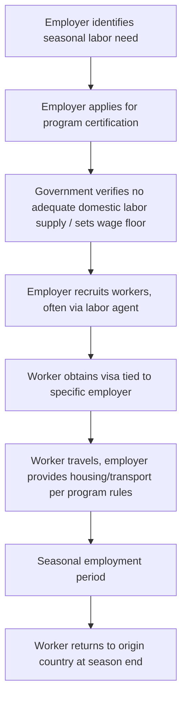
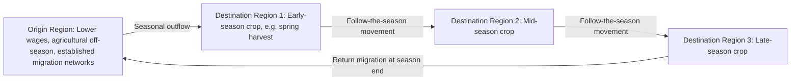

## Migrant and Seasonal Agricultural Labor

### Conceptual Overview

Migrant and seasonal agricultural labor refers to the workforce that relocates — across international borders, across regions within a country, or between agricultural and non-agricultural sectors — to meet the sharply time-bounded labor demand peaks inherent to agricultural production cycles. This labor supply mechanism is the primary institutional response to the seasonality of farm labor demand established in general farm labor market analysis: since agricultural labor demand is highly concentrated in short windows (planting, thinning, harvest) that vary by crop and region, a purely local, non-mobile labor force is structurally insufficient to meet peak demand without either substantial off-season underemployment or a mobile labor supply that follows the sequence of regional and crop-specific peaks.

**Key Points**

- Migrant agricultural labor is economically distinct from general labor migration in that its temporal pattern is **structurally tied to biological production cycles** rather than to a single, less time-sensitive relocation decision.
- The category includes **domestic seasonal migrants** (workers relocating within a country, e.g., following a north-south or coastal-inland harvest sequence), **international/cross-border migrants** (both documented, often through formal guest-worker programs, and undocumented), and **circular migrants** who repeat seasonal movement patterns across multiple years.
- Migrant agricultural labor markets are shaped jointly by economic fundamentals (wage differentials, migration costs) and by **immigration and labor law**, which frequently constrains worker mobility and bargaining power in ways that depart from a purely competitive labor market model.

### The Economics of Migration Decision-Making

The classic **Harris-Todaro** and related migration models frame the individual migration decision as comparing expected income in the destination location against the origin location, net of migration costs:

$$E[w_{\text{destination}}] - C_{\text{migration}} > w_{\text{origin}}$$

For seasonal agricultural migration specifically, the comparison incorporates the **expected duration of the seasonal employment opportunity** and the **probability of securing work** upon arrival, rather than a simple wage-level comparison:

$$E[\text{Net Migration Benefit}] = p \cdot w_d \cdot d - C_m - w_o \cdot d$$

where $p$ is the probability of obtaining seasonal work at the destination, $w_d$ is the destination daily wage, $d$ is the expected duration of the work opportunity, $C_m$ is the total cost of migration (transport, information, documentation, and any recruitment fees), and $w_o$ is the forgone wage/income opportunity at the origin over the same period.

**Key Points**

- **Migration costs** for agricultural seasonal work include not only direct transport costs but also information costs (locating opportunities, understanding legal requirements), documentation/visa costs where applicable, and, in some contexts, substantial fees paid to labor recruiters or intermediaries — the latter can be a significant determinant of a migrant's *effective* net wage and, in extreme cases, create debt-bondage-like dependency on the recruiting intermediary.
- **Circular/repeat migration** — workers returning to the same destination region across multiple seasons — reduces effective migration costs over time as workers accumulate destination-specific information, employer relationships, and, in some formal program contexts, program-specific eligibility history, potentially explaining persistent migration corridors between specific origin and destination regions across many years.
- [Inference] The relative importance of pure wage-differential motives versus risk-diversification motives (seasonal migration as a household income-diversification strategy, distinct from permanent relocation) varies by context, and household-level agricultural models often treat seasonal labor migration as one income-diversification strategy among several available to a farm household, alongside off-farm local employment and non-farm enterprise.

### Institutional Structures Governing Migrant Agricultural Labor

**1. Formal Guest-Worker/Temporary Agricultural Visa Programs**

Many labor-receiving countries operate formal temporary visa programs specifically for agricultural work, typically featuring:

- Employer-specific work authorization (the visa is tied to a specific employer, restricting the worker's ability to change employers without losing legal status)
- A prevailing/minimum wage requirement intended to prevent imported labor from depressing wages for domestic workers in the same labor market (sometimes called an "adverse effect wage rate" mechanism)
- Employer-provided or employer-arranged housing and transportation requirements
- A defined, typically non-renewable-without-reapplication, temporary work period tied to the agricultural season

**Key Points**

- **Employer-tied work authorization** is a defining institutional feature with significant labor-market power implications: because changing employers typically requires a new visa petition and may not be straightforward, the worker's practical outside-option/exit threat within the destination labor market is substantially constrained relative to a worker with unrestricted mobility, which can depress the worker's effective bargaining position even where a nominal wage floor exists.
- The prevailing/adverse-effect wage mechanism is designed specifically to address the theoretical concern that an elastic, program-supplied migrant labor pool could otherwise be used to suppress wages below what a purely domestic labor market would sustain; [Inference] empirical assessments of whether this mechanism fully achieves that objective are mixed and program-design-dependent.

**2. Undocumented/Irregular Migration**

In several major agricultural labor markets, a substantial share of the seasonal workforce is present without full legal work authorization, which has distinct economic implications:

**Key Points**

- Undocumented workers typically face **even weaker exit options and legal recourse** than documented guest-workers, since raising a labor standards violation carries the additional risk of immigration enforcement exposure, further constraining effective bargaining power and potentially suppressing wages or working conditions below what full-information, unconstrained bargaining would produce.
- Employers of undocumented labor bear **legal and enforcement risk** distinct from labor-market risk, and in some analyses this risk is treated as functioning similarly to a cost that should, in a fully competitive framework, be reflected somewhere in the wage-setting or hiring-decision calculus, though its actual empirical incidence (borne by employer, worker, or consumer) is not resolved uniformly in the literature.
- Reliance on undocumented labor is frequently linked in policy discussion to the broader question of the **replacement elasticity between labor and mechanization**: constrained or increasingly costly/risky access to undocumented labor is one of several factors cited (alongside wage levels and technology cost) as an incentive for accelerated mechanization adoption in labor-intensive crops, though isolating this specific causal channel from other drivers (crop prices, technology cost declines) is empirically difficult.

**3. Farm Labor Contractors and Recruitment Intermediaries**

As introduced in general farm labor market analysis, labor contractors play an outsized role specifically in migrant labor markets, often handling the cross-border or cross-region recruitment, transportation, and sometimes housing logistics that individual migrant workers would find costly to arrange independently.

$$w_{\text{worker}} = w_{\text{contract rate}} - f_{\text{recruitment}} - f_{\text{transport/housing}}$$

where $f_{\text{recruitment}}$ and other fees may be deducted from wages or charged upfront, and where the transparency and legality of such deductions vary substantially by jurisdiction and enforcement regime.

### Wage Effects of Migrant Labor Supply on Agricultural and Local Labor Markets

**Key Points**

- Standard labor supply-and-demand analysis predicts that an inflow of migrant labor **shifts the aggregate seasonal labor supply curve outward**, which — holding labor demand constant — would be expected to moderate the seasonal wage spike that would otherwise occur under a purely local, less mobile labor supply (as illustrated in the general farm labor wage-determination content).

$$L^S_{\text{total}}(w) = L^S_{\text{local}}(w) + L^S_{\text{migrant}}(w)$$

- This wage-moderating effect on peak-season agricultural wages is a central point of policy debate: proponents of migrant/guest-worker labor supply argue it prevents unsustainable seasonal wage spikes that could otherwise threaten the economic viability of labor-intensive crop production (or accelerate a shift entirely away from such crops), while critics argue that below-competitive wages for domestic agricultural workers, or crowding-out of the domestic agricultural workforce, can result.
- [Inference] The empirical net effect on domestic agricultural worker wages specifically is highly context- and study-dependent, varying by the substitutability between migrant and domestic labor in specific tasks, regional labor market tightness, and the wage-floor mechanisms embedded in the relevant guest-worker program (if any) governing the migrant labor inflow being studied.

### Housing, Working Conditions, and Non-Wage Compensation

**Key Points**

- Migrant seasonal agricultural work frequently includes **in-kind compensation components** — employer-provided housing, transportation, and sometimes meals — which complicate direct wage comparisons across employers or regions, since total compensation must account for the value (and quality) of these in-kind elements alongside the cash wage.
- Housing quality and conditions for migrant farmworkers are a persistent area of regulatory attention in many jurisdictions, given the combination of employer-provided (and thus employer-controlled) housing with the worker's limited outside options during the employment period, a combination that can weaken the worker's practical ability to demand housing-quality improvements through ordinary market bargaining.
- Occupational health and safety exposure (pesticide exposure, heat stress, repetitive strain from manual harvest tasks) is a specific concern in migrant and seasonal agricultural labor given the physically demanding nature of much harvest-stage work and, in some contexts, limited access to health services for a transient workforce.

### Seasonal Migration Corridors and Regional Specialization

Agricultural regions frequently develop **persistent migration corridors** connecting specific labor-sending origin regions to specific labor-receiving destination regions, reinforced over time by accumulated migrant networks, established employer-worker relationships, and program-specific historical participation patterns.

**Key Points**

- **"Follow-the-crop" migration patterns**, in which the same workforce moves sequentially through multiple destination regions as different crops or growing regions reach their respective harvest peaks within a single season, allow workers to maximize the total duration of seasonal employment across a year, rather than being limited to a single region's shorter individual harvest window.
- These corridors function as a form of **spatial arbitrage** in the agricultural labor market, transmitting wage and demand signals across regions and partially equalizing effective seasonal earnings opportunities for mobile workers, though the degree of equalization is limited by migration costs, information gaps, and legal/documentation constraints specific to each corridor.

### Policy Instruments Affecting Migrant Agricultural Labor Markets

| Instrument | Mechanism | Primary Economic Effect |
| --- | --- | --- |
| Guest-worker visa programs | Formal, employer-tied temporary work authorization | Expands legal seasonal labor supply; wage floor moderates downward wage pressure |
| Prevailing/adverse-effect wage requirements | Minimum wage floor specific to guest-worker programs | Intended to prevent wage suppression of domestic workers from program-supplied labor |
| Labor contractor licensing/regulation | Registration, bonding, and conduct requirements for recruitment intermediaries | Aims to reduce fee exploitation and improve accountability for labor standards |
| Housing and transportation standards | Minimum quality requirements for employer-provided worker housing/transport | Addresses non-wage compensation quality given constrained worker bargaining power |
| Portable/multi-employer visa reforms (where implemented) | Allows visa holders to change employers without full re-petition | Intended to increase worker mobility and bargaining power within the program |
| Immigration enforcement policy | Affects the size and legal status composition of the available agricultural labor pool | Interacts with wage levels, mechanization incentives, and reliance on undocumented labor |

### Worked Illustrative Example

**Example**

A fruit-growing region has a domestic seasonal labor supply curve for the six-week harvest window given by $L^S_{\text{local}}(w) = 20 + 0.5w$ (workers available at wage $w$ per day) and labor demand of $L^D(w) = 300 - w$.

**Equilibrium with local labor only:**

$$20 + 0.5w = 300 - w \implies 1.5w = 280 \implies w = 186.7$$

$$L = 300 - 186.7 = 113.3 \text{ workers}$$

**With a migrant labor program adding supply** $L^S_{\text{migrant}}(w) = 10 + 0.8w$ (migrant workers responsive to the same regional wage, subject to program wage-floor and availability constraints):

$$L^S_{\text{total}}(w) = (20 + 0.5w) + (10 + 0.8w) = 30 + 1.3w$$

$$30 + 1.3w = 300 - w \implies 2.3w = 270 \implies w = 117.4$$

$$L = 300 - 117.4 = 182.6 \text{ workers}$$

This stylized example illustrates the standard prediction: the addition of migrant labor supply moderates the equilibrium seasonal wage (from 186.7 to 117.4 per day) while increasing total employment (from 113.3 to 182.6 workers) — a supply-expansion outcome consistent with general labor market theory, though [Inference] the real-world magnitude and distributional consequences (particularly effects on domestic worker earnings specifically, as distinct from the average/marginal equilibrium wage) depend on the actual substitutability between local and migrant labor and on the wage-floor mechanisms embedded in any governing guest-worker program, which this simplified model does not incorporate.

### Illustrative Diagram: Migrant Labor's Effect on Seasonal Labor Supply

<svg xmlns="http://www.w3.org/2000/svg" viewBox="0 0 820 440" font-family="Arial, sans-serif">
<text x="410" y="28" text-anchor="middle" font-size="18" font-weight="bold" fill="#1a1a1a">Migrant Labor Supply Effect on Seasonal Wage (svg_diagram)</text>
<line x1="80" y1="380" x2="760" y2="380" stroke="#333" stroke-width="1.5" />
<line x1="80" y1="380" x2="80" y2="60" stroke="#333" stroke-width="1.5" />
<text x="420" y="410" text-anchor="middle" font-size="12" fill="#333">Number of Workers (L)</text>
<text x="45" y="220" text-anchor="middle" font-size="12" fill="#333" transform="rotate(-90 45 220)">Wage (w)</text>

<line x1="120" y1="90" x2="700" y2="360" stroke="#a53f3f" stroke-width="2.5" />
<text x="620" y="330" font-size="11" fill="#a53f3f" font-weight="bold">Labor Demand</text>

<line x1="120" y1="360" x2="500" y2="110" stroke="#2f6690" stroke-width="2.5" />
<text x="470" y="140" font-size="11" fill="#2f6690" font-weight="bold">Local Supply Only</text>

<line x1="180" y1="360" x2="650" y2="120" stroke="#3f7d3f" stroke-width="2.5" />
<text x="600" y="150" font-size="11" fill="#3f7d3f" font-weight="bold">Local + Migrant Supply</text>

<circle cx="380" cy="200" r="5" fill="#2f6690" />
<text x="380" y="185" text-anchor="middle" font-size="10" fill="#2f6690">Eq. 1 (high w, low L)</text>
<circle cx="480" cy="255" r="5" fill="#3f7d3f" />
<text x="480" y="240" text-anchor="middle" font-size="10" fill="#3f7d3f">Eq. 2 (lower w, higher L)</text>
</svg>

### Related Topics

- Farm labor markets and wage determination (general seasonality and piece-rate systems)
- Harris-Todaro migration model and expected-income migration theory
- Guest-worker/temporary visa program design and prevailing wage mechanisms
- Agricultural household models and off-farm income diversification
- Labor contractor regulation and anti-exploitation labor standards
- Farm mechanization economics and labor-saving technology adoption
- Occupational health and safety regulation for agricultural workers
- Remittance economics and rural household income effects
- Immigration policy and its interaction with sectoral labor markets
- Rural labor market informality and social protection coverage gaps