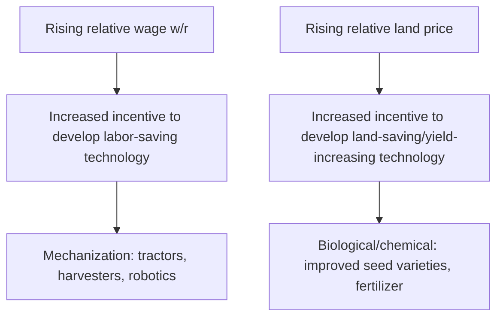
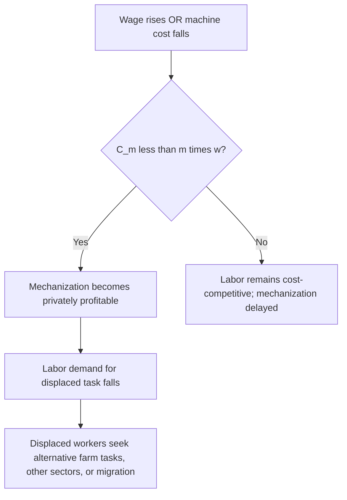
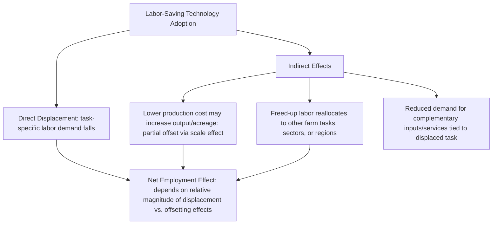

## Labor-Saving Technology and Displacement

### Conceptual Overview

Labor-saving technology in agriculture refers to mechanical, biological, chemical, or digital innovations that reduce the quantity of human labor required to produce a given level of agricultural output. **Displacement** refers to the resulting reduction in labor demand — and, for affected workers, employment or hours — that follows adoption of such technology. This is a specific application of the general theory of factor substitution and induced innovation to agriculture, where labor-saving technological change interacts directly with the seasonal, spatially dispersed farm labor markets and migrant labor systems discussed elsewhere in this chapter.

**Key Points**

- Labor-saving technology operates through **factor substitution**: capital, chemical, or biological inputs are substituted for labor in specific tasks, altering the labor-to-capital ratio in production.
- Displacement effects are **task-specific and time-specific** before they are sector-wide: mechanization typically first displaces labor in particular operations (e.g., harvesting a specific crop) rather than eliminating farm labor demand uniformly across all agricultural tasks and seasons.
- The economic literature treats mechanization both as a **response to** labor market conditions (induced innovation) and as a **cause of** subsequent labor market change (displacement), a bidirectional relationship central to understanding historical mechanization waves.

### The Theory of Induced Innovation

The **induced innovation hypothesis** (associated with Hicks and later formalized for agriculture by Hayami and Ruttan) holds that the direction of technological change in agriculture responds systematically to relative factor scarcity: where labor is relatively scarce and expensive relative to land or capital, technological innovation is induced toward labor-saving (mechanical) technology; where land is relatively scarce and expensive relative to labor, innovation is induced toward land-saving (biological/chemical, yield-increasing) technology.

$$\frac{\partial \text{(Innovation Direction)}}{\partial (w/r)} > 0$$

where $w$ is the wage rate and $r$ is the rental price of capital/land — as the relative price of labor rises, the incentive to develop and adopt labor-saving innovation strengthens.

**Key Points**

- The historically observed divergence between labor-scarce, land-abundant agricultural economies (which industrialized mechanization earlier and more extensively) and land-scarce, labor-abundant economies (which historically emphasized yield-increasing biological/chemical innovation, e.g., Green Revolution-type technologies) is frequently cited as supporting evidence for the induced innovation hypothesis.
- [Inference] While influential, the induced innovation hypothesis is not the sole explanatory framework in the literature; public research investment priorities, international technology transfer and spillovers, and output market structure are also cited as significant independent determinants of the direction of agricultural technological change, alongside relative factor price signals.

### Categories of Labor-Saving Agricultural Technology

**1. Mechanical Technology**

- Tractors and mechanized tillage equipment (displacing draft animal and manual land preparation labor)
- Mechanical harvesters (grain combines, cotton pickers, mechanical fruit/vegetable harvesters)
- Automated irrigation systems (displacing manual irrigation labor)
- Precision agriculture equipment (GPS-guided machinery, automated seeding/planting systems)

**2. Biological and Chemical Technology**

- Herbicides (displacing manual and mechanical weeding labor)
- Improved seed varieties bred partly for mechanical harvest compatibility (e.g., determinate growth habit, uniform ripening enabling single-pass mechanical harvest)
- Growth regulators facilitating synchronized ripening for mechanical harvest

**3. Digital and Robotic Technology (Emerging)**

- Autonomous/robotic harvesting systems for labor-intensive specialty crops (fruits, vegetables) historically resistant to mechanization due to selective ripeness and delicate handling requirements
- Computer vision and AI-based crop monitoring, reducing manual scouting labor
- Automated milking and livestock management systems

**Key Points**

- Historically, **grain and row-crop mechanization** (tractors, combines) proceeded earlier and more completely than **specialty/horticultural crop mechanization**, because grain harvest involves relatively uniform, robust plant material tolerant of mechanical handling, whereas fruits and vegetables often require selective picking of individually ripe, easily damaged produce — a technical barrier that robotic/computer-vision technology is now specifically targeting.
- [Inference] The pace of adoption for robotic harvesting in specialty crops is an active area of ongoing technological development rather than a settled historical pattern, and adoption trajectories are likely to vary substantially by crop depending on technical feasibility and relative cost trends, which are still evolving.

### The Labor Demand Effect of Mechanization: A Formal Framework

Mechanization can be represented as a shift in the production function toward greater capital intensity, altering the marginal product of labor and the labor demand curve:

$$Q = A \cdot F(K, L)$$

Labor-saving technical change is formally represented as an increase in the marginal product of capital relative to labor at any given input ratio, or equivalently, a reduction in the labor requirement per unit of output:

$$\frac{L}{Q}\Big|_{\text{post-mechanization}} < \frac{L}{Q}\Big|_{\text{pre-mechanization}}$$

At the task level, if mechanization introduces a machine that performs the work of $m$ workers at cost $C_m$, adoption occurs where:

$$C_m < m \cdot w$$

i.e., mechanization is privately profitable once machine cost falls below (or wage rises above) the threshold at which the machine cost equals the wage bill of the labor it would replace.

**Key Points**

- This threshold framework explains why mechanization adoption often accelerates during periods of **rising agricultural wages** (whether from general economic growth, reduced labor supply due to out-migration, or, in some historical episodes, from constrained access to previously available labor pools), since rising $w$ makes the mechanization inequality more likely to hold.
- Conversely, in labor-abundant, low-wage agricultural economies, the mechanization threshold is harder to clear, since $m \cdot w$ remains low relative to machine cost $C_m$, which is a standard explanation in the literature for slower mechanization adoption rates in labor-abundant relative to labor-scarce agricultural economies, holding other factors constant.

### Displacement Effects: Direct, Indirect, and Induced

**Key Points**

- **Direct displacement**: the immediate, task-specific reduction in labor hours required once a mechanical or chemical substitute is adopted for that task (e.g., herbicide adoption directly reducing manual weeding labor demand).
- **Scale/output effect (partial offset)**: mechanization typically lowers per-unit production costs, which — depending on output price elasticity and market structure — can increase total output or cultivated area, partially offsetting the direct per-unit labor-saving effect by expanding the scale of operation. This is analogous to the general "productivity paradox" in labor economics, where labor-saving technology does not necessarily reduce total sector employment if it sufficiently expands the scale of activity.

$$\Delta L_{\text{net}} = \Delta L_{\text{direct displacement}} + \Delta L_{\text{scale effect}}$$

where $\Delta L_{\text{direct displacement}} < 0$ and $\Delta L_{\text{scale effect}} \geq 0$; the sign of $\Delta L_{\text{net}}$ is theoretically ambiguous and an empirical question specific to the technology, crop, and market context.

- **Indirect/complementary task effects**: mechanization of one task (e.g., harvest) can, in some cases, *increase* labor demand for complementary tasks (e.g., increased acreage under cultivation following harvest mechanization may raise demand for planting or field maintenance labor), producing offsetting effects across the production cycle rather than a uniform reduction across all farm tasks.
- **Regional and structural displacement**: even where aggregate agricultural labor demand is only modestly affected, mechanization frequently produces significant **regional** and **task-specific** displacement, disproportionately affecting workers concentrated in the specific mechanized task/region/crop, independent of the aggregate net effect.

### Historical Mechanization Episodes: Illustrative Patterns

**Example**

- **Grain harvest mechanization** (combine harvesters replacing manual/animal-drawn harvest and threshing): dramatically reduced per-hectare labor requirements for grain production in economies that adopted this technology at scale, historically associated with substantial rural-to-urban labor outmigration as agricultural labor demand fell relative to a growing non-agricultural labor market.
- **Cotton harvest mechanization** (mechanical cotton pickers): historically associated with a documented and rapid decline in the demand for manual cotton-picking labor in regions where adoption occurred at scale, frequently cited as a canonical case study of technology-driven agricultural labor displacement given the previously very high labor intensity of manual cotton harvest.
- **Herbicide adoption**: substantially reduced demand for manual and mechanical cultivation/weeding labor across a wide range of row crops, representing a chemical (rather than mechanical) form of labor-saving technology with similarly significant displacement implications for weeding-task labor demand specifically.
- [Inference] While the *direction* of these historical displacement effects is well documented, the precise *magnitude* of net regional employment change attributable to mechanization alone (versus concurrent structural economic transformation, changing crop mix, and other confounding factors) is difficult to isolate empirically and is treated with appropriate caution in the historical economics literature.

### Distributional and Adjustment Effects of Displacement

**Key Points**

- Displacement effects are typically **not evenly distributed** across the agricultural labor force: workers with skills or physical capacities specific to the mechanized task, older workers with fewer retraining options, and workers in regions with limited alternative employment opportunities tend to bear disproportionate adjustment costs relative to the aggregate, sector-wide labor market effect.
- **Adjustment channels** available to displaced agricultural workers include: reallocation to other, still labor-intensive farm tasks or crops; migration to other agricultural regions with continued labor demand; transition to non-agricultural rural employment; or migration to urban labor markets — the relative availability and cost of each channel shapes the actual welfare impact of displacement on affected workers, independent of the technology's productivity benefits to the adopting farm.
- **Farm labor contractors and intermediaries** (discussed in migrant and seasonal labor context) may see reduced demand for their labor-supply services in mechanized tasks, representing a further indirect displacement effect beyond the directly affected farmworkers themselves.

### Mechanization and the Interaction with Migrant Labor Availability

**Key Points**

- As discussed under migrant and seasonal agricultural labor, constrained or increasingly costly/risky access to migrant labor (whether via immigration policy tightening, rising guest-worker program costs, or reduced undocumented labor availability) is frequently cited in policy and industry discussion as an accelerant of mechanization adoption in specialty/horticultural crops, since it directly raises the effective $w$ (or effective cost of accessing labor) in the mechanization threshold inequality above.
- Conversely, abundant, low-cost migrant labor availability can **delay** mechanization adoption by keeping the effective labor cost below the threshold required to justify the (often substantial) fixed capital investment in specialized harvesting or other mechanized equipment — a dynamic sometimes discussed in the context of specialty crop industries weighing capital investment in emerging robotic harvest technology against continued reliance on seasonal migrant labor.
- [Speculation] Given ongoing advances in computer-vision and robotic harvesting technology for selective, delicate-handling crops historically resistant to mechanization, some industry and academic observers anticipate an acceleration of labor-saving technology adoption in specialty horticulture over the coming years, though the pace and ultimate extent of such adoption remains uncertain and is not a settled empirical matter as of this writing.

### Policy Responses to Displacement

| Policy Approach | Mechanism | Objective |
| --- | --- | --- |
| Worker retraining/transition programs | Skills training for displaced agricultural workers | Facilitate reallocation to alternative employment |
| Regional economic diversification support | Investment in non-agricultural rural employment opportunities | Reduce regional dependence on a single labor-intensive crop/task |
| Gradual/phased mechanization mandates or incentives | Policy timing tools affecting the speed of adoption | Manage the pace of labor market adjustment |
| Social protection/unemployment support extension to agricultural workers | Extending safety-net coverage to a historically under-covered sector | Cushion income loss during adjustment period |
| Research investment in labor-complementary (rather than purely labor-substituting) technology | Public R&D funding priorities | Shape the direction of future technological change per the induced innovation framework |

### Worked Numerical Example

**Example**

A specialty fruit operation currently relies on manual harvest labor: 40 workers at a seasonal wage of $150/day for a 30-day harvest window, giving a total harvest labor cost of:

$$\text{Labor Cost} = 40 \times 150 \times 30 = \$180{,}000$$

A newly available semi-autonomous harvesting system can perform the equivalent work of 25 of these 40 workers, at an amortized (per-season) cost of $95,000, leaving 15 workers still required for tasks the machine cannot yet perform (quality sorting, machine oversight, handling delicate produce the system flags as unsuitable for automated picking).

**Post-mechanization labor cost:**

$$15 \times 150 \times 30 = \$67{,}500$$

**Total post-mechanization cost (machine + remaining labor):**

$$95{,}000 + 67{,}500 = \$162{,}500$$

Since $\$162{,}500 < \$180{,}000$, mechanization is privately profitable under these cost assumptions, and the operation would be expected to adopt the technology, displacing 25 of the original 40 harvest workers (though, per the indirect-effects discussion above, some or all of these workers may find alternative employment on the same operation in other tasks, at other operations still relying on manual harvest, or in other sectors, depending on local labor market conditions).

### Illustrative Diagram: Mechanization Adoption Threshold and Displacement Pathway

<svg xmlns="http://www.w3.org/2000/svg" viewBox="0 0 820 420" font-family="Arial, sans-serif">
<text x="410" y="28" text-anchor="middle" font-size="18" font-weight="bold" fill="#1a1a1a">Mechanization Threshold and Displacement Pathway (svg_diagram)</text>
<line x1="80" y1="370" x2="760" y2="370" stroke="#333" stroke-width="1.5" />
<line x1="80" y1="370" x2="80" y2="60" stroke="#333" stroke-width="1.5" />
<text x="420" y="400" text-anchor="middle" font-size="12" fill="#333">Wage Rate (w)</text>
<text x="45" y="215" text-anchor="middle" font-size="12" fill="#333" transform="rotate(-90 45 215)">Cost</text>

<line x1="100" y1="350" x2="700" y2="90" stroke="#a53f3f" stroke-width="2.5" />
<text x="600" y="120" font-size="11" fill="#a53f3f" font-weight="bold">Labor Cost (m × w)</text>

<line x1="100" y1="220" x2="700" y2="220" stroke="#2f6690" stroke-width="2.5" stroke-dasharray="6,3" />
<text x="600" y="205" font-size="11" fill="#2f6690" font-weight="bold">Machine Cost (C_m)</text>

<line x1="420" y1="60" x2="420" y2="370" stroke="#999" stroke-width="1" stroke-dasharray="3,3" />
<text x="420" y="55" text-anchor="middle" font-size="10" fill="#666">Mechanization Threshold Wage</text>
<rect x="100" y="380" width="320" height="20" fill="#dbe9f5" opacity="0.6" />
<text x="260" y="395" text-anchor="middle" font-size="9" fill="#2f6690">Labor remains cost-competitive</text>
<rect x="420" y="380" width="280" height="20" fill="#f5d9d9" opacity="0.6" />
<text x="560" y="395" text-anchor="middle" font-size="9" fill="#a53f3f">Mechanization adopted; displacement occurs</text>
</svg>

### Related Topics

- Farm labor markets and wage determination (foundational supply-demand framework)
- Migrant and seasonal agricultural labor (interaction with mechanization incentives)
- Induced innovation hypothesis and the Hayami-Ruttan model of agricultural technical change
- Agricultural technology adoption and diffusion models
- Precision agriculture and digital farming technologies
- Rural-to-urban migration and structural economic transformation
- Agricultural research and development investment priorities
- Labor market adjustment policy and worker retraining programs
- Green Revolution technology and land-saving/yield-increasing innovation
- Robotics and automation in specialty crop production