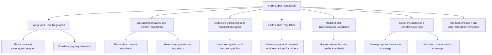
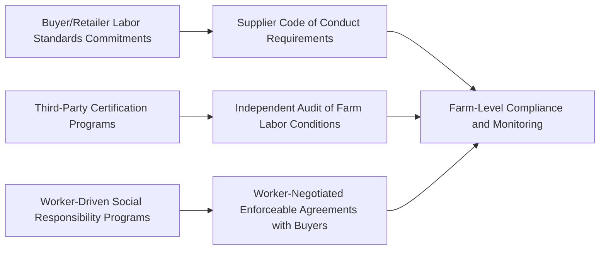

## Labor Regulation and Farm Worker Welfare

### Conceptual Overview

Labor regulation in agriculture encompasses the body of statutory, administrative, and contractual rules governing wages, hours, working conditions, safety, and social protection for farmworkers. Agricultural labor regulation is distinguished from general labor law in most jurisdictions by a pattern of **partial or full exemption** from standard labor protections applied to other sectors — a regulatory gap with specific historical and economic origins that has direct implications for farmworker welfare outcomes and for the wage and displacement dynamics discussed elsewhere in this chapter.

**Key Points**

- Agricultural labor exemptions are pervasive across many national labor law systems, commonly affecting minimum wage coverage, overtime pay requirements, collective bargaining rights, child labor restrictions, and unemployment/social insurance coverage — the specific pattern and extent of exemption varies substantially by country and, within federal systems, by sub-national jurisdiction.
- The economic rationale historically offered for agricultural exemptions includes the sector's small-scale, dispersed, seasonal employer base (raising compliance monitoring costs); the biological/weather-dependent nature of agricultural work (complicating standard hours regulation); and, in some historical contexts, the political economy influence of agricultural employer interests during the original legislative design of labor law frameworks.
- Farmworker welfare outcomes are shaped jointly by **formal regulatory coverage**, the **practical enforceability** of nominally applicable regulation given the sector's structural features (seasonality, dispersion, migrant/undocumented worker vulnerability), and **non-regulatory mechanisms** (voluntary certification, collective bargaining, market-driven labor standards commitments by buyers).

### The Economic Rationale for and Against Agricultural Labor Exemptions

**Arguments historically offered for exemption/differential treatment:**

- **Compliance monitoring cost**: the large number of small, geographically dispersed agricultural employers, combined with seasonal and variable-hours work patterns, raises the administrative cost of standard labor law enforcement (e.g., verifying overtime hours on tasks without fixed shift structures) relative to more concentrated industrial employment.
- **Biological/weather dependency**: agricultural tasks (particularly harvest) are often time-critical in ways that standard maximum-hours regulation was not originally designed to accommodate, since delaying harvest to comply with hours limits can impose direct crop-loss costs not present in most non-agricultural contexts.
- **Historical political economy**: in several jurisdictions, agricultural (and domestic) labor exemptions in foundational labor legislation are documented to have reflected the political influence of agricultural employer interests during the original legislative bargaining process, a historical explanation distinct from a purely economic-efficiency rationale.

**Arguments against continued exemption:**

- **Equity/parity principle**: absent a compelling ongoing economic justification, differential treatment of farmworkers relative to other sectors' workers is criticized as an inequitable carve-out disproportionately affecting a workforce that, in many contexts, already faces elevated vulnerability (migrant status, limited English/local-language proficiency, geographic isolation, informality).
- **Externalized costs**: some economic analyses argue that exemption-driven suppression of farmworker wages or working conditions functions as an implicit subsidy to agricultural production, with the welfare cost borne by farmworkers rather than reflected in output prices — a distributive rather than efficiency-based critique.
- [Inference] The empirical magnitude of any wage or welfare gap directly attributable to regulatory exemption (as distinct from other structural features of agricultural labor markets, such as informality or migrant worker vulnerability) is difficult to isolate cleanly, and the literature does not offer a single settled quantitative estimate applicable across contexts.

### Typology of Farm Labor Regulation

### Wage and Hour Regulation

**Key Points**

- **Minimum wage coverage**: while many jurisdictions have extended general minimum wage law to agricultural employment over time, some retain full or partial exemptions (e.g., exemptions for very small employers, family farms, or specific categories of agricultural work), meaning formal minimum wage protection is not universal across all farmworkers even within a single country.
- **Overtime exemption**: agricultural work is frequently exempted from standard overtime pay requirements (typically time-and-a-half pay beyond a standard threshold of hours per week) in jurisdictions where general labor law otherwise mandates such premiums, reflecting the historical "biological dependency" rationale discussed above; this remains an area of active legislative and legal reform activity in several jurisdictions, with agricultural overtime coverage having been extended in some jurisdictions in recent years while remaining exempted in others.
- **Piece-rate wage floor interactions**: where piece-rate compensation is used (as discussed in general farm labor wage determination), minimum wage regulation typically requires that piece-rate earnings, when averaged over hours worked, meet or exceed the applicable minimum wage floor — creating a compliance requirement (and associated recordkeeping/monitoring burden) distinct from a simple hourly-wage minimum wage system.

$$\frac{\text{Total Piece-Rate Earnings}}{\text{Total Hours Worked}} \geq w_{\min}$$

### Occupational Safety and Health Regulation

**Key Points**

- **Pesticide exposure standards** (e.g., worker protection standards governing re-entry intervals after pesticide application, personal protective equipment requirements, and pesticide handler training) address a hazard specific to agricultural work with limited direct analogue in most other sectors.
- **Heat stress prevention standards**: given the outdoor, physically demanding nature of much agricultural labor, heat-illness prevention regulation (mandated rest breaks, water access, shade provision, and acclimatization protocols during high-heat conditions) has become an increasing area of regulatory focus in several jurisdictions, particularly as concerns about rising heat exposure risk have grown.
- **Machinery and equipment safety standards**: agricultural machinery (tractors, harvesters, grain-handling equipment) presents specific injury risks (rollover, entanglement, confined-space hazards in grain storage) addressed through equipment design standards and, in some jurisdictions, specific training requirements.
- [Inference] Enforcement intensity for occupational safety regulation in agriculture is frequently constrained by the same dispersed, small-employer structural features noted above, and available injury/fatality statistics in several countries suggest agriculture ranks among the higher-risk sectors for occupational injury and fatality, though precise comparative risk rankings vary by data source, reporting methodology, and time period.

### Collective Bargaining and Association Rights

**Key Points**

- In many jurisdictions, agricultural workers are **excluded from general labor relations/collective bargaining statutes** that apply to industrial and other sectors, meaning farmworkers in these jurisdictions may lack a formal, legally protected mechanism for union recognition and collective bargaining that other sectoral workers possess.
- Some jurisdictions and sub-national governments have enacted **agriculture-specific labor relations statutes** extending collective bargaining rights to farmworkers, representing a distinct policy response to the general-statute exclusion pattern rather than a uniform default across all jurisdictions.
- Where formal collective bargaining rights are absent or limited, **informal worker associations, faith-based worker centers, and voluntary employer-buyer commitments** (discussed below) have in some contexts served as partial substitutes for formal union representation, though [Inference] their effectiveness relative to formal collective bargaining rights in achieving comparable wage and condition improvements is a subject of ongoing debate rather than settled empirical consensus.
- The economic logic of collective bargaining in this context follows standard labor economics: absent a coordination mechanism, individual dispersed farmworkers typically have limited bargaining power relative to an employer, particularly where alternative employment options are constrained (as is often the case for migrant workers under employer-tied visa status, per the migrant labor discussion); collective bargaining, where available and effective, is intended to redress this bargaining power asymmetry.

### Child Labor Regulation in Agriculture

**Key Points**

- Agriculture is frequently subject to **more permissive child labor standards** than other sectors in many jurisdictions — lower minimum age thresholds for certain agricultural tasks, exemptions for work on family farms, and, in some cases, more permissive hours-of-work rules during non-school periods — reflecting historical treatment of family-farm youth labor as categorically distinct from industrial child labor.
- This differential treatment has been a persistent subject of policy debate, particularly regarding the application of more permissive standards to **hired** (non-family) child agricultural labor, where the family-farm rationale for permissive treatment does not directly apply, and where hazardous task exposure (machinery, pesticides, heat) raises safety concerns comparable to those motivating stricter standards in other sectors.

### Housing and Transportation Standards

**Key Points**

- As discussed under migrant and seasonal agricultural labor, employer-provided housing for migrant farmworkers is a specific regulatory focus given the combination of employer control over housing and the worker's constrained outside options during the employment period (particularly under employer-tied visa arrangements).
- Regulatory standards in this domain typically address minimum space, sanitation, safe drinking water, and fire-safety requirements for employer-provided worker housing, along with vehicle safety and licensing requirements for employer-arranged worker transportation — the latter motivated by documented elevated transportation-related injury risk associated with informal or substandard farmworker transport arrangements in some contexts.

### Social Insurance and Benefits Coverage

**Key Points**

- **Unemployment insurance coverage**: agricultural employment is exempted from unemployment insurance systems in a number of jurisdictions, or subject to differential eligibility thresholds (e.g., minimum employer size or minimum wages-paid thresholds specific to agricultural employers), which can leave seasonal farmworkers without access to unemployment benefits during the off-season despite the highly seasonal, involuntary nature of their between-season unemployment.
- **Workers' compensation coverage**: coverage for agricultural workplace injury varies substantially by jurisdiction, with some jurisdictions extending standard workers' compensation coverage to agricultural employment and others maintaining exemptions or reduced-coverage categories, again often keyed to employer size or the seasonal/casual nature of the specific employment relationship.
- **Health insurance and health service access**: migrant and seasonal farmworkers frequently face particular barriers to health service access given transient residence, limited employer-provided health insurance in a sector with historically lower rates of such coverage relative to other industries, and, for migrant workers, potential barriers tied to immigration status or lack of portability of coverage across jurisdictions.

### Voluntary and Market-Based Labor Standards Mechanisms

Beyond statutory regulation, several **non-governmental mechanisms** have developed to address farmworker welfare, particularly in contexts where formal regulatory coverage or enforcement capacity is limited:

**Key Points**

- **Buyer-driven supply chain labor standards**: large retailers and food companies increasingly impose supplier codes of conduct addressing labor conditions as a condition of continued purchasing relationships, functioning as a market-based enforcement mechanism operating in parallel to (and sometimes exceeding) statutory regulatory requirements.
- **Third-party certification programs**: independent certification schemes verify compliance with specified labor standards (wages, hours, safety, freedom of association) as a condition of a certification label, which can carry price premium or market access benefits for certified producers, creating a market-based incentive for voluntary standards adoption beyond regulatory minimums.
- **Worker-driven social responsibility (WSR) models**: distinct from conventional buyer-driven or auditor-driven certification, some models place **enforceable agreements negotiated directly by worker organizations with buyers** at the center of the compliance mechanism, with worker-designed complaint and monitoring systems, representing an alternative institutional design intended to address power-asymmetry and enforcement-credibility limitations sometimes associated with purely buyer-designed or third-party-audited certification models.
- [Inference] Comparative evidence on the relative effectiveness of buyer-driven, third-party-certified, and worker-driven models in achieving durable farmworker welfare improvements is an active area of research, and no single model is uniformly regarded in the literature as superior across all contexts; effectiveness appears to depend significantly on program design details, particularly the strength and independence of complaint/enforcement mechanisms.

### Enforcement Challenges Specific to Agricultural Labor Regulation

**Key Points**

- **Dispersed, small-scale employer base**: the large number of geographically dispersed agricultural employers, many operating at small scale, raises the per-employer cost of inspection and monitoring relative to more concentrated industrial sectors, straining limited public enforcement agency resources.
- **Seasonal and transient workforce**: high worker turnover and short employment durations complicate both proactive inspection targeting and worker-initiated complaint processes, since a worker's employment (and physical presence in the jurisdiction) may end before a regulatory investigation or legal process concludes.
- **Migrant/undocumented worker vulnerability**: as discussed under migrant labor, workers with constrained legal status or employer-tied visa arrangements face elevated practical barriers to reporting violations, given the risk of retaliation, job loss, or immigration enforcement exposure associated with initiating a complaint — a vulnerability that directly undermines the practical effectiveness of otherwise-applicable formal regulatory protections.
- **Labor contractor intermediation**: where farm labor contractors serve as the legal employer of record (as discussed in prior sections), regulatory accountability can become diffused between the contractor and the farm operator using the contracted labor, complicating enforcement against the party ultimately responsible for a given violation, particularly where contractor licensing and bonding requirements are weak or poorly enforced.

### Comparative Summary: Regulatory Coverage Gaps and Their Welfare Implications

| Regulatory Domain | Common Pattern of Exemption/Gap | Primary Welfare Implication |
| --- | --- | --- |
| Minimum wage | Partial exemptions (small employer, family farm categories) | Wage floor not universally binding for all farmworkers |
| Overtime pay | Frequently exempted | Long harvest-season hours without premium compensation |
| Collective bargaining | Frequently excluded from general labor relations statutes | Reduced formal mechanism for addressing bargaining power asymmetry |
| Unemployment insurance | Frequently exempted or reduced-eligibility | Limited income support during structurally seasonal unemployment |
| Child labor standards | More permissive age/hours thresholds | Elevated hazard exposure risk for hired minors on farms |
| Workers' compensation | Variable coverage, often reduced for small/seasonal employers | Inconsistent injury compensation access |

### Illustrative Diagram: Farmworker Welfare Determinants

<svg xmlns="http://www.w3.org/2000/svg" viewBox="0 0 820 420" font-family="Arial, sans-serif">
<text x="410" y="28" text-anchor="middle" font-size="18" font-weight="bold" fill="#1a1a1a">Determinants of Farmworker Welfare Outcomes (svg_diagram)</text>
<rect x="40" y="70" width="220" height="90" rx="8" fill="#dbe9f5" stroke="#2f6690" stroke-width="1.5" />
<text x="150" y="100" text-anchor="middle" font-size="12" font-weight="bold" fill="#1a1a1a">Statutory Regulation</text>
<text x="150" y="120" text-anchor="middle" font-size="10" fill="#333">Wage/hour law, safety</text>
<text x="150" y="136" text-anchor="middle" font-size="10" fill="#333">standards, bargaining rights</text>
<rect x="300" y="70" width="220" height="90" rx="8" fill="#f5e6d3" stroke="#a5682a" stroke-width="1.5" />
<text x="410" y="100" text-anchor="middle" font-size="12" font-weight="bold" fill="#1a1a1a">Enforcement Capacity</text>
<text x="410" y="120" text-anchor="middle" font-size="10" fill="#333">Inspection resources,</text>
<text x="410" y="136" text-anchor="middle" font-size="10" fill="#333">complaint mechanisms</text>
<rect x="560" y="70" width="220" height="90" rx="8" fill="#e0f0dc" stroke="#3f7d3f" stroke-width="1.5" />
<text x="670" y="100" text-anchor="middle" font-size="12" font-weight="bold" fill="#1a1a1a">Voluntary/Market Mechanisms</text>
<text x="670" y="120" text-anchor="middle" font-size="10" fill="#333">Buyer standards,</text>
<text x="670" y="136" text-anchor="middle" font-size="10" fill="#333">certification, WSR models</text>
<rect x="230" y="220" width="360" height="90" rx="8" fill="#efe0f5" stroke="#7a3f9c" stroke-width="1.5" />
<text x="410" y="250" text-anchor="middle" font-size="12" font-weight="bold" fill="#1a1a1a">Worker Bargaining Power / Vulnerability</text>
<text x="410" y="270" text-anchor="middle" font-size="10" fill="#333">Migrant/visa status, mobility,</text>
<text x="410" y="286" text-anchor="middle" font-size="10" fill="#333">alternative employment options</text>
<rect x="280" y="350" width="260" height="60" rx="8" fill="#f5d9d9" stroke="#a53f3f" stroke-width="1.5" />
<text x="410" y="385" text-anchor="middle" font-size="13" font-weight="bold" fill="#1a1a1a">Farmworker Welfare Outcome</text>
<line x1="150" y1="160" x2="350" y2="220" stroke="#555" stroke-width="1.5" />
<line x1="410" y1="160" x2="410" y2="220" stroke="#555" stroke-width="1.5" />
<line x1="670" y1="160" x2="470" y2="220" stroke="#555" stroke-width="1.5" />
<line x1="410" y1="310" x2="410" y2="350" stroke="#555" stroke-width="2" marker-end="url(#arrowW)" />
</svg>

### Related Topics

- Farm labor markets and wage determination (piece-rate systems and wage floor interaction)
- Migrant and seasonal agricultural labor (employer-tied visa status and bargaining power)
- Labor-saving technology and displacement (interaction between regulation and mechanization incentives)
- Occupational health and safety economics
- Collective bargaining theory and labor union economics
- Supply chain labor standards and corporate social responsibility
- Worker-driven social responsibility program design
- Social insurance program design and coverage gap analysis
- Child labor economics and household decision-making
- Comparative labor law and agricultural exceptionalism in legal systems