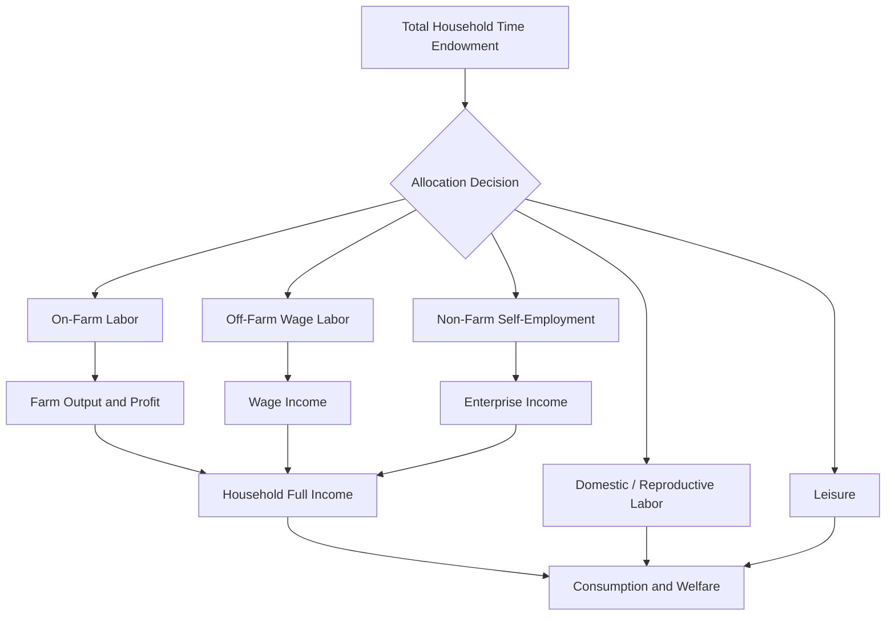

## Household Labor Allocation in Family Farms

### Overview

Household labor allocation in family farms refers to the decision-making process by which farm households distribute the labor time of their members across competing uses: on-farm production, off-farm wage employment, non-farm self-employment, domestic/reproductive labor, and leisure. Unlike firms that hire labor purely on profit-maximizing terms, family farms are simultaneously production units and consumption units, making labor allocation decisions inseparable from household welfare, demographic composition, and risk preferences.

### The Agricultural Household Model (AHM)

The theoretical foundation for analyzing this behavior is the **Agricultural Household Model**, originally formalized by Chayanov and later developed rigorously by Singh, Squire, and Strauss (1986).

**Key Points**

- Under complete and perfect markets (for labor, land, and credit), the household's production and consumption decisions are **separable** (the "separability" or "recursive" property).
- Under separability, the household first maximizes farm profit treating labor as a tradeable input at the market wage, then allocates full income (profit plus non-labor income) across consumption and leisure, subject to a standard utility function.
- When labor markets are missing, thin, or characterized by high transaction costs (common in many developing-country contexts), separability breaks down, and the **shadow wage** of household labor diverges from the market wage.

**Separable Model (Recursive Structure)**

$$\max_{L_f} \pi = pQ(L_f, X) - wL_f - rX$$

where $\pi$ is farm profit, $p$ is output price, $Q$ is the production function, $L_f$ is total labor input, $X$ is other purchased inputs, $w$ is the market wage, and $r$ is the price of other inputs.

Once $\pi^*$ is determined, the household solves:

$$\max_{C, T_l} U(C, T_l) \quad \text{s.t.} \quad pC = wT_w + \pi^* + V$$

where $C$ is consumption, $T_l$ is leisure, $T_w$ is off-farm work time, and $V$ is non-labor income. Total time $T$ is allocated as $T = T_l + T_w + T_f$ (on-farm work).

**Non-Separable Model**

When no labor market exists, the household solves a single joint optimization:

$$\max_{C, T_l, T_f} U(C, T_l) \quad \text{s.t.} \quad pC = pQ(T_f, X) - rX + V, \quad T = T_l + T_f$$

Here, the **shadow wage** $w^*$ (the household's implicit marginal valuation of its own labor) is derived endogenously from the first-order conditions rather than observed in the market:

$$w^* = p \cdot \frac{\partial Q}{\partial T_f}$$

This shadow wage depends on household preferences, demographic composition, and farm technology — meaning identical farms with different household compositions may allocate labor differently even facing the same market conditions.

### Determinants of Labor Allocation Decisions

**Household Demographics**

- **Dependency ratio** — households with more young children or elderly members have fewer effective labor-hours available and often prioritize labor-intensive on-farm activities that can be flexibly timed around caregiving.
- **Household size and composition** — larger households can more easily diversify labor across farm and off-farm activities, spreading risk (a Chayanovian insight tied to the "labor-consumer balance").
- **Gender division of labor** — in many agrarian systems, tasks are gender-segmented (e.g., land preparation vs. weeding vs. marketing), which affects who is allocated to which activity and how off-farm opportunities are gendered.

**Farm and Market Characteristics**

- **Farm size** — smaller farms tend to generate labor surpluses relative to land, pushing household members toward off-farm work (the inverse farm size–off-farm participation relationship).
- **Labor market thinness** — in areas with few off-farm opportunities, on-farm shadow wages fall, and households may substitute effort for hired labor even when marginal product is low ("disguised unemployment," a classical Lewis-model concept).
- **Seasonality** — labor demand on family farms is highly seasonal (planting and harvest peaks vs. slack periods), which drives temporary off-farm migration and intra-household task reallocation across the agricultural calendar.
- **Mechanization** — capital-labor substitution reduces peak labor demand, freeing household members for off-farm activities; this is a central channel in structural transformation.

**Risk and Credit Constraints**

- Off-farm labor allocation is frequently used as an ex-ante or ex-post **risk management strategy**, diversifying income sources against covariate agricultural risk (weather, price shocks).
- Where credit markets are imperfect, off-farm earnings can relax liquidity constraints on farm input purchases (the "cash-financing" motive for off-farm work).

### Types of Labor Allocation Outcomes

**Key Points**

1. **Full-time farming** — household labor concentrated entirely on-farm; typical when farm size is adequate, off-farm opportunities are scarce, or farm profitability is high.
2. **Pluriactivity / part-time farming** — household members split time between farm and off-farm work, either seasonally or through role specialization (e.g., one member farms full-time, another commutes to wage work).
3. **Complete exit / absentee farming** — household relies primarily on hired or contracted labor while members work off-farm, retaining land for tenure security, inheritance, or supplemental income.
4. **Labor-hiring households** — larger or wealthier households hire in labor, effectively becoming net demanders in the labor market rather than suppliers.

### Empirical Modeling Approaches

**Example**

A standard reduced-form empirical specification, given separability failures, estimates off-farm labor supply as:

$$T_w = f(w, \pi, V, Z_h, Z_f, \varepsilon)$$

where $Z_h$ are household characteristics (age, education, dependency ratio) and $Z_f$ are farm characteristics (size, irrigation access, distance to market). Estimation commonly uses:

- **Tobit or double-hurdle models** — because off-farm labor supply is frequently a corner solution (many households report zero off-farm hours), a Tobit model or two-stage double-hurdle model (participation decision followed by hours decision) is standard.
- **Heckman selection models** — to correct for non-random selection into off-farm participation when estimating wage or hours equations.
- **Shadow wage estimation** — using the marginal product of labor from an estimated production function (often Cobb-Douglas or translog) as an instrument or direct measure, since observed wages are unavailable for family labor.

$[Inference]$ Because household survey data on time use is self-reported and often aggregated at the household rather than individual-task level, measurement error in labor allocation variables is a persistent empirical challenge, and estimated coefficients on shadow wages should be interpreted with this caveat in mind.

### Diagram: Household Time Allocation Decision

### Structural Transformation Linkage

Household labor allocation is central to structural transformation theory. As economies develop:

- Agricultural wages and off-farm wages tend to converge (Lewis dual-economy model).
- Rural households progressively shift labor-hours from farm to non-farm activities, a pattern strongly documented across developing economies through **Rural Income Generating Activities (RIGA)** and Living Standards Measurement Study (LSMS) household panel datasets.
- Land and labor markets often develop in tandem — as off-farm opportunities expand, land rental/lease markets emerge to allow labor-scarce households to lease out land rather than under-cultivate it.

### Policy Implications

**Key Points**

- **Labor-saving technology adoption** (e.g., mechanized weeding, herbicides) can free household labor for higher-return off-farm activities, but may also reduce demand for hired agricultural labor, affecting landless laborers.
- **Rural infrastructure** (roads, electrification) lowers the transaction costs of off-farm participation, shifting the household's labor allocation frontier outward.
- **Social protection and cash transfer programs** can alter labor allocation by relaxing liquidity constraints, sometimes increasing on-farm investment (input use) rather than reducing labor supply, contrary to simple income-effect predictions. $[Inference]$ Empirical findings on this effect vary substantially by program design and context, so magnitude and direction are not universal.
- **Gender-targeted interventions** — because women's labor is often disproportionately allocated to domestic and unpaid farm tasks, policies targeting women's off-farm income opportunities interact with intra-household bargaining dynamics affecting overall allocation efficiency.

### Related Topics

- Chayanov's theory of the peasant economy and the labor-consumer balance
- Agricultural household model: separable vs. non-separable specifications
- Shadow wage estimation techniques
- Rural labor markets and seasonality
- Intra-household bargaining models (collective household models)
- Structural transformation and the Lewis dual-economy model
- Migration as a household risk-diversification strategy
- Farm mechanization and labor displacement
- Gender division of labor in agriculture
- Off-farm income diversification and rural livelihoods