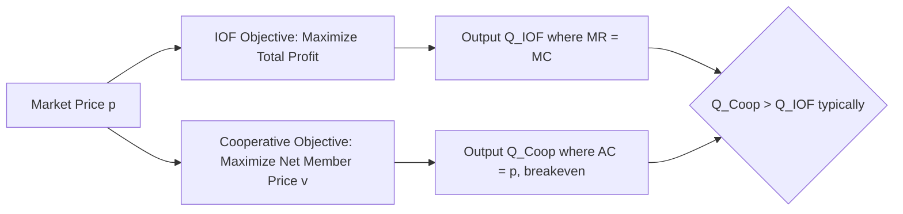
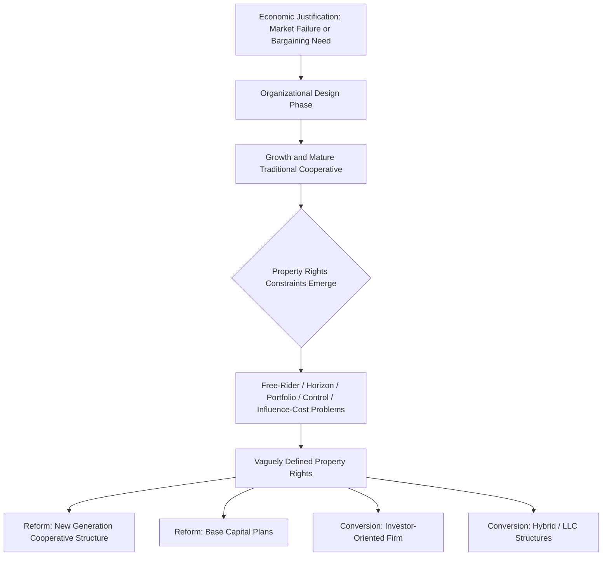

## Theory of Agricultural Cooperatives

### Overview

The theory of agricultural cooperatives examines why farmers voluntarily pool resources, ownership, and decision-making rights into member-owned firms, and how these organizations differ structurally and behaviorally from investor-owned firms (IOFs). Cooperative theory draws on neoclassical firm theory, transaction cost economics, property rights theory, and collective action theory to explain formation, governance, financing, and eventual institutional evolution of cooperatives.

### Defining Characteristics

**Key Points**

- **User-ownership** — the cooperative is owned by the people who use its services (patrons), not by outside investors.
- **User-control** — governance follows democratic principles, typically one-member-one-vote (OMOV) regardless of patronage volume, though some cooperatives use proportional voting.
- **User-benefit** — surplus (net income) is distributed to members based on **patronage** (use of the cooperative) rather than capital contribution, distinguishing cooperatives from IOFs where dividends follow share ownership.

These three principles are often summarized as the **"user-owner, user-control, user-benefit"** triad central to the U.S. Department of Agriculture's classical definition of a cooperative.

### Classical Neoclassical Model of the Cooperative Firm

The traditional economic model treats the cooperative as maximizing net returns per unit of patronage rather than total profit. For a marketing cooperative purchasing member output at price $v$ and selling in the market at price $p$, with processing/marketing cost function $C(Q)$:

$$\max_{Q} \; \pi = pQ - C(Q) - vQ$$

Because the cooperative returns any surplus to members as patronage refunds, the effective objective becomes maximizing the **net price received by members**, $v$, subject to a zero-profit (breakeven) constraint:

$$v = p - \frac{C(Q)}{Q}$$

This is distinct from an IOF's objective of maximizing $\pi$ for external shareholders. The cooperative therefore tends to expand output beyond the profit-maximizing quantity of a comparable IOF, since it internalizes benefits to members as producers rather than treating their surplus as a cost to be minimized.

**Diagrammatic Comparison (IOF vs. Cooperative Output)**

### Why Cooperatives Form: Theoretical Rationales

**1. Market Failure / Countervailing Power Theory**

Cooperatives emerge to correct market failures where farmers face monopsony power from input suppliers or monopoly power from output processors/buyers. By aggregating supply or demand, the cooperative shifts bargaining power back toward members. $[Inference]$ This rationale is most empirically robust in thin rural markets with few buyers, though its explanatory power is weaker in well-developed competitive markets.

**2. Transaction Cost Economics (TCE)**

Building on Williamson's framework, cooperatives reduce transaction costs associated with asset specificity, uncertainty, and opportunism in agricultural supply chains. Farm-specific investments (e.g., specialized equipment for a particular crop) create hold-up risk when dealing with a single downstream buyer; vertical integration through a cooperative internalizes the transaction and reduces this risk.

**3. Property Rights Theory**

Cooperatives address property rights problems in agricultural markets — particularly information asymmetries about product quality — by aligning ownership and control among the actual producers who possess private information about their own products.

**4. Collective Action Theory**

Drawing on Olson's logic of collective action, cooperative formation is analyzed as a public-goods/free-rider problem: initial capitalization and organizing costs benefit all potential members, but individuals have incentive to free-ride on others' organizing efforts. Successful formation typically requires selective incentives, strong social capital, or external facilitation (e.g., extension agencies).

### The Property Rights Problems of Cooperative Ownership

A distinct branch of the literature (developed extensively by Cook, Iliopoulos, and others) identifies five classical property rights constraints unique to the traditional cooperative structure, often summarized as the **"vaguely defined property rights" problems**:

**Key Points**

1. **Free-rider problem** — because new members receive the same patronage benefits and often the same allocated equity terms as long-standing members, without having contributed proportionally to accumulated reserves, incentives to invest in the cooperative's growth are diluted.
2. **Horizon problem** — members' claims on retained earnings and cooperative equity are often tied to current patronage rather than being freely transferable or redeemable at fair market value, so members have shorter investment horizons than the useful life of the assets being financed, biasing toward under-investment in long-term projects (e.g., R&D, brand-building).
3. **Portfolio problem** — members cannot adjust their capital contribution to the cooperative independently of their patronage decisions, and typically cannot diversify or trade their cooperative equity like a financial asset, reducing capital-raising flexibility.
4. **Control problem** — the separation between financial contribution (proportional to patronage) and voting rights (OMOV) can create misalignment between those bearing the largest financial risk and those exercising the most influence, complicating monitoring of management (an agency-cost variant).
5. **Influence-cost problem** — heterogeneous membership (differing farm sizes, product mixes, risk preferences) generates costly internal political processes as members lobby the cooperative board for favorable treatment.

$[Inference]$ These five problems are widely cited as the primary drivers behind cooperative de-mutualization or conversion to alternative organizational forms, though the relative weight of each varies by sector and country and is not settled empirically.

### Cooperative Governance and Voting Structures

| Structure | Description | Typical Use Case |
| --- | --- | --- |
| One-Member-One-Vote (OMOV) | Each member has equal voting weight regardless of patronage volume | Traditional agricultural marketing/supply cooperatives |
| Proportional voting | Voting weight scaled to patronage or capital contribution | Larger cooperatives with heterogeneous member scale |
| Delegate systems | Members elect regional delegates who vote at cooperative assemblies | Large, geographically dispersed cooperatives |
| New Generation Cooperatives (NGCs) | Tradable delivery rights tied to specific capital contribution, addressing horizon/portfolio problems | Value-added processing cooperatives (e.g., ethanol, specialty grain) |

### Financing Structures

Cooperative equity capital is fundamentally different from IOF equity because it is generally **non-tradable** in secondary markets. Common financing mechanisms include:

- **Direct member investment** — initial membership shares or per-unit capital retains.
- **Retained patronage refunds** — a portion of patronage refunds withheld and credited to member equity accounts rather than paid in cash (often called "revolving fund" financing), redeemed on a rotating multi-year cycle.
- **Per-unit capital retains** — deductions from payments per unit of product delivered, used to build cooperative equity proportional to current usage.
- **Preferred stock / debt** — used to raise external capital without diluting member control, since preferred shareholders typically lack voting rights.

$$E_{coop} = M_0 + \sum_{t=1}^{T} r_t Q_t$$

where $E_{coop}$ is accumulated cooperative equity, $M_0$ is initial membership capital, $r_t$ is the per-unit retain rate in period $t$, and $Q_t$ is member patronage volume.

### Cooperative Organizational Evolution

Cook's (1995) **"cooperative life cycle"** framework describes a common institutional trajectory:

**Example**

New Generation Cooperatives (NGCs), which emerged in the U.S. Upper Midwest in the 1990s for value-added grain processing (e.g., corn wet-milling, soybean processing), addressed the horizon and portfolio problems by issuing **tradable delivery rights**: members purchase equity shares tied to a specific delivery obligation, and these shares can be sold to other qualified producers, restoring some liquidity and long-horizon investment incentive absent in traditional OMOV cooperatives.

### Empirical and Applied Considerations

- **Efficiency comparisons** — empirical studies comparing cooperative and IOF technical efficiency show mixed results; $[Inference]$ cooperatives are not systematically less efficient than IOFs, but efficiency differentials appear sensitive to sector, competitive environment, and governance quality, making broad generalizations unreliable.
- **Yardstick competition role** — even where cooperatives do not dominate market share, their presence can discipline IOF pricing behavior by providing farmers a credible outside option, a "competitive yardstick" effect documented in several dairy and grain-marketing studies.
- **Risk-sharing function** — cooperatives can act as informal insurance mechanisms, smoothing member income through patronage refund pooling across good and bad years, though this is distinct from formal agricultural insurance products.

### Diagram: Cooperative vs. Investor-Owned Firm Ownership-Control Mapping (svg_diagram)

<svg xmlns="http://www.w3.org/2000/svg" viewBox="0 0 720 320">
\<style\>
.title { font: bold 14px sans-serif; fill: #1a1a1a; }
.label { font: 12px sans-serif; fill: #1a1a1a; }
.box { fill: #eef3f8; stroke: #2c5f8a; stroke-width: 1.5; }
.arrow { stroke: #555; stroke-width: 1.5; marker-end: url(#arrowhead); fill: none; }
\</style\>
<text x="360" y="24" text-anchor="middle" class="title">Cooperative vs. IOF Structure (svg_diagram)</text>
<rect x="30" y="50" width="280" height="90" class="box" />
<text x="170" y="75" text-anchor="middle" class="label" font-weight="bold">Cooperative</text>
<text x="170" y="95" text-anchor="middle" class="label">Owners = Users (Patrons)</text>
<text x="170" y="112" text-anchor="middle" class="label">Control: OMOV / Proportional</text>
<text x="170" y="129" text-anchor="middle" class="label">Benefit: Patronage Refund</text>
<rect x="410" y="50" width="280" height="90" class="box" />
<text x="550" y="75" text-anchor="middle" class="label" font-weight="bold">Investor-Owned Firm</text>
<text x="550" y="95" text-anchor="middle" class="label">Owners = Shareholders</text>
<text x="550" y="112" text-anchor="middle" class="label">Control: Shares Held</text>
<text x="550" y="129" text-anchor="middle" class="label">Benefit: Dividends on Equity</text>
<rect x="220" y="200" width="280" height="90" class="box" />
<text x="360" y="225" text-anchor="middle" class="label" font-weight="bold">Key Distinction</text>
<text x="360" y="245" text-anchor="middle" class="label">Coop: Ownership tied to use</text>
<text x="360" y="262" text-anchor="middle" class="label">IOF: Ownership tied to capital</text>
<text x="360" y="279" text-anchor="middle" class="label">Coop equity typically non-tradable</text>
<path d="M170 140 L300 200" class="arrow" />
<path d="M550 140 L420 200" class="arrow" />
</svg>

### Related Topics

- New Generation Cooperatives and tradable delivery rights
- Cook's five property rights problems in detail (free-rider, horizon, portfolio, control, influence-cost)
- Cooperative capital structure: revolving funds and base capital plans
- Cooperative de-mutualization and conversion case studies
- Agricultural marketing boards vs. cooperatives
- Collective action theory and Olson's free-rider problem
- Transaction cost economics in agricultural supply chains
- Cooperative bargaining power and countervailing market power
- Comparative efficiency studies: cooperatives vs. investor-owned firms
- Credit unions and financial cooperatives (Farm Credit System)