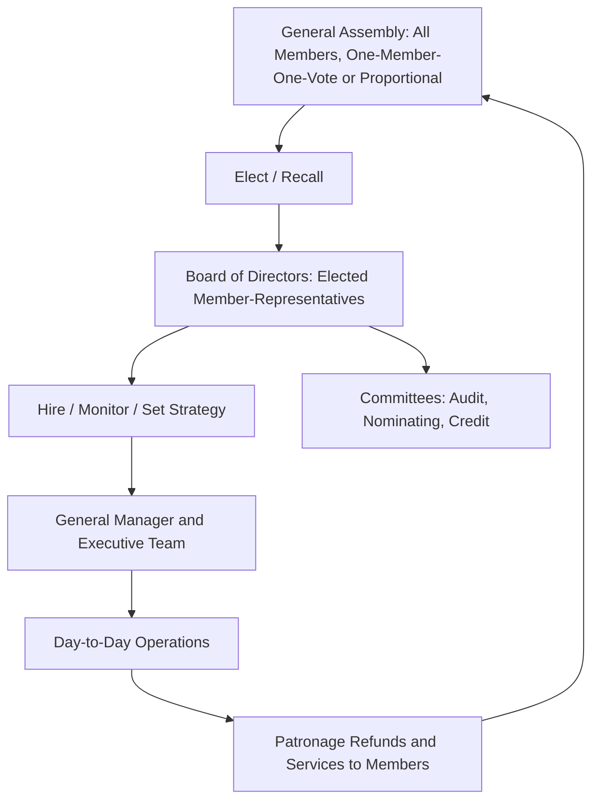

## Cooperative Governance and Member Relations

### Overview

Cooperative governance encompasses the formal and informal structures through which member-owners exercise control, monitor management, and resolve conflicts of interest within cooperative organizations. Because cooperatives separate financial contribution (patronage-based) from control rights (typically democratic), governance design must address unique principal-agent dynamics not present in conventional investor-owned firms, where the traditional single-agency relationship (shareholders vs. managers) is compounded by a second layer: heterogeneous member-owners with potentially divergent interests.

### The Dual Governance Structure

**Key Points**

Cooperative governance typically operates through a two-tier or three-tier structure:

1. **General Assembly / Membership Meeting** — the supreme governing body where all members exercise voting rights, typically annually, to elect directors, approve financial statements, and vote on major structural changes (mergers, bylaw amendments, dissolution).
2. **Board of Directors** — elected from and by the membership (in many jurisdictions, directors must themselves be active patron-members), responsible for strategic oversight, hiring/monitoring the general manager, and setting patronage refund policy.
3. **Management/Executive Team** — hired professionals responsible for day-to-day operations, typically not required to be members themselves.

### Agency Theory Applied to Cooperatives

Standard agency theory identifies a principal-agent problem between shareholders and managers, mitigated by market discipline (takeover threats, share price signals). Cooperative governance faces a compounded structure because member-owners cannot rely on the same disciplining mechanisms:

**Multiple Layers of Agency Cost**

- **Manager–Board agency problem** — analogous to the standard IOF case; the board must monitor management despite information asymmetry regarding operational performance.
- **Board–Membership agency problem** — directors, often part-time farmer-elected representatives, may lack the technical/financial expertise to effectively monitor professional management, a persistent governance weakness noted in the cooperative literature.
- **Member–Member heterogeneity problem** — because members differ in farm size, product mix, and reliance on the cooperative, directors elected under OMOV may represent the median or modal member's interest rather than the aggregate value-maximizing strategy, creating a distinct agency dynamic absent in IOFs (sometimes termed the **"member-heterogeneity" or "collective decision-making" cost**).

$[Inference]$ Because cooperative equity is not traded on an open market, external monitoring mechanisms (hostile takeovers, analyst scrutiny, stock price feedback) that discipline IOF management are largely absent, which the literature frequently cites as a structural governance disadvantage — though the magnitude of resulting inefficiency is not precisely quantified and varies by cooperative and sector.

### Board Composition and Director Roles

**Key Points**

- **Member-elected directors** — the traditional model; directors must typically be active patrons, ensuring alignment with member interests but sometimes limiting technical/financial governance expertise.
- **Outside/independent directors** — an increasingly common reform (particularly in larger, more complex cooperatives) bringing external financial, legal, or industry expertise to the board without patronage ties; contested because it dilutes the "pure" member-control principle.
- **Hybrid boards** — combining elected patron-directors with a minority of appointed outside directors, attempting to balance democratic legitimacy with technical competence.

**Example**

A regional dairy cooperative might structure its board as nine elected patron-directors (representing geographic districts to ensure balanced regional representation) plus two outside directors with financial/legal expertise appointed by the board itself, requiring a bylaw amendment to permit non-member board seats.

### Member Relations and Communication

Effective member relations address the **information asymmetry** between the elected/hired leadership and the broader patron base, which is central to sustaining member trust, participation, and loyalty (a key driver of patronage volume and equity commitment).

**Key mechanisms:**

- **Annual and periodic member meetings** — beyond the statutory general assembly, many cooperatives hold district or regional meetings to improve two-way communication given membership dispersion.
- **Newsletters, annual reports, and patronage statements** — transparency mechanisms disclosing financial performance, patronage refund calculations, and equity redemption schedules.
- **Member surveys and advisory committees** — used to gauge satisfaction and input on service offerings, particularly important as member heterogeneity increases with cooperative growth.
- **New member orientation and education programs** — addressing the free-rider problem by clarifying capital contribution obligations, patronage mechanics, and voting rights to reduce information gaps between founding and newer members.

### Voting Rules and Their Governance Implications

| Voting Rule | Mechanism | Governance Trade-off |
| --- | --- | --- |
| One-Member-One-Vote (OMOV) | Equal weight regardless of patronage | Protects small member interests; may underweight large patrons' financial stake, reducing their incentive to remain engaged |
| Proportional (patronage-weighted) voting | Voting power scaled to volume delivered/purchased | Aligns control with financial exposure; risks marginalizing smaller members |
| Capped proportional voting | Proportional voting subject to a maximum vote share per member | Balances alignment and protection against large-member dominance |
| Delegate/district systems | Members elect regional delegates who vote at assembly | Improves feasibility for large, dispersed memberships; introduces an additional agency layer (delegate–member) |

### Conflict Resolution and Member Exit

Because cooperative equity is illiquid and membership often ties to a specific delivery/purchase obligation, conflict resolution mechanisms differ substantially from IOF shareholder remedies (e.g., selling shares).

**Common Mechanisms**

- **Bylaw-defined grievance procedures** — internal arbitration or mediation clauses for disputes over patronage calculations, quality grading, or delivery quotas.
- **Board recall provisions** — member-initiated votes to remove underperforming or non-representative directors.
- **Redemption policies** — structured equity buyback schedules (revolving fund redemption) providing an exit mechanism, though typically with multi-year delays that constrain member liquidity relative to tradable shares.
- **Exit via non-renewal** — in cooperatives with fixed-term delivery agreements (common in New Generation Cooperatives), members may decline to renew delivery rights rather than seeking a secondary market sale.

### Governance Reforms Addressing Structural Weaknesses

**Key Points**

1. **Base capital plans** — replacing the revolving fund system with a target equity level tied to current patronage share, requiring under-invested members to contribute more and over-invested (e.g., retired or reduced-volume) members to be redeemed faster, addressing horizon and portfolio problems discussed in cooperative financing theory.
2. **Professionalization of boards** — director training programs, term limits, and skills-based nomination committees to address the board-management expertise gap.
3. **Hybrid/LLC conversions** — some cooperatives restructure as limited liability companies or hybrid entities to access outside equity capital while attempting to preserve patron-control features, blurring the traditional cooperative-IOF distinction.
4. **Independent director requirements** — increasingly mandated or encouraged in cooperative governance codes, especially in larger, more capital-intensive cooperatives (e.g., dairy processing, farm supply).

### Diagram: Member Relations Feedback Loop (svg_diagram)

<svg xmlns="http://www.w3.org/2000/svg" viewBox="0 0 720 320">
\<style\>
.title { font: bold 14px sans-serif; fill: #1a1a1a; }
.label { font: 12px sans-serif; fill: #1a1a1a; }
.box { fill: #eef8ee; stroke: #2c8a4f; stroke-width: 1.5; }
.arrow { stroke: #555; stroke-width: 1.5; marker-end: url(#arrowhead2); fill: none; }
\</style\>
<text x="360" y="24" text-anchor="middle" class="title">Member Relations Feedback Loop (svg_diagram)</text>
<rect x="30" y="60" width="200" height="70" class="box" />
<text x="130" y="90" text-anchor="middle" class="label" font-weight="bold">Members</text>
<text x="130" y="108" text-anchor="middle" class="label">Patronage + Input</text>
<rect x="270" y="60" width="200" height="70" class="box" />
<text x="370" y="90" text-anchor="middle" class="label" font-weight="bold">Board</text>
<text x="370" y="108" text-anchor="middle" class="label">Oversight + Policy</text>
<rect x="510" y="60" width="180" height="70" class="box" />
<text x="600" y="90" text-anchor="middle" class="label" font-weight="bold">Management</text>
<text x="600" y="108" text-anchor="middle" class="label">Operations</text>
<rect x="270" y="200" width="200" height="70" class="box" />
<text x="370" y="230" text-anchor="middle" class="label" font-weight="bold">Disclosure</text>
<text x="370" y="248" text-anchor="middle" class="label">Reports, Meetings, Surveys</text>
<path d="M230 95 L270 95" class="arrow" />
<path d="M470 95 L510 95" class="arrow" />
<path d="M600 130 L600 235 L470 235" class="arrow" />
<path d="M270 235 L130 235 L130 130" class="arrow" />
</svg>

### Related Topics

- Agency theory and monitoring costs in member-owned firms
- Base capital plans and equity redemption policy design
- Independent director models in large agricultural cooperatives
- New Generation Cooperative delivery-rights and governance structures
- Cooperative bylaws, grievance procedures, and dispute resolution
- Member heterogeneity and collective decision-making costs
- Comparative governance: cooperatives vs. investor-owned firms vs. hybrid LLCs
- Board professionalization and director training programs
- Patronage refund calculation methodologies
- Cooperative mergers, conversions, and de-mutualization governance processes