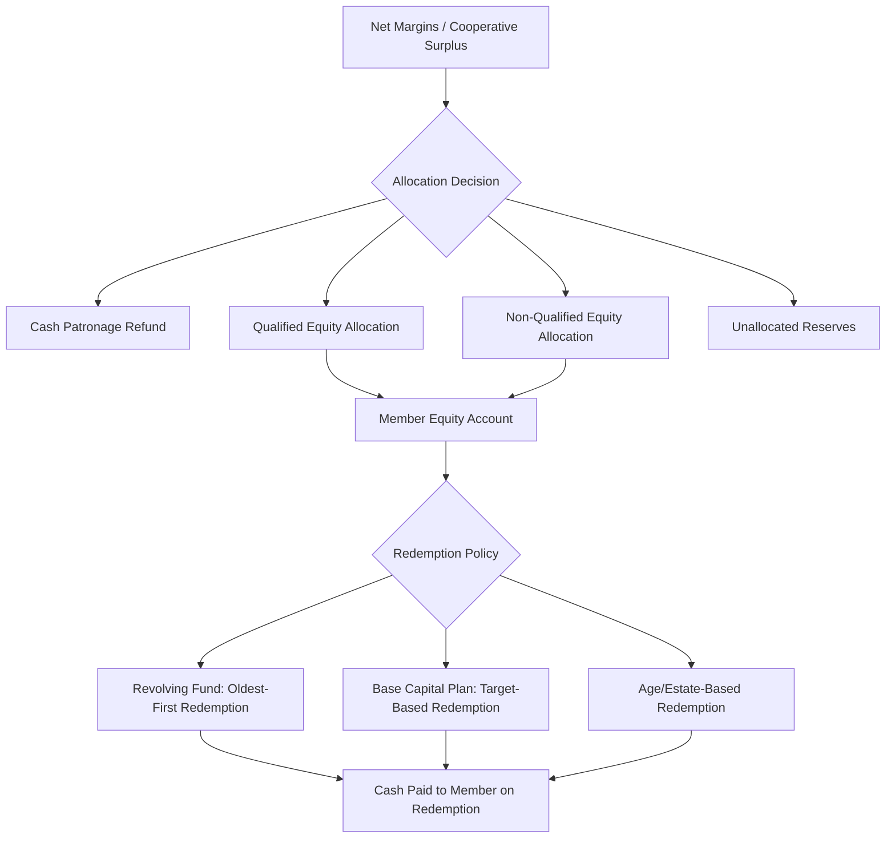

## Cooperative Financing and Capital Structure

### Overview

Cooperative financing addresses how member-owned firms raise, allocate, and redeem capital under constraints fundamentally different from investor-owned firms (IOFs). Because cooperative equity is generally non-tradable and tied to patronage rather than pure investment return, cooperatives face distinct capital structure trade-offs that shape their long-term investment capacity, growth potential, and financial resilience.

### Distinguishing Features of Cooperative Capital

**Key Points**

- **Patronage-linked equity** — ownership shares and capital obligations are tied to use of the cooperative (volume delivered or purchased) rather than pure investment preference.
- **Non-tradability** — unlike IOF stock, cooperative equity is typically not sold on secondary markets; exit is achieved through redemption programs rather than market sale.
- **Redemption obligation** — cooperatives generally commit (though not always contractually) to eventually returning member equity, creating a long-term liability profile absent in IOF permanent equity capital.
- **Limited return on equity** — many jurisdictions cap the dividend/interest rate payable on cooperative equity capital (statutory limits in some cooperative laws), reinforcing that member benefit flows primarily through patronage rather than capital appreciation.

### Sources of Cooperative Capital

**1. Direct Member Investment**

- **Membership shares / common stock** — a fixed initial investment required for membership eligibility.
- **Preferred stock** — issued to members or sometimes non-members, carrying a fixed dividend rate but typically no voting rights, used to raise capital without diluting democratic control.

**2. Retained Patronage-Based Equity**

- **Qualified patronage refunds** — a portion of net margins allocated to members as equity (rather than cash), tax-deductible to the cooperative if certain distribution thresholds are met (in jurisdictions with cooperative-specific tax treatment) and taxable to the member in the year allocated.
- **Non-qualified patronage refunds** — retained as equity but not immediately taxable to the member; taxed upon eventual redemption, deferring member tax liability while providing the cooperative earlier access to retained capital.
- **Per-unit capital retains (PUCs)** — a fixed deduction per unit of product delivered (e.g., per bushel, per hundredweight), building equity independent of overall cooperative profitability, common in commodity marketing cooperatives.

**3. Unallocated Reserves**

- Retained earnings not credited to individual member accounts; function similarly to IOF retained earnings but without a specific redemption obligation, providing more permanent capital but foregone member allocation.

**4. External Debt Financing**

- **Bank and Farm Credit System loans** — cooperatives frequently access specialized agricultural lending institutions (e.g., CoBank in the U.S. Farm Credit System) for both short-term operating credit and long-term capital investment.
- **Bonds and debentures** — larger cooperatives may issue debt instruments to institutional investors.
- **Member loans/subordinated debt** — some cooperatives raise capital through member-subscribed debt instruments distinct from equity, preserving control structure while accessing member capital.

### The Cooperative Equity Redemption Cycle

$$E_t = E_{t-1} + \text{Allocations}_t - \text{Redemptions}_t$$

where $E_t$ is total member equity outstanding at time $t$, allocations are new patronage-based equity credited to members, and redemptions are equity payouts (often to retiring, deceased, or long-tenured members under a revolving cycle).

**Revolving Fund Method**

The most traditional redemption approach: equity is redeemed in the order it was issued (oldest allocations redeemed first), typically on a multi-year cycle (commonly cited ranges of 7–15 years in practice, though this varies substantially by cooperative and financial condition). $[Inference]$ The specific redemption period is a board policy choice constrained by the cooperative's cash flow and capital needs rather than a fixed rule, so actual practice varies widely and should not be treated as standardized across the sector.

### Base Capital Plans

An alternative to the revolving fund system, designed to address the **horizon and portfolio problems** in cooperative property rights theory. Under a base capital plan:

1. The cooperative calculates each member's "base capital" obligation as a share of total equity proportional to their share of total patronage over a defined period (e.g., a trailing 3–5 year average).
2. Members whose actual equity investment is **below** their target base capital are required to increase contributions (often through withheld patronage refunds).
3. Members **above** target base capital (e.g., due to declining patronage volume, retirement, or exit) receive accelerated redemption to bring their equity back toward target.

This directly ties capital contribution to current economic use of the cooperative, reducing the free-rider problem where long-tenured members retain outsized equity claims disconproportionate to current patronage.

### Capital Structure Trade-offs

| Financing Source | Control Impact | Cost | Flexibility |
| --- | --- | --- | --- |
| Membership shares | Preserves member control | Low explicit cost | Low; fixed and small |
| Retained patronage equity | Preserves member control | Implicit cost (delayed member liquidity) | Moderate; scalable with volume |
| Preferred stock | No voting dilution | Fixed dividend obligation | Moderate; attracts outside capital |
| Unallocated reserves | Preserves member control | No individual redemption obligation | High; most permanent capital |
| Debt (bank/bond) | No control impact | Interest cost, covenant constraints | High but leverage-limited |
| New Generation Cooperative delivery-right shares | Preserves member control, tradable among qualified members | Market-priced | Higher; addresses portfolio problem |

**Example**

A grain marketing cooperative facing a major elevator expansion might finance it through a combination of: (a) increased per-unit capital retains on all grain delivered over the next five years, (b) a term loan from a Farm Credit System lender secured against the facility, and (c) a temporary reduction in cash patronage refunds (increasing the qualified equity allocation percentage) to preserve internal cash flow — illustrating how cooperatives blend patron-based and external financing to fund capital-intensive projects while preserving member control.

### Tax Treatment Considerations

$[Unverified]$ Specific tax treatment of patronage refunds (qualified vs. non-qualified, single vs. double taxation avoidance under Subchapter T in the U.S. context) varies by jurisdiction and is subject to legislative change; readers should consult current tax code and a qualified tax advisor rather than relying on general descriptions for compliance purposes.

In general terms, cooperative tax frameworks in several countries (including the U.S. under Subchapter T) permit a single layer of taxation on patronage-sourced income by allowing the cooperative to deduct qualified patronage refunds distributed to members, who then report the income individually — avoiding the double taxation (corporate + shareholder) typical of IOF dividend structures. This tax treatment is a significant, though secondary, incentive supporting the patronage-refund financing mechanism.

### Financial Ratios and Solvency Monitoring

Cooperatives commonly track modified versions of standard financial ratios that account for their equity redemption obligations:

$$\text{Equity Ratio} = \frac{\text{Total Member Equity} + \text{Unallocated Reserves}}{\text{Total Assets}}$$

$$\text{Redemption Coverage Ratio} = \frac{\text{Cash Flow Available for Redemption}}{\text{Scheduled Equity Redemptions}}$$

A declining equity ratio over time, combined with a strained redemption coverage ratio, is often cited in the cooperative finance literature as an early warning indicator of capital structure stress, since it signals the cooperative's diminishing ability to both fund growth and honor redemption commitments to aging membership. $[Inference]$ Precise threshold values for "healthy" ratios are not universally standardized across the sector and depend on cooperative type, capital intensity, and lender covenants.

### Related Topics

- Revolving fund vs. base capital redemption policy design
- Subchapter T and comparative international cooperative tax treatment
- New Generation Cooperative tradable equity structures
- Farm Credit System and specialized agricultural lending institutions
- Per-unit capital retains vs. patronage-based equity allocation
- Cooperative solvency and financial ratio benchmarking
- Preferred stock and non-member capital instruments in cooperatives
- Horizon and portfolio problems in cooperative property rights theory
- Cooperative mergers and capital structure consolidation
- Debt covenant structures in agricultural cooperative lending