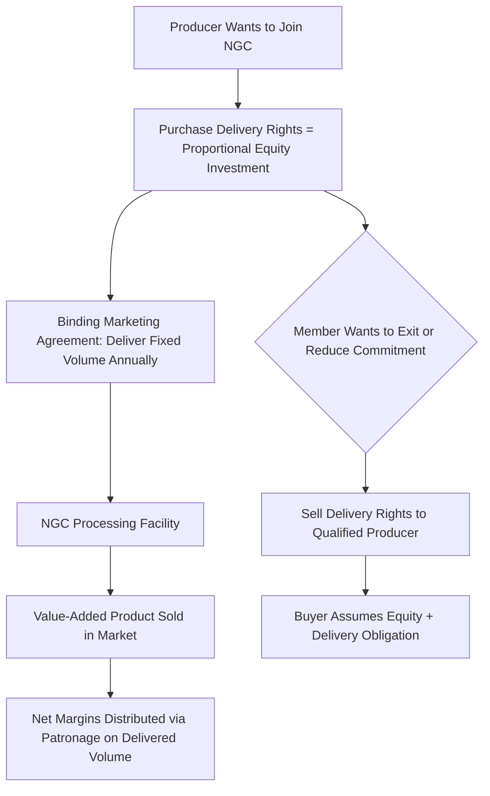

## New Generation Cooperatives

### Overview

New Generation Cooperatives (NGCs) are a hybrid organizational model that emerged in the U.S. Upper Midwest during the late 1980s and 1990s, designed to overcome the structural property rights limitations of traditional cooperatives (the free-rider, horizon, and portfolio problems) while preserving democratic, member-based control. NGCs are most closely associated with value-added agricultural processing ventures — particularly grain, oilseed, and livestock processing — where members sought to capture downstream margin rather than remaining commodity price-takers.

### Origins and Economic Rationale

NGCs arose primarily in response to declining farm commodity margins and the recognition that value-added processing (converting raw commodities into higher-margin products, e.g., corn into ethanol, sugar beets into refined sugar, wheat into pasta) captured most of its profit downstream of the farm gate. Traditional cooperatives, constrained by open membership, low capital requirements, and non-transferable equity, struggled to raise the substantial upfront capital such processing facilities required.

**Key Points**

- NGCs are sometimes termed **"closed cooperatives"** or **"proportional investment cooperatives,"** reflecting their defining features of closed (or restricted) membership and capital contribution proportional to a specific delivery commitment.
- The model is closely tied to Cook's cooperative life-cycle theory, representing a structural **reform response** to the vaguely-defined property rights problems inherent in traditional OMOV cooperatives.

### Defining Structural Features

**1. Closed Membership with Delivery Rights**

Unlike traditional "open membership" cooperatives that must accept any qualifying patron, NGCs restrict membership to a fixed number of delivery rights tied to the plant's processing capacity. A member purchases a specific delivery right (e.g., the right/obligation to deliver 1,000 bushels of corn annually) that corresponds to a proportional equity investment.

**2. Proportional, Upfront Capital Investment**

Members must make a substantial upfront equity investment proportional to their delivery commitment — often covering a significant share of the plant's total capital cost before construction begins, addressing the free-rider problem since capital contribution and patronage benefit are tightly linked from the outset.

$$\text{Member Investment}_i = \left(\frac{\text{Delivery Right}_i}{\text{Total Plant Capacity}}\right) \times \text{Total Capital Required}$$

**3. Tradable Delivery Rights**

This is the signature innovation distinguishing NGCs from traditional cooperatives: delivery rights (and their associated equity) can be **bought and sold**, typically restricted to other qualified producers within a defined trade territory, rather than being locked into a non-tradable, patronage-tied claim.

**4. Binding Delivery Obligations**

Members are contractually obligated to deliver their specified volume (a "marketing agreement"), and the cooperative is correspondingly obligated to accept and process it — creating a more predictable raw material supply than the voluntary delivery common in traditional cooperatives.

### How NGCs Address the Classical Property Rights Problems

| Problem (Traditional Cooperative) | NGC Solution |
| --- | --- |
| Free-rider problem | Membership requires proportional upfront investment tied to delivery rights; no dilution by non-contributing new members |
| Horizon problem | Tradable delivery rights allow members to capture the present value of future earnings by selling their shares, restoring long-term investment incentive |
| Portfolio problem | Members can sell delivery rights on a secondary market (within eligible producer pool), providing liquidity absent in traditional cooperative equity |
| Control problem | Voting typically remains one-member-one-vote or is only mildly proportional, though financial stake is now tightly proportional to patronage by design |
| Influence-cost problem | Homogeneous membership (similar commodity, similar delivery volume) around a single processing venture reduces heterogeneity-driven political friction relative to diversified traditional cooperatives |

### Formation Process

**Key Points**

1. **Feasibility study** — assessing market demand, processing economics, and required capital scale, often supported by extension services or cooperative development centers.
2. **Producer recruitment and equity drive** — securing binding delivery-right subscriptions and upfront capital commitments from enough producers to reach the minimum viable plant scale.
3. **Legal and bylaw structuring** — establishing the cooperative charter, marketing agreement terms, delivery-right transfer rules, and governance structure (often still incorporated under state cooperative statutes despite the closed-membership deviation from classical open-membership principles).
4. **Debt financing layer** — because member equity alone rarely covers full capital costs, NGCs typically supplement member investment with bank debt or Farm Credit System financing, using the committed member equity as a signal of project viability to lenders.
5. **Construction and startup** — plant construction financed by combined member equity and debt, followed by operational startup and initial delivery cycles.

### Example: Ethanol and Value-Added Processing Cooperatives

The archetypal NGC application was farmer-owned **ethanol production** in the U.S. Corn Belt during the 1990s and early 2000s, where corn producers formed closed cooperatives to build ethanol plants, securing delivery rights proportional to their capital investment and capturing processing margin that would otherwise accrue to independent ethanol companies. Similar models were applied to soybean processing (soy-based products), pasta/durum wheat processing, and specialty livestock processing (e.g., branded beef or pork cooperatives). $[Inference]$ Many of these ethanol NGCs later converted to limited liability companies (LLCs) as capital requirements grew and non-farmer investors were sought, though the extent and pace of such conversions varied by venture and region and is not uniformly documented.

### Limitations and Criticisms

**Key Points**

- **High capital barrier to entry** — the substantial upfront investment requirement excludes smaller or capital-constrained producers, raising equity and access concerns relative to traditional open-membership cooperatives.
- **Concentration risk** — because NGCs are typically built around a single processing facility and product line, members bear concentrated risk exposure comparable to a single-asset investment rather than the diversification of a multi-service traditional cooperative.
- **Secondary market thinness** — the tradability of delivery rights is theoretically valuable, but in practice the market for such rights can be illiquid, limited to a small pool of eligible producers within a defined trade territory. $[Inference]$ The degree of illiquidity varies by venture and has not been systematically benchmarked across the sector.
- **Governance tension** — closed membership and rigid delivery obligations can create conflict when market conditions change (e.g., a member wanting to reduce delivery due to a bad crop year still bears a binding contractual obligation).
- **Evolution toward LLC/hybrid structures** — many NGCs, once established and needing additional growth capital, have converted to LLCs or other hybrid entities, which further dilutes the "cooperative" character (patron control) in favor of broader investor access, illustrating a continuing institutional evolution rather than a stable endpoint.

### NGC vs. Traditional Cooperative vs. LLC Comparison

| Feature | Traditional Cooperative | New Generation Cooperative | LLC/Hybrid |
| --- | --- | --- | --- |
| Membership | Open | Closed, capacity-limited | Open to investors |
| Capital contribution | Variable, often modest | Substantial, proportional to delivery right | Market-based investment |
| Equity tradability | Generally non-tradable | Tradable among qualified producers | Freely tradable (subject to entity terms) |
| Delivery obligation | Typically voluntary | Contractually binding | Not applicable (pure investment) |
| Control basis | OMOV or mild proportionality | OMOV or mild proportionality despite proportional capital | Proportional to investment (IOF-like) |

### Related Topics

- Cook's cooperative life-cycle theory and organizational evolution
- Property rights problems in traditional cooperatives (free-rider, horizon, portfolio)
- Marketing agreements and binding delivery obligations
- Value-added agricultural processing economics
- Cooperative-to-LLC conversion case studies
- Farm Credit System financing for value-added ventures
- Secondary markets for delivery rights and equity liquidity
- Comparative governance: NGC vs. traditional cooperative vs. LLC
- Feasibility study methodology for farmer-owned processing ventures
- Risk concentration in single-asset cooperative structures